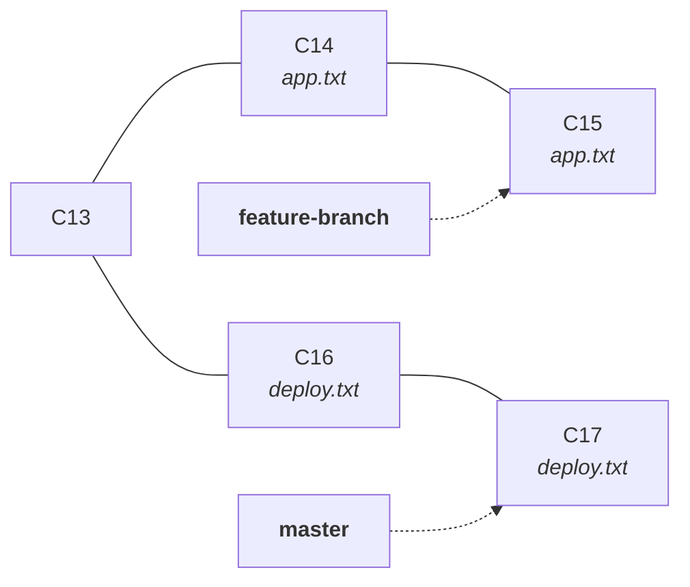
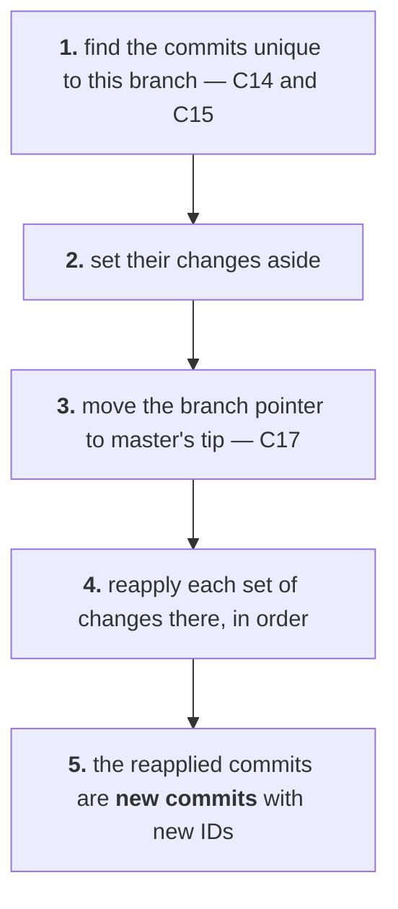
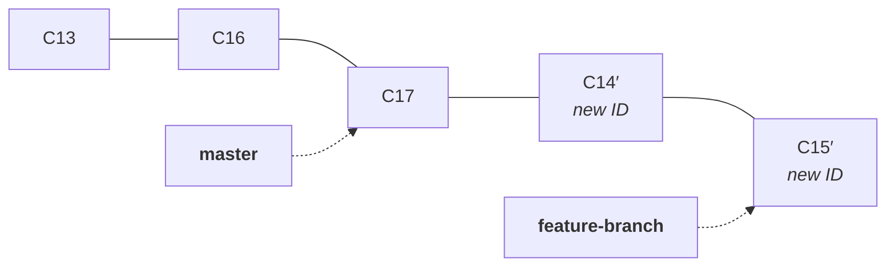
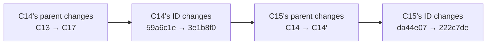
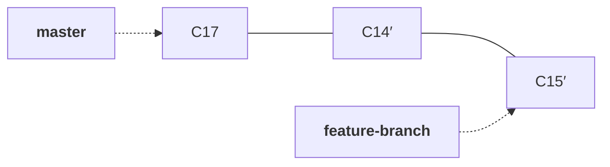

Note `08` ended on a cost. Merging never rewrites anything, which is exactly what makes it safe — and it means every merge of a diverged branch leaves a merge commit behind as a permanent record that two lines existed and came back together.

Two branches produced two merge commits and two forks. Look at the graph after only that much:

```bash
git log --oneline --graph --decorate --all
```

```
*   9f4c2ab (HEAD -> master) 13th commit merged app.txt
|\
| * 7e20b6d (feature-branch) 12th commit modified app.txt
* | 4d3e91c 11th commit modified app.txt
|/
*   a110a3f Merge branch 'feature-branch'
|\
| * 2f9d10c 8th commit modified app.txt
* | 5c8ba07 9th commit modified deploy.txt
|/
* 3928a43 7th commit modified deploy.txt
```

Now put a real team on it. Ten developers, a branch each, several merges a day, and this is what the history of the project looks like:

```
*   Merge feature-12
|\
| * commit
| * commit
* | main commit
|/
*   Merge feature-11
|\
| * commit
* | main commit
|/
*   Merge feature-10
|\
...
```

The information is all there and it is all accurate. It is also close to unreadable, and the practical questions — what changed last Tuesday, which commit broke the build, what actually went into this release — get harder to answer with every merge.

What you want instead is the history you would have had if everyone had simply taken turns:

```
* 222c7de (feature-branch) 15th commit modified app.txt
* 3e1b8f0 14th commit modified app.txt
* f7cc0b6 (master) 17th commit modified deploy.txt
* c2c58f1 16th commit modified deploy.txt
* 9f4c2ab 13th commit merged app.txt
```

One line. No forks, no merge commits, every commit in a single order.

Nobody took turns, though. Those commits genuinely happened in parallel. So producing that straight line means presenting history as something other than what happened — and that is exactly what rebase does, why it is useful, and why it is dangerous.

> [!important] **Merge and rebase solve the same problem and make opposite trades.**
>
> **Merge** combines two branches while preserving the existing history. Nothing that already exists is altered, and the record shows the branches really did diverge.
>
> **Rebase** replays your commits on top of another branch, producing a clean linear history. The record no longer shows the divergence, because the commits are rewritten as though it never happened.

---

## What rebase actually does

You are on `feature-branch`, which split from `master` at commit 13. Since then you made two commits and `master` made two:



Run rebase from **the branch you want moved** — this is the opposite of merge, where you stand on the branch that receives:

```bash
git switch feature-branch
```

```bash
git rebase master
```

```
Successfully rebased and updated refs/heads/feature-branch.
```

Git worked through five steps:



The result:



One straight line. Reading it top to bottom, it looks as though you waited for commits 16 and 17 to land and only then started work — which is not what happened.

> [!important] **Rebase does not move your commits. It replays them.** C14 and C15 are not relocated; their changes are applied again on a new base, producing **different commits** that happen to make the same edits. The originals still exist in the object database and are simply no longer on any branch.

---

## Why the IDs have to change

This is the part worth deriving rather than memorising, because notes `04` and `05` already contain the answer.

A commit's ID is the SHA-1 of its contents. And note `05` listed what those contents are:

| | |
|---|---|
| **tree** | the snapshot |
| **parent** | the commit before it |
| author, committer, timestamp, message | the metadata |

**The parent is part of the commit.** So:

```
before rebase   C14's parent is C13
after rebase    C14's parent is C17
```

Different contents, therefore a different hash, therefore a different commit. It is not a policy decision Git made — it falls out of content addressing, the same mechanism that made two identical files share a blob in note `04`.

And it cascades:



Rewriting one commit rewrites every commit after it, all the way to the tip. This is the same property note `05` used to explain why history is append-only — a commit cannot point forward, because changing a commit changes its ID and orphans everything downstream. Rebase does not escape that rule; it pays it, by rebuilding the whole chain.

### Proving it, ID by ID

Before rebasing, write down all four commit IDs — the two on the feature branch and the two on master:

| Commit | Branch | ID before |
|---|---|---|
| **C14** | feature | `59a6c1e8b4d720f3a95c68e01b7d4f28a3c50961` |
| **C15** | feature | `da44e07b2c9f1836ad50e4c7b9128f36d0a5e742` |
| **C16** | master | `c2c58f13e097ab4d6215fe8c370b9d4a1e6f2073` |
| **C17** | master | `f7cc0b62a41d38e5907c2fb4816ade3095c17e28` |

Rebase, then look again:

| Commit | Branch | ID after | |
|---|---|---|---|
| **C14′** | feature | `3e1b8f04a7d2c96150e83b4fa62d709c1e5482b3` | **changed** |
| **C15′** | feature | `222c7de9013b8a45f6c2e07d519bafc4830e6d17` | **changed** |
| **C16** | master | `c2c58f13e097ab4d6215fe8c370b9d4a1e6f2073` | unchanged |
| **C17** | master | `f7cc0b62a41d38e5907c2fb4816ade3095c17e28` | unchanged |

The commit messages are identical. The changes are identical. **The identities are not.**

> [!tip] **Master's commits were not touched, and that is the sentence to keep.** Rebase rewrote only the commits being replayed — the ones unique to the branch you were standing on. Everything it was replayed onto is untouched, byte for byte. That is the whole safety boundary: **rebasing rewrites your side, never the base.**

> [!info] **These IDs are illustrative.** As note `05` established, a commit's ID hashes the author and timestamp too, so you cannot reproduce them. What you can reproduce is the pattern — do this on any repository and the replayed commits will have new IDs while the base keeps its own.

---

## The push gets rejected, and that is the interesting part

```bash
git push
```

```
 ! [rejected]        feature-branch -> feature-branch (non-fast-forward)
error: failed to push some refs to 'https://github.com/<user>/<repo>.git'
hint: Updates were rejected because the tip of your current branch is behind
hint: its remote counterpart. Integrate the remote changes (e.g.
hint: 'git pull ...') before pushing again.
hint: See the 'Note about fast-forwards' in 'git push --help' for details.
```

Read that against note `07`. The remote's `feature-branch` still points at the **original** C15 — you already pushed it. Your local branch now points at C15′, and there is no path from the remote's commit to yours, because they are different commits on different bases.

**The remote is refusing to lose commits.** Every push Git accepts by default is a fast-forward, exactly as in note `08`: the new tip must have the old tip in its history. Yours does not. Accepting it would strand the two commits already on the remote.

The hint is wrong for this situation, and it is worth saying so, because following it makes things worse. `git pull` would fetch the original C14 and C15 and merge them back in — leaving you with **both** copies of your own work, the rebased pair and the originals, plus a merge commit joining them. That is the opposite of what you rebased for.

What the situation actually calls for is telling the remote to accept a rewritten branch:

```bash
git push -f
```

> [!important] **The rejection is not an obstacle. It is the one safety check standing between a rewrite and someone else's work.** Git cannot tell whether the commits it is being asked to discard matter. Forcing past it is you asserting that you know they do not — which is true for a branch only you use, and can be badly false for anything shared.

> [!warning] **Prefer `--force-with-lease` to `-f`, which the class did not cover.**
>
> ```bash
> git push --force-with-lease
> ```
>
> Plain `-f` overwrites the remote branch unconditionally — including commits a teammate pushed in the last five minutes that you have never seen. `--force-with-lease` first checks that the remote is still where you last saw it, and refuses if anyone else has pushed in the meantime. It permits exactly the rewrite you intended and blocks the accident that plain `-f` causes. **Make it your default force push.**

### Master still has to catch up

Rebasing moved the feature branch. It did nothing to `master`, which still points at C17:



`master` is now strictly behind on a line it is already on — which is the fast-forward case from note `08`, and now it is guaranteed rather than lucky:

```bash
git switch master
```

```bash
git merge feature-branch
```

```
Fast-forward
```

> [!tip] **This is the actual point of rebasing before you merge.** It converts a merge that would have needed a merge commit into one that cannot need one. The integration into `master` stays a pointer move, and the history stays linear.

---

## Rebase conflicts

If both branches changed the same region of the same file, replaying cannot decide either — same reason as note `08`. The difference is that rebase replays commits **one at a time**, so it stops partway:

```
Auto-merging app.txt
CONFLICT (content): Merge conflict in app.txt
error: could not apply 3e1b8f0... 14th commit modified app.txt
```

Resolution is identical to a merge conflict: open the file, remove the markers, leave the content you want, and stage it.

```bash
git add app.txt
```

> [!warning] **Do not run `git commit` here.** A merge conflict ends with a commit; a rebase conflict does not, because the commit being replayed already exists as a plan. The commands were not shown in class and this is where people get stuck:
>
> ```bash
> git rebase --continue
> ```
> resumes, replaying the remaining commits.
> ```bash
> git rebase --abort
> ```
> throws the whole rebase away and puts the branch back exactly as it was — always safe, and the right move whenever you are unsure.
> ```bash
> git rebase --skip
> ```
> drops the commit being replayed entirely. Rarely what you want.
>
> A rebase with three conflicting commits stops three times. That is not a fault — it is one decision per commit, which is often easier than one enormous decision for all of them at once.

---

## When rebasing is safe

> **Rebase commits that only you have. Merge anything other people already have.**

The reason is the ID change, followed through to its consequence. If a colleague has C14 and you rewrite it into C14′, Git does not see an updated commit — it sees **two unrelated commits** that happen to make the same edit. Their branch is built on one; yours is built on the other. Merging those later produces duplicated commits, conflicts between a change and itself, and a history nobody can read.

It is worse than awkward for tooling. Everything downstream of Git tracks commits by hash: CI results, review comments on a pull request, links in incident tickets, `git bisect`. Rewrite the hashes and those references point at commits that are no longer on any branch. Diffs recompute against a different base and can show changes nobody made.

| | Merge | Rebase |
|---|---|---|
| Existing commits | untouched | rewritten with new IDs |
| History shape | preserves the divergence | linear, divergence erased |
| Extra commit | a merge commit | none |
| Safe on shared branches | **yes** | **no** |
| Push | ordinary | needs a force push |
| Conflicts | once, for the whole merge | once per replayed commit |

The working rule from the class: **rebase your own local branches as much as you like** — that is what keeps a long-lived feature branch current without collecting merge commits — **and use merge when the work goes into `master`**, because that is the branch everyone else has built on.

---

## The safety net, and its limits

```bash
git reflog
```

`reflog` records every position `HEAD` has held on your machine — every commit, checkout, merge, reset and rebase — including commits no branch points to any more. After a rebase that went wrong, the originals are still in there, and you can get back to them.

> [!danger] **`reflog` recovers your changes. It does not undo the rewrite.**
>
> The original C14 and C15 are still in `.git/objects`, so nothing you wrote is lost. But the new IDs are the ones the branch and the remote now carry, and everyone who pulled has them. Recovering means creating commits again, not restoring the old ones.
>
> **It is also local and temporary.** `reflog` is your machine's record of where `HEAD` has been — it is not pushed, a colleague's clone has none of it, and entries expire (unreachable ones after 30 days by default). It is a net for the mistake you notice today, not an archive.

That asymmetry is the whole argument for the rule above. A bad merge is fixed by another commit. A bad rebase on a shared branch is fixed by every person who cloned it.

---

## Summary

| Command | What it does |
|---|---|
| `git rebase <base>` | replay the current branch's commits on top of `<base>` |
| `git rebase --continue` | resume after resolving a conflict |
| `git rebase --abort` | cancel and restore the branch exactly as it was |
| `git push --force-with-lease` | push a rewritten branch, refusing if the remote moved |
| `git push -f` | push a rewritten branch unconditionally |
| `git reflog` | every position `HEAD` has held locally, including orphaned commits |

The three sentences worth keeping:

- **Rebase replays commits onto a new base, so they become new commits with new IDs.**
- **Only the branch being rebased is rewritten. The base is untouched.**
- **Rewritten history must be force-pushed, which is safe exactly when nobody else has the old commits.**

Rebase takes an entire branch and replants it. The next question is smaller and comes up more often in an incident: what if you only want **one** commit from a branch, and none of the rest?

---

*Source: class 5 — 2026-08-20, recording part 3.*
