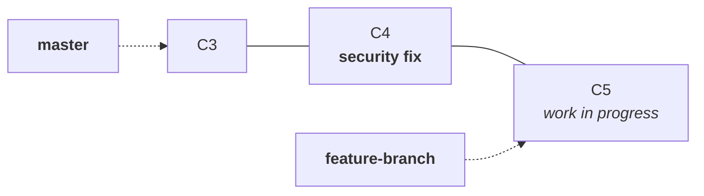
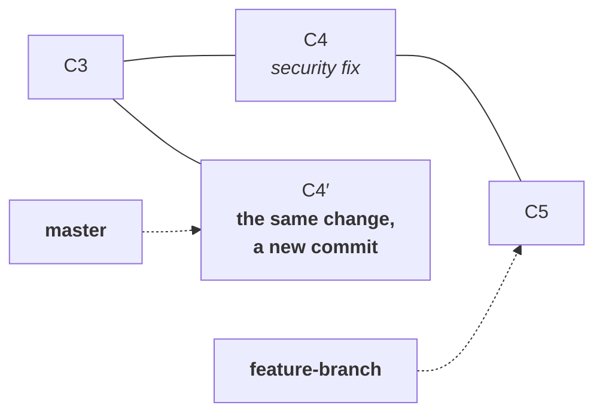
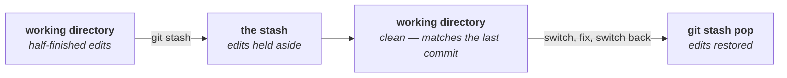

Notes `08` and `09` gave you two ways to combine branches, and both share an assumption that is easy to miss: **they take the whole branch.** Merge brings every commit the other branch has; rebase replays every commit yours has. Neither offers a subset.

Most of the time that is what you want. Two situations break it, and they are the two commands in this note.

---

## Cherry-pick: one commit, not a branch

You are working on `feature-branch`. It has two commits on it:



**C4 is a security fix and it needs to be in production now.** C5 is half-written — more commits are coming after it, and it is nowhere near deployable.

Run through the options you already have:

| | What happens |
|---|---|
| `git merge feature-branch` | brings C4 **and C5** into `master` |
| `git rebase master` then merge | same — the whole branch, replayed |
| wait until C5 is finished | the security fix waits with it |
| undo C5, merge, redo C5 | destroying work to ship unrelated work, which is exactly what note `06` argued against |

Every one of them fails for the same reason: your unit of work here is **one commit**, and every tool so far operates on a branch.

```bash
git switch master
```

```bash
git cherry-pick 59a6c1e
```

```
[master 8a3f2c1] 14th commit added security patch
 Date: Fri Aug 21 09:12:44 2026 +0530
 1 file changed, 1 insertion(+)
```



C5 is untouched, still sitting on the feature branch, still being worked on. The fix is on `master` and can deploy.

### It is a new commit, for the reason you already know

C4′ is not C4. Its parent was C3 on the feature branch's line and is now `master`'s tip, so its content differs, so its hash differs — the same derivation as note `09`.

> [!important] **Cherry-pick applies a change, it does not move a commit.** Git works out what changed between C4 and its parent, applies that change where you are standing, and writes a new commit. That is why it works at all across unrelated branches: it is transplanting a **diff**, not relocating an object.
>
> ```
> commit C4  →  what changed from its parent  →  apply here  →  new commit C4′
> ```

> [!warning] **The duplicate can come back to bite you, and this was asked in class.** If `feature-branch` is later merged into `master`, Git sees C4 and C4′ as two unrelated commits that happen to make the same edit — different hashes, different parents. Often Git works it out. Sometimes you get a conflict between a change and itself, which is confusing precisely because both sides look correct. Resolve it the way note `08` describes; the content is identical, so either side will do.

### When a cherry-pick conflicts

The change may not apply cleanly, if the place it is going has moved on:

```
CONFLICT (content): Merge conflict in app.txt
error: could not apply 59a6c1e... 14th commit added security patch
```

The resolution loop mirrors rebase from note `09`:

```bash
git add app.txt
```
```bash
git cherry-pick --continue
```

> [!tip] **`git cherry-pick --abort` puts everything back**, exactly as `git rebase --abort` does. Reach for it the moment a cherry-pick looks more complicated than you expected.

### Use it deliberately, not habitually

> [!info] **The instructor's practical caveat: reach for cherry-pick when you genuinely need one commit, not as a general way to move work around.** Every cherry-pick duplicates a change under a second identity, and a history full of duplicates is hard to reason about. His preferred alternative when the situation allows it — **put the fix on its own branch in the first place and merge that branch**, so the commit has one identity and normal merging applies.
>
> Where cherry-pick genuinely earns its place: **hotfixes**, pulling a single useful commit out of someone else's branch, and backporting a fix to a release branch that must not receive anything else.

---

## Stash: pausing work you cannot commit

The second case is not about commits at all. It is about the working directory.

You are part-way through a change on `feature-branch` — files edited, nothing committed, nothing finished. An urgent production issue arrives and you need to be on another branch right now.

Try it:

```bash
git switch master
```

```
error: Your local changes to the following files would be overwritten by checkout:
	app.txt
Please commit your changes or stash them before you switch branches.
Aborting
```

**Git refuses.** Switching branches rewrites the files in your working directory to match the target branch, and you have uncommitted edits that would be destroyed. Note `07` described switching as moving one pointer, which is true of `.git/HEAD` — but the working directory has to be updated to match, and that is what collides with your unsaved work.

> [!info] **This error is Git protecting you, and it is worth reading rather than reflexively working around.** The two suggestions it makes are the only two honest options: **commit** the work, or **stash** it. Committing is wrong here — the work is half-finished, and note `06` already established that a commit should be a coherent unit rather than whatever you happen to have touched.

That leaves the third thing:

```bash
git stash
```

```
Saved working directory and index state WIP on feature-branch: 222c7de 15th commit modified app.txt
```

Your changes are set aside and the working directory is clean — back to exactly what the last commit contains. Now the switch works:



Handle the urgent thing, come back, and take the work out again:

```bash
git switch feature-branch
```

```bash
git stash pop
```

```
On branch feature-branch
Changes not staged for commit:
	modified:   app.txt

Dropped refs/stash@{0} (0f3a9d1c8b74e25f60a4d3971ce8bf2049a7d6e3)
```

You are exactly where you left off.

> [!important] **The stash is not a branch and not a commit you can navigate to.** Treat it as a shelf: you put uncommitted work on it, and you take work off it. It exists so that **switch branches** and **finish what you were doing** stop being the same decision.

### The parts the class did not show

> [!warning] **`pop` versus `apply`, and seeing what is on the shelf** — not covered in class, and the distinction matters the first time a restore goes wrong.
>
> ```bash
> git stash list
> ```
> ```
> stash@{0}: WIP on feature-branch: 222c7de 15th commit modified app.txt
> ```
>
> The stash is a **stack**, and you can have several entries. `stash@{0}` is the most recent.
>
> | Command | Restores the changes | Keeps the stash entry |
> |---|---|---|
> | `git stash pop` | yes | **no** — removed once it applies |
> | `git stash apply` | yes | **yes** |
>
> **Prefer `apply` when you are not certain you are on the right branch.** A stash applied to the wrong branch with `pop` is gone from the shelf, and you are hand-repairing. With `apply` the entry survives and you can simply try again where you meant to. Drop it yourself once you are sure:
>
> ```bash
> git stash drop
> ```

> [!danger] **Stashed work is invisible and easy to abandon.** It does not appear in `git status`, `git log`, or on any branch, it is never pushed, and it does not survive a fresh clone. A stash left for three weeks is work nobody knows exists. **Stash for the length of an interruption, not as storage** — if the work needs to outlive the afternoon, put it on a branch and commit it.

---

## Summary

| Command | What it does |
|---|---|
| `git cherry-pick <commit>` | apply one commit's change here, as a new commit |
| `git cherry-pick --continue` | resume after resolving a conflict |
| `git cherry-pick --abort` | cancel and restore the previous state |
| `git stash` | set uncommitted changes aside and clean the working directory |
| `git stash list` | show what is on the stash stack |
| `git stash pop` | restore the most recent stash and remove the entry |
| `git stash apply` | restore it and keep the entry |
| `git stash drop` | discard a stash entry |

Both commands exist because **branch-level tools are the wrong size for some problems**. Cherry-pick is for when a branch is too much to take. Stash is for when a commit is too much to make.

Between them, notes `07` to `10` cover changing history. What is left is the opposite skill — reading it, and undoing it when something has already gone wrong.

---

*Source: class 5 — 2026-08-21, recording part 4.*
