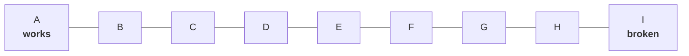
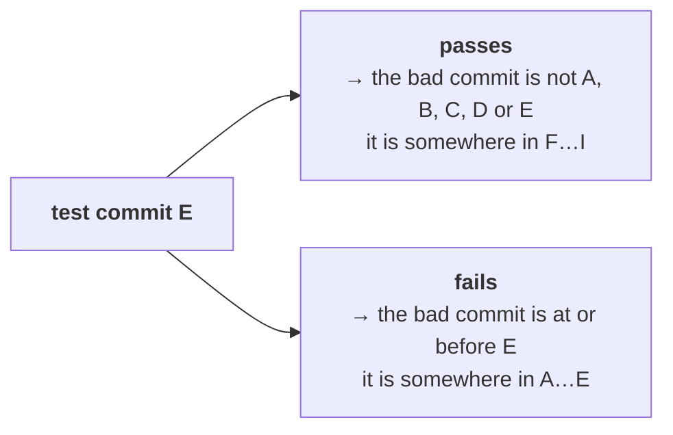
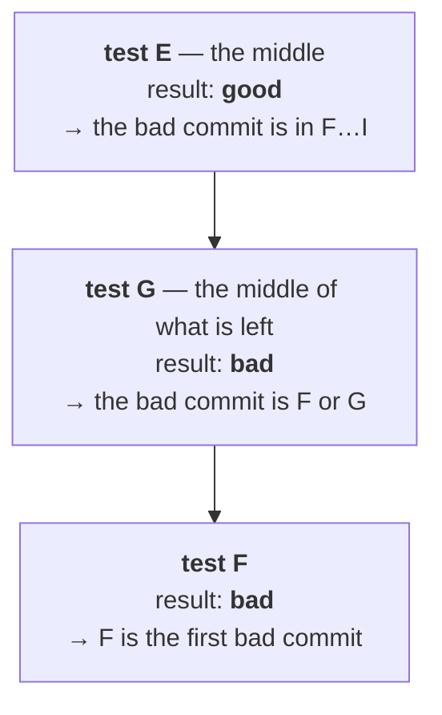
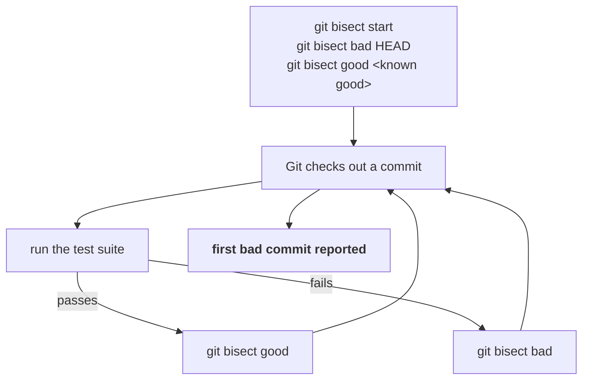

A branch got merged and production broke.

You know two things and no more. The application worked at some commit in the past, and it is broken now. Somewhere between those two points, one commit introduced the problem — and everything after that commit is also broken, because each commit builds on the last.



Note `11` gave you `log`, `show` and `diff`. They are the right tools once you know **which** commit to look at. They do not tell you which one.

---

## The obvious approach, and its cost

Start at the beginning and walk forward. Check out A, run the tests, and keep going until something fails.

That works. It is also **linear search**, and its cost is the length of the branch:

| Commits between working and broken | Test runs, worst case |
|---|---|
| 10 | 10 |
| 100 | 100 |
| 500 | **500** |

If the test suite takes four minutes, five hundred commits is over thirty hours.

> [!important] **Automating it does not fix it.** A script that checks out each commit and runs the tests still performs the same five hundred test runs. The problem is not that a human is doing the work — it is that the search strategy is wrong.

## The property that makes something better possible

Here is what makes this different from searching an unsorted list.

**A commit contains everything before it.** Testing commit E does not test E's change in isolation — it tests the state of the project after A, B, C, D and E have all been applied. So a single test run answers a question about the whole prefix:



Every test run **halves** the range. That is the sorted-list property, and it means binary search applies.

> [!tip] **This is the interview-shaped version of the idea.** History is effectively a sorted array — good, good, good, then bad, bad, bad, with exactly one transition. Finding a transition point in a sorted array is binary search, at **O(log n)** instead of **O(n)**.

| Commits | Linear search | Binary search |
|---|---|---|
| 10 | 10 | 4 |
| 100 | 100 | 7 |
| 500 | 500 | **9** |
| 10,000 | 10,000 | **14** |

Five hundred commits at four minutes a run goes from over thirty hours to about **thirty-six minutes**.

### Walking it by hand

Take the nine commits above. A is known good, I is known bad.



Three test runs instead of nine. E was good and F is bad, so **F is where the behaviour changed** — and F is the commit to hand to whoever wrote it.

---

## Git does this for you

You do not have to work out the midpoints or manage the checkouts. That is `git bisect`, and the name is literal: it cuts the range in half, repeatedly.

```bash
git bisect start
```

Tell it where you are now is broken:

```bash
git bisect bad HEAD
```

And a commit you know was fine:

```bash
git bisect good 12ab45c
```

Git immediately checks out a commit in the middle and tells you how much is left:

```
Bisecting: 3 revisions left to test after this (roughly 2 steps)
[e41c9725d3b8a0f461c27de95084b3a6f0d1728c] 5th commit
```

Now test whatever the application does — run the suite, start the service, hit the health endpoint — and report the result with one of two commands:

```bash
git bisect good
```
```bash
git bisect bad
```

Git narrows the range and checks out the next commit to test. Repeat until it announces the answer:

```
e41c9725d3b8a0f461c27de95084b3a6f0d1728c is the first bad commit
commit e41c9725d3b8a0f461c27de95084b3a6f0d1728c
Author: Your Name <you@example.com>
Date:   Mon Aug 17 14:22:03 2026 +0530

    add payment validation
```

The commit, its author, its date and its message — everything note `11`'s tools need in order to look at what it actually did.

> [!important] **You never choose which commit to test.** Git does, and its choice is the midpoint of the remaining range. Your entire contribution is answering **good** or **bad** about the state in front of you. Getting that answer right is the whole skill; the search is not your problem.

> [!info] **The temporary state Git puts you in is managed for you.** During a bisect, Git checks out historical commits directly, so you are not on a branch in the usual sense. The class described this as Git creating temporary branches internally — the practical point is the same either way: **you do not create, track or clean up anything.**

### Ending the session

> [!warning] **`git bisect reset` was not mentioned in class, and leaving it out is how people get stranded.**
>
> ```bash
> git bisect reset
> ```
> ```
> Previous HEAD position was e41c972 add payment validation
> Switched to branch 'master'
> ```
>
> A bisect leaves you sitting on some historical commit, not on your branch. Until you reset, `git status` looks alarming, new commits go somewhere you did not intend, and the next person to use the clone inherits the confusion. **Run it as soon as you have your answer**, including when you abandon a bisect part-way.

---

## Automating it

The good/bad loop is mechanical, and the class's closing point was that it should therefore be a script: start the bisect, run the tests, report the result, repeat until Git prints an answer.



> [!tip] **Git has this loop built in, which the class did not cover.**
>
> ```bash
> git bisect run npm test
> ```
> ```bash
> git bisect run ./mvnw test
> ```
>
> After `start`, `bad` and `good`, hand `git bisect run` any command. Git checks out a commit, runs it, reads the **exit code**, and marks the commit itself — then repeats until it has the answer, with no further input from you.
>
> | Exit code | Meaning |
> |---|---|
> | `0` | good |
> | `1`–`124`, `126`, `127` | bad |
> | `125` | skip — this commit cannot be tested |
>
> That exit-code contract is the reason this works with anything: a test runner, a shell script, a curl against a health endpoint. Any command that fails when the application is broken will do.

> [!important] **This is the DevOps shape of the whole idea, and it is why bisect belongs in this module rather than a developer's.** You already have a command that says whether a build is healthy — it is what the CI pipeline runs on every commit. `git bisect run` takes that exact command and turns it into an automated search for the commit where healthy became unhealthy. The investment you made in a reliable test command pays off a second time.

Anything you can classify as good or bad can be bisected, not only test failures:

| Symptom | The command that decides |
|---|---|
| application fails to start | run it, check it stays up |
| health endpoint returning errors | curl it, check the status code |
| container image suddenly much larger | build it, check the size against a threshold |
| latency regression | run the benchmark, check against a threshold |
| build pipeline failure | run the build |
| configuration no longer loading | start the service, check the logs |

> [!info] **The only real requirement is a reliable verdict.** A flaky test breaks bisect badly — one wrong good or bad sends the search into the wrong half and it confidently reports an innocent commit. If a check is unreliable, run it a few times per commit, or use `git bisect skip` for commits that genuinely cannot be tested, such as one where the build was already broken for an unrelated reason.

---

## Summary

| Command | What it does |
|---|---|
| `git bisect start` | begin a bisect session |
| `git bisect bad [commit]` | mark a commit as broken — defaults to `HEAD` |
| `git bisect good <commit>` | mark a commit as working |
| `git bisect good` / `bad` | report the result of the commit Git just checked out |
| `git bisect skip` | this commit cannot be tested; try another |
| `git bisect run <command>` | let Git run the test itself and drive the whole search |
| `git bisect reset` | end the session and return to where you started |

The three sentences worth keeping:

- **A commit contains everything before it, so testing one commit answers a question about the whole prefix — which is what makes binary search apply.**
- **`git bisect` reduces finding a regression from O(n) test runs to O(log n)**, turning five hundred candidate commits into about nine.
- **`git bisect run` connects it to CI**, because the command that decides good or bad is the one your pipeline already runs.

This is where Git stops being a place to store code and starts being an instrument you point at a production incident.

---

*Source: class 5 — 2026-08-21, recording part 4.*
