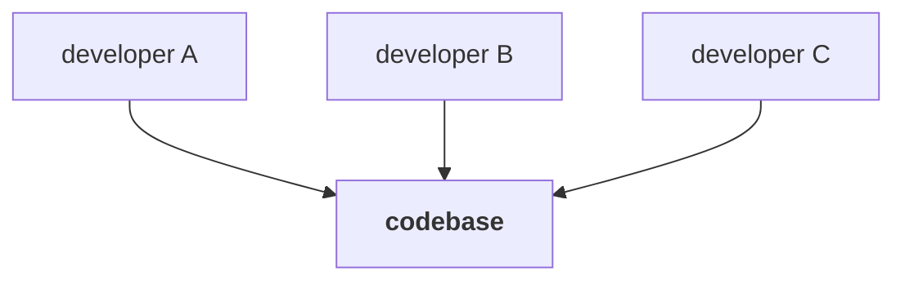
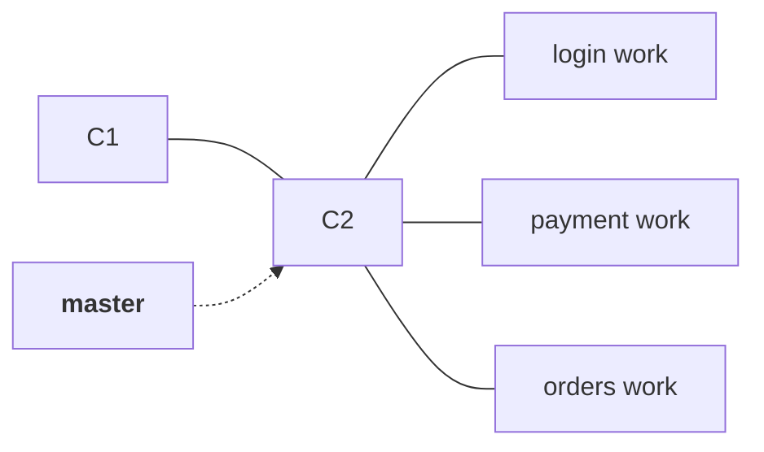
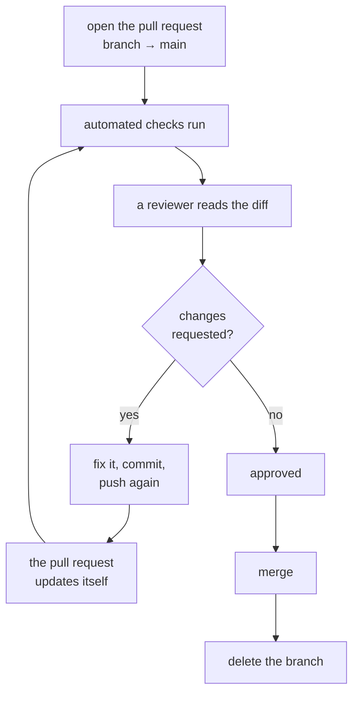
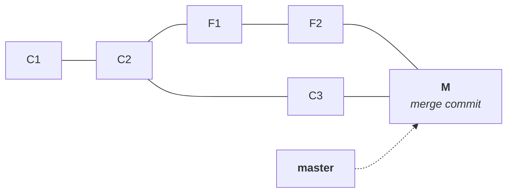
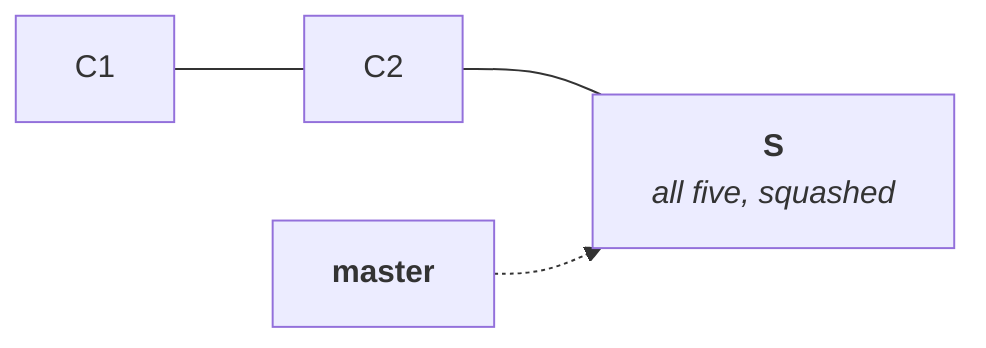
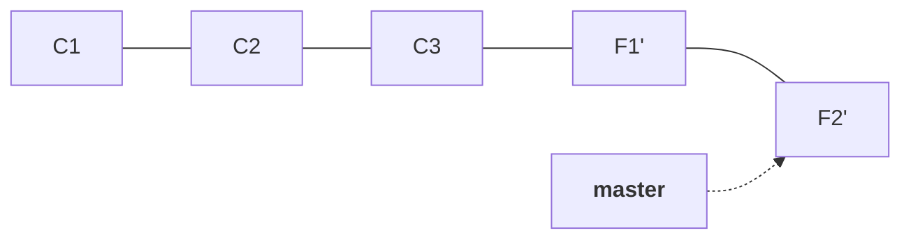

Notes `07` through `12` gave you everything needed to work alone: cut a branch, commit on it, merge it back, rebase it, undo it. Every one of those commands assumed you were allowed to run them. On a live product you are not.

Picture one codebase and three developers working on it at the same time.



The naive arrangement is the one Git gives you for free: one branch, called `master` or `main`, and everybody commits to it. That breaks immediately. Three people editing the same files on the same branch collide constantly, and no single feature ever reaches a finished state, because each person's half-done work is sitting in everyone else's checkout.

Note `07` already solved that half of the problem. Each developer cuts their own branch, works there in isolation, and merges back when the feature is done.



That is enough for a hobby project. It is not enough here, and the reason is what `master` means once a product is live.

## Master is the branch that is deployed

In a real repository there are many branches, but exactly one of them is wired to production. Whatever commit `master` points at is the code your users are running right now. Every other branch is somebody's work in progress.

> [!important] **The repository holds every branch. Production holds one.**
> A common misreading is that the main codebase on GitHub only contains `master`. It contains all of them — feature branches, release branches, abandoned experiments. What makes `master` different is not where it is stored, it is what is attached to it: the deploy.

That single fact makes the merge step dangerous in a way it was not in note `08`. Nothing in Git stops a developer three days into their first job from doing this:

```bash
git switch master
git merge feature/login
git push
```

Three ordinary commands, each of which you have already learned, and the result is that untested code is live for every user. Git will not object. Git has no idea what production is.

So the rule that every team adopts is blunt: **nobody pushes to `master` directly.** Which immediately raises the question the rest of this note answers — if you cannot merge your own branch into `master`, how does your code ever get there?

## You ask. That request is the pull request

You push your branch to the remote, and then you file a request that says: please merge my branch into `master`. Somebody else reads it, decides, and performs the merge.

On GitHub that request is called a **pull request**, shortened to PR. On GitLab the identical thing is called a **merge request**, shortened to MR. Different vendors, different word, same object and same purpose. If you see either abbreviation in a job description or a stand-up, they mean this.

The whole sequence, from nothing to merged, is six commands and a browser:

```bash
git switch main
git pull origin main
git switch -c feature/payment-validation
git add .
git commit -m "Add payment validation"
git push -u origin feature/payment-validation
```

Starting from an up-to-date `main` matters. Cutting the branch from a stale copy means your work diverges from a starting point that is already behind, which makes the merge harder than it needed to be — the same divergence cost note `14` returns to. The `-u` on the push is note `03`'s upstream flag, needed only the first time a branch is pushed.

After that push, the remote holds two branches — `origin/main` and `origin/feature/payment-validation` — and the pull request is opened between them in the browser.



> [!important] **A pull request tracks a branch, not a snapshot.** Push another commit to the same branch and the open pull request picks it up automatically — the diff, the commit list and the checks all re-run against the new tip. There is no second pull request to open and nothing to re-upload. This is what makes review an iteration rather than a single verdict: the reviewer comments, you push a fix, and they are looking at the corrected code in the same place a minute later.

> [!info] **A pull request is not a Git object, and Git has never heard of it.** Notes `04` and `05` catalogued everything Git stores: blobs, trees, commits, and refs pointing at them. A pull request is none of those. It lives in GitHub's database, not in `.git/`, and it is a conversation attached to a proposed merge — a diff, a comment thread, and an approval gate. This is why note `01`'s distinction matters in practice: Git is the version control system, GitHub is a product built around it, and code review is one of the things GitHub adds. Clone a repository and you get every commit; you do not get its pull requests.

What the reviewer sees is worth being precise about, because it is the reason this scales. The pull request does not show them the whole project. It shows only what your branch has that the target branch does not — the commits you added, and the files those commits touched. If the target branch already contains seventeen commits of shared history, the pull request says nothing about them; it shows the handful on top.

The reviewer reads that diff and asks whether the code is correct, whether it fits the codebase, and whether anything needs changing. That process has a name of its own — **code review** — and companies run it against a written policy rather than by taste. When the reviewer is satisfied they approve the pull request and submit the review, which unlocks the merge.

> [!important] **Approval is a gate, not a formality.** In a configured repository the merge button stays disabled until a reviewer with the right permission approves. That is the enforcement mechanism behind the no-direct-push rule, and it is what makes the rule a rule instead of an honour system. A repository with the gate switched off will happily let you merge your own pull request, which is why you can do it on your own projects and cannot at work.

## What a review actually looks like

The reviewer does not write approved or rejected. They comment on specific lines, and each comment is a small conversation.

A reviewer sees a line they do not understand and leaves a comment on it — why have you used this line. You get the comment, and you either change the code or explain the reasoning in a reply. When the point is settled, the thread is marked resolved. Only once the threads are resolved does the reviewer approve, and only then can the merge happen.

> [!important] **The comments are the review. The approval is the end of it.** A pull request with no comments and an instant approval is usually not a review that happened — it is a rubber stamp. The back-and-forth is the part that catches things, which is why the workflow makes it a conversation attached to specific lines rather than a verdict at the end.

### What a reviewer is checking, and what they are not

A reviewer reads for **correctness** (does this do the right thing), **integrity and security** (does it let something through that it should not), **performance** (is this call doing more work than it needs to), **consistency** (does it match how the rest of the codebase does this), and readability and maintainability more generally.

> [!important] **A reviewer does not test your code. They assume you already did.** They are not running your branch to see whether it works — they are reading it. The tests are your responsibility before the pull request is opened, and the automated checks are there to catch what you missed. Treating review as a testing stage is how untested code reaches production with an approval on it.

Seniority is relevant here only in a narrow way. A reviewer who has worked on a system for years spots the API call that will be slow at scale, or the pattern the team abandoned last year, because they have seen it before. That is experience being useful — not authority deciding whose code wins, which note `08`'s conflict rules already ruled out.

### The four labels

Teams prefix review comments with a word that says how much weight the comment carries. The exact vocabulary varies between companies, but the categories are near-universal, and knowing them saves a great deal of misreading.

| Label | Means | Blocks the merge |
|---|---|---|
| **Blocking** | Something that must be fixed before this merges | Yes |
| **Suggestion** | An improvement that would be nice to have | No |
| **Question** | The reviewer wants context before deciding | Until answered |
| **Nit** | A tiny preference, short for nitpick | No |

A blocking comment is exactly what it says — the pull request does not merge until the thread is resolved. Something is wrong: an endpoint that should not be reachable, a check that is missing, a case that is unhandled.

```
Blocking: this endpoint allows access without checking the user's role.
This should be fixed before merge.
```

A suggestion is an improvement the reviewer would make but is not insisting on — a long if-else ladder that would read better as a switch, a block that could be extracted into a helper. Nothing is wrong with the code; it could just be better.

```
Suggestion: could this validation be extracted into a helper method?
It may make the service easier to read.
```

A question is the reviewer asking for context rather than asserting anything. Often the answer is fine and the thread closes with a reply.

A nit is trivial and labelled as trivial precisely so it is not mistaken for anything more — renaming `payment_gateway` to `paymentGateway` to match the codebase's convention, fixing a typo in a comment. A nit should never hold up an otherwise good pull request.

> [!tip] **Read the label before reacting to the comment.** Almost all the friction around code review comes from a suggestion or a nit being read as criticism. The labels exist to defuse exactly that: the reviewer is telling you in advance how seriously to take each point. A nit is not an attack on your competence, and a blocking comment is not a personal judgement either — it is the one category that says do not merge this yet.

Two conventions make review work better in both directions. **Comments are about the code, not the person who wrote it** — the subject of the sentence is the function, not you. And **a reviewer explains why**, because a change request with a reason teaches something, and one without it only creates an argument.

### Keep pull requests small

The most reliable way to get a bad review is to make reviewing hard. A pull request showing 92 files changed, 11,300 lines added and 6,700 removed will not get read properly by anybody — it will get skimmed and approved, which is worse than no review at all, because now it carries an approval. A pull request showing 4 files changed, 180 added and 40 removed can actually be reasoned about.

The related rule is **one pull request, one purpose**. A branch that adds payment validation, refactors the payment repository, changes logging, cleans up the database and redesigns some CSS is five changes wearing one coat. Split into separate pull requests, each one is easier to review, easier to test, and — the part people forget — easier to revert on its own when one of them turns out to be the problem.

## Merging the pull request: three buttons, three histories

When the merge is finally performed, GitHub offers three ways to do it. They are not cosmetic variations — each produces a different history, and each is one of the operations you already know from notes `08` and `09`.

**Create a merge commit** is exactly note `08`'s three-way merge. Your branch's commits arrive intact, and one extra commit is created on top with two parents, recording that two lines of development came back together.



**Squash and merge** collapses every commit on your branch into a single new commit on the target. Five commits of work-in-progress — a first attempt, a fix, a typo correction, a rename, a final tidy — arrive on `master` as one commit whose message you write yourself.



**Rebase and merge** replays your commits onto the tip of the target branch, exactly as note `09` described, and the result is a straight line with no merge commit at all. As note `09` established, those replayed commits are new objects with new IDs, because a commit's parent is part of what gets hashed.



| Button | What lands on master | History shape | Merge commit |
|---|---|---|---|
| Create a merge commit | Your commits, unchanged, plus one merge commit | Branching, with the fork visible forever | Yes |
| Squash and merge | One new commit containing all your changes | Straight line, your individual commits gone | No |
| Rebase and merge | Your commits replayed with new IDs | Straight line, each commit preserved | No |

There is a real trade-off here and it is worth stating rather than picking a winner. A merge commit preserves the truth of what happened, at the cost of a graph that gets hard to read once dozens of branches have merged. Squashing gives `master` one clean commit per feature, at the cost of losing the intermediate steps — which is a loss if you ever need `git bisect` from note `12` to land on a small commit, and a gain if those intermediate commits were noise. Rebase-and-merge keeps every commit and still gives a straight line, at the cost of rewriting history: the commits on `master` are not the objects that were reviewed, they are copies.

> [!warning] **This is a team decision, not a personal preference, and teams disagree.** Some organisations require squash so that every entry on `master` is one shippable feature. Others require rebase so history stays linear and readable. Others keep merge commits because they want the record. Follow whatever your repository is configured for — the buttons your team has left enabled tell you what they decided.

After a merge, the target branch has gained the commits from your branch and, if the merge commit option was used, one additional commit created by the merge itself. That extra commit is the same object note `08` proved has two parents; the pull request did not invent anything new, it just performed the merge on the server instead of on your laptop.

## Branch naming is a convention, and it is load-bearing

With three developers and one repository the branch list is short. With fifty it is not, and a list of branches called `test`, `fix`, `new` and `mybranch` tells nobody anything.

Teams therefore adopt a naming convention. Common ones:

- **By type and subject** — `feature/login`, `feature/payment`, `feature/orders`. The prefix says what kind of work it is, the suffix says which piece of the product.
- **By ticket number** — the branch name carries the identifier from the issue tracker, so any branch can be traced back to the request that caused it and the person assigned to it.
- **By owner** — the developer's name appears in the branch, which makes it obvious at a glance who is responsible for it.

Which convention matters far less than having one. The point is that a stranger reading the branch list can tell what each branch is for without asking.

## Deleting branches after they merge

Once a branch has been merged its job is finished, and every workflow in the next two notes ends by deleting it. Branches are cheap — note `07` proved a branch is a 41-byte file holding one commit ID — but a repository with four hundred stale branches is genuinely harder to work in, and none of them are telling the truth about what is currently being built.

GitHub offers to delete the branch on the remote as soon as the pull request merges. That is the deletion that matters, because the remote is what everyone else sees.

> [!info] **Deleting the remote branch does not delete your local one.** They are separate refs — the remote's `refs/heads/feature/login` and yours are different files on different machines, as note `07` showed. Your local copy sits there until you remove it yourself with `git branch -d feature/login`, which is harmless to leave but worth cleaning up. The merged work is safe either way: it is in `master` now, and deleting a branch only removes a pointer, never the commits.

> [!info] **Two branches holding the same file do not store it twice.** A natural worry when branch count grows is disk: if ten branches all contain the same thousand files, is that ten copies? No — and note `04` already explained why. Git addresses content by its hash, so identical content is one blob no matter how many trees and how many branches reference it. Branches are pointers into a shared object database, not folders full of duplicated files.

## Who resolves a conflict, and what devops actually owns

Merging through a pull request does not make conflicts disappear. If two branches changed the same lines, GitHub reports the conflict exactly as note `08` described and refuses to merge until it is resolved — either in the browser's conflict editor or locally, and in both cases by choosing which side survives.

The question worth asking is whose job that is, because it is a question about roles rather than about Git.

> [!important] **The conflict is resolved by the developer who wrote the code — never by devops.** Resolving a conflict means deciding which of two changes is correct, and that decision needs to know what the code is supposed to do. Nobody outside the two authors has that knowledge. In practice the two developers talk: one explains what their change was for, and the other accepts it or keeps their own. There is no rule Git could apply on their behalf, and there is certainly no rule that says the more senior person's code wins.

So if devops does not resolve conflicts, what is the devops responsibility in all of this? It is the process, not the content:

- **That the branching strategy is actually followed.** One long-lived branch that deploys, feature branches that merge into it, no stray permanent branches nobody agreed to. The next two notes describe the strategies being enforced.
- **That every change passes through the gates before it reaches production** — the staging environment, the review, the approval.
- **That the automated checks run on the way in.** Tests, linting and coverage executed against the pull request before a human is even asked to look, so that obviously broken code never reaches a reviewer. That automation is continuous integration, which is the subject the course moves to after Git.

This is the same definition of devops from the very first class, applied concretely: keeping development and operations running smoothly together. The pull request is where those two meet.

## Summary

- **`master` is the branch that is deployed**, so it is protected: nobody pushes to it directly, and the merge is performed by somebody other than the author.
- **A pull request (GitHub) or merge request (GitLab) is the request to merge one branch into another.** It is not a Git object — it lives in the hosting platform, along with the diff, the discussion and the approval.
- **A reviewer sees only what the branch adds** on top of the target, which is what makes review possible on a large repository.
- **Three merge buttons, three histories** — merge commit keeps the fork and adds a two-parent commit, squash collapses the branch into one new commit, rebase replays the commits with new IDs onto a straight line.
- **The review is the comments, not the approval** — a reviewer checks correctness, security, performance and consistency, and assumes you already tested the code.
- **Comments carry labels** — blocking stops the merge, suggestion and nit do not, and a question needs an answer.
- **Small, single-purpose pull requests get reviewed properly.** Large ones get skimmed and approved, which is worse than no review.
- **Conflicts are resolved by the people who wrote the conflicting code**, because resolution requires knowing what the code is for.
- **Devops owns the process around the merge**, not the merge decision: that the strategy is followed, that the gates exist, and that the automated checks run.

---

*Source: class 6 — 2026-08-23, recording parts 1–3.*
