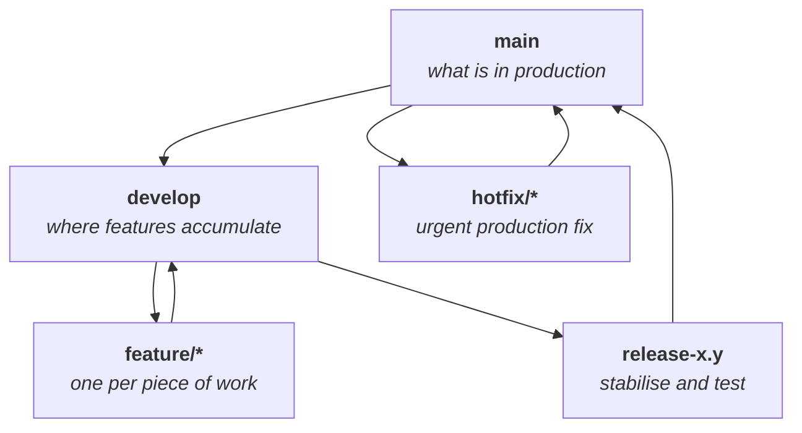
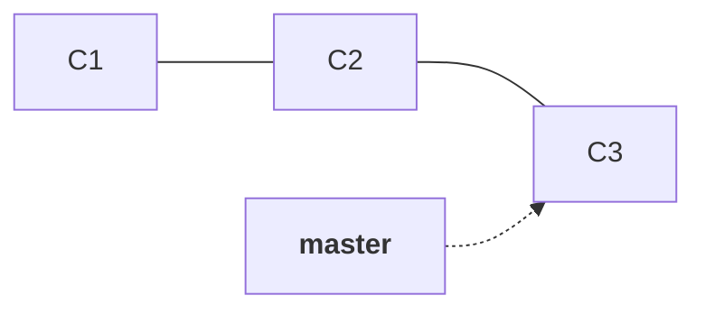
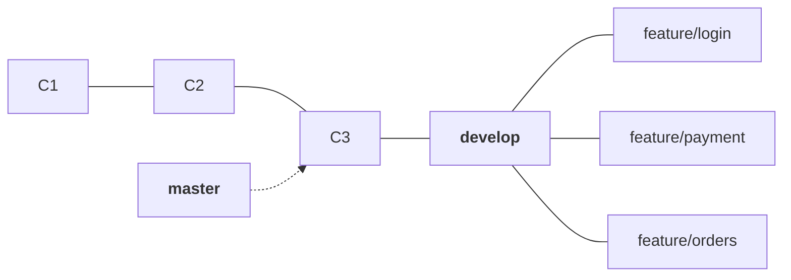
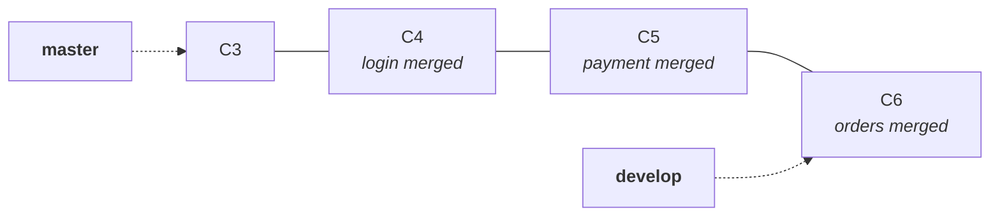
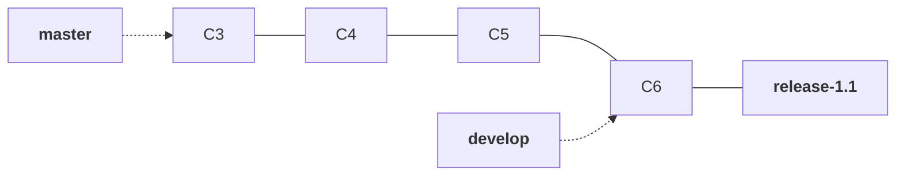
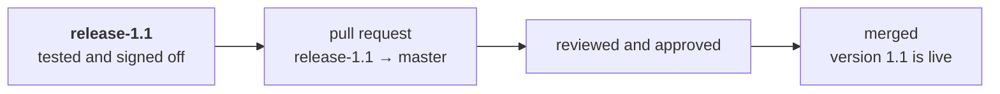
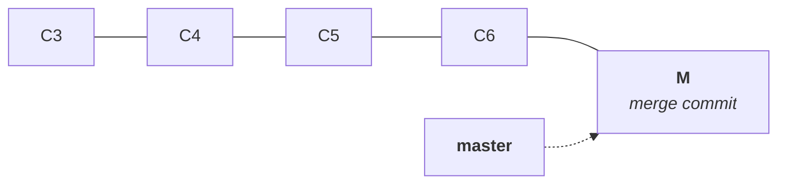
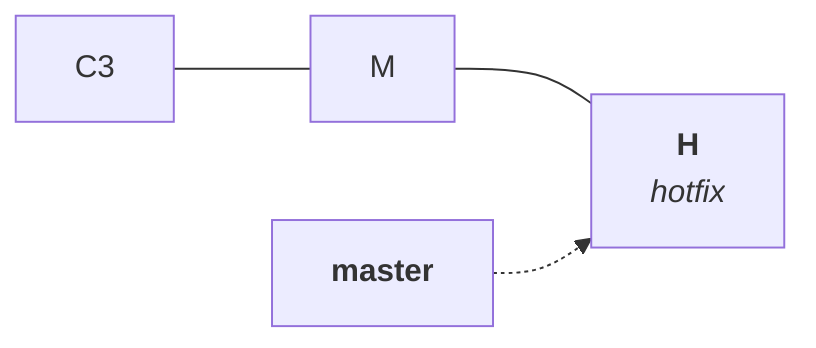

Note `13` ended with a working arrangement: cut a feature branch, open a pull request, get it reviewed, merge it into `master`. For a product that ships continuously, that is very nearly the whole story. For a large class of software it is not, and the reason has nothing to do with Git.

Consider a product that releases on this schedule:

| Version | Released |
|---|---|
| 1.0 | day 0 |
| 1.1 | roughly 30 days later |
| 1.2 | roughly 60 days after that |
| 2.0 | when something changes big enough to justify it |

That numbering is the ordinary **major.minor.patch** convention: the last digit moves for a small fix, the middle for new functionality, the first for a change large enough that the product is meaningfully different. What matters here is not the numbering but the gap between the rows. Code is being written every day, and it reaches users once every 30, 60 or 90 days.

This is normal for banking systems, telecom billing, enterprise software shipped to customers who must schedule the upgrade, and for anything described as legacy. The deployment window is rare and expensive, so a release is not one feature — it is every feature written since the last one, tested together as a single version.

Now apply note `13`'s arrangement to it. Ten features are finished over eight weeks and each one merges into `master` as it lands. But `master` is production. Merging a finished feature into it means either deploying it immediately, which the release schedule forbids, or leaving `master` holding code that is not live — at which point `master` has stopped being the thing that describes production, and nobody can tell by looking at it what users are actually running.

So the features need somewhere else to accumulate. That place is what Git Flow adds.

## The four kinds of branch



Two of these are permanent and live forever: `main` (or `master`) and `develop`. The other three are cut for a purpose and deleted when that purpose is served.

- **`main`** is production, exactly as note `13` described it. Nothing is merged into it except a finished, tested release, and only through a pull request.
- **`develop`** is the integration branch. Every finished feature is merged here first, so `develop` is the running answer to the question of what the next version will contain.
- **`feature/*`** is one branch per piece of work, cut from `develop` and merged back into `develop`.
- **`release-x.y`** is cut from `develop` when the version's content is complete, and exists so that testing and stabilisation happen somewhere that is not moving.
- **`hotfix/*`** is the exception path for a bug already in production, cut from `main` and merged back into `main`.

## Walking it through

Start from a repository with some history on `master` and nothing else — three commits that are live.



Create `develop` from it, and push it so the rest of the team has it:

```bash
git switch -c develop
git push -u origin develop
```

> [!info] **`develop` has to be pushed like any other branch.** A branch created locally does not exist on the remote until you push it — note `03` covered this and it surprises people here, because `develop` feels like infrastructure rather than someone's working branch. It is not special. Until `git push -u origin develop` runs, it is a 41-byte file on one laptop.

Three developers now cut their own branches from `develop` — not from `master`, which is the whole point. Update `develop` first, so the branch starts from what the team currently has rather than from whatever you last fetched:

```bash
git switch develop
git pull
git switch -c feature/login
```



Each developer works on their own branch and pushes it. The first push of a new branch needs the upstream set, which is the `-u` from note `03`:

```bash
git add login.txt
git commit -m "added login feature"
git push -u origin feature/login
```

After all three have done this, the remote shows five branches: `master`, `develop`, and the three feature branches. Note `13`'s point applies — they all live in the same repository, and only `master` is deployed.

### The feature files are not in develop yet

This is worth stopping on, because it is the moment the model becomes concrete. Switch to `develop` and list the files:

```bash
git switch develop
ls
```

```
app.txt  deploy.txt
```

`login.txt`, `payment.txt` and `orders.txt` are nowhere to be seen, even though all three were committed and pushed minutes ago. They exist only inside their own branches. As note `07` established, switching branches rewrites your working directory to match the commit that branch points at, and `develop` still points where it did before any feature work started.

### Merging the features in

Now each finished feature is merged into `develop`:

```bash
git merge feature/login
```

The first merge fast-forwards or produces a merge commit depending on whether `develop` has moved — note `08` covered both cases in detail. The moment the first one lands, `develop` has moved, so the second and third merges have two diverged sides and each creates a merge commit.



> [!info] **A merge commit needs a message, so Git opens your editor.** When a merge is not a fast-forward, Git launches whatever `core.editor` is set to with a pre-filled message. Accept it and exit — `:wq` in vim, or Ctrl+O then Ctrl+X in nano. Nothing is wrong; Git is asking you to confirm the commit message for a commit it is about to create. If you find yourself stuck in an editor you did not expect, that is what happened.

Run `ls` on `develop` now and all three files are there. Meanwhile `master` has not moved at all — it still points at C3, and production is still running exactly what it was running this morning.

### Cutting the release branch

The version's content is complete, so it gets its own branch:

```bash
git switch -c release-1.1
```



`ls` on `release-1.1` shows the same files as `develop`, because it was cut from the tip of `develop` and nothing has happened since.

The reason this branch exists is that testing needs a target that stops moving. QA needs to certify a specific set of changes, and regression testing on a product that ships every 60 days is not a quick exercise. If testing ran directly against `develop`, every merge landing during the test cycle would invalidate the run. Cutting `release-1.1` freezes the candidate.

> [!important] **The release branch is why `develop` can keep moving.** The instant `release-1.1` exists, the three developers are free to start the next version's work — new branches cut from `develop`, for the next set of features. Those changes accumulate in `develop` while `release-1.1` is being tested, and they cannot contaminate the release, because the release is a separate branch. Without `develop`, there would be nowhere to put in-flight work during a two-week stabilisation, and development would simply stop.

Bugs found during testing are fixed on the release branch. Each fix is a commit there, and the branch is re-tested. Alongside those fixes, the release branch is where the version-preparation work happens — bumping the version number, updating documentation and changelogs, and anything else that belongs to shipping 1.1 rather than to building 1.2.

> [!important] **New features do not go into a release branch.** Once `release-1.1` is cut, its contents are frozen apart from fixes to what is already in it. A feature that arrives late does not get squeezed in — it goes into `develop` and ships in 1.2. The moment new work is allowed onto the release branch, the branch stops being a stable test candidate and QA is testing something that keeps moving, which is the exact problem cutting it was meant to solve.

> [!info] **Everything fixed on the release branch has to reach `develop` too.** The release branch is deleted after it ships. Any bug fixed there exists nowhere else, so if it is not merged back into `develop`, version 1.2 reintroduces it. In practice the whole release is synchronised back into `develop` after it merges into `main`, which carries the fixes with it in one step.

### Merging the release into production

The release is finally merged into `master` — and, as note `13` established, not by hand:



Nobody runs `git switch master && git merge release-1.1 && git push`. The pull request shows the reviewer only what the release adds on top of `master` — the feature commits and the files they changed, not the shared history underneath. The reviewer approves, the merge is performed, and `master` gains the release's commits plus one merge commit created by the merge itself.



Version 1.1 is now in production, and `master` once again describes exactly what users are running.

## Hotfix: the one path that skips develop

Something is broken in production right now. The fix cannot wait 30 days for the next release, and it cannot come through `develop`, because `develop` is full of half-finished work for version 1.2 that must not go live.

So the hotfix branch is cut from `master` — the only branch in the whole model that is cut from production:

```bash
git switch master
git switch -c hotfix/login-crash
```

Fix it, commit it, and merge it back into `master` through a pull request. The naming convention is the same idea as note `13`'s: the prefix says what kind of branch it is, the suffix says what it fixes.



> [!important] **A fix applied to production must also be carried back, or the next release undoes it.** If the fix lands only on `master`, then `develop` — which was cut before the fix existed — still contains the broken code, and version 1.2 will happily ship the bug again. So the hotfix is merged into `develop` as well. The same applies to a bug found and fixed on a release branch: that fix has to reach `develop`, or it is lost the moment the release branch is deleted. This is the failure mode of the whole model, and it is easy to hit, because the merge that fixes production feels like the end of the job.

## The five branches at a glance

| Branch | Cut from | Merges into | Lifetime |
|---|---|---|---|
| `main` | — | — | permanent — always describes production |
| `develop` | `main`, once | — | permanent — always describes the next version |
| `feature/*` | `develop` | `develop` | one piece of work |
| `release/*` | `develop` | `main`, and back into `develop` | one version's stabilisation |
| `hotfix/*` | `main` | `main`, and back into `develop` | one urgent production fix |

> [!info] **The separator in a branch name is a team convention, not a rule.** `release-1.1` and `release/1.1` are equally common, as are `hotfix/payment-null-error` and `bugfix/cart`. Git treats the whole string as the branch name and the slash carries no special meaning to it — although most tools will display slash-separated names as a folder tree, which is the reason the convention caught on.

## What it costs

Git Flow is not a bad strategy. For a product that ships every 60 days to customers who schedule their upgrades, it is close to the only sane arrangement — it gives you a branch that always describes production, a branch that always describes the next version, and a frozen candidate to test.

The cost is conflicts, and it is structural rather than accidental.

Three developers work for 30 to 90 days on separate branches. Nobody's work meets anybody else's until it is merged into `develop`, which by design happens at the end. Every day of separation is another day in which two people can edit the same function without either of them finding out.

> [!important] **Integration difficulty grows with the time between merges.** Two branches that diverged an hour ago rarely conflict. Two branches that diverged two months ago frequently do, because the amount of code each side has changed is now large. Git Flow deliberately keeps branches apart for the length of a release cycle, so it deliberately maximises this. The conflicts all arrive at once, at integration time, in `develop` — and every one of them has to be resolved by the developers who wrote the code, as note `13` established.

Teams working this way get very good at conflict resolution, because they have no alternative — the release cadence is set by the business, not by the branching model.

That cost is what the next strategy exists to avoid.

## Summary

- **Git Flow suits a slow, versioned release cadence** — 30, 60 or 90 days between deployments, with a version number attached to each one.
- **Two permanent branches**: `main` for what is in production, `develop` for what the next version will contain.
- **Features are cut from `develop` and merged back into `develop`**, never into `main` directly.
- **A release branch is cut from `develop`** when the version's content is complete, so that testing has a target that does not move — and so that `develop` can keep accepting the next version's work.
- **The release reaches `main` through a pull request**, reviewed and approved like any other.
- **Hotfixes are cut from `main`**, because production cannot wait for `develop` — and must be merged back into `develop` too, or the next release reintroduces the bug.
- **The structural cost is merge conflicts**, because the model keeps branches separated for the whole release cycle and integrates them all at the end.

---

*Source: class 6 — 2026-08-23, recording parts 1–2.*
