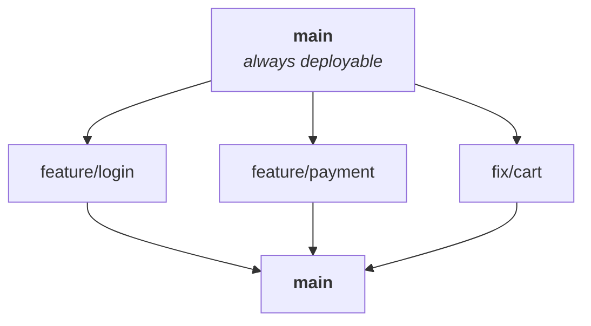
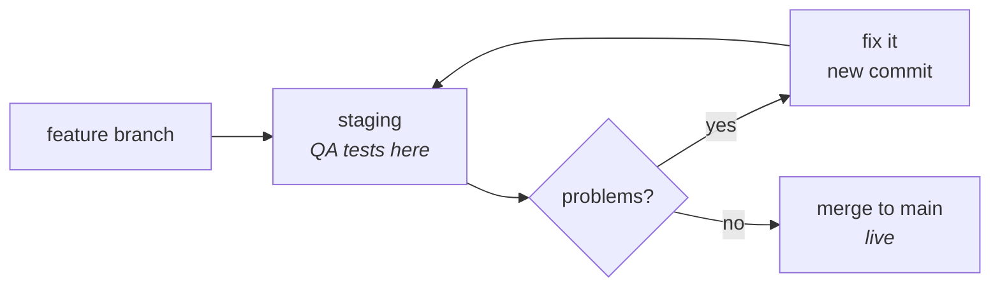
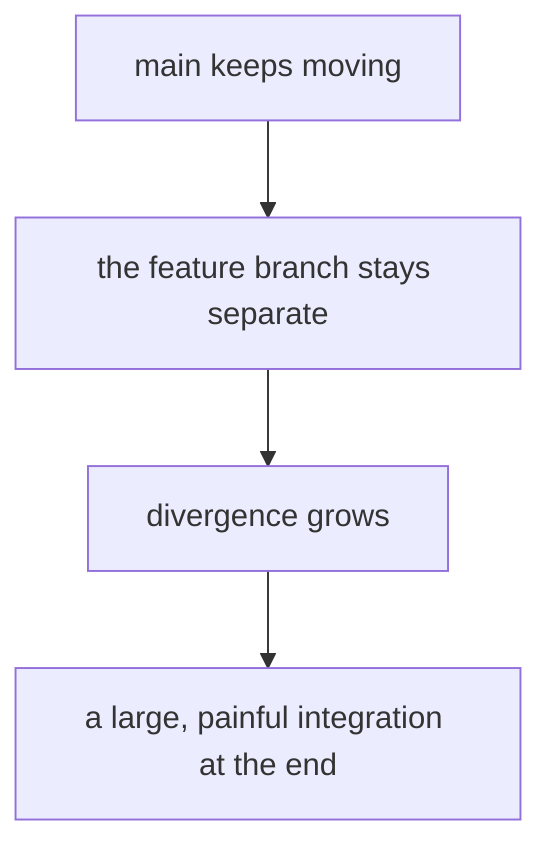
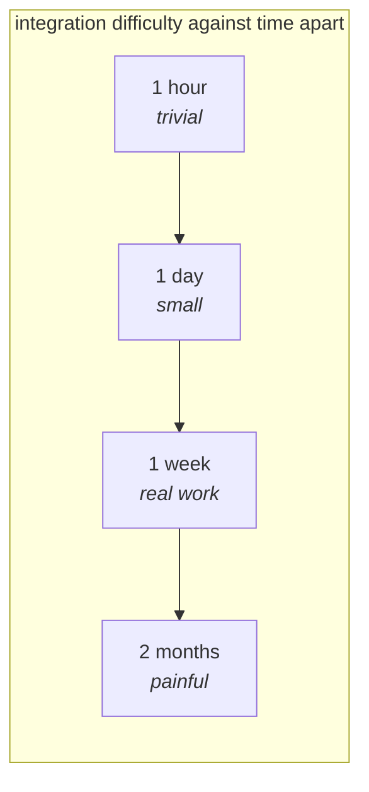

Note `14` ended on a structural cost: Git Flow keeps branches apart for a whole release cycle, so every conflict in the cycle arrives at once, at the end, in `develop`. That price buys something real when a release ships every 60 days. Now change one number and watch it stop being worth paying.

Suppose the company deploys **every day**. Monday something goes live, Tuesday something else, Wednesday again. Nothing is batched into a version, because there is no version — there is just what is in production right now.

Run Git Flow against that. A feature finishes on Tuesday morning, so it merges into `develop`. It needs to ship Tuesday afternoon, so a release branch is cut from `develop` for it. That branch is tested, merged into `main`, deployed, and deleted. On Wednesday the whole ritual runs again. And again on Thursday.

The release branch exists to freeze a candidate while testing runs for days. If it lives for two hours, it is not freezing anything — it is a formality between `develop` and `main`. And `develop` exists to hold the next version's work while a release stabilises. If stabilisation takes an afternoon, `develop` is holding nothing; it is a second copy of `main` that everything passes through on the way past.

So both of them get deleted, and what remains is GitHub Flow.

## One long-lived branch, and short-lived branches around it

There is exactly one permanent branch. Every piece of work is a branch cut from it, and every branch merges back into it through a pull request. Compared with note `14`, two things disappear: `develop` and `release/*`. That is the entire simplification, and it is most of the reason the workflow feels lighter.

> [!important] **GitHub Flow is not the same thing as using GitHub.** The name is unhelpful. It is a branching strategy, and you can follow it on GitLab, Bitbucket or a self-hosted server. What it names is a set of rules — one healthy central branch, short-lived branches around it, pull requests, review, automated checks, and merging often. Equally, you can use GitHub all day while following Git Flow or trunk-based development. The tool and the strategy are independent choices.

The cycle for a single change:

Every step is one you already have. The branch is note `07`, the commits are note `02`, the push is note `03`, and the pull request and review are note `13`. Nothing new was invented — the strategy is a decision about which branches exist and how long they live.

## Where the testing goes

Git Flow had an obvious place for testing: the release branch, frozen and certified before it reached production. GitHub Flow deletes that branch, so the question is where the testing moved to.

Two answers, usually both at once.

**Automated checks run on the pull request.** Tests, linting and static analysis execute against your branch before a human is asked to look at it, so obviously broken code never reaches a reviewer. Note `13` described this as the gate; here it carries more weight, because there is no release branch behind it as a second chance.

**A staging environment sits in front of production.** Staging is a deployment that looks like production — same shape, same infrastructure, not real users. The change is deployed there and tested against it, and only then merged and deployed for real.

A bug found in staging is not a crisis. It is another commit on the same branch, another deploy to staging, another test. The loop runs until the change is clean, and only the clean version reaches `main`.

> [!info] **Urgent production fixes do not need a special branch here.** Git Flow needed `hotfix/*` because `develop` was full of unfinished work that must not ship, so the fix had to come off `main` directly. In GitHub Flow every branch already comes off `main`, so a production fix is an ordinary short-lived branch that happens to be urgent. Some teams still name it `fix/*` or `hotfix/*` for visibility, but the mechanics are identical to any other change.

## Where it fits

GitHub Flow suits software that is deployed frequently and does not ship as a numbered version to customers who schedule the upgrade — web applications, SaaS products, backend APIs, and most startup products. The teams using it deploy daily, or every two or three days, and at the outside weekly.

It is also considerably easier to explain to a new joiner, which matters more than it sounds. Git Flow has five branch types and a rule for each; GitHub Flow has one branch and one rule.

## What it does not fix

Note `14` blamed Git Flow's conflicts on branches staying separate for weeks. It is worth being honest that **GitHub Flow does not prevent that** — it only makes it less likely by removing the structure that encouraged it.

Nothing stops a developer from opening `feature/payment` and working on it for two months. When they do, the identical failure appears:

And the conflicts are not eliminated by merging more often either — they are only made smaller. Two developers whose branches both come off `main` can still touch the same lines, and the second one to merge still has to reconcile.

> [!important] **Integration difficulty grows with time apart, roughly in proportion.** Two branches that diverged an hour ago rarely conflict, because neither side has changed much. Two branches that diverged two months ago frequently do, because both sides have. This is the single idea underneath every workflow decision in these three notes, and it is why the third strategy exists: if delay is what makes integration expensive, then integrate constantly.

## Why Git will not resolve a conflict for you

One question is worth answering directly, because it comes up whenever conflicts are discussed: could the platform not just resolve them automatically?

No — and the reason is not that nobody has implemented it.

Two developers changed the same line of the same file. Git can see both versions. What it cannot see is which one is correct, and there is no rule it could apply that would not be wrong regularly. Taking the later change assumes newer means better. Taking the earlier one assumes the opposite. Ranking by author seniority is worse still: the junior developer's change may be the one that supersedes the senior's, because it was written afterwards with more information.

> [!important] **If Git could resolve it safely, it would not be called a conflict.** Every merge Git performs silently is a case it could decide — different files, different regions, one side unchanged. It stops only in the case where any automatic choice could destroy work, and it stops to hand the decision to the one participant who knows what the code is supposed to do. Note `13` established who that is: the developer who wrote it.

## Summary

- **GitHub Flow deletes `develop` and `release/*`**, leaving one permanent branch and short-lived branches around it.
- **It is a branching strategy, not a GitHub feature** — the name is misleading and the workflow runs anywhere.
- **The cycle is branch, commit, push, pull request, review, checks, merge, delete.**
- **Testing moves to automated checks on the pull request and to a staging environment**, since there is no release branch to certify.
- **A production fix is just another short-lived branch**, because every branch already comes off `main`.
- **It fits frequent deployment** — web and SaaS products, APIs, startups.
- **It does not prevent long-lived branches**, and the cost of a long-lived branch is the same here as in Git Flow: integration difficulty grows with time apart.

---

*Source: class 6 — 2026-08-23, recording parts 2–3.*
