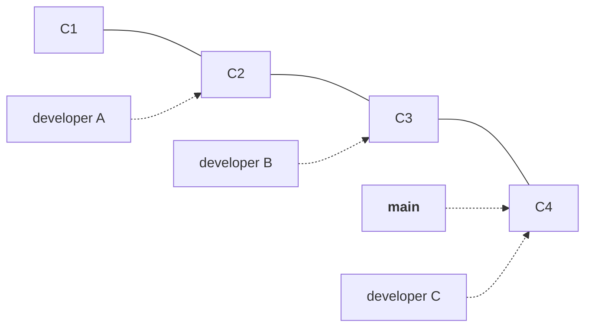
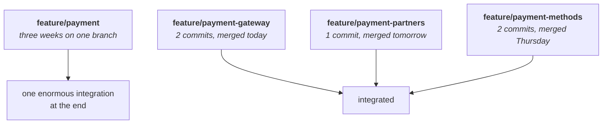
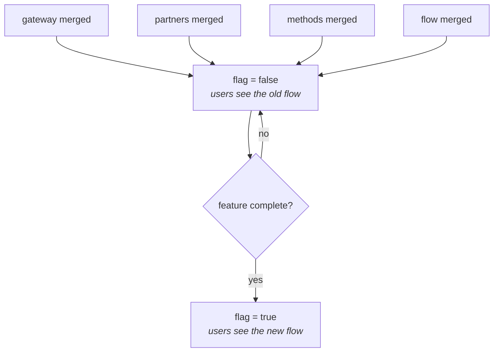
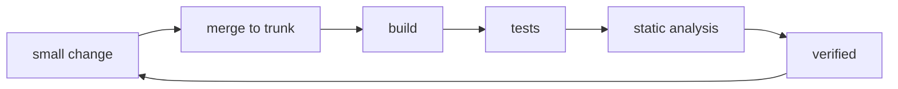

Note `15` ended with the idea that everything in these three notes rests on: integration gets harder the longer two branches stay apart. Git Flow keeps them apart for a release cycle. GitHub Flow shortens that but does not enforce anything — a feature branch can still sit open for two months.

So take the idea to its limit. If time apart is what costs you, remove the time apart.

## The naive version, and why it fails

Start with the extreme. Why have branches at all? One branch — `main` — and everybody commits straight to it.



The appeal is real and worth taking seriously for a moment. There are no merge conflicts, because there is nothing to merge — every change lands on the same line of history, one after another. There is no branching strategy to document, no branch naming policy, no argument about squash versus rebase. Integration is continuous by construction, because nobody is ever separated from anybody.

And it fails immediately, for the reason note `13` gave: `main` is what is deployed. People make mistakes — that is not a character flaw, it is the normal condition of writing software — and this arrangement puts every mistake straight into production with no review, no automated check, and nothing between the typo and the user. No amount of care makes that acceptable, because the failure mode is not carelessness, it is ordinary human error.

So the philosophy survives and the mechanism does not. What trunk-based development keeps is the goal — everyone's changes integrated into one shared trunk, constantly — and what it changes is how the change gets in.

## Short-lived branches

The trunk is the shared branch, and in almost every repository the trunk is `main`. Work still happens on branches, and those branches still merge through a pull request with review and automated checks. The single rule that makes it trunk-based is how long a branch is allowed to live.

> [!important] **The principle is not no branches. It is no long-lived branches.** A trunk-based branch exists for hours or a day or two, holds one or two commits, and is merged and deleted. Some teams with very strong test suites do commit directly to the trunk, but that requires excellent automated coverage, strong CI and real discipline. The common form is a branch so short-lived that divergence never has time to accumulate.

Which raises the obvious objection: features are not small. What do you do with one that genuinely takes three weeks?

## Split the feature, not the branch

Take a payment feature. It is not one thing — it is a payment gateway integration, then payment partners, then the different payment methods, then the payment flow itself, then the security around it. In a ticketing system those are already separate sub-tickets under one parent.

Under GitHub Flow the natural move is one branch, `feature/payment`, held open for three weeks while all of that is built. Trunk-based says: do not do that. Make a branch per sub-ticket.



Each branch carries one or two commits, lives less than a day, and merges into the trunk. The three-week feature is still three weeks of work — it is simply integrated a piece at a time instead of all at once, and each piece meets everyone else's code while it is still small enough to reconcile easily.

## The problem this creates

Solving the conflict problem this way introduces a worse one, and the class was explicit about it.

Your payment gateway work is merged into `main` on Tuesday. But `main` is what gets deployed. The gateway is integrated and nothing else is — no partners, no payment methods, no flow. If a deploy happens on Tuesday evening, users get a payment feature that is a quarter built.

> [!danger] **You traded merge conflicts for a correctness problem, and correctness is the more expensive one.** A conflict is annoying and is caught before anything ships. Shipping a half-built feature is visible to every user of the product. Merging small and often is worthless unless something prevents incomplete work from reaching people.

## Feature flags, and deploy versus release

The fix is to separate two things that sound identical and are not.

| Term | Means |
|---|---|
| **Deploy** | The code has reached production infrastructure. It is merged, built and running on the servers. |
| **Release** | Users can actually reach the functionality. It is visible and usable. |

Under Git Flow those two happened together, so the distinction never came up. Trunk-based development breaks them apart deliberately, and a feature can sit in the state **deployed yes, released no** for weeks.

The mechanism is a **feature flag**: a value the code checks before deciding which path to take.

```java
if (newCheckoutEnabled) {
    useNewCheckout();
} else {
    useOldCheckout();
}
```

While the feature is being built in pieces, the flag is `false`. Every one of those small branches merges into `main` and deploys, and every user keeps getting the old path, because the new one is behind a condition that is not met. Nothing half-built is visible to anybody.



When the last piece lands, the flag is flipped to `true` and the feature is released — with no deployment, no merge and no code change. The code was already there.

Where the value lives depends on the setup: an environment file, a configuration file, a database row, or a dedicated configuration service. What matters is that it is not hard-coded, so flipping it does not require shipping new code.

> [!danger] **A flag flipped before the feature is finished does exactly the damage you were avoiding.** The flag is now the thing standing between users and half-built code, so turning it on early is the same outage as merging early would have been — with the extra problem that it can be done by someone who was not involved in writing the feature. Flags are a control, and controls need the same care as the code they gate.

> [!info] **The old path is removed later, not immediately.** Once the new flow is live and stable, the `else` branch is dead code, and it is deleted in a subsequent release rather than in the same one. Keeping it briefly means the flag can be flipped back if something is wrong. Removing it eventually matters too — a codebase that never cleans up its flags accumulates conditions nobody remembers the purpose of.

## Who tests

Git Flow put testing on a release branch, and GitHub Flow put it on staging plus checks on the pull request. Trunk-based development can use a staging environment too, and some teams do — but the emphasis shifts.

Because changes are small and constant, the practical burden moves onto the developer: you unit-test your own change properly before it goes anywhere near the trunk. Teams following this are typically small and fast-moving, and there is often no separate QA pass between your merge and production. That is the discipline the strategy is named for.

> [!important] **This is the trade-off, stated plainly.** Trunk-based development buys tiny integrations and near-zero conflict pain, and pays for it with process discipline: excellent automated tests, feature flags used correctly, and developers who pull from the trunk frequently — because the trunk moves under you many times a day, and a branch that does not keep up is a long-lived branch by another name.

## Why it needs CI

The word in continuous integration is the same word as the one in this note, and that is not a coincidence.

Every merge into the trunk can trigger a pipeline: build, unit tests, integration tests, static analysis, security checks. Since merges happen many times a day, that pipeline is the only thing standing between constant small changes and a broken trunk. Merging often without automated verification is not trunk-based development — it is a fast route to a broken `main`.



This is the point at which the course leaves Git behind: the strategy that works best is the one that depends most on automation, and building that automation is what CI/CD is.

## The three strategies side by side

| | Git Flow | GitHub Flow | Trunk-based |
|---|---|---|---|
| Production branch | `main` | `main` | trunk, usually `main` |
| `develop` branch | Yes | No | No |
| Feature branches | Yes, can be long | Yes, prefer short | Very short, or none |
| Release branches | Yes | Usually no | Usually no |
| Hotfix branches | Yes, from `main` | An ordinary fix branch | An ordinary small trunk fix |
| Branch lifetime | Can be weeks | Prefer days | Hours to a day |
| Release style | Versioned and planned | Frequent deployment | Continuous, flag-controlled |
| Complexity | High | Moderate | Low structure, high discipline |
| Best fit | Traditional release cycles | Web and SaaS teams | Teams with strong CI/CD |

The mental model in one line each: **Git Flow is structured release branches. GitHub Flow is one branch plus short-lived branches plus pull requests. Trunk-based is integrating into the trunk constantly.**

None of them is correct in the abstract. The right one is decided by how often your product can actually ship, which is a business fact before it is an engineering one.

## Summary

- **Trunk-based development integrates everyone's work into one shared trunk constantly**, because integration difficulty grows with time apart.
- **It does not mean no branches** — it means no long-lived ones. Branches live hours, carry a commit or two, and merge through a pull request.
- **Large features are split into small increments** and merged one at a time, instead of held on a branch for weeks.
- **That would put incomplete work on the deployed branch**, so feature flags gate it.
- **Deploy and release become separate events**: the code reaches production while users still see the old path, until a flag is flipped.
- **The strategy trades structure for discipline** — strong automated tests, correct flag handling, and frequent pulling from a trunk that moves all day.
- **It depends on continuous integration**, which is where the course goes next.

---

*Source: class 6 — 2026-08-23, recording part 3.*
