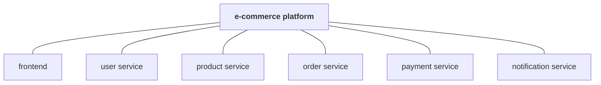
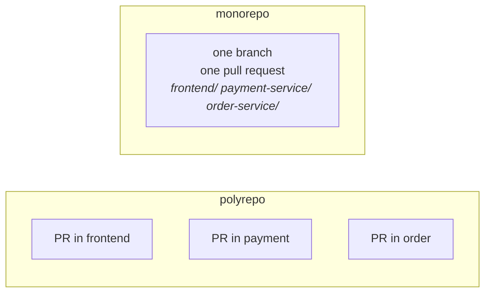

Notes `14` through `16` all answered the same question in different ways: how should branches be organised inside a repository? There is a second question sitting one level above it, and it is decided far less often than it should be.

**How many repositories should the system have at all?**

Take an e-commerce platform. It is not one thing — it is a frontend, a user service, a product service, an order service, a payment service and a notification service, each with its own code.



Two arrangements are possible, and they are not variations on a theme — they lead to different day-to-day work.

## Polyrepo: one repository per service

Poly means many. Each service lives in its own repository, with its own history, its own remote and its own settings.

```
github.com/company/frontend
github.com/company/user-service
github.com/company/order-service
github.com/company/payment-service
github.com/company/notification-service
```

> [!info] **A repository is a `.git` directory and a remote, and nothing more.** Note `06` walked through what is inside `.git/`, and note `02` created one with `git init`. Deciding between one repository and six is therefore a concrete decision about how many `.git/` directories exist and how many remotes they point at — not an abstract organisational preference.

What this buys you:

- **Ownership is unambiguous.** The payments team owns the payments repository. There is no argument about who reviews what, because the repository boundary is the ownership boundary.
- **Deployment is independent.** A change to payments deploys the payment service. Nothing else is rebuilt, retested or redeployed, because nothing else is in the repository.
- **Versions are independent.** The payment service can be at 4.2 while the order service is at 8.1. Each evolves on its own schedule.
- **Clones are small.** A developer clones the one service they work on, not the entire company.
- **Permissions are simple.** Access is granted per repository, so a contractor working on the frontend does not get the payment code.

And what it costs:

> [!important] **A change that crosses services stops being one change.** Suppose an API field is renamed from `amount` to `amountInPaise`. The frontend sends it, the payment service reads it, and the order service passes it along. That is one logical change and three repositories, so it becomes three pull requests, in three repositories, reviewed by three sets of people — and they have to land in a compatible order, or something is briefly broken in production. Nothing in Git coordinates them for you.

Shared code has the same shape of problem. Several services need the same logging, the same authentication helpers, the same data objects. That shared code has to live somewhere — normally in a repository of its own, published as a library — which means the services now depend on a versioned artifact, and upgrading it is its own piece of work in every repository that uses it.

## Monorepo: one repository for everything

Mono means one. Every service lives in a single repository, in its own directory.

```
ecommerce-platform/
├── frontend/
├── user-service/
├── order-service/
├── payment-service/
├── notification-service/
└── shared/
```

One `git init`, one remote, one history, one set of branches. The services are still separate services — they build separately, run separately and scale separately. They are simply stored together.

> [!important] **A monorepo is not a monolith, and confusing the two is the most common mistake here.** They answer different questions. Software architecture is about how the system runs: one deployable process, or twenty services talking over the network. Repository strategy is about how the source code is stored: one repository, or twenty. You can run twenty microservices out of one Git repository and still have a microservice architecture, because nothing about the repository layout changes how the processes run in production.

That makes all four combinations technically possible, though only three are sensible:

| Architecture | Repository strategy | In practice |
|---|---|---|
| Monolith | Monorepo | The usual pairing. One codebase, one repository. |
| Microservices | Polyrepo | The usual pairing. Independent services, independent repositories. |
| Microservices | Monorepo | Real and deliberate — see below. |
| Monolith | Polyrepo | Almost never. Splitting one codebase across repositories means a separate `git init` and remote per module, with nothing gained. |

The thing a monorepo is genuinely good at is the case that hurt polyrepo:



The `amount` to `amountInPaise` rename is one branch and one pull request touching three directories. It is reviewed as one change, merged as one commit, and either all of it is in or none of it is. Shared code needs no publishing step either — it is a directory in the same repository, and a change to it is visible to every consumer immediately.

## What a monorepo costs

The costs arrive with scale, and they are the reason the pairing with microservices is uncommon rather than default.

> [!important] **Deployment stops being obvious.** In a polyrepo, a push to the payment repository deploys the payment service — the repository boundary told you what changed. In a monorepo there is one repository and one commit history, so a naive pipeline rebuilds and redeploys everything on every change. At any real size that is unworkable, so you need tooling that answers three questions on every commit: what changed, which projects depend on it, and therefore what has to be built and tested. That tooling exists, and it is genuine additional complexity that a polyrepo team never has to install or maintain.

The same problem appears in testing. With separate repositories, a change to the order service runs the order service's tests. In a monorepo you often cannot tell what a change might affect, so the safe default is running much more than you needed to — which is slow, and slow pipelines are the thing that stops people merging often.

Everything else scales badly too: the clone gets large, the dependency graph gets complicated, and permissions are hard to isolate, because access is granted per repository and there is only one repository. A repository holding two hundred applications and fifteen million lines of code is a serious engineering problem in its own right, separate from any of the code in it.

Teams still choose it, and usually for one reason: **everything in one place**. A new engineer clones once and has the whole system. Nobody hunts across repositories to find where a function is defined. Whether that is worth the tooling investment depends entirely on how large the repository will get.

## Side by side

| | Monorepo | Polyrepo |
|---|---|---|
| Git repositories | One | Many |
| Cross-project change | One branch, one pull request, atomic | Coordinated pull requests across repositories |
| Shared code | A directory in the same repository | A separate library with versions |
| CI/CD | Needs tooling to work out what to build | Naturally isolated per repository |
| Ownership | Boundaries live inside the repository | The repository is the boundary |
| Permissions | Hard to isolate below repository level | Straightforward per repository |
| Clone size | Grows with the whole organisation | Stays small |
| Independent releases | Possible, with tooling | Natural |
| Best fit | Closely related projects, strong tooling | Independent teams and services |

Neither is better in the abstract, which is the same answer as the branching strategies in note `16` and for the same reason: the right choice follows from how the teams are organised and how the system ships, not from a property of Git.

## Summary

- **Branching strategy organises branches inside one repository. Repository strategy decides how many repositories exist.**
- **Polyrepo** gives clear ownership, independent deployment and versioning, small clones and simple permissions — and makes any change spanning services into several coordinated pull requests.
- **Monorepo** makes a cross-service change atomic and shared code trivial to consume — and requires tooling to work out what to build, test and deploy on each commit.
- **A monorepo is not a monolith.** Architecture is how the system runs; repository strategy is how the source is stored. Microservices in a monorepo is a real and deliberate combination.
- **The usual pairings are monolith with monorepo and microservices with polyrepo**, but neither is a rule.

---

*Source: class 6 — 2026-08-23, recording part 3.*
