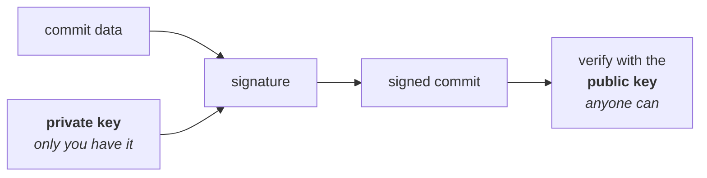

Note `11` used `git log` to answer the question of what changed and who changed it. The second half of that answer is weaker than it looks.

A commit shows an author and an email:

```
commit 4d3e91c8a7b2f1e9c0d5a6b3e8f7c2d1a9b4e6f0
Author: Some Developer <dev@example.com>
Date:   Sat Aug 23 21:14:02 2026 +0530

    added payment gateway
```

Where did those two strings come from? Note `02` answered that: you typed them.

```bash
git config user.name "Some Developer"
git config user.email "dev@example.com"
```

Nothing verified them. Git took the strings, and note `05` showed exactly what happened next — the commit object embeds the author name, the email and the timestamp as plain text, and hashes the lot.

So consider what someone can do in thirty seconds:

```bash
git config user.name "Another Developer"
git config user.email "another@example.com"
git commit -m "removed the rate limiter"
```

That commit now says another person wrote it. `git log` will report it that way, GitHub will display it that way, and there is nothing in the object that contradicts it. The author field is a label, not a claim anyone checked.

> [!important] **The commit hash guarantees integrity, not identity.** Note `04` proved that a Git object's ID is the hash of its content, so nobody can alter a commit after the fact without the ID changing and the change being obvious. That is a real guarantee and it still holds. But the content being hashed includes the author name and email as typed. The hash proves the commit has not been tampered with since it was created; it says nothing whatsoever about who created it.

## Signing

The fix is public-key cryptography, and the useful mental model is small.

You hold two related keys. The **private key** never leaves your machine and is shared with nobody. The **public key** is handed out freely — to GitHub, to your team, to anyone.



Signing runs the commit's content through your private key to produce a signature, which is stored alongside the commit. Anyone holding your public key can check that signature against the commit. If it matches, the commit was signed by whoever holds the matching private key — and only one person does.

Creating one is a flag on the command you already know:

```bash
git commit -S -m "Add payment validation"
```

The capital `-S` tells Git to sign. Git can sign with GPG, with an SSH key, or with S/MIME; the setup differs per mechanism and the flag does not.

> [!info] **Signing does not encrypt anything.** This trips people up because both involve keys. The commit content stays completely readable — anyone who can clone the repository can read the code exactly as before. A signature is an addition to the commit, not a transformation of it. What it adds is proof of origin, not secrecy.

## Guarantees, and what it does not guarantee

Signing makes a precise promise, and reading more into it than that is where the failures happen.

**It guarantees** that the commit was signed by the holder of a specific private key, and that its content has not been altered since it was signed. Those two together are authenticity and integrity.

**It does not guarantee** that the code is any good — a signed commit can contain any bug or backdoor its author wanted. It does not guarantee that the person is who they claim to be in the real world; it proves control of a key, and the link between that key and a human being is established separately, by publishing the public key against an account. And it does not survive a stolen private key: whoever holds the key can sign as you, which is why the private key never leaves your machine and is why compromised keys are revoked rather than repaired.

> [!info] **Hosting platforms surface this as a badge.** Once your public key is registered with your account, commits you sign are displayed with a verified marker and unsigned ones are not. Repositories that care can go further and require signatures on protected branches, so an unsigned commit is refused at push time rather than merely marked. This is platform behaviour on top of what Git provides rather than part of Git itself, in the same way that pull requests are in note `13`.

## Where it actually matters

Most everyday work does not use signed commits, and that is a reasonable default when everyone pushing to a repository already has an account on a system that authenticated them.

It becomes worth the setup when the author of a commit is itself security-relevant:

- **Open-source projects**, where contributions arrive from people the maintainers cannot vouch for individually.
- **Security-sensitive repositories**, where a forged commit is a plausible attack rather than a hypothetical.
- **Regulated environments**, where being able to prove who authored a change is a compliance requirement rather than a nicety.
- **Supply-chain security**, where the risk being defended against is exactly the injection of code attributed to somebody trusted.
- **Release verification**, where a tag or release build must be provably from the maintainers.

The common thread is that all of them are cases where somebody might have a reason to lie about authorship — and note that in every other case, the label is being trusted because nobody has a motive to forge it, not because Git checked.

## Summary

- **The author name and email on a commit are metadata you set yourself**, with `git config`, and Git never verifies them.
- **Anyone can commit under any name**, and `git log` will report it without complaint.
- **The commit hash proves the commit has not been altered** since it was made — it proves nothing about who made it.
- **Signing uses a private key to produce a signature** that anyone can check with the matching public key, giving authenticity and integrity.
- **`git commit -S` signs a commit**; GPG, SSH and S/MIME are all supported mechanisms.
- **Signing does not encrypt** — the code stays readable, and the signature is an addition rather than a transformation.
- **It matters where authorship is security-relevant**: open source, regulated code, supply-chain and release verification.

---

*Source: class 6 — 2026-08-23, recording part 3.*
