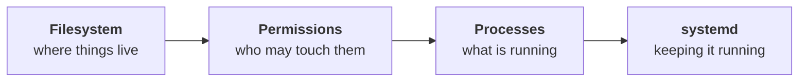

The previous module explained what Linux *is* — a kernel, wrapped in a distribution, reached through a shell. This one is about using it, and it ends somewhere specific: **an application built on your laptop, running on a Linux server, answering requests from outside.**

Everything here is done by hand. Later modules automate all of it, and the automation only makes sense if you have felt the manual version once.

| # | Note | Covers |
|---|---|---|
| `01` | [[01-Servers-Have-No-Desktop]] | Why a server has no GUI · SSH and why not HTTP · setting up a practice VM |
| `02` | [[02-The-Filesystem-Is-One-Tree]] | One root `/` · absolute vs relative paths · `pwd`, `cd`, `cd ~`, `cd ..` |
| `03` | [[03-Making-And-Reading-Files]] | `mkdir`, `touch`, `nano`, `cat` · why `cat` fails on logs · `head`, `tail`, `less` |
| `04` | [[04-The-Directories-That-Matter]] | `/home`, `/root`, `/etc`, `/var`, `/opt`, `/tmp` · convention, not enforcement |
| `05` | [[05-Ownership-Sudo-And-Chown]] | Permission denied · `sudo` · owner and group · `chown -R` |
| `06` | [[06-Getting-The-Build-Onto-The-Server]] | Building a `.jar` · moving a file between two machines · landing it in `/opt` |
| `07` | [[07-Configuration-Logs-And-Running-It]] | Config in `/etc` · logs in `/var/log` · running it · calling it from outside |

---

## The shape of the class

The four areas worth learning about a Linux server, in the order the course takes them:

**This module is the first, plus as much of the second as a deployment needs.** Processes and `systemd` are still ahead — and note `07` ends by showing exactly why they have to exist.

## Where the deployment lands

Three directories, one application:

| Piece | Goes to |
|---|---|
| The built application | `/opt/spring-demo/app.jar` |
| Its configuration | `/etc/spring-demo/application.properties` |
| Its log output | `/var/log/spring-demo/application.log` |

Notes `04` through `07` are, between them, the story of how each piece gets to its place and why that is the place.

---

## Commands introduced

| | |
|---|---|
| **Navigation** | `pwd` · `cd` · `cd ~` · `cd ..` · `cd .` · `ls` |
| **Files** | `mkdir` · `touch` · `nano` · `cat` · `head` · `tail` · `less` · `mv` |
| **Permissions** | `sudo` · `chown -R user:group` · `ls -l` |
| **Running it** | `java -jar` |
| **The VM** | `multipass info` · `multipass shell` · `multipass transfer` |

> [!info] **The `multipass` commands are specific to one way of getting a Linux machine.** If you are on WSL, VirtualBox or a real cloud server, the equivalents differ — and on a real server the file transfer is usually `scp`, which copies over SSH. Everything else on this list is the same everywhere.

---

## Currency check — written 2026-08-09

DevOps tooling moves quickly, so here is what is likely to drift and what to re-check before relying on it.

- **Ubuntu 24.04 LTS** is what the class runs. LTS releases are supported for five years, so this is stable ground; a newer LTS will exist by 2026's end and nothing in this module changes with it.
- **Multipass** is actively maintained by Canonical. `transfer`, `info` and `shell` are long-standing subcommands, but check `multipass help` if a command is rejected — this is the least stable tool named here, because it is the only one specific to one host platform.
- **`nano` 7.2** is what appeared on screen. Nano's key bindings have been the same for many years; the version is recorded only because the class showed it.
- **Spring Boot property names** (`server.port`, `server.address`, `logging.file.name`) are current. `logging.file.name` is worth flagging specifically: it **replaced the older `logging.file`** in Spring Boot 2.2, and plenty of tutorials still show the old name. If a log file never appears, that is the first thing to check.
- **The filesystem layout** — `/etc`, `/var`, `/opt`, `/home` — is the one thing here that will not drift. It predates all of this tooling and will outlast it.

## What this module deliberately does not cover

Named here so you know they are absent rather than forgotten: the `rwx` permission bits and `chmod`, users and groups as a subject in their own right, `find` and `grep`, processes and signals, services and `systemd`, and `journalctl`. All of them are coming, and several are the direct sequel to note `07`.
