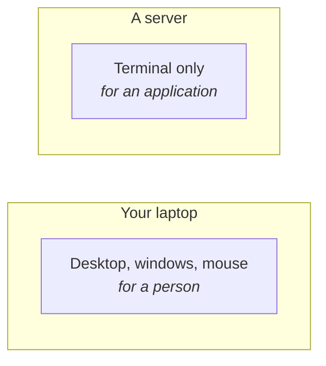
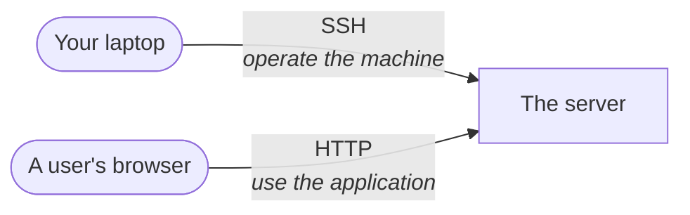
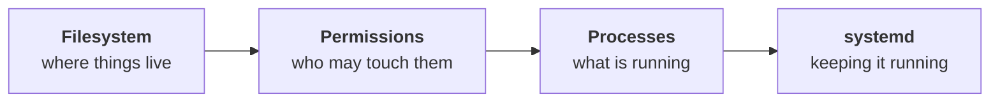

You know what a server is by now: a computer that stays on and answers requests. What has not been said is what it is like to *use* one — and that turns out to shape everything else in this module.

Start with the obvious version of the question. You have written an application on your laptop. It needs to run on a server. So you sit down at the server and copy it over.

Except you cannot sit down at it, and there is nothing to sit down in front of.

---

## A server is a computer with better specifications

Nothing exotic. A server has far more RAM, far more storage and many more CPU cores than a laptop, because it is serving many people at once. But it is a computer, running an operating system — and overwhelmingly that operating system is a Linux distribution.

What it does **not** have is a screen, a mouse, or a desktop.

## Why there is no graphical interface

This was put to the class as a question before it was answered, and it is worth answering yourself before reading on.

A graphical interface exists so that a **person** can work with a computer. You need one on your laptop because you do many different things: write code, join a class, watch something, read mail. Icons, windows and a mouse make that pleasant.

A server does exactly one thing: **serve the application deployed on it.** No person sits in front of it. So the interface has no user.

And it is not merely unnecessary — it is expensive:

> [!important] **A graphical interface consumes real resources.** Rendering a desktop costs CPU, memory and disk that you are paying for and that your application would rather have. On a machine whose entire purpose is to run one application as well as possible, spending a slice of it drawing windows nobody looks at is pure waste.

The class summarised this well: **a server is designed to run services, not for a person to interact with it directly.**

So a server runs a Linux distribution **without a GUI** — a terminal-based system, and nothing else.



> [!info] **This is the honest answer to "why learn commands?"** Not tradition, and not because commands are more powerful. Because **on a server there is no alternative.** Every interaction you will ever have with a production machine goes through a terminal, and the commands are the only vocabulary that exists there.

---

## So how do you reach it?

Your laptop is here. The server is elsewhere — in a data centre, or on a cloud provider like AWS. Between them is the internet.

You cannot plug anything in. You need to talk to it over the network, which means you need a **protocol** — an agreed way for two machines to exchange messages.

The obvious candidate is the one you already know. When a browser talks to a server it uses **HTTP**. So why not that?

> [!important] **Because HTTP does the wrong job.** HTTP carries a request and returns a response — you ask for a page, you get a page. That is what a *client* does with a *running application*.
>
> That is not what you are trying to do. You want to **operate the machine**: copy files onto it, create directories, run commands, read logs, restart things. You want to reach into its terminal from outside, as though you were sitting at it.

The protocol for that is **SSH — Secure Shell.**

The name is the definition. It gives you a **shell** on a remote machine, **securely** — everything you type and everything that comes back is encrypted in transit.



Two different conversations with the same machine, for two different purposes. As a DevOps engineer you are almost always on the top line.

> [!tip] **This distinction answers a question people ask for months:** *"why can't I just deploy over HTTP?"* You can move a file over HTTP. What you cannot do is **become a shell on the far machine** — and deployment is almost entirely shell work: put this here, set that permission, edit this config, start that service.

---

## The practice machine

You need a Linux machine to work on, and the class does not use a rented server for it. It uses a **virtual machine** — a complete second computer running inside your own, with its own operating system and filesystem.

The demonstration machine was set up with **Multipass**, Canonical's tool for running Ubuntu VMs, on macOS:

```bash
brew install multipass
```

Then a VM is created and can be inspected:

```bash
multipass info devops
```

`devops` is the name given to the VM. The output reports what it has been allocated. In class:

| | |
|---|---|
| Image | Ubuntu 24.04 LTS |
| CPU cores | 4 |
| Memory | 6 GB (of the host's 24 GB) |
| Disk | 40 GB, ~2.6 GB used |

And to open a shell inside it:

```bash
multipass shell devops
```

The prompt changes to something of the form `ubuntu@devops`. Read that as two facts: **`ubuntu` is your username** on that machine, and **`devops` is the machine's name**.

> [!info] **Use whatever gets you an Ubuntu terminal.** Multipass is one route and it is a Mac-friendly one. On Windows, **WSL** is the easy path; VirtualBox and other VM managers work equally well. On Linux you already have what you need.
>
> The commands to *create* the VM differ per tool and are worth looking up once for your own setup. Everything after that point is identical, because everything after that point is just Linux.

> [!warning] **The VM is on your own laptop, and that has one consequence worth naming.** Your "server" and your "client" are the same physical machine. Nothing travels over the internet. That is fine for learning — the shape of every operation is identical — but it does mean the network is doing less work than it would in production, so network problems that a real deployment would hit will not appear here.

---

## What the rest of this module is

With a terminal on a Linux machine, four things are worth learning, in this order:



This module is the **first** of those, plus enough of the second to get an application deployed. Processes and `systemd` come after.

And the module ends somewhere concrete: **a Spring Boot application, built on the laptop, running on the Ubuntu machine, answering requests from outside.** Every command between here and there exists to make that happen.
