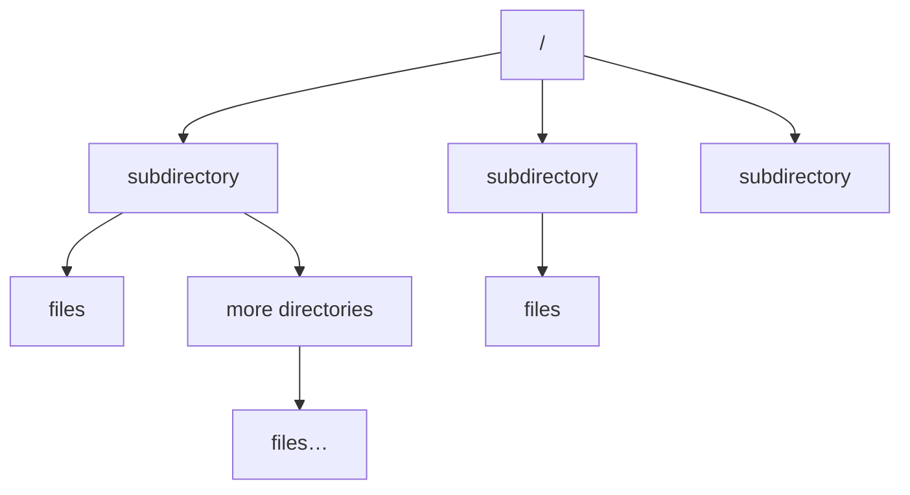
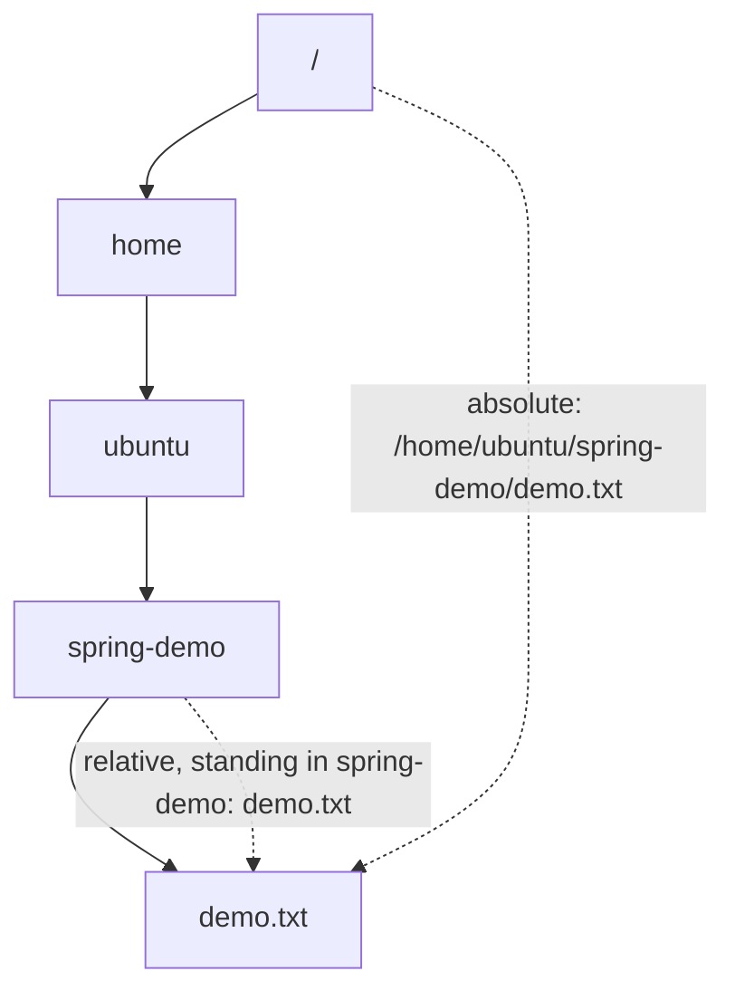

Every operating system has to answer the same question: where do files go? And the answers differ enough that moving from Windows to Linux feels disorienting for a week.

Windows splits storage into **drives**. `C:\` is one, `D:\` is another, `E:\` another still. Each is its own separate top level, and a path begins by naming which one you mean.

Linux — and macOS, which shares Linux's Unix ancestry — does not do that.

> **There is exactly one top, and it is called `/`.**

One tree. Everything on the machine hangs off it: every file, every directory, every disk. There is no second root to choose between.



Below the root are subdirectories; inside those, more directories or files; and so on down as far as you like. That is the entire structure.

---

## Seeing it

```bash
cd /
ls
```

`cd` is **change directory**. `/` is the root. So this says "go to the top", and `ls` lists what is there:

```
bin  boot  dev  etc  home  lib  lost+found  media  mnt
opt  proc  root  run  sbin  srv  sys  tmp  usr  var
```

Twenty-odd directories, none of which you created. What they are for is note `04`; for now the point is only that they exist and that they all hang off the same `/`.

---

## Why it is arranged, not scattered

Here is the framing from class that makes the whole thing click, and it works because you already do this.

Think about a project you have written. You did not put every file in one folder. You made a structure:

```
project/
├── backend/
│   ├── src/
│   └── static/
└── frontend/
    ├── html/
    ├── css/
    └── js/
```

You invented that layout so that anyone opening the project can guess where things are. Images in `static`. Styles in `css`. Nobody had to be told.

> [!important] **Linux does exactly the same thing, for the whole machine.** Its directory structure is a convention about what goes where, and it is followed seriously enough that the layout is **predictable** — configuration is always in one place, logs are always in another, on any Linux machine you have ever met.
>
> That predictability is the thing that makes a DevOps engineer's job possible. You are handed a server you have never seen, built by someone you will never meet, and you already know where to look.

---

## Absolute and relative paths

Two ways to name the same file, and the difference matters more than it looks.

### Absolute — from the root, every time

An **absolute path starts at `/`** and spells out every step down to the thing you want:

```
/home/ubuntu/spring-demo/demo.txt
```

Read it left to right: start at the root, go into `home`, into `ubuntu`, into `spring-demo`, and there is `demo.txt`.

An absolute path is **unambiguous from anywhere on the machine.** It does not matter where you are standing when you use it — it names exactly one file, always.

### Relative — from where you already are

A **relative path starts from your current directory**.

If you are already inside `/home/ubuntu/spring-demo`, then naming the file is just:

```
demo.txt
```

Same file. Much less typing. But it only works *because of where you are standing* — run it from somewhere else and it means nothing, or worse, means a different file.



> [!tip] **Which to use.** Relative paths when you are working interactively and you know where you are. **Absolute paths in anything you save** — a script, a config file, a service definition — because those run later, from a directory you did not choose and cannot predict. Every path in the deployment later in this module is absolute, and that is not an accident.

---

## Knowing where you are

Relative paths only make sense if you know your current position, so there is a command for it:

```bash
pwd
```

**Print working directory.** It answers "where am I?" — and it answers with an absolute path:

```
/home/ubuntu
```

This is the command to reach for the instant you are confused. It is impossible to be lost in a filesystem while `pwd` exists.

## Moving around

```bash
cd /
```

Go to the root.

```bash
cd home
```

Go into `home`, relative to where you are.

```bash
cd ubuntu
```

And into your own directory. Now `pwd` prints `/home/ubuntu`.

### Going back up

```bash
cd ..
```

`..` means **the parent directory** — one step up. From `/home/ubuntu` this puts you in `/home`.

```bash
cd .
```

`.` means **the directory I am already in**. Which does nothing at all, and that is genuinely the point:

> [!info] **`.` looks useless and is not.** As a `cd` target it is pointless. But `.` is how you *refer* to the current directory in a command that needs a path spelled out, and you will see it constantly in exactly that role. Learn it here as the counterpart of `..` and it will not surprise you later.

### Going home from anywhere

Get yourself deliberately lost:

```bash
cd /usr/bin
pwd
```

```
/usr/bin
```

You are deep in a system directory. To get back to your own space:

```bash
cd ~
```

`~` — the tilde — means **your home directory**. Not the root, not the parent: *yours*.

```bash
pwd
```

```
/home/ubuntu
```

> [!important] **`cd ~` works from anywhere, always, regardless of how far you have wandered.** It is the single most useful piece of navigation on this page, and the class flagged it as the one to commit to memory. When you have no idea where you are and want to start again, that is the command.

| Command | Goes to |
|---|---|
| `cd /` | the root of the filesystem |
| `cd ~` | your home directory |
| `cd ..` | the parent of where you are |
| `cd .` | nowhere — the directory you are in |
| `pwd` | *(prints where you are)* |

---

## Your home directory

`cd ~` took you to `/home/ubuntu`. That `ubuntu` is **your username** — on a machine where the user is `ana`, it would be `/home/ana`.

This is your space on the machine. Your files, your projects, anything you download. On a desktop it is where your documents and media would sit.

```bash
ls
```

On a fresh machine: nothing. It is completely empty, and seeing that emptiness once is worth the keystroke — everything you find in there later, you put there.

Which is the natural place to start actually doing something.
