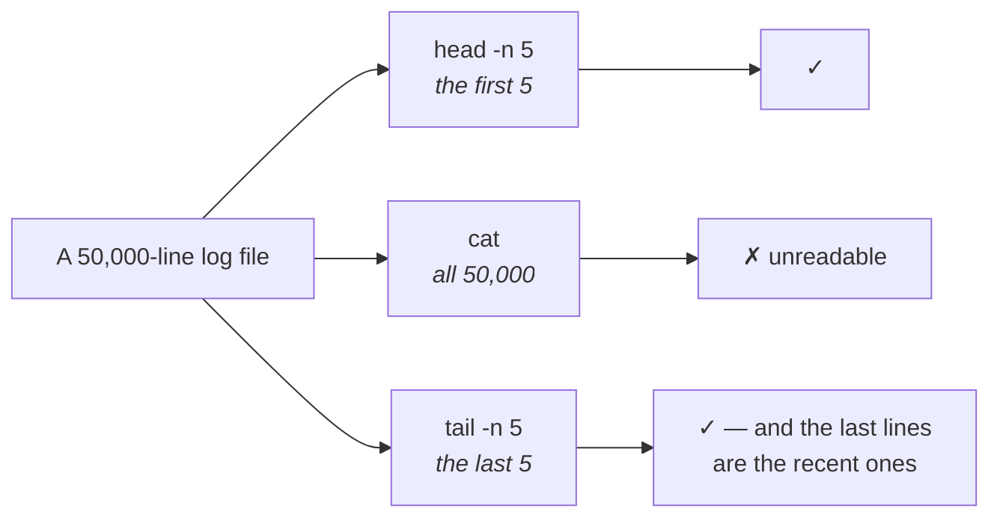

You can now move around the filesystem. Moving around is not much use on its own — a server is somewhere you *put* things. So: create a directory, create a file, put content in it, and read it back.

Four commands do all of that, and a fifth pair exists for a problem the first four cannot handle.

---

## Creating a directory

Start in your home directory and look at what is there:

```bash
ls
```

On a fresh machine this prints nothing at all. The directory is empty — which is worth seeing once, because it tells you that everything you are about to look at, you put there.

Now make somewhere to keep your work:

```bash
mkdir project
```

`mkdir` is **make directory**. The argument is the name you want.

```bash
ls
```

`project` is now listed. That is the whole operation.

> [!info] **Notice what you did not have to type.** No `sudo`. You were in your own home directory, and inside your own home directory you are allowed to create things freely. That stops being true the moment you step outside it — which is the subject of note `05`.

## Creating a file

```bash
touch demo.txt
```

`touch` creates an empty file if the name does not exist yet.

```bash
ls
```

Now both `project` and `demo.txt` are listed — one directory, one file.

> [!tip] **`touch` is not really a "create file" command**, which is why the name looks odd. Its actual job is to update a file's timestamps, and creating the file when it is absent is a side effect. In practice everyone uses it to make empty files, and that is fine — but the name will stop looking arbitrary once you know.

---

## Putting something in the file

Here is the situation the next command exists for. You have a text file. It is empty. You want to write in it — and you have **no editor and no graphical interface**, because you are working through a terminal on a machine that has no desktop at all.

The terminal supplies its own editor:

```bash
nano demo.txt
```

The file opens for editing, with a header showing the version — `GNU nano 7.2` on the machine used in class.

Type whatever you like:

```
Hello, my name is Ana
and I am an engineer at Example Corp
```

The controls are printed along the bottom of the screen, so you do not have to remember them:

| Key | Does |
|---|---|
| `Ctrl+O` | Write the file out (save) |
| `Ctrl+X` | Exit |
| `Ctrl+R` | Read another file in |

Press `Ctrl+X` to leave. Nano notices you have unsaved changes and asks — `Save modified buffer?` — press `Y`, confirm the filename with `Enter`, and you are back at the shell with the content saved.

> [!tip] **Nano tells you what to press, at all times.** That is the entire reason it is the editor to start with. `vim` is more powerful and is what you will eventually meet on servers that do not have nano installed, but it gives you no such help, and having to look up how to quit an editor is a bad first experience of a machine you are trying to learn.

## Reading the file back

```bash
cat demo.txt
```

`cat` prints the file's entire contents to the screen. Both lines you typed come back.

That is it — for a small file.

---

## Where `cat` stops working

Now the case that breaks it, and it is the case you will actually be in.

You are on a server. Your application is running. It writes a **log file** — a running record of what it did, one line per event. Someone reports a problem and you go to read that log.

> **A production log file is not two lines. It can be fifty thousand.**

And it is not sitting still. The application is live, requests are arriving, and every one of them appends another line. The file is growing while you are looking at it.

Run `cat` on that and your terminal fills with fifty thousand lines, scrolls past everything you wanted, and leaves you at the bottom of a wall of text.

So you need to say "not all of it — just some of it, from one end".

```bash
head demo.txt
```

`head` prints the **first** lines of a file. By default, **ten**. In the class demo the file had eleven lines and `head` returned ten of them — the eleventh simply was not shown, which is the clearest possible demonstration of what "by default ten" means.

```bash
tail demo.txt
```

`tail` prints the **last** lines. Also ten by default.

And when ten is the wrong number, `-n` sets it:

```bash
head -n 5 demo.txt
tail -n 5 demo.txt
```

The first prints the top five lines, the second the bottom five.



> [!important] **`tail` is the one you will reach for constantly, and here is why.** A log file is written in time order, so the **newest events are at the bottom**. When something just broke, what you want is the end of the file — which is exactly what `tail` gives you.
>
> There is a further form, `tail -f`, which stays attached and prints new lines as they are written, so you can **watch a live application as it runs**. It comes into its own once there is a running application to point it at, and it is the command DevOps work leans on most heavily of all: deploy, watch the log, see what happens.

## When you want to move around inside the file

`head` and `tail` give you the ends. Sometimes you want the middle, or you want to browse.

```bash
less demo.txt
```

`less` opens the file and shows **one screenful at a time**, letting you scroll through it rather than dumping it all at once. Press `q` to quit.

On a file of eleven lines this looks identical to `cat`, because eleven lines fit on one screen — which is exactly what happened in the class demonstration. Its value only shows up on a file too big to fit, which is the case you will actually be in on a server.

---

## The command summary

| Command | Does | Default |
|---|---|---|
| `mkdir <name>` | create a directory | — |
| `touch <name>` | create an empty file | — |
| `nano <file>` | open the terminal's editor | — |
| `cat <file>` | print the whole file | — |
| `head <file>` | print from the top | 10 lines |
| `tail <file>` | print from the bottom | 10 lines |
| `head -n N` / `tail -n N` | choose how many | — |
| `tail -f <file>` | follow the file as it grows | — |
| `less <file>` | scroll through it a screen at a time | `q` to quit |

None of these needed `sudo`, because all of it happened inside your own home directory. Step outside it and the machine starts saying no.
