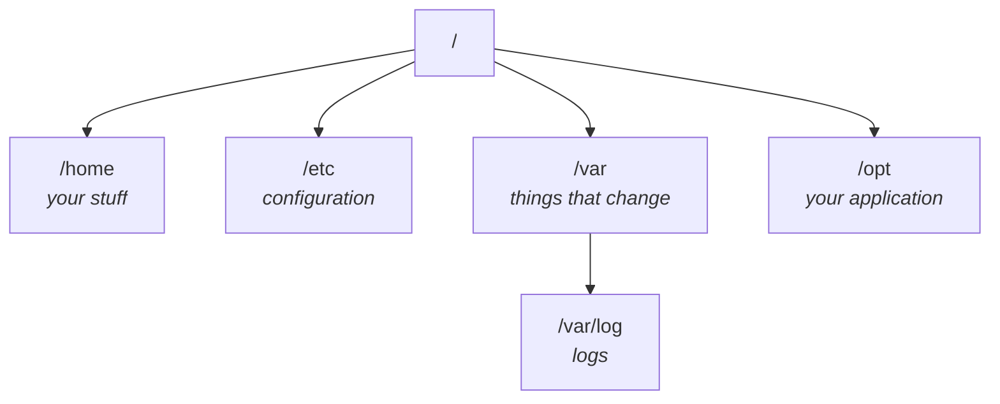

Run `ls` at the root of a Linux machine and about twenty directories come back. You did not create any of them.

The instinct is to memorise the list. Don't — most of it you will never touch. The useful question is narrower: **when I put an application on this machine, where does each piece of it go?**

Four directories answer that, and the rest can wait until something makes you care about them.



---

## First: you did not make these

A question came up in class that is worth answering before anything else — *"I didn't create these folders. Where did they come from?"*

**Linux created them for itself.** The operating system needs its own files and its own places to put them, and those places exist from the moment the system is installed. You are a guest in a house that was already furnished.

That also explains why the names are terse and slightly cryptic: they were chosen decades ago, for the system's own use, and everyone else has been living with them since.

---

## `/home` — people

Each ordinary user gets a directory under `/home`, named after them:

```
/home/ana
/home/ubuntu
```

This is where a user's own things live — their files, their projects, their personal work. On a desktop machine it is the equivalent of the user folder on Windows or macOS.

It is also, as note `03` showed, **the one place you can create things without asking permission**.

## `/root` — the administrator, and a name collision

`/root` is the home directory of the **root user** — the administrator account.

> [!warning] **`/` and `/root` are two different things and the names actively mislead.**
>
> - **`/`** is the root *of the filesystem* — the top of the whole tree.
> - **`/root`** is a directory *inside* it, belonging to one particular user.
>
> They are unrelated. `/root` sits under `/` exactly like `/home` does. The word "root" is doing two unconnected jobs, which is unfortunate and permanent.

## `/etc` — configuration

Every application has configuration: the settings it reads at startup to know how to behave.

You have seen this in whatever you build with. A Spring Boot application has `application.properties`. A Node.js server has a config file, often JSON. Whatever the language, there is a file somewhere holding the values that change between one environment and another.

> **`/etc` is where that configuration goes on a Linux server.**

Real examples you will meet on machines you did not set up:

```
/etc/nginx/
/etc/ssh/
/etc/hosts
```

And when you deploy your own application, you make your own directory alongside those.

> [!info] **What "etc" stands for is not worth your time.** It is a historical name with a contested expansion, and knowing it tells you nothing. What matters is the association: **`/etc` means configuration.**

## `/var` — things that change while the system runs

`/var` is for data that **changes during normal operation**. Not the program, not its settings — the output and working state.

The one that matters immediately:

```
/var/log
```

**Every log file goes here.** Your application's log, and the logs of everything else on the machine.

Look inside `/var` on a running system and you will also find `lib`, `cache`, `local` and others. On a real server you will meet things like `/var/lib/docker` and `/var/lib/mysql` — programs keeping their working data where working data belongs.

> [!info] **A question from the class, worth keeping.** *"Why would libraries be under `/var`? Libraries don't change."*
>
> They change more than you'd think — you add one, remove one, upgrade one. Anything you install and later modify is closer to "changing data" than to "fixed program", which is the distinction `/var` is drawing.
>
> The practical answer for this course is narrower: **a Spring Boot `.jar` contains its own libraries inside it.** So there is nothing separate to place, and the whole `.jar` goes to `/opt` with the rest of the application.

## `/opt` — your application

`/opt` is short for **optional**: software that is not part of the operating system.

That is exactly what your application is. So:

```
/opt/spring-demo
/opt/node-demo
```

Your code, deployed, lives under `/opt` in a directory named for the application.

## `/tmp` — temporary, and genuinely temporary

`/tmp` holds files that only need to exist for a while — something created mid-way through an operation and thrown away afterwards, an intermediate file, an upload being processed.

```bash
cd /tmp
ls
```

You will see files you did not create. Linux made them, because it needed them.

> [!danger] **Never put anything in `/tmp` that you need to keep.** Linux clears it out from time to time. That is not a bug or a risk — it is the entire purpose of the directory. A file in `/tmp` is a file you have agreed to lose.

---

## Two more you will see without needing to study

| Directory | What it is |
|---|---|
| `/usr` | Installed programs and shared resources — `/usr/bin` is full of the commands you have been running |
| `/dev` | Devices, represented as files |

`ls /usr/bin` returns an enormous list. That is the point of looking once: **the commands you type are programs sitting on the disk**, exactly as note `05` of the previous module described. `ls` is a file. So is `cat`.

---

## The part people get wrong

> [!important] **This is convention, not enforcement.**
>
> Nothing in Linux *stops* you putting your application in `/home`, your logs in `/opt` and your configuration wherever you like. The system will not object. Every one of those directories is just a directory.
>
> The reason to follow the convention is that **other people — and other tools — expect it.** A monitoring agent looks in `/var/log`. The next engineer looks in `/etc` for the config. Deployment scripts assume `/opt`. Putting things where they are expected is what makes a machine legible to someone who did not build it.

So the layout for the deployment this module is building:

| Piece | Goes to |
|---|---|
| The application itself (`app.jar`) | `/opt/spring-demo/` |
| Its configuration | `/etc/spring-demo/` |
| Its log output | `/var/log/spring-demo/` |

Three directories, one application, each piece where the next person will look for it.
