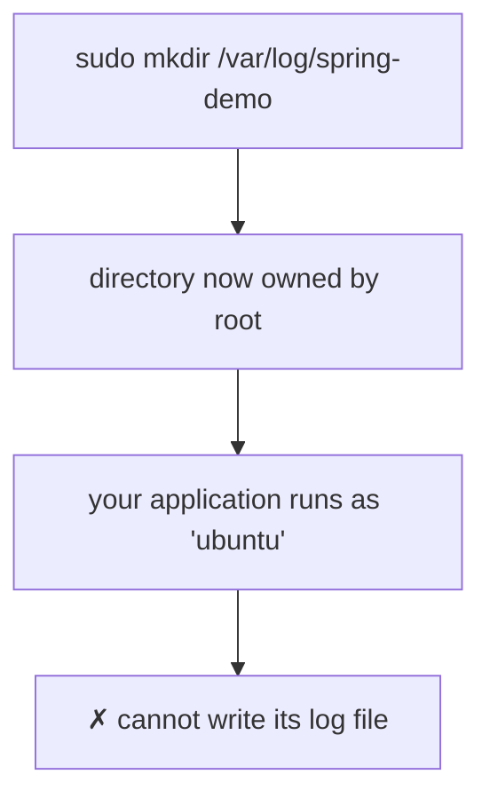

Everything so far worked without asking anyone's permission. Create a directory, create a file, edit it, read it — no obstacles.

That was because all of it happened in your home directory. Step outside it and the machine starts refusing.

---

## The refusal

You now know your application code belongs in `/opt`. So go and make somewhere to put it:

```bash
cd /opt
mkdir spring-demo
```

```
mkdir: cannot create directory ‘spring-demo’: Permission denied
```

Nothing is broken. The machine is telling you something true: **you are not allowed to write here.**

Recall the reason from the previous module. `/opt`, `/etc`, `/var` and the rest belong to the system, not to you. The kernel enforces who may touch what, and an ordinary user may not modify system directories. Your own home directory is the exception carved out for you.

## `sudo` — asking for the elevated version

```bash
sudo mkdir spring-demo
```

This time it works.

`sudo` runs a single command with administrator privileges. It prompts for your password the first time, and then the command proceeds as though the administrator had run it.

```bash
ls
```

`spring-demo` is there.

> [!important] **The rule to carry forward:** if you are creating or modifying anything **outside your home directory**, you will need `sudo`. Inside your home directory, you will not.
>
> That single sentence explains almost every "permission denied" you will hit while learning, and it is a better mental model than reaching for `sudo` reflexively whenever something fails.

> [!warning] **Do not become someone who prefixes everything with `sudo`.** A command that fails without it is telling you that you are touching something that belongs to the system — which is information worth registering rather than overriding on autopilot. The habit of typing `sudo` first and reading the error never is how people delete things they did not mean to.

Making the three directories the deployment needs:

```bash
sudo mkdir /opt/spring-demo
sudo mkdir /etc/spring-demo
sudo mkdir /var/log/spring-demo
```

---

## But `sudo` alone is not enough

Here is where it gets interesting, and where the class's example earns its keep.

The directories exist. But **you created them as the administrator**, which means the administrator owns them. Your ordinary user does not.

Now think about what happens next. Your application is going to run as *you* — as the ordinary user — and it is going to want to write a log file into `/var/log/spring-demo` continuously, appending a line every time a request arrives.

It will not be allowed to. The directory belongs to somebody else.



So creating the directory was only half the job. You also have to hand it over.

## Every file has an owner and a group

```bash
ls -l
```

The long listing shows, for each file, two names:

```
-rw-r--r-- 1 ana developers 2048 Aug  8 app.conf
                ↑      ↑
              owner  group
```

Every file carries three things: an **owner**, a **group**, and a set of **permissions**. This note is about the first two; permissions themselves come later in the course.

> [!info] **What is your group?** On a normal Ubuntu machine, **your group has the same name as your user.** If you set the machine up as `ubuntu`, your user is `ubuntu` and your group is `ubuntu`. If you created the user under your own name, both take that name.
>
> That is why the command below reads slightly oddly, with the same word twice. It is not a typo.

## `chown` — change ownership

```bash
sudo chown -R ubuntu:ubuntu /opt/spring-demo
sudo chown -R ubuntu:ubuntu /var/log/spring-demo
```

Reading it piece by piece:

| Piece | Means |
|---|---|
| `sudo` | you are changing something you do not currently own, so this needs elevation |
| `chown` | **change owner** |
| `-R` | **recursive** — apply to the directory *and everything inside it* |
| `ubuntu:ubuntu` | the new owner, then the new group, separated by a colon |
| `/opt/spring-demo` | what you are changing |

Substitute your own username on both sides of the colon. If your user is `ana`, it is `ana:ana`.

> [!danger] **`-R` is not optional here, and leaving it off is a silent failure.**
>
> Without `-R`, `chown` changes the ownership of the directory itself and **nothing inside it**. The command succeeds, prints nothing, and looks like it worked — and then your application fails later on a file it cannot write, in a directory that appears to belong to you.
>
> This happened live in the class: the first `chown` was typed without `-R` and had to be run again. Watch for it.

---

## Which directories actually need this

Not all three.

| Directory | Needs `chown`? | Why |
|---|---|---|
| `/opt/spring-demo` | **yes** | the application runs from here |
| `/var/log/spring-demo` | **yes** | a log file is written and appended to constantly, while the app runs |
| `/etc/spring-demo` | no | you write the config **once**, by hand, with `sudo`. The application only reads it |

The distinction is worth stating plainly, because it is the actual principle rather than a rule to memorise:

> **Hand over ownership of the things your application has to write to.** Configuration is something you place once and the application reads; it can stay owned by the administrator.

---

## What this is really teaching

For now, treat `chown -R user:group path` as the incantation that lets your application work with the directories you made for it. That is enough to complete the deployment.

But notice the shape of the problem, because it recurs constantly in operations work: **the thing that creates a resource and the thing that uses it are often not the same identity.** You made these directories as the administrator. Your application runs as an ordinary user. Somebody has to bridge that gap explicitly, and nothing will do it for you.

Permissions proper — the `rwx` bits, `chmod`, and what read/write/execute mean differently for directories than for files — are still ahead.
