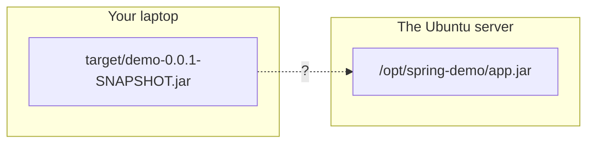
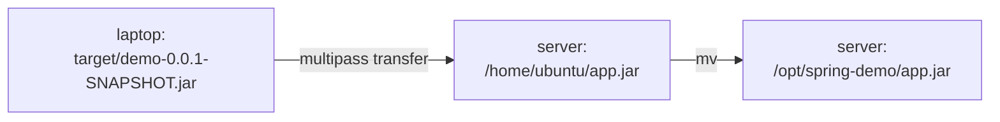

The directories are made and you own the ones that matter. Now there needs to be something to put in them.

This is the point where the module stops being about Linux and starts being about deployment. The application is written on your laptop. It has to end up running on a different machine. Everything that follows is the mechanics of that sentence.

> [!info] **You do not need to know the framework.** The application below is Spring Boot because that is what the class used, and a Node.js version was shown afterwards following exactly the same steps. **The framework is not the lesson.** If you read the code and understand nothing, you have lost nothing — what matters is that a build produces one file, and that file has to travel.

---

## What is being deployed

A minimal web application with one endpoint. Ask it for `/api/hello` and it answers with a message.

Three details matter later, so notice them now:

```java
@RestController
public class HelloController {

    private static final Logger log = LoggerFactory.getLogger(HelloController.class);

    @Value("${app.message}")
    private String message;

    @GetMapping("/api/hello")
    public String hello() {
        log.info("GET /api/hello endpoint called");
        return message;
    }
}
```

1. **It returns a message it does not contain.** `@Value("${app.message}")` means the text comes from *configuration*, not from the code. Change the configuration and the application says something different without being rebuilt.
2. **It writes a log line** every time the endpoint is called.
3. **It listens on a port** — 8080 by default.

Configuration, logs, and a port. Those are the three things you are about to place on a server by hand.

## Building it into one file

```bash
mvn package
```

This compiles the project and produces a single file under `target/`:

```
target/demo-0.0.1-SNAPSHOT.jar
```

**JAR** is short for **Java archive**. The important property is that it is *self-contained* — the application's own code and every library it depends on, in one file. You can hand that file to a machine with Java installed and it will run.

> [!info] **Two things went wrong here in class, both ordinary.** The first `package` run failed because the project's tests did not pass, and the build was re-run after skipping them. And the very first project had to be regenerated because the initial download unpacked to the wrong name.
>
> Neither is interesting in itself. They are worth recording because **this is what building actually looks like** — the clean single-command version in a tutorial is the exception, not the rule.

Node.js has the same shape: a build step, and one artifact that gets deployed. The name and the tooling differ; the process does not.

---

## The actual problem

You now have a `.jar` file. Where is it?

**On your laptop.** In `target/`, inside a project directory, on the machine you wrote the code on.

And where does it need to be? **On the server** — the Ubuntu machine, which is a completely separate operating system with its own filesystem.



Two machines. Two filesystems. Nothing you have learned so far crosses that gap — `cp` and `mv` move files *within* one machine.

> [!important] **This is the whole reason the next command exists**, and it is worth sitting with for a second. Every deployment problem in this course is a version of this picture: an artifact is here, and it needs to be there, and "there" is a machine you are not sitting in front of.

## Crossing the gap

In this course the Ubuntu machine is a **virtual machine** running on the laptop itself, managed by **Multipass**. So the tool that copies files across is Multipass's own:

```bash
multipass transfer <source-path> <instance>:<destination-path>
```

For a VM named `devops`:

```bash
multipass transfer ~/Desktop/demo/target/demo-0.0.1-SNAPSHOT.jar devops:/home/ubuntu/app.jar
```

Read it as three parts: the file on your laptop, the name of the virtual machine, and where it should land inside it. The file is renamed to `app.jar` on the way — a shorter name to type from here on, and the `.jar` extension is preserved because that is what makes it runnable.

> [!info] **The error worth keeping.** Running this without naming the instance produces:
>
> ```
> An instance name is needed for either source or destination
> ```
>
> Multipass is copying *between two machines*, so at least one side of the command has to say which machine. That is the `devops:` prefix. The error is a good one — it names exactly what is missing.

> [!warning] **On other setups the command is different, but the idea is not.** WSL, a cloud server, a VM under a different manager — each has its own way of moving a file in. The one you will meet most often on real servers is `scp`, which copies over SSH. Look up the one that matches your setup; what you are looking for is always "how do I copy a file from here to there".

## You can only land in the home directory

The `transfer` above put the file in `/home/ubuntu/`, not straight into `/opt/spring-demo/` where it belongs. That was not an arbitrary choice.

**Multipass writes as the ordinary user**, and by now you know what that means: it can write to that user's home directory and nowhere else. `/opt` needs `sudo`, and a file transfer coming in from outside has no way to elevate.

So the file arrives in the home directory first:

```bash
cd /home/ubuntu
ls
```

`app.jar` is there.

## Moving it into place

Now you are inside the server, as a user who owns `/opt/spring-demo` — because you handed it to yourself in note `05`. So the second hop is an ordinary move:

```bash
mv ~/app.jar /opt/spring-demo/app.jar
```

`mv` is **move**. Same command you would use to move a file between two directories on your own laptop, because that is exactly what this is — both directories are on the server now.

Confirm it landed:

```bash
cd /opt/spring-demo
ls
```

`app.jar`.



Two hops, because the first one could not reach past the home directory.

---

> [!important] **That is deployment, at its most basic.** A question came up in class — *"what does deployment actually mean?"* — and this is the answer in its plainest form: **the built artifact is sitting on the server, in the place the server expects it.**
>
> Real deployments do not look like this. They use a cloud provider, they build container images, they run a pipeline that does all of it without a person typing anything. Those come later in the course. What you are doing here is the same job **by hand**, so that when a pipeline does it for you, you know what it is doing.

The application is on the server. It cannot run yet — it has no configuration and nowhere to write its logs. That is the next note.
