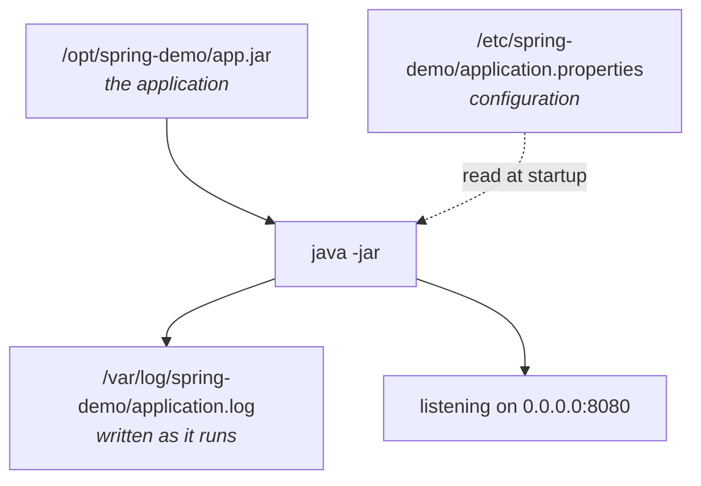
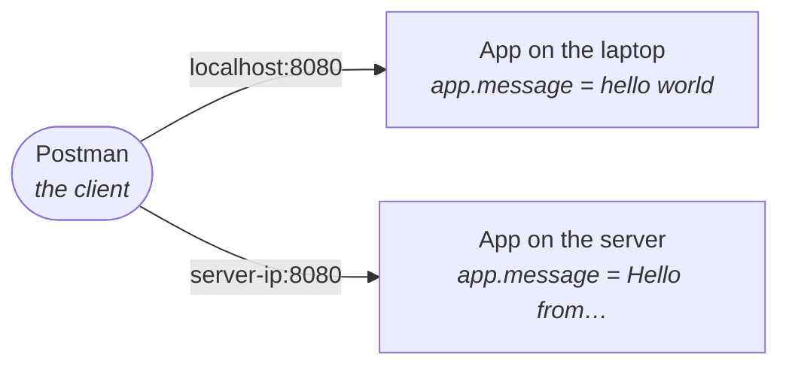
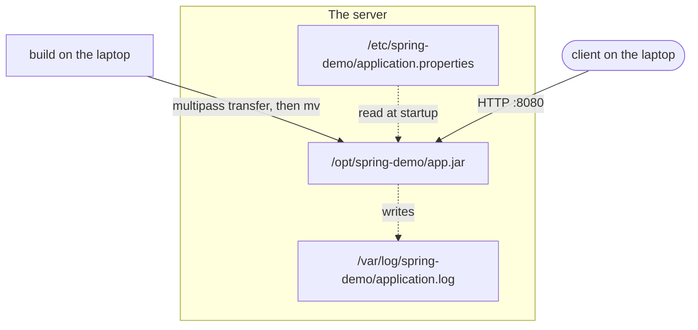

The `.jar` is in `/opt/spring-demo/`. It still cannot usefully run, and the reason is the one from the previous note: the application returns a message it does not contain, and writes a log to a path it has not been told.

Both of those live in configuration, and configuration goes in `/etc`.

---

## Writing the configuration file

```bash
cd /etc/spring-demo
sudo nano application.properties
```

`sudo`, because `/etc/spring-demo` was made by the administrator and — deliberately — never handed over. The application only ever *reads* this file, so it does not need to own it.

Four settings:

```properties
server.port=8080
server.address=0.0.0.0
app.message=Hello from the Spring Boot application running on Ubuntu
logging.file.name=/var/log/spring-demo/application.log
```

Taking them one at a time, because three of the four are more interesting than they look.

### `server.port`

Which port the application listens on. 8080 is the Spring Boot default.

### `server.address` — the one that catches people

`0.0.0.0` means **listen on every network interface this machine has**.

The alternative, and the default in many setups, is to listen only on `localhost` — which means *"accept connections that originate on this machine, and nothing else"*. That is fine while you are developing, because your browser and your application are on the same computer.

> [!important] **On a server it is exactly wrong.** The whole point of a server is that requests arrive from *somewhere else*. An application bound to `localhost` on a server is unreachable from anywhere but the server itself — it will start cleanly, log nothing unusual, and refuse every connection from outside. That failure looks like a networking problem and is not one.

### `app.message`

The text the endpoint returns. This is the value the code declared with `@Value("${app.message}")` and did not contain.

Notice what this buys you: **to change what the application says, you edit this file and restart it.** No rebuild, no re-transfer. That is the practical argument for configuration living outside the artifact.

### `logging.file.name`

Where to write the log:

```
/var/log/spring-demo/application.log
```

This is the directory you created in note `05` and then handed to yourself with `chown -R`. If you had skipped that step, the application would start and then fail the first time it tried to write a line here.

---

## Running it

```bash
java -jar /opt/spring-demo/app.jar
```

The application starts. The terminal is now occupied by it — the process is running in the foreground, printing as it goes.



Three directories, three roles, one running process. That diagram is the whole module in one picture.

---

## Calling it from outside

The application is running on the server. Your API client — Postman, in the class — is on your laptop. Those are different machines, so `localhost` will not reach it.

You need the server's **IP address**:

```bash
multipass info devops
```

This prints the virtual machine's details, including its IPv4 address. On a Multipass VM it will be a private address on your own machine's network, something of the form `192.168.x.x`.

Then, from Postman on the laptop:

```
GET http://<server-ip>:8080/api/hello
```

The response comes back:

```
Hello from the Spring Boot application running on Ubuntu
```

That string came from `application.properties` on the server. Nothing in the compiled `.jar` contains it.

> [!info] **The failure that happened first, and is worth reproducing deliberately.** The initial request was sent to the IP address with **no port**, and the connection was refused.
>
> An IP address alone identifies a *machine*. A machine runs many programs, and a port is what selects between them. Without `:8080`, the request arrives at the default HTTP port — where nothing is listening — and is rejected. The error looks alarming and means only "you did not say which program".

Switch to the terminal where the application is running and the log line is there:

```
GET /api/hello endpoint called
```

Request in, response out, log written. The loop is closed.

---

## Two applications at once

The class finished with a demonstration that makes the client/server split concrete, and it is the best part of the session.

The same application was also started **locally**, in the IDE on the laptop, with a different `app.message` — `hello world`. So two copies were running: one on the laptop, one on the server.

From the same Postman window:

| Request | Reaches | Response |
|---|---|---|
| `http://localhost:8080/api/hello` | the copy on the laptop | `hello world` |
| `http://<server-ip>:8080/api/hello` | the copy on the server | `Hello from the Spring Boot application running on Ubuntu` |



> [!important] **Same client, same endpoint, same port — two different servers, distinguished only by the address.** That is what "client" and "server" actually mean, and why note `01` of module `01` insisted the client is a *program making a request*, not a person.
>
> It also shows configuration doing its job. The two copies are byte-for-byte the same `.jar`. They behave differently because they read different `application.properties` files.

> [!info] **A question from the class:** *"Is it HTTP by default?"* Yes. The requests above are plain HTTP. HTTPS requires a certificate and additional setup, which this deployment does not have.

---

## What you have actually built



Every step of that was done by hand: build, transfer, move, configure, own, run.

> [!danger] **And every step of it is fragile, in ways that are the point of the rest of the course.**
>
> The application is running in a terminal. Close that terminal and it stops. Reboot the server and it does not come back. If it crashes at three in the morning, nothing restarts it and nobody is told.
>
> That is not a flaw in what you just did — it is the motivation for what comes next. **Services and `systemd`** exist to make a program survive a logout and a reboot, and to restart it when it fails. Doing the deployment manually first is what makes those tools look necessary rather than arbitrary.
