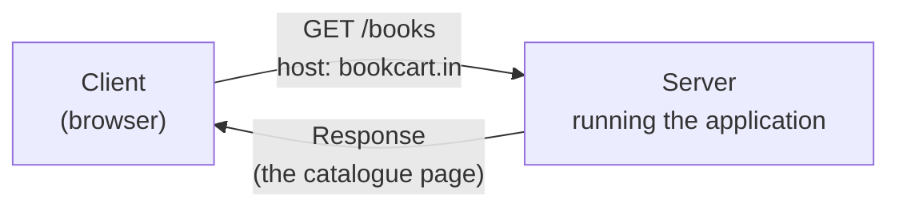
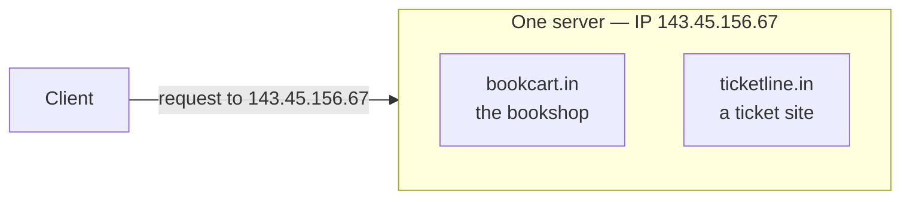
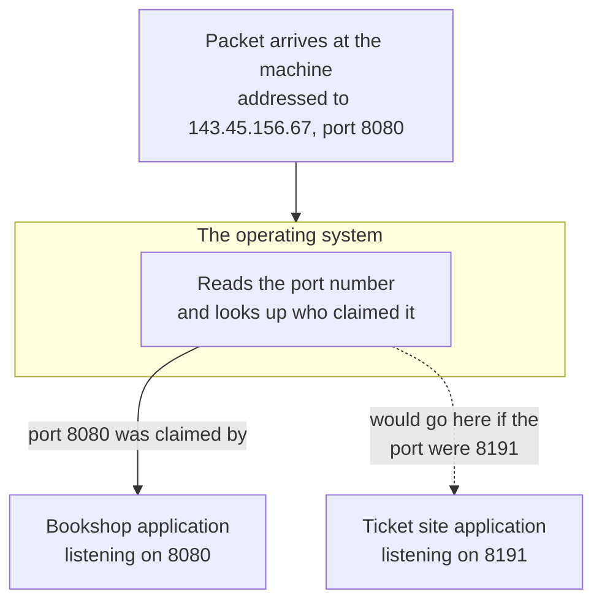

You can write an application, put it under version control, and deploy it onto a Linux machine — and none of that explains what happens when somebody in another city types your website's name into a browser and your page comes back. Between the name they typed and the code you deployed sits a chain of machinery that has to solve two separate problems: find the one machine you deployed to, out of every machine on the internet, and then find the one program on that machine that is supposed to answer.

This note is about that chain. Not all of it — a network engineer's version of this subject is a career, and almost none of it changes how you deploy anything. What you need is narrow and specific: what an address is, why an address alone is not enough, and what closes the gap.

## What actually travels

A client sends a request to a server. The server sends a response back. The client is usually a browser, and the server is a machine somewhere running your code.

The request is not just a name. It carries a **method**, which says what kind of operation you are asking for:

| Method | What it asks for |
|---|---|
| `GET` | Give me this thing |
| `POST` | Here is something new, store it |
| `PATCH` | Change part of something that already exists |
| `DELETE` | Remove this thing |

And it carries an address in two halves. Suppose the site is an online bookshop at `bookcart.in`. A visitor who wants the catalogue is asking for `bookcart.in/books`. That splits into:

- **Host name** — `bookcart.in`. Which machine, or more precisely which site.
- **Endpoint** — `/books`. Which part of that site.

An endpoint is just a named section of the application. A bookshop has a catalogue, a reviews section, a profile page, a home page. On the backend, each of those is an endpoint:

| URL | Endpoint | The section it reaches |
|---|---|---|
| `bookcart.in/` | `/` | Home page |
| `bookcart.in/books` | `/books` | The catalogue |
| `bookcart.in/reviews` | `/reviews` | Reviews |
| `bookcart.in/profile` | `/profile` | The signed-in user's own page |

So a full request reads as a method plus an endpoint plus a host — a `GET` for `/books` at `bookcart.in`. The server answers with a response.



That much is the shape of every web request ever made. The interesting question is how the request found `S` at all.

## Every machine on a network has an address

If you want to send something to a house, you need its address — house number, street, area, postcode. Nothing about the delivery works without it. Machines are the same: to move data from A to B, A must know B's address.

That address is the **IP address**, where IP stands for **Internet Protocol**. It is a standard for giving every device on a network an identifier that other devices can aim at.

There are two versions in use, and the reason the second exists is worth understanding because it is a straightforward counting problem.

### IPv4 and why it ran out

**IPv4** is a **32-bit** address, written as four numbers separated by dots, each number covering one byte:

```
143.45.156.67
```

Each of those four parts holds a value from 0 to 255, which is exactly what one byte can express. Four bytes is 32 bits, so the total number of distinct addresses IPv4 can ever produce is fixed:

```
2^32 = 4,294,967,296
```

Roughly **4.3 billion**. That sounds enormous until you count devices rather than people. Phones, laptops, servers, routers, televisions, watches — a single person may account for five or six. There was always going to be a day when the addresses ran out, and that day arrived.

### IPv6

**IPv6** is a **128-bit** address, which raises the ceiling to 2^128 — a number large enough that exhaustion stops being a concern anyone plans around.

The important practical point is that **this was not a migration that finished**. Both versions are live right now. A site that supports IPv6 uses it; a site that does not is still reachable over IPv4, and a very large number of sites are still only on IPv4. You will meet both, and as you will see when addresses get written into DNS configuration, they are stored in different places precisely because they are different things.

| | IPv4 | IPv6 |
|---|---|---|
| Size | 32 bits | 128 bits |
| Written as | Four decimal numbers, dot-separated | Eight groups of hex, colon-separated |
| Total addresses | ~4.3 billion | 2^128 |
| Status | Still dominant | Supported where sites have adopted it |

> [!info] A server is not a special kind of machine.
> It is a computer. The client is also a computer. Both have IP addresses for exactly the same reason, and the word server describes a role — the machine that answers — rather than a category of hardware.

**Does every device really get its own address?** Yes, in the sense that every device on a network is individually addressable. But if you have several devices at home behind one router, they do not each present a separate address to the outside world — they share the router's outward-facing one, while the router keeps them apart internally. That splits addresses into two kinds with two different jobs, and that distinction becomes load-bearing later on, once there is more than one server to talk to.

> [!info] A MAC address is a different thing, and the two get confused constantly.
> The MAC address is the machine's own hardware address, burned into the network interface, and it does not change. An IP address is assigned to a device on a network and changes whenever the network does — move your laptop to a different network and it gets a different IP while its MAC address stays exactly as it was. One identifies the hardware; the other identifies where that hardware currently sits.

## The problem the address does not solve

Here is where the simple picture breaks.

**One server can host multiple applications.** This single sentence causes most of the confusion people have about the rest of this subject, so it is worth stating plainly and then looking at.

If you have deployed anything onto a Linux machine before, you have already done this without necessarily noticing. A Spring Boot application deployed on one machine, and a Node.js application deployed on the same machine, both running at the same time, both serving traffic. That is normal — it is what servers are for. A single machine can host two applications, or ten.

Now watch what that does to the address:



Both applications are on the same machine, so **both have the same IP address**. The client sends a request to `143.45.156.67` and the address alone cannot say which of the two it wants. The address got the request to the right building. It has nothing to say about which door.

## Ports

The fix is a second number carried alongside the address, called a **port number**.

The analogy that makes this stick: **the IP address is the building number, and the port is the flat number inside that building.** One large building, one street address, many flats — and a letter needs both parts or it cannot be delivered.

You already rely on this every day without seeing it. Right now your own machine probably has a browser open, a music player running, and a messaging app in the background. When a message arrives over the network, something has to decide whether it belongs to the messaging app or the music player. The address gets it to your machine. The port decides which program on your machine receives it.

So a request aimed at a specific application on a specific machine looks like an address and a port together:

```
143.45.156.67:8080     → the bookshop
143.45.156.67:8191     → the ticket site
```

Same machine, same address, different applications, told apart by the port.

> [!info] An address and a port together are called a **socket**.
> When you see the word socket in networking material, that pairing is what it means — the combination of an IP address and a port number, which together identify one endpoint of a connection rather than just one machine.

### The well-known ports

Some port numbers are fixed by convention across the entire internet, so that a client can connect to a service without being told which port to use. These are worth memorising because they turn up constantly:

| Port | Service | What it is |
|---|---|---|
| `80` | HTTP | Unencrypted web traffic |
| `443` | HTTPS | Web traffic over TLS — the same protocol with the contents encrypted |
| `22` | SSH | Remote login to a machine |
| `3306` | MySQL | The MySQL database |
| `6379` | Redis | The Redis in-memory data store |

The first four are registered assignments — the same table your own machine consults in `/etc/services`. The Redis port is slightly different in status: `6379` is Redis's own documented default rather than a formally reserved assignment, but every Redis installation you meet will be on it unless somebody deliberately changed it.

> [!important] HTTPS is not a different protocol from HTTP.
> It is the same protocol with the message encrypted in transit. The `S` is for secure, and what it secures is the contents of the request and response — not the fact that a request happened, and not where it went.

### What listening on a port actually means

A port is not a physical thing on the machine. It is a number an application claims, and the claim happens when the application starts.

When you deploy the bookshop and tell it to run on port `8080`, the application announces to the operating system that it wants to receive anything arriving for port `8080`. This is called **listening**. The ticket site does the same for `8191`. From then on:



The operating system holds the mapping from port number to application and hands each incoming packet to whoever registered for that port. Two applications cannot both claim the same port on the same machine — the number identifies exactly one listener, which is the whole point of it. If you need two things answering on the same port number, you need two machines.

## What is still missing

Put the two halves together and the picture looks complete. A client has an address and a port; the address finds the machine, the port finds the application. Except that a real visitor has neither of those things. What they have is a name they typed: `bookcart.in`. They do not know the address, and they certainly do not know that the bookshop happens to be listening on `8080`.

Two separate gaps, then, and each gets its own answer.

The first — turning a name into an address — is what the domain name system exists to do.

The second is subtler and easy to miss. A browser making an encrypted request does not aim at port `8080`. It aims at `443`, because that is the fixed, conventional port for HTTPS and the browser has no way of knowing the application chose something else. So the request arrives at the right machine, on port `443`, and the application that should answer it is listening on `8080` and never hears a thing. Something has to sit in between and translate one to the other.

*Source: class 7 — 2 September 2026, recording part 1.*
