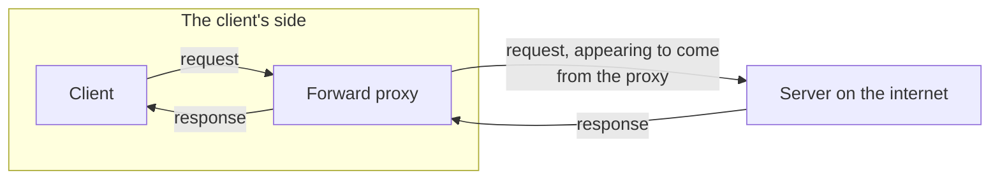
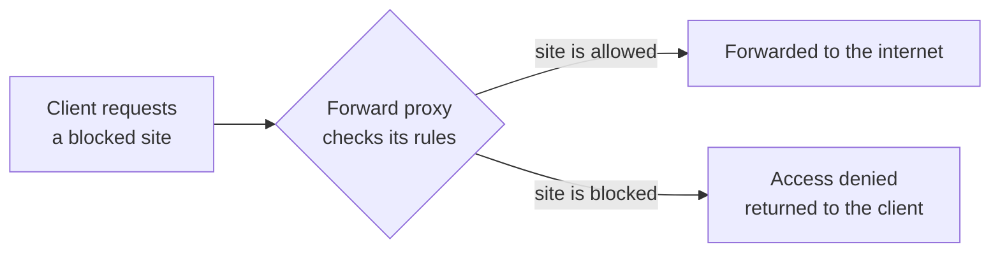
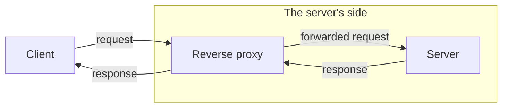
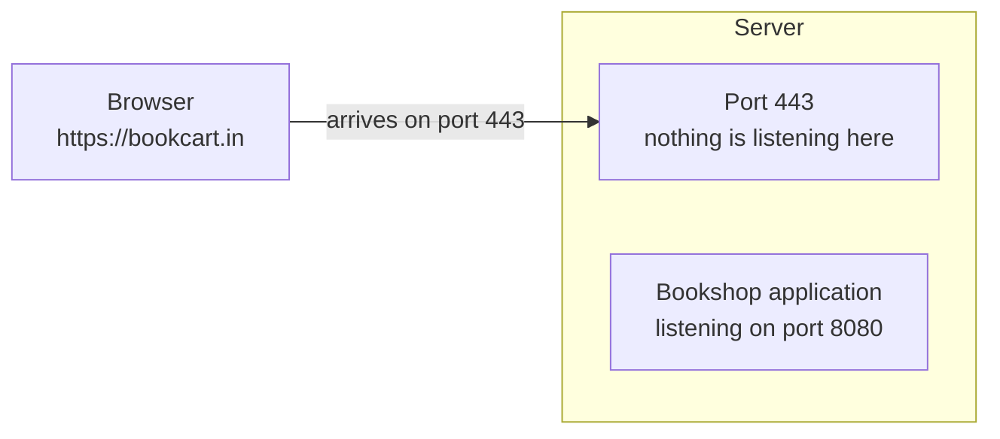

An address finds the machine and a port finds the application, but the previous note ended on a gap that neither of them closes: the browser aims its encrypted request at port `443` because that is what HTTPS means, and the application is listening on `8080` because that is where it was deployed. Both facts are correct. Together they mean the request arrives and nothing answers.

## What a proxy is, before any adjectives

Strip the word back and a **proxy** is something that acts on behalf of something else. It stands in for another party, and whoever it is talking to believes they are dealing with the real thing.

The word is used this way everywhere in software, not just in networking — it turns up in low-level design and in system design with the same meaning. Here it means one machine standing in for another in a conversation.

Which gives two kinds, distinguished by nothing except **which side it stands in front of**.

## Forward proxy — standing in front of the client

Put the proxy in front of the client, and every request the client makes goes through it first.



This is a **forward proxy**, also called a front proxy. The client cannot reach the internet without passing through it.

Notice what each end believes. The server on the internet thinks it is talking to a real client — it never sees the actual one, only the proxy, and the address it sees is the proxy's. The client thinks it is talking to the internet, when it is really talking to its own proxy. Both are half-right, and that is the entire trick.

### What it is for

The common case is a corporate network. Work somewhere with any size of IT department and there is almost certainly a proxy between your machine and the outside world, and everything you fetch goes through it.

The reason is **access control**. The proxy sits in the only path out, which means it gets to decide what is allowed out. Ask it for a site the organisation blocks and it does not forward the request at all — it answers from where it stands:



The request never reaches the internet. Whatever the site is, the answer comes back as access denied, and the server on the far side never learns anyone asked.

> [!info] A forward proxy is optional.
> Not every architecture has one or needs one. It appears where somebody wants control over outbound traffic — a company, a school, a filtered network. Plenty of systems have none at all.

## Reverse proxy — standing in front of the server

Now move the proxy to the other end. Put it in front of the **server**, and it is a **reverse proxy**, also called a backward proxy.



The belief structure is the mirror image. The client thinks it is talking to the real server; it is talking to the server's proxy. The server sends its responses to the proxy, and the proxy is responsible for talking to the client.

> [!important] The clean way to hold the difference: a forward proxy belongs to the client's architecture, a reverse proxy belongs to the server's.
> Draw a box around the client and its proxy — that whole box is what the outside world calls the client. Draw a box around the server and its proxy — that whole box is what the outside world calls the server. Neither box has any business knowing what is inside the other.

One consequence follows immediately, and it matters: **the address DNS hands out is the reverse proxy's.** When a visitor resolves the domain, the address they get back is the proxy's, not the server's. The client never learns the server's address, and the proxy substitutes the real one when it forwards.

## Back to the dead end

Which brings us to the problem this started with. The bookshop is deployed on a server, listening on port `8080`. A visitor opens `https://bookcart.in`.

The browser has exactly one basis for choosing a port: the request is HTTPS, so the port is `443`. It cannot know the application chose `8080`, and there is nowhere in a normal URL for anyone to tell it.



Nobody claimed `443`, so nothing receives the packet. The application that should have answered is sitting on `8080` with no idea a request happened.

You could deploy the application on `443` directly and skip the problem. That works exactly once. The moment a second application needs to serve HTTPS from the same machine you are stuck again — `443` can be claimed by one listener and one only.

The reverse proxy is what closes it. It claims `443`, and it rewrites both halves of the destination as it forwards:

| The request arrives as | The proxy forwards it as |
|---|---|
| Proxy's address, port `443` | Server's real address, port `8080` |
| Proxy's address, port `80` | Server's real address, port `8191` |
| Proxy's address, port `22` | Server's real address, port `9090` |

Not just the port — the address too, because the address the client had was the proxy's all along.

> [!important] One incoming port maps to one application, and there is no way around that.
> If `443` is mapped to the bookshop, `443` cannot also be mapped to the ticket site on the same machine. The proxy has taken the restriction off the applications and onto itself, but it still exists. Two applications that both genuinely need the same public port need two servers, or they need to be told apart by something other than the port.

## nginx, and what the configuration looks like

The reverse proxy you will meet in practice is **nginx**. Configuring it means describing which port to listen on and where to send what arrives.

```nginx
# /etc/nginx/nginx.conf — the shape of a reverse-proxy block
server {
    listen 443;

    location / {
        proxy_pass http://localhost:8080;
    }
}
```

Three directives carry the whole idea. `listen` says which port this block answers on. `location` says which request paths the block applies to, with `/` meaning everything. `proxy_pass` says where to forward them.

> [!info] Why `localhost` in the `proxy_pass` line?
> Because in the ordinary deployment, nginx and the application are on the **same machine**. If you deploy your application on a cloud server and put nginx on that same server, then from nginx's point of view the application is not somewhere across a network — it is right here. `localhost` is a machine's name for itself, so `localhost:8080` means the thing listening on port 8080 on this very machine. Split them across two machines and this line would carry the other machine's address instead.

nginx is also not only a reverse proxy. The same program is routinely configured as a **load balancer**, and it can take on **API gateway** work as well. That is not three products; it is one process doing a different job, or several at once.

| Role | What it does in that role |
|---|---|
| Reverse proxy | Receives on the public port, rewrites address and port, forwards to the application |
| Load balancer | Spreads incoming requests across several servers running the same application |
| API gateway | Routes by request path, and handles the policies that sit in front of an application |

## Does the extra hop cost anything?

A fair question: you have inserted a component into every single request. Does that slow things down?

Barely. The effect is small enough to ignore in practice. All the proxy does is receive a request, substitute an address and a port, and pass it on — it is not parsing anything expensive or doing work proportional to the size of what it forwards. The added latency is negligible against everything else in the path.

## What this buys, and what it does not

The reverse proxy has bought a clean separation. Applications no longer have to care what port the outside world uses; the outside world no longer has to care what port an application chose. Each side changes without telling the other, because what connects them is a line of configuration rather than an assumption baked into both.

Be clear about the limit, though. In this form the reverse proxy solves an addressing problem and nothing else. It does not make the application faster, it does not make it survive a crash, and it does not help when one machine stops being enough.

It does turn out to have a second job, and a considerably more important one — but that only becomes visible once there is encryption in the picture, because the reverse proxy is where the encryption gets undone.

*Source: class 7 — 2 September 2026, recording part 1; class 8 — 2 September 2026.*
