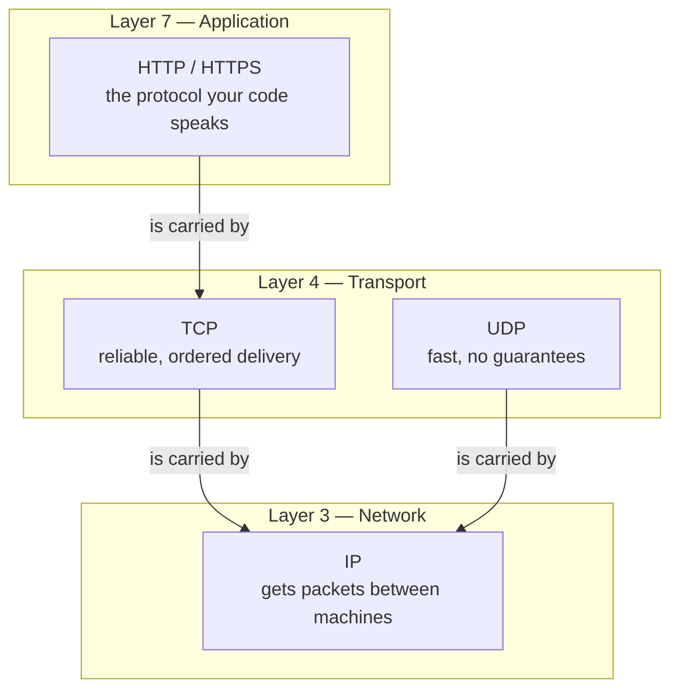
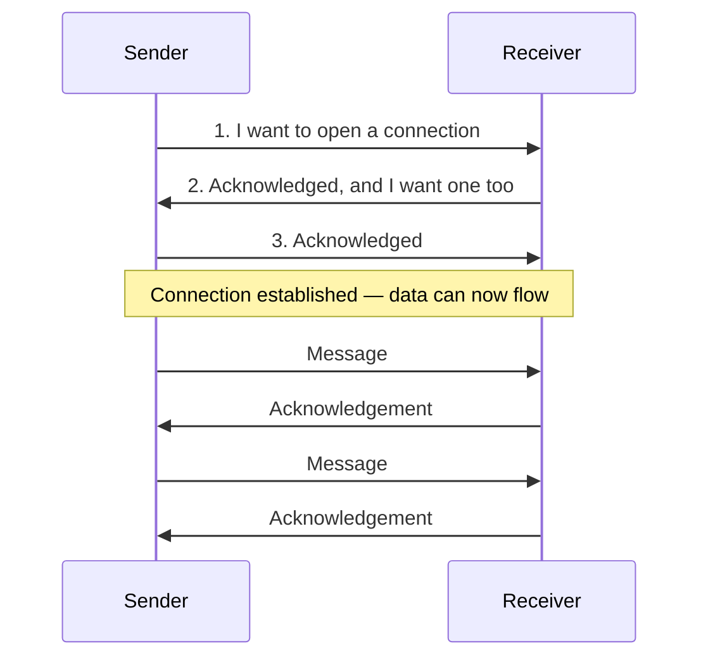
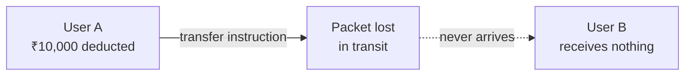
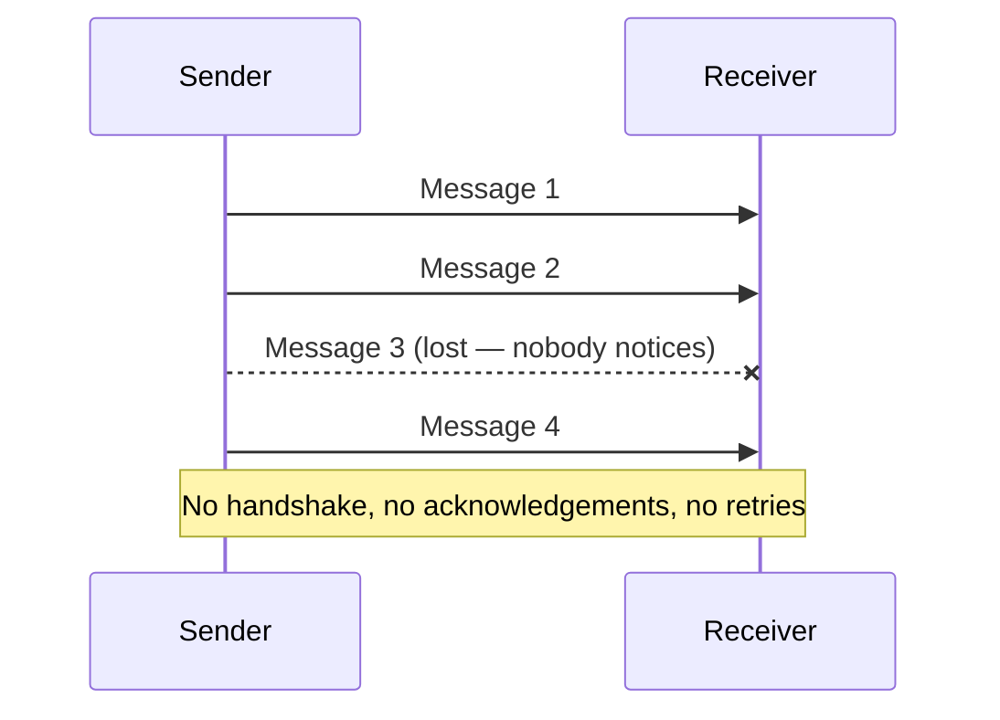

Everything so far has treated a request as a thing that simply arrives — the proxy forwards it, the application receives it. That is a convenient fiction. A request is not a single object that travels intact; it is data broken into packets, handed down through several layers of machinery, pushed across a network that can drop things, and reassembled at the other end. Whether it arrives at all, and whether it arrives in the order you sent it, depends on which protocol you asked to carry it.

## Layers, and why the word keeps appearing

Network communication is described as a stack of layers, each responsible for one part of the job and each unaware of the details of the ones below it. The standard description is the **OSI model**, which has seven:

| # | Layer | Roughly responsible for |
|---|---|---|
| 7 | Application | The protocol your program actually speaks |
| 6 | Presentation | How data is represented — encoding, encryption |
| 5 | Session | Keeping a conversation open across exchanges |
| 4 | Transport | Getting a complete message from one program to another |
| 3 | Network | Getting packets from one machine to another across networks |
| 2 | Data link | Moving frames between directly connected devices |
| 1 | Physical | The actual signal on the wire or the air |

Each layer has its own protocols. You do not need to hold all seven in your head to do this job, but you do need two of them, because the two protocols that matter most to you live one layer apart and the relationship between them explains a great deal.

**HTTP is an application-layer protocol** — layer 7. It is what your code speaks when it makes a request. **TCP is a transport-layer protocol** — layer 4. It is what HTTP is built on top of.

So when you make an HTTPS call, you are using an application-layer protocol that hands its work to a transport-layer protocol that hands its work to the network layer. You write one line of code and four layers do something about it.

> [!info] HTTPS is HTTP with the contents encrypted, and it sits in exactly the same place in the stack.
> Both are application-layer protocols, and both are built on TCP. The `S` changes what a watcher on the wire can read. It does not change which layer the protocol lives at or which transport carries it.

## TCP — the protocol that promises

**TCP** stands for **Transmission Control Protocol**, and it is also called a **connection-oriented protocol** or a **handshake protocol**. All three names point at the same behaviour: before it will send your data, it establishes a connection with the other side and confirms the other side is there and listening.

### The three-way handshake

The connection is set up in three messages, which is where the name comes from:

Only after those three messages does any of your actual data move. From then on, every message the sender sends is answered by an **acknowledgement** from the receiver saying it arrived.

### What that buys, stated as guarantees

TCP **guarantees**:

- **Delivery.** Every message you send arrives. If a packet goes missing, TCP notices the missing acknowledgement and sends it again. Your code does not have to know this happened.
- **Order.** Packets arrive in the order you sent them. If they turn up out of order — which is normal, because packets can take different routes — TCP reassembles them correctly before handing anything up.
- **That the other side exists.** The handshake fails if nobody is there, so you find out before you have sent anything.

TCP **does not guarantee**:

- **Speed.** All of the above costs time. Establishing a connection takes a full round trip before any data moves, and waiting for acknowledgements and retransmitting lost packets adds more.
- **That the connection stays open indefinitely.** Connections time out, which is covered below.

### Why this is not optional for real work

Imagine transferring money without it. User A sends ₹10,000 to user B. The packet carrying that instruction is lost somewhere in the middle. What now?

Money has left A and has not reached B, and nothing in the system knows. There is no acknowledgement missing to notice, because nothing was expecting one. There is no way to revert A's deduction, because nothing recorded that the instruction failed rather than succeeded. The money is simply gone.

This is why any exchange that follows a proper request-and-response cycle runs on TCP, and it is why HTTP is built on TCP rather than on the faster alternative.

## UDP — the protocol that does not promise

**UDP** stands for **User Datagram Protocol**, and it is the opposite trade. It is **connectionless**: it does not establish anything, it does not wait for acknowledgements, and it does not check whether what it sent arrived.

The sender simply starts sending and keeps sending. Some messages may be lost. UDP does not care, and neither does anything above it.

That sounds like a defect until you find the case where it is exactly right.

### Where losing data is the correct choice

A live video stream is the clearest example. What you want from live video is **speed** — the speaker talks and you hear it now. What you do not want is a protocol that stops the stream to re-fetch a frame from four seconds ago, because a correctly delivered frame that arrives late is worthless. It is already the past.

The same holds for a video call. If the connection stutters and a moment of the other person's audio is lost, the useful response is to carry on — and if it mattered, they will notice you did not react and say it again. That recovery is a human one, and it is cheaper than making the protocol guarantee something the situation does not need.

| | TCP | UDP |
|---|---|---|
| Connection | Established first, via handshake | None |
| Acknowledgements | Every message | None |
| Lost packets | Retransmitted | Lost, silently |
| Ordering | Guaranteed | Not guaranteed |
| Cost | Slower | Faster |
| Right for | Requests and responses, transactions, page loads | Live audio and video, anything where late data is useless |

## Packet loss

A reasonable question at this point: if packets get lost, how do you stop that happening?

You largely do not. Packet loss is a property of the network, not a setting. What you can influence is **bandwidth** — how much data the connection can carry at once. Greater bandwidth means more packets in flight simultaneously, which is why bandwidth is the number that dominates any discussion of streaming quality. Packets will still be lost; the loss depends on connection speed and a long list of other factors you do not control.

Under TCP, loss costs you time, because the missing packet is sent again. Under UDP, loss costs you a fragment of the stream, and that is the deal you accepted when you chose it.

## How long a connection lives

If TCP establishes a connection before sending, does every single request build a new one?

No. Once a connection is established, **multiple messages can travel over it**. The handshake is paid once, not per message, which matters because paying a full round trip before every request would be ruinous for a page that makes dozens of them.

The connection stays open until it is lost, and one way it gets lost is a **timeout**. If no message is sent for a certain period, the connection is closed, and the next message has to establish a new one.

> [!info] You do not manage any of this yourself.
> You make an HTTP call. TCP is a lower-level protocol that your HTTP client sits on top of, and the handshake, the acknowledgements, the retransmissions and the connection lifetime are all handled below the line you wrote. What you need to know is which transport is in play and why — that a page load or an API call rides on TCP and gets its guarantees, and that a streaming application rides on UDP and does not.

That knowledge is not decoration. The next time something in your system is slow, the question of whether you are paying for a handshake on every single request is a real one, and it is only askable if you know the handshake exists.

*Source: class 7 — 2 September 2026, recording part 1.*
