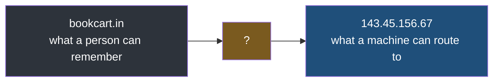
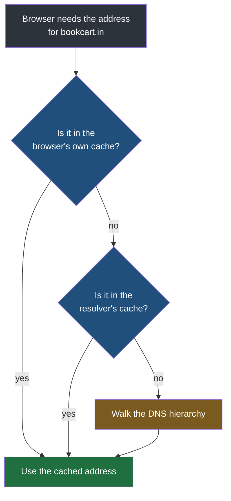
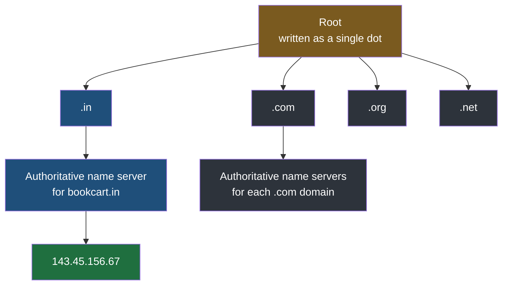
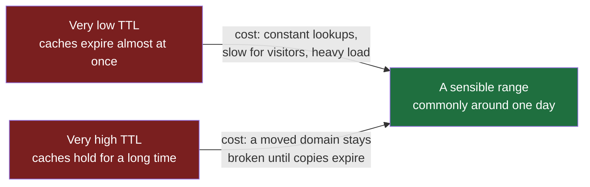
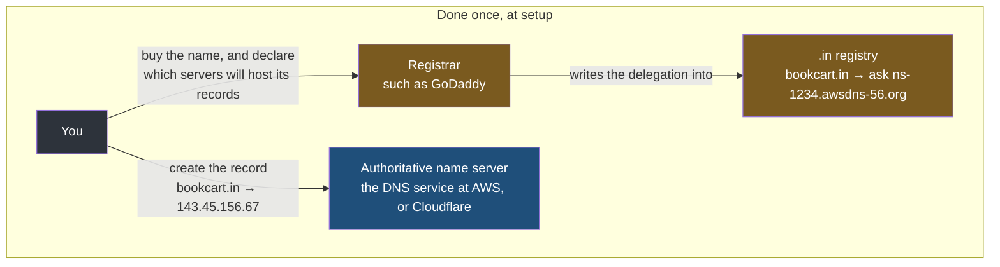
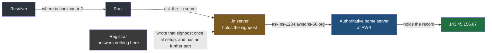

Both of the previous notes assumed the address was already known. The proxy forwards to a port on a machine it can already reach; TCP opens a connection to an address it has already been handed. Nobody has said where that address came from, and the visitor certainly did not supply it — they typed a name.

## Why names exist at all

Suppose there were no mechanism for this. To visit the bookshop you would have to know and remember `143.45.156.67`. To visit a search engine, a messaging service, a mail provider — a different string of digits for each, memorised exactly, with no room for error.

Nobody would use the internet built that way. People remember words. A site has a name because a name is the part a human can hold, and the address is the part a machine needs. Something has to convert one into the other:



That box is the **DNS** — the **Domain Name System**. Its job, stated at the coarsest level, is exactly one thing: given the name of a site, fetch an IP address and hand it back to the browser, so the browser can go there.

Everything else in this note is detail about how that lookup actually happens, and the detail matters because almost every part of it is cached, and caches are where confusing behaviour comes from.

## The lookup, one step at a time

The browser does not go straight to a DNS server. It works through a sequence, and the sequence exists to avoid the expensive step whenever possible.



### Step one — the browser's own cache

Every browser keeps a cache. If you visited the bookshop a few minutes ago, the browser already fetched `143.45.156.67` once and **stored it**. The next time you type the name, the browser answers from its own memory and the request never leaves your machine.

This is not the only caching a browser does, and it is worth being clear that **it is a browser-side cache** rather than anything the server controls. It is a different mechanism from an application cache such as Redis, which lives on the server side and holds data your own code put there. The similarity is only in the word.

### Step two — the resolver

If the browser has no answer, the question goes to a **DNS resolver**, whose name describes its function: **it resolves a URL into an IP address.** In the ordinary case, your resolver is your **ISP** — your internet service provider, the company your connection comes from.

The resolver has its own cache too. If somebody else on the same provider looked up the bookshop recently, the answer is already there and it comes straight back. At this point the lookup has still not reached the DNS hierarchy proper.

> [!important] Every level caches, and the reason is load.
> The fewer times a lookup has to reach the DNS hierarchy, the better. That hierarchy answers for the entire internet, and although it is itself distributed rather than a single machine, the pressure on it is enormous. Caching at the browser and again at the resolver exists to absorb the overwhelming majority of lookups before they ever get that far.

### Step three — walking the hierarchy

If neither cache has the answer, the resolver goes to the hierarchy. This is where the actual authority lives, and it is structured as a tree that gets narrower at each step.



**The root** is the top, written as a single dot — that is all the notation means. The root does not know any site's address. What it knows is which servers handle each **top-level domain**.

**Top-level domains**, or **TLDs**, are the last part of a name: `.com`, `.in`, `.org`, `.net`, `.io`, and a long list of others. A TLD server does not know any individual site's address either. What it knows is which server is authoritative for each domain registered under it.

**The authoritative name server** is the one that actually holds the answer. It is the final stop, and it is the place where the record for your domain genuinely lives.

So a full walk looks like a chain of redirections rather than a search:

| Asked | Answer |
|---|---|
| Root: where is `bookcart.in`? | I do not know, but I know who handles `.in` — go there |
| `.in`: where is `bookcart.in`? | I do not know, but I know which server is authoritative for it — go there |
| Authoritative server: where is `bookcart.in`? | Here it is: `143.45.156.67` |

Nothing at any level searched for anything. Each level held a pointer to the next, and the resolver followed it — the same shape as walking a chain of pointers in a data structure, one hop at a time until you reach the node that holds the value.

> [!tip] Every level of the hierarchy caches too.
> Once the `.in` server has learned the authoritative server for a domain, or a resolver has learned the final address, that answer is held for a while rather than re-fetched on every request. Without it, every lookup in the world would land on the same small set of servers.

And once the answer reaches the browser, the browser stores it — which is step one of the next lookup. The second visit to the same site skips the whole chain.

## TTL — how long an answer stays valid

Five different places now hold a copy of that answer — the browser, the resolver, and each of the three levels of the hierarchy it passed through. Which raises an obvious question: how does anyone know when to stop trusting a cached copy?

The answer is a value called **TTL**, for **time to live**. It is set by whoever owns the domain, as part of configuring it, and it says how long any cache anywhere may hold that answer before discarding it.

If the TTL is 60 seconds, then 60 seconds after a cache stores the address, it must throw it away and ask again. Every level obeys it — the browser, the resolver, and the levels of the hierarchy.

### The trade-off, in both directions

TTL is a number you choose, and both extremes hurt.

**Too high, and you cannot move.** Say the bookshop moves to a different host with a different address. You update the record. But caches all over the internet are still holding the old address, and they will keep serving it until their copy expires. For everyone whose browser or resolver has a cached answer, your site is still at the old location — which may now be nothing at all. The migration is invisible to you and broken for them, and there is no way to force the caches to drop it early.

**Too low, and you pay constantly.** With a very short TTL, caches expire almost immediately and nearly every request goes back through the resolver and possibly the hierarchy. That is slower for every visitor and it puts pressure on infrastructure that exists precisely so it does not have to answer every lookup individually.



**A common default is one day** — 86,400 seconds. That resolves each domain once per day per cache, which keeps load low while capping how long a stale answer can survive.

The right value depends on the application. If you migrate frequently, keep it lower and accept the extra lookups. If the address is stable, a longer value costs you nothing.

## Who owns what — registrar versus authoritative server

Two roles get confused constantly, and the reason is that one company usually sells you both. They are separate purchases and they do separate jobs.

**The registrar** is where you **buy** the name. You pay for the string `bookcart.in`, and the registrar enters you in the `.in` registry as its owner. That is the whole transaction — you now own a name and it points at nothing.

**The authoritative name server** is where the domain's records are **hosted**. It is the machine that, when somebody asks what address `bookcart.in` has, answers `143.45.156.67`. It is the last stop in the chain from the previous section, and it is the only party in this note that ever answers a real query.

### What the registrar does after the sale

This is the part that makes the rest of the section make sense, and it is easy to miss because it happens once and then never again.

When you tell the registrar which servers will host your records, the registrar writes that fact into the `.in` registry on your behalf. Not your address — just the names of the servers that will know your address. The `.in` server, which the previous section described as knowing which server is authoritative for each domain under it, learns it from exactly here.

So after setup the `.in` server holds a line that amounts to this:

```
bookcart.in   →  ask ns-1234.awsdns-56.org
```

That is the registrar's entire contribution. It is a signpost, written once, pointing somewhere else. Meanwhile the actual record lives wherever you chose to host it, and you put it there yourself.



### What happens on every lookup afterwards

Now run a real query against that setup and watch where the registrar appears.



The registrar is not on the path. Nobody queries it for your address, because the address is not there. When the note says the registrar is what tells the world where to go, that telling happened once, at configuration time, in the form of the line written into the `.in` registry — and from then on the registrar is inert.

> [!question] So what breaks if you let the domain lapse, given that the records live elsewhere?
> The signpost disappears from the `.in` registry, and the chain breaks at the second hop. Your records are still sitting untouched on the authoritative server, perfectly correct, and completely unreachable — because nothing tells a resolver to go and ask for them. Owning the name and hosting the answer are separate, and losing either one is enough to take the site off the internet.

### Why hosting the records where the application runs is the common choice

If the application is deployed on AWS, it is natural to host the domain's records there too — at which point AWS is the authoritative server and the registrar is only the shop the name was bought from. Nothing forces this, and plenty of people leave the records at the registrar. The reasons to move them are practical:

| | Records left at the registrar | Records hosted where the app runs |
|---|---|---|
| Where you go to change an address | The registrar's control panel, separate from everything else | The same console as the servers |
| Pointing at something whose address is not fixed | You have to notice it changed and update by hand | The provider resolves its own resources by name |
| Accounts involved in a deployment | Two | One |

The second row is the one that actually bites, and it matters more once there is a load balancer in front of the application rather than a single machine with a fixed address.

> [!note] DNS is a distributed database, but it is not merely a set of name-to-address pairs.
> It is genuinely distributed, and it is genuinely a database. What it is not is a simple key-value store. The authoritative server holds considerably more per domain than one address, which is what the next note is about.

## What a domain costs

Prices are not uniform, and the variation comes from the TLD rather than the name.

The same name can be a few hundred rupees under one extension and orders of magnitude more under another, because demand differs sharply between them. A `.com` and a `.ai` version of the same word can differ by a factor of a hundred or more, for no reason except that a great many people currently want the second one.

If you have never configured a domain, the cheapest useful exercise in this whole subject is to buy one. A plain name under an unfashionable TLD costs very little, and owning one is what makes the next note concrete rather than theoretical — you cannot really understand what an authoritative server holds until you have put something in it yourself.
