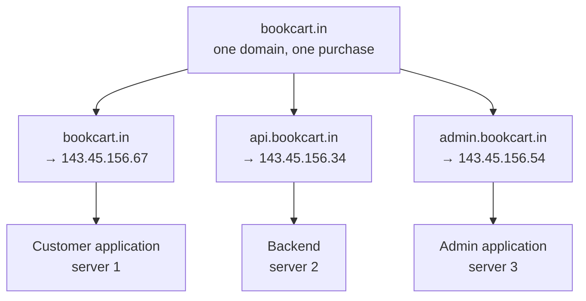
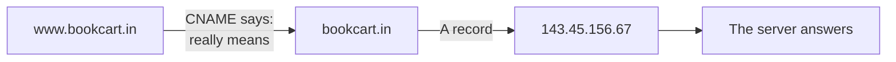
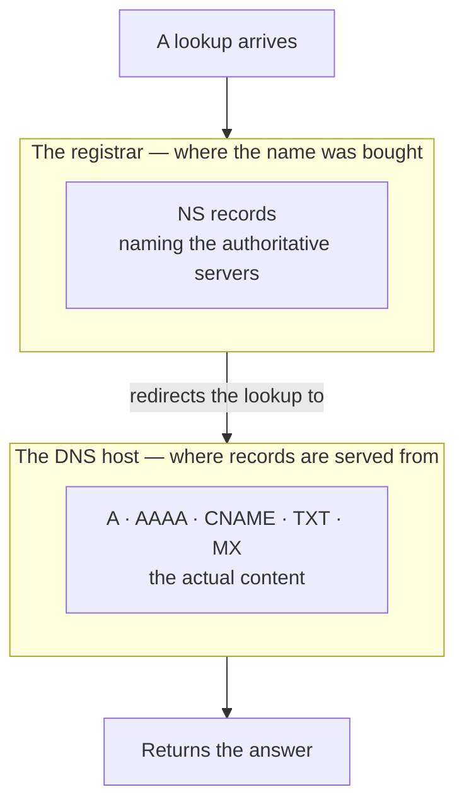

The previous note ended on a claim it did not cash: the authoritative name server holds more per domain than a single address. That extra content is the subject here, and it is where DNS stops being a lookup table you read about and becomes a thing you configure.

## What the authoritative server actually stores

Against one domain, the authoritative server holds a set of entries called **DNS records**. Each record is a different kind of fact about the domain, and each has a type that says which kind.

There are many types. As a DevOps engineer you need six:

| Type | Holds |
|---|---|
| `A` | The domain's IPv4 address |
| `AAAA` | The domain's IPv6 address |
| `CNAME` | An alias — this name is really that other name |
| `TXT` | Arbitrary text, used mostly to prove you own the domain |
| `MX` | Which mail server handles email for the domain |
| `NS` | Which name servers are authoritative for the domain |

Every record, whatever its type, is written with the same three fields:

| Field | Means |
|---|---|
| **Type** | Which of the above this record is |
| **Name** | Which name within the domain this record is about |
| **Value** | The answer |

> [!info] `@` in the name field means the domain itself.
> When a record applies to the bare domain rather than a name underneath it, you write `@` rather than spelling out `bookcart.in` again. The provider already knows which domain you are configuring, so repeating it in every row would be noise. `@` is the shorthand for the top of the domain, often called the apex or root.

## A and AAAA — name to address

The `A` record is the one doing the fundamental job. It maps a domain to an **IPv4** address.

| Type | Name | Value |
|---|---|---|
| `A` | `@` | `143.45.156.67` |

That single row is what makes `bookcart.in` resolvable. Read it back as a sentence: for the domain itself, the IPv4 address is `143.45.156.67`.

The `AAAA` record — spoken as quad-A, because it is four A's — holds exactly the same kind of fact for an **IPv6** address:

| Type | Name | Value |
|---|---|---|
| `AAAA` | `@` | `2404:6800:4000:101f::71` |

Two record types rather than one, for the reason set out earlier: both address versions are live, and they are different lengths in a different notation, so they cannot share a field. A domain reachable over both has both records. A domain that has never adopted IPv6 has only the `A`.

## Subdomains

The `name` field is what makes a domain more than one thing.

`bookcart.in` is the domain. `api.bookcart.in` is a **subdomain** — anything placed in front of the domain, separated by a dot. So is `admin.bookcart.in`, and `manager.bookcart.in`, and `blog.bookcart.in`.

Each one gets its own record, with its own value:

| Type | Name | Value |
|---|---|---|
| `A` | `@` | `143.45.156.67` |
| `A` | `api` | `143.45.156.34` |
| `A` | `admin` | `143.45.156.54` |

Three names, three different addresses, one domain. The lookup for `api.bookcart.in` finds the second row and returns `143.45.156.34`, which may be a different machine entirely from the one the apex points at.

> [!important] You do not buy subdomains. You buy one domain and create as many as you like.
> This trips people up constantly. There is one purchase and one annual fee, for `bookcart.in`. Everything in front of the dot is yours to invent, register in your own records, and point wherever you want, at no additional cost and with no additional transaction.

### Why you would want several

The typical reason is that one product is several applications, with different audiences.

A shop has a customer-facing site and an admin panel, and they are not the same application. Instagram is the easiest example to picture: there is the app every user runs, and there is a separate administrative interface that a small number of staff sign into, with rights no ordinary account has. Those are different codebases, often on different machines, and giving each its own subdomain keeps them cleanly apart:

| Subdomain | What is deployed there |
|---|---|
| `bookcart.in` | The customer-facing application |
| `api.bookcart.in` | The backend the applications call |
| `admin.bookcart.in` | The administrative interface |
| `manager.bookcart.in` | A middle tier with more rights than a user and fewer than an admin |



Two facts sit behind that diagram, and they are worth stating separately because together they cover every arrangement you will meet. **One server can host multiple applications** — established earlier, and the reason ports exist. And **one application can be deployed across multiple servers**. Neither constrains the other, so subdomains on different machines, or several subdomains on one machine, are both perfectly ordinary.

> [!info] Ports do not complicate this.
> A question that comes up is how port mapping works across subdomains. It mostly does not need to: if the subdomains resolve to different addresses, they are different machines and each has its own ports to itself. Where two do share a machine, the reverse proxy in front of them is what tells them apart, exactly as before.

## CNAME — one name standing for another

Start with a correction that catches almost everybody:

> [!important] `www.bookcart.in` is not the same thing as `bookcart.in`.
> They look interchangeable because browsers treat them that way, quietly adding or hiding the `www` as they please. In DNS they are simply two different names. `www` sits in front of the domain, separated by a dot, which by the definition above makes it a subdomain — no different in kind from `api` or `admin`. If nothing has been configured for it, it does not resolve, and a visitor who types it gets nothing.

The `CNAME` record fixes this. It creates an **alias**: a record saying this name is really that other name, go and look there instead.

| Type | Name | Value |
|---|---|---|
| `CNAME` | `www` | `bookcart.in` |

Now a lookup for `www.bookcart.in` is told to resolve `bookcart.in` instead, which has an `A` record, which yields the address:



### The more useful case

Aliasing `www` to the apex is the obvious use. The one that earns `CNAME` its place is pointing a name you own at a service you do not.

Suppose the blog is not something you host. It lives on a third-party platform, at some address of theirs, and you want visitors to reach it at `blog.bookcart.in` rather than at the platform's own URL. You cannot write an `A` record for it, because you do not control that platform's address and it may change without telling you. What you can do is alias the name:

| Type | Name | Value |
|---|---|---|
| `CNAME` | `blog` | `your-space.somehostingplatform.com` |

Anyone visiting `blog.bookcart.in` is sent onward to the platform. If the platform moves its infrastructure, its own records change and your alias keeps working, because you pointed at a name rather than at an address. That indirection is the whole value.

## TXT — proving the domain is yours

A `TXT` record holds arbitrary text. Its dominant use is verification.

When you set up a service that will act on your domain's behalf — a workspace and mail suite, an analytics product, an identity provider — that service needs to know you actually control the domain rather than merely typing its name into a form. The standard way to prove it is to ask you to publish a specific string in DNS, on the grounds that only somebody with control of the domain can do that.

The service hands you a string. You add it:

| Type | Name | Value |
|---|---|---|
| `TXT` | `@` | `google-site-verification=xyz123abc` |

The service then looks the record up. If it finds the string it issued, the domain is proven yours, and verification passes. You can usually delete the record afterwards, though services often ask you to leave it in place.

Nothing about `TXT` is specific to any one vendor. Google Workspace verification works this way, Microsoft's does too, and so does Google Analytics — each hands you a different string for the same record type, and each then checks that it appears.

## MX — where the mail goes

Owning a domain also gives you the ability to have email addresses at it. Instead of a generic mailbox somewhere, the shop can have `orders@bookcart.in` and `support@bookcart.in`.

That requires somebody to actually run the mail infrastructure, and the `MX` record — for **mail exchange** — is where you name them:

| Type | Name | Value |
|---|---|---|
| `MX` | `@` | `10 mail.someprovider.com` |

When a mail server anywhere in the world has a message for an address at your domain, it looks up your `MX` record to find out where to deliver it. Running mail infrastructure is a specialised job and generally not one you take on; the record simply points at whoever does.

## NS — which server is authoritative

The last record type is the one that makes the others findable, and it is the only one that does not live where the others do.

The `NS` record — for **name server** — answers the question: which DNS servers are authoritative for this domain? Its value is the names of those servers:

| Type | Name | Value |
|---|---|---|
| `NS` | `@` | `ns1.dnsprovider.com` |
| `NS` | `@` | `ns2.dnsprovider.com` |

Two are typical, so that one being unreachable does not take the domain down.

If your records are hosted on a cloud provider's DNS service, these are that provider's name server names. If you use a CDN and DNS provider such as Cloudflare, they are Cloudflare's. The names change; the role does not.

## Where each record has to be written

This is the part people get wrong, and the confusion is the registrar-versus-authoritative split from the previous note showing up as a practical question.



**`NS` records go at the registrar.** That is where a lookup arrives first, because the registrar is what the TLD knows about. Its job is to say: the content for this domain is not here, it is over there.

**Everything else goes at the DNS host** — the provider actually serving your records, which is usually wherever the application is deployed. `A`, `AAAA`, `CNAME`, `TXT` and `MX` all live there.

So the common setup, end to end: buy the name from a registrar, deploy the application on a cloud provider, host the DNS records with that provider, and then go back to the registrar once to set the `NS` records pointing at it. After that single step, every future record change happens at the provider and the registrar is never touched again.

> [!info] Which address does a visitor to the bare domain actually get?
> Whatever the apex `A` record points at — which in the layout above is the customer-facing application, since that is what receives the first call. The backend is reached separately, at `api.bookcart.in`, because a record was written for it. If you want a machine to be reachable by name, it needs a record; there is no automatic exposure.

> [!info] The customer-facing tier goes by two names, which is worth knowing before somebody uses the other one.
> It is commonly called the frontend. In backend-side conversation the same tier is often called the middleware, on the grounds that it sits between the user and the real backend rather than being an endpoint in itself. Both words describe the thing the apex record points at, and nothing changes depending on which one is used.

## Reading records back

You do not have to take a provider's dashboard at its word. Every record type above is publicly queryable, and `nslookup` is on your machine already:

```bash
# ~/notes — reading DNS records for a domain
nslookup -type=A     example.com     # the IPv4 address
nslookup -type=AAAA  example.com     # the IPv6 address
nslookup -type=NS    example.com     # which servers are authoritative
nslookup -type=MX    example.com     # where mail for the domain goes
nslookup -type=TXT   example.com     # verification strings and similar
nslookup -type=CNAME example.com     # any alias on this name
```

Running the `NS` query against a large site returns its name servers directly, which is the quickest way to see the registrar-to-host redirection actually working rather than taking it on trust. Running the `CNAME` query against a bare domain usually returns nothing, and that is correct rather than a failure — an apex normally has an `A` record rather than an alias.

*Source: class 7 — 2 September 2026, recording parts 1–2.*
