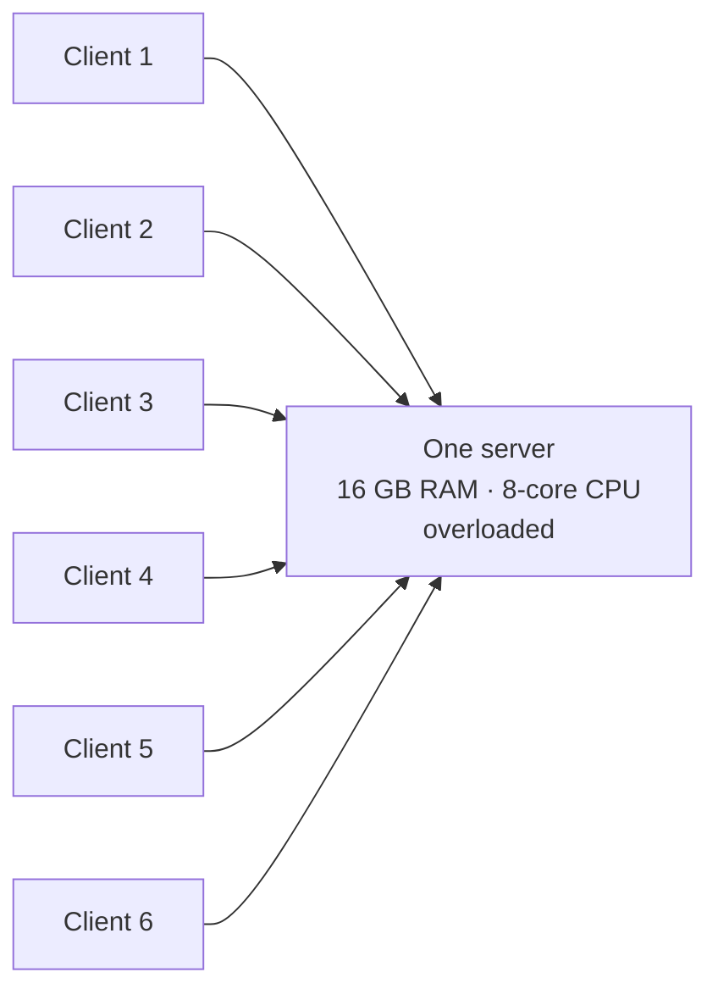
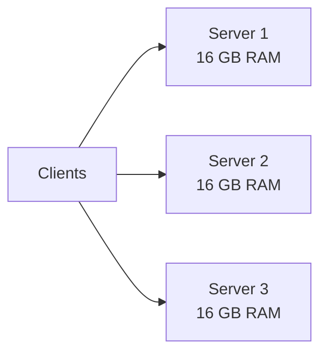
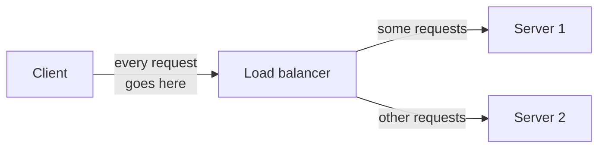
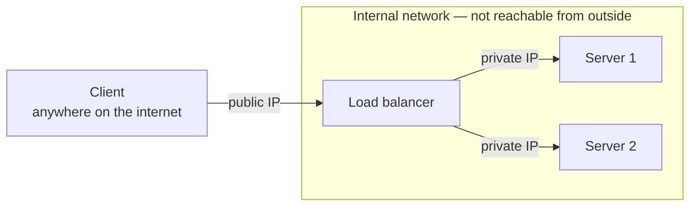
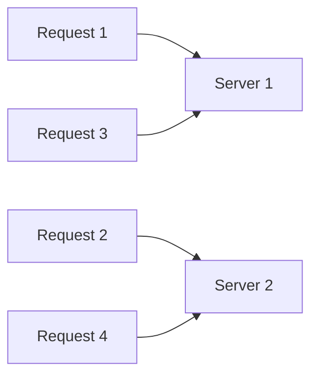
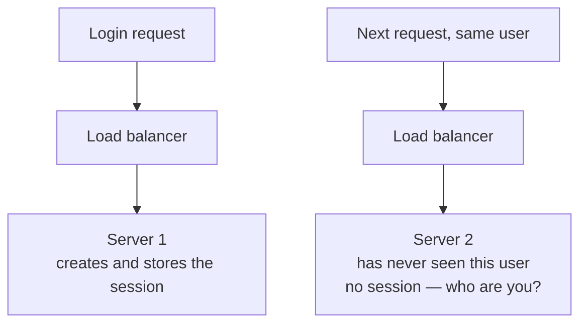
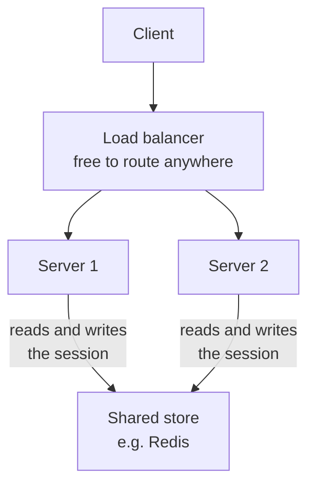
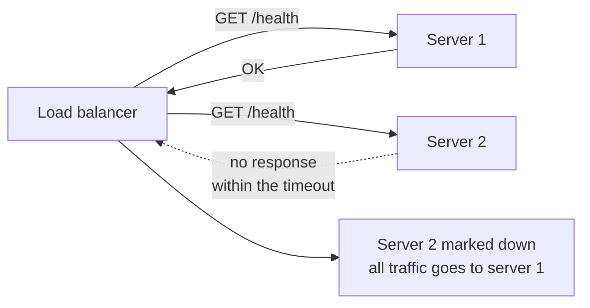
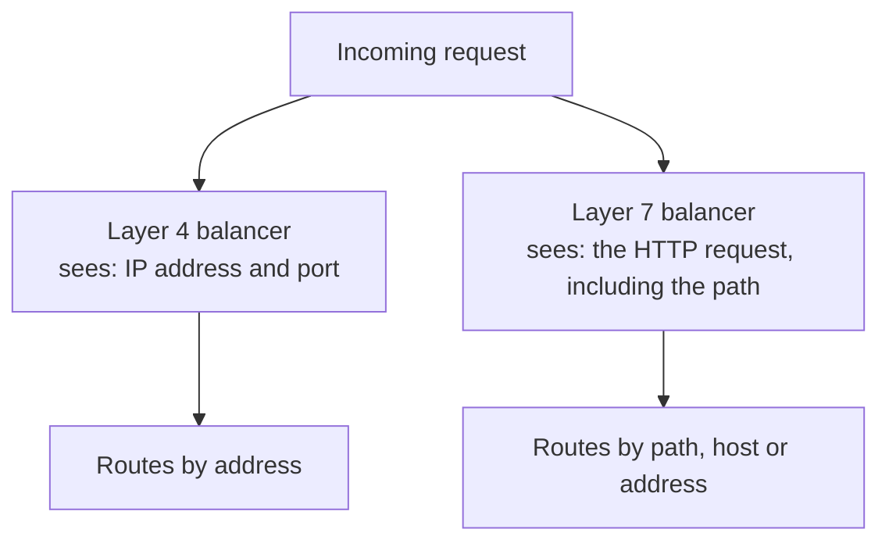
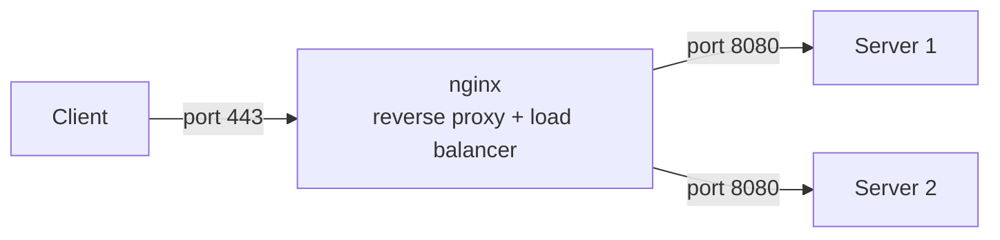

Subdomains solved a problem of variety: several different applications, each needing its own name and its own machine. This note is about a problem of volume — one application, one machine, and more visitors than the machine can serve.

## Where one server stops being enough

A server has a fixed configuration. Say this one has 16 GB of RAM, an 8-core CPU and a 1 TB SSD.

Every visitor consumes some of that. A handful of concurrent users barely registers. But the more people hit the site at once, the more of those 8 cores are in use and the more of that 16 GB is consumed, and there is a point at which the machine cannot keep up. Requests queue, responses slow, and eventually the server cannot handle the load at all.

There are exactly two ways out, and they are worth naming precisely because the second one drags in everything else in this note.

## Vertical scaling — make the machine bigger

The obvious move: give the machine more of what it ran out of. Double the RAM to 32 GB. If that fills, go to 64 GB. Add cores. Add disk.

If the server handled 10,000 requests before, a bigger one handles 20,000. When 20,000 users arrive, scale it again.

This is called **vertical scaling**, and it is genuinely the right answer for a while. For a small system it is simpler than any alternative, it requires no change to how the application is written, and it involves no new components.

> [!important] Vertical scaling has a hard ceiling, and it is physical.
> A machine has a finite number of RAM slots. There is a largest CPU you can buy. You cannot scale a single machine infinitely, and the limit is not a policy or a price — it is the box. Once you have maxed out a machine, the only direction left is outward.

## Horizontal scaling — use more machines

The alternative is to leave the machine as it is and add another one exactly like it. Two servers, 16 GB each. Half the requests go to the first, half to the second.

This is **horizontal scaling**, sometimes called distributed scaling. Rather than stacking capacity onto one machine, you build more machines and split the work between them. They can be identically configured or not — nothing requires them to match, though matching makes reasoning about them easier.

In raw capacity terms, two 16 GB servers and one 32 GB server are similar. So why prefer the pair?

> [!important] Horizontal scaling removes the single point of failure. Vertical scaling does not.
> With one server, that server failing takes the entire application down — every client, all at once, with no recourse. With three, one failing leaves two serving traffic. This is the reason horizontal scaling is the default approach for anything of consequence, and capacity is almost the lesser half of the argument.

The two are not rivals so much as stages. Vertical scaling is what you do while the system is small. Once it is maxed out, horizontal scaling is what you do from then on.

## The thing in the middle

Horizontal scaling creates a question it does not answer: when a request arrives, which server gets it? Something has to decide, request by request.

That something is a **load balancer**, and the name is the job — it balances load across the machines behind it.

The servers behind it are running **the same application**. Two servers does not mean two different codebases — it means the same code deployed twice, on two machines, so that either can answer any request.

The consequence to notice is that **the client no longer talks to a server at all**. It talks to the load balancer. The load balancer talks to the servers. That single change is what makes the rest of this note necessary.

## Public and private addresses

Because the client only ever reaches the balancer, the addresses split into two kinds with two different exposures.

**The public IP** is the balancer's. It is the address the outside world can reach, and it is the one DNS hands out — the `A` record for the domain points at the load balancer, not at any server.

**The private IPs** belong to the servers. They are addresses within an internal network, and **no client can reach them directly**. Nobody outside is supposed to know they exist.

### Why hiding the servers is the point

It is tempting to think this is just tidiness, and it is not. Suppose you did give the client a server's address directly.

Server 1 goes down. You want traffic to go to server 2 instead — that is the entire reason you built two. But the client is holding server 1's address. It sends its request there, gets nothing back, and concludes that the application is down. You have three healthy servers and a user who cannot reach any of them, because you told them about the one that failed.

> [!important] The client must never learn which servers exist or which are healthy.
> That information is yours, not theirs. All the client needs is one address that always works — the balancer's — and the balancer takes responsibility for the fact that what sits behind it changes.

### Does the balancer not become the new weak point?

It would, if there were one of it. If every request in the system funnels through a single machine, that machine is now the thing whose failure takes everything down — the exact problem horizontal scaling was meant to remove, moved one step forward.

So a load balancer is itself distributed. It is not one box but several working as one, for precisely the reason the servers behind it are several. The same is true of DNS, which faces the same pressure at a much larger scale and is likewise distributed rather than centralised. It is a recurring shape: anything that everything else depends on cannot be allowed to be singular.

## Deciding where a request goes

The balancer needs a rule. Several exist, and you do not need all of them, but you should know the shape of the choice.

### Round robin

The simplest possible rule: hand them out in turn. First request to server 1, second to server 2, third back to server 1, fourth to server 2, and onward forever.

It requires no knowledge of the servers at all, which is both why it is simple and why it is crude.

### Least response time

A rule that looks at the servers before choosing. If server 1 currently has 10 requests in flight and server 2 has 40, and both have identical configurations, then server 1 will answer faster — so the next request goes there.

This adapts to reality in a way round robin cannot. A request that happens to be expensive will tie up its server, and this rule notices and routes around it.

### IP hash

Route on the client's address: hash it, and always send the same client to the same server. Because the client's address does not change between requests, the server does not either.

That property is not obviously useful yet. It becomes the answer to the next problem.

> [!info] Equal distribution stops being meaningful when the servers are not equal.
> Splitting traffic evenly assumes the machines can take an even share. If one server has 16 GB and another has 32 GB, an even split underuses the second and overloads the first. The rules above all have variants that weight servers differently for exactly this reason, and consistent hashing is a further refinement used where you need a client to keep landing on the same server even as servers are added and removed.

## The session problem

Here is what horizontal scaling breaks, and it is the most important thing in this note because it is a correctness failure rather than a performance one.

A user logs in. The request goes through the balancer to **server 1**, which checks the password, creates a **session** for that user, and stores it. A session is how a server remembers that this client already proved who they are. In a great many applications the session is a JWT — a token issued at login, held server-side, and presented on every request afterwards so the server does not ask for the password again.

The user's next request goes back to the balancer. The balancer, following whatever rule it uses, sends it to **server 2**.

Server 2 has no record of this user. The session lives on server 1's disk and in server 1's memory, and server 2 cannot see either. The user is logged out, or asked to log in again, or refused — and nothing was wrong with the credentials, the code, or the balancer. The architecture did it.

There are two answers.

### Answer one — sticky sessions

Force the balancer to keep sending a given client to the same server. Once a client's session is established on server 1, every subsequent request from that client goes to server 1, no matter what else is happening.

This is called a **sticky session**, and the IP hash rule above is how you get it: same client address, same hash, same server, every time.

> [!important] Sticky sessions work, and they are the weaker answer.
> You have solved the session problem by giving up the thing horizontal scaling was for. The balancer can no longer send a request to the least loaded server, because it is obliged to honour an earlier decision — so a server can be overloaded while another sits idle and nothing may be done about it. Worse, if that server goes down, every client stuck to it loses its session anyway. You have reintroduced a small single point of failure per user.

### Answer two — move the session out

The better answer attacks the assumption rather than the routing. The problem is that the session lives **inside** a server. So put it somewhere both servers can reach.

The session is stored in a common data store that every server can read — Redis being the usual choice, because sessions are small, short-lived and read constantly, which is what an in-memory store is for.

Now it does not matter which server a request lands on. Either one fetches the session from the shared store and knows exactly who the client is. The balancer is free again to route on load, servers become interchangeable, and losing one costs nothing but capacity.

This is why the servers behind a balancer are described as stateless: not that they hold nothing, but that they hold nothing another server would have needed.

## Health checks

The balancer's second job, alongside distributing load, is knowing which servers are actually alive.

The mechanism is a **health check**. Each server exposes an endpoint — conventionally something like `/health` — that does nothing but confirm the application is running. The balancer calls it repeatedly, on a schedule.

If a server answers, it stays in rotation. If it fails to answer within a certain time, the balancer concludes it is down and stops sending it anything. Traffic goes to whatever remains healthy, and the clients never learn that anything happened — which is the payoff for having hidden the servers behind a single public address in the first place.

## Layer 4 and layer 7

Load balancers come in two kinds, and the names come straight from the layer model.

**A layer 4 load balancer** works at the transport layer. What it can see is addresses and ports, so its decisions are made on that basis — the IP hash rule is a layer 4 rule. It does not know or care what the request is asking for.

**A layer 7 load balancer** works at the application layer. It can see the HTTP request itself, which means it can route on the **path**:

| Rule | Sends to |
|---|---|
| `/product/*` | Server 1 |
| `/admin/*` | Server 2 |

The `*` means anything following — `/product/detail`, `/product/address`, `/product/` anything at all, all routed together. That is a categorically different capability: the balancer is now making decisions based on what the client is trying to do rather than merely where it came from.

> [!info] A load balancer is not an API gateway, even when it behaves like one.
> Routing by path is gateway-shaped work, and a layer 7 balancer doing it looks very much like a gateway. They remain different components with different purposes, and gateways commonly include load-balancing among their functions rather than the reverse. Where a system has both, the gateway sits in front and the balancer behind it.

## One process, several jobs

Recall that nginx appeared earlier as a reverse proxy, translating a public port to an application's real port. The same program is also a load balancer, and it is routinely configured as both at once.

In that arrangement a single request passing through nginx has two things done to it: its port is rewritten to the one the application listens on, and it is directed to whichever of several servers should handle it.

Balancers also come as **hardware** appliances as well as software, and the choice between them is largely one of scale and budget rather than capability.

## Where this stops

Everything above is the operating knowledge — what a balancer is for, what it breaks, and how the breakage is repaired. Several threads here run considerably deeper: how balancers are themselves made highly available, how consistent hashing behaves when the server set changes, what an API gateway does beyond routing, and how health monitoring works in a real distributed system. Those belong to system design rather than to deployment, and the boundary is a real one.

What is not optional is the shape. Load grows past one machine. More machines need something in front of them. That something hides the machines, which makes them replaceable, which is the entire benefit — and the price is that anything a server remembers privately becomes a bug.

*Source: class 7 — 2 September 2026, recording part 2.*
