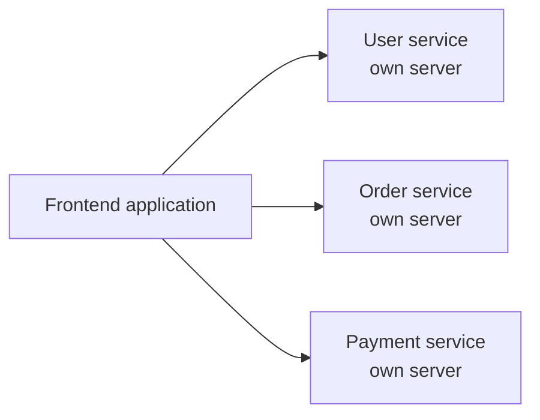
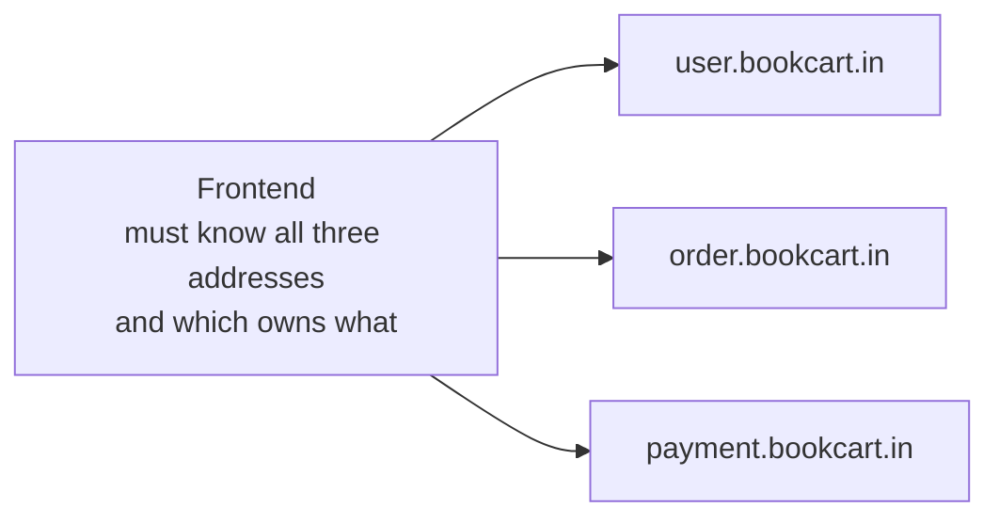
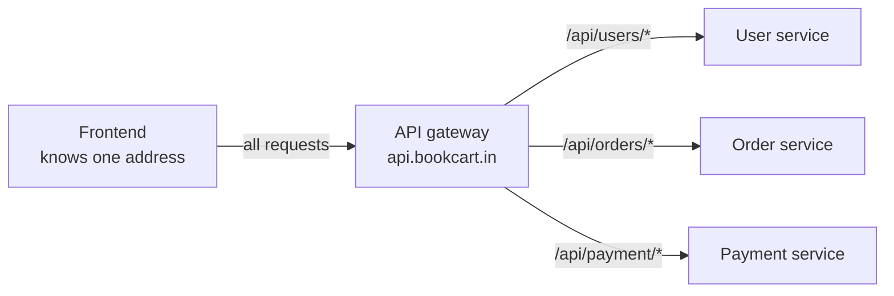
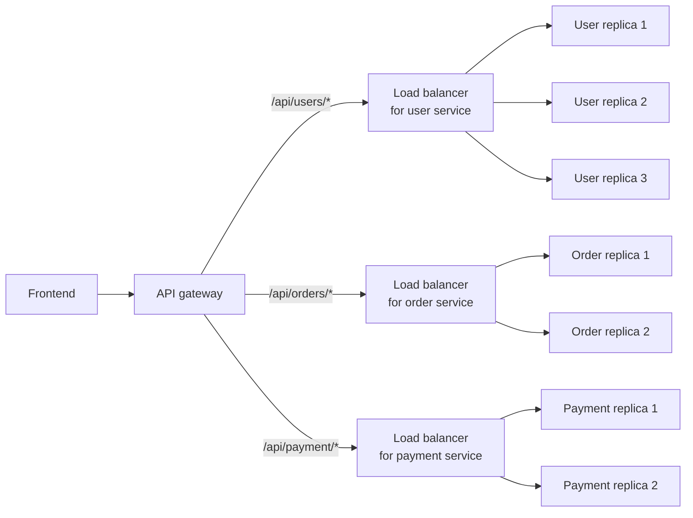
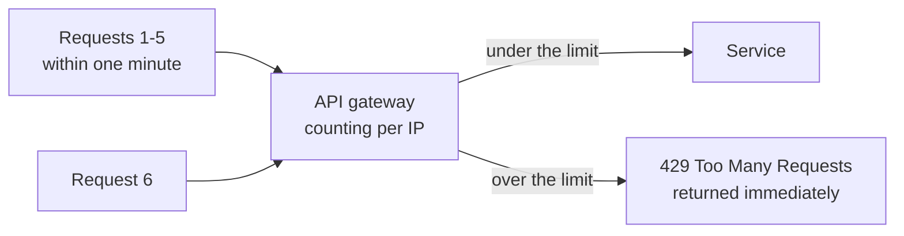

A load balancer spreads requests across copies of one application, and a reverse proxy rewrites where a request is aimed. Both assume there is essentially one application behind them. That assumption stops holding the moment a system is built as several services rather than one, and what breaks first is not the servers — it is the frontend.

## When one application becomes several

Start with the ordinary case. A single backend application, deployed on a server, answering everything a client asks for.

As it grows, the usual move is to split it. Rather than one large application, the team breaks it into **microservices** — separate applications, each owning one area of the business, each deployed on its own server:

Each is a real, independent deployment. And each needs an address the frontend can reach, which is a problem already solved: give each one a subdomain.

| Subdomain | Service |
|---|---|
| `user.bookcart.in` | User service |
| `order.bookcart.in` | Order service |
| `payment.bookcart.in` | Payment service |

One domain purchase, three subdomains, three services. Nothing here is wrong yet.

## What this does to the frontend

Now look at it from the frontend's side. It needs to fetch a user, so it calls `user.bookcart.in`. It needs to place an order, so it calls `order.bookcart.in`. It needs to take a payment, so it calls `payment.bookcart.in`.

Which means the frontend has to know:

- how many services exist
- what each one is called
- which one owns which piece of functionality
- and every one of those addresses, hardcoded somewhere

That is a great deal of backend structure leaking into a place it does not belong. Split a service in two and the frontend has to change. Rename one and the frontend has to change. Add a fourth and the frontend has to change.

> [!important] In most organisations, the people writing the frontend are not the people writing the backend.
> Frontend and backend are usually separate teams, and the frontend has no reason to know how many microservices exist, what they are called, or how the backend has chosen to divide its work. What it needs is one address to send requests to and a response coming back. Everything past that address is somebody else's design decision, and every detail of it that the frontend has to know is a detail that couples two teams together for no benefit.

## The gateway

What sits in that gap is an **API gateway**: a single entry point that receives every request and forwards it to whichever service should handle it.

The frontend now knows exactly one address — `api.bookcart.in` — and nothing else. It sends everything there. The gateway reads the request path and decides where it goes:

| Request path | Routed to |
|---|---|
| `/api/users/*` | User service |
| `/api/orders/*` | Order service |
| `/api/payment/*` | Payment service |

The `*` means anything following, so `/api/orders/detail` and `/api/orders/history` both land on the order service without either being listed individually.

Add a fourth service and you add a routing rule at the gateway. The frontend does not change, because from where it stands nothing did.

> [!info] An API gateway can be software or hardware.
> Like the reverse proxy, it is defined by its position and its job rather than its packaging — and in practice a gateway and a reverse proxy are very often the same process doing both, since both sit at the front and both rewrite where a request is going.

## Gateway versus load balancer

These two get confused constantly, because described loosely they sound identical: both sit in front of servers, both receive requests, both send them somewhere. The difference is what they decide on, and it is absolute.

> [!important] A load balancer is deliberately dumb. A gateway is deliberately smart.
> A load balancer cannot read the request. It does not know or care what endpoint is being called — it distributes load across machines that are all running **the same** application, so any of them would answer the request equally well. A gateway does the opposite: it reads the endpoint and routes to a **different** application depending on what it says. One picks a machine among equals; the other picks which service the request even belongs to.

Which means they are not alternatives. A real system has both, in a fixed order.

## The whole picture

Put it together. Each microservice is itself a server, and a server under enough load needs more than one copy — its **replicas**. Each set of replicas gets its own load balancer.

The gateway holds the addresses of the three load balancers and nothing more. Each load balancer holds the addresses of its own service's replicas and nothing more.

**Why three load balancers rather than one?** Because each one only ever chooses between interchangeable copies of a single service. The load balancer in front of the user service has three user replicas to choose from and no ability to send anything anywhere else — a payment request would be meaningless to it. Deciding that a request belongs to payments at all is a judgement about the endpoint, and only the gateway can make it.

> [!info] Everything in that diagram is a server.
> The gateway is a server. Each load balancer is a server. The reverse proxy is a server. So is the database. Some of these can be dedicated hardware appliances instead, but in the ordinary case every box in an architecture diagram is software running on a machine, and it helps to read them that way rather than as abstract components.

## What else a gateway does

Routing is the core job, but the gateway's position — every request passes through it, before reaching any service — makes it the natural place for anything that should apply to all of them.

### Authentication

The gateway can check that a request is authenticated before forwarding it. Anything that gets past has already been checked, so no individual service has to do it, and none of them can accidentally forget to.

### Rate limiting

**Rate limiting** caps how many times a given caller may hit an endpoint in a window of time. Set a limit of five calls per minute per IP address, and the sixth call within that minute does not reach the service:

If you have done any web development you have met the resulting error — too many requests — from the outside.

The reason to want it is usually cost. Suppose one of your endpoints fetches data from Google Maps, which charges you per API call. Every request a user makes to your endpoint costs you money — you are paying Google each time, whether the caller is a real customer or not. Without a limit, anyone can run up your bill simply by calling it in a loop, and a swarm of bots calling it together is both an attack on your service and an attack on your budget. A rate limit puts a ceiling on both.

Limits can be set per endpoint, so an expensive one is capped tightly while a cheap one is left generous.

## Where this sits in the larger picture

The diagram above is one region's worth of architecture. Zoom out and there is more of it: gateways are themselves replicated, DNS resolves to different infrastructure depending on where in the world the request comes from, and content delivery networks sit further out again. All of that is system design rather than deployment, and the flow above is what you need to hold.

Two things worth separating from the gateway before leaving it, because the names invite confusion. A **VPN** is not a proxy of either kind — it does tunnelling, which is a different job entirely. And an **API gateway** has nothing to do with a **payment gateway** beyond sharing a word.

*Source: class 8 — 2 September 2026.*
