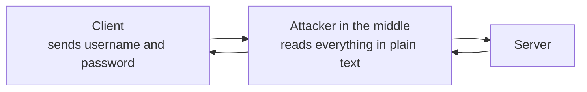
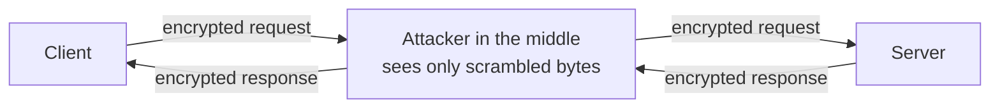
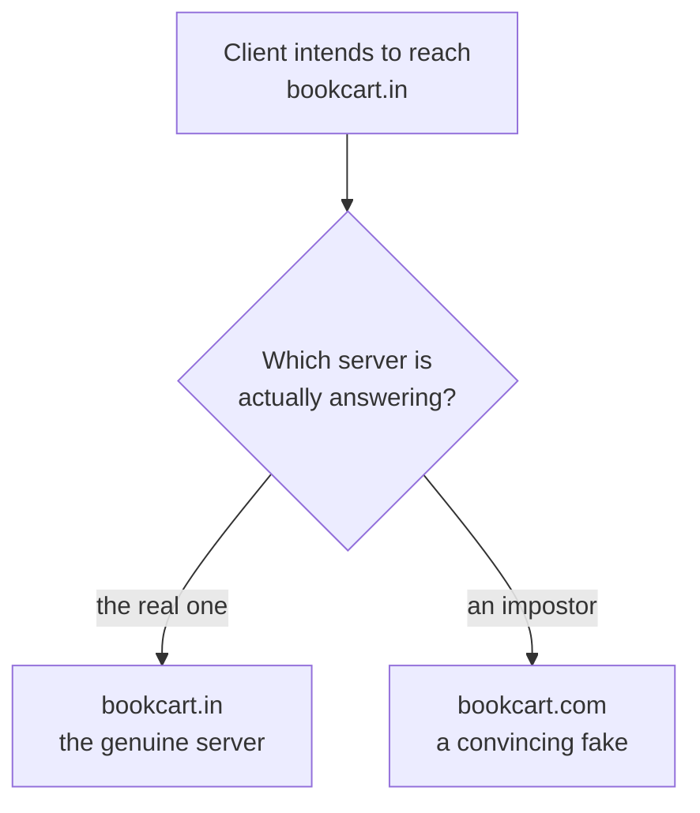

Every note so far has moved a request around — found the machine, found the application, chose a service, spread the load. None of them has asked what the request looks like to anyone watching it travel. That turns out to be the most consequential question in the subject, and the answer for plain HTTP is uncomfortable.

## What HTTP actually specifies

**HTTP** stands for **Hypertext Transfer Protocol**, and it is a set of rules for how a client sends data to a server and gets an answer back.

Those rules cover a lot. A request states which **method** it is using — `GET`, `POST`, `PUT`, `PATCH`, `DELETE` — which endpoint it wants, which host it is aimed at, and it may carry a body. A login request might look like this:

```
POST /users
Host: api.bookcart.in

username: someone
password: password123
```

HTTP defines every part of that: the shape, the ordering, what a server may reply. What it does not define, anywhere, is that any of it should be **encrypted**.

So it is not. A plain HTTP request travels in raw form — exactly as written above, readable by anything it passes through.

## Why that is a problem

Between a client and a server, a message crosses networks nobody in the conversation controls. The standard way to think about the risk is a **man-in-the-middle attack**: an attacker positioned somewhere in that path, intercepting traffic as it goes past.



Intercepting means reading — both the request travelling one way and the response coming back. With the login above, the attacker now has a working username and password, and nothing stops them going to the server themselves and signing in as that user.

The same applies to anything else in the traffic: card details, tokens, personal data, whatever the application happens to send. All of it in the clear, all of it readable by anyone on the path.

## HTTPS

This is where **HTTPS** comes from. Early web traffic ran on plain HTTP; HTTPS is what replaced it once it became obvious that raw transmission was untenable.

**HTTPS** is **Hypertext Transfer Protocol Secure**, and the `S` is doing exactly one job. Requests from client to server, and responses from server to client, are **encrypted in transit**:



The attacker is still there. They can still see traffic passing. What they cannot do is understand it — a request whose body reads `hello` goes past as something like `qw123`, and without the means to reverse it, that string tells them nothing.

> [!important] HTTPS is not a different protocol. It is HTTP plus TLS.
> Everything about HTTP is unchanged — same methods, same endpoints, same headers, same responses. What HTTPS adds underneath is **TLS**, and TLS is where all the actual work happens. Written as an equation: HTTPS = HTTP + TLS.

## TLS

**TLS** stands for **Transport Layer Security**, and its name says where it operates. Data moves between machines using transport-layer protocols — TCP and UDP. TLS is responsible for the security of that transport: how information gets encrypted on the way out, how it gets decrypted on the way in, and how the two ends agree on any of it.

Before a client and a server exchange a single message of real content, they perform a **TLS handshake**. This is a negotiation that establishes a secure channel between them. Once it completes, both sides know the connection is secure and can start sending.

> [!info] The TLS handshake is not the TCP handshake.
> TCP's three-way handshake, with its synchronise and acknowledge messages, establishes that a connection exists. It has nothing to do with security. The TLS handshake happens **after** it, over the connection TCP just built, and its job is to make that connection private. Two handshakes, in sequence, for two entirely different purposes.

> [!info] TLS does not care what is underneath it.
> A reasonable objection: if TLS secures the transport layer and video streaming uses UDP rather than TCP, how does any of this work for a streaming site? The answer is that the two are separate concerns. Whatever transport a given piece of traffic uses, TLS secures the connection to the website itself. Loading the page, signing in, and every request the application makes go over TCP and are secured normally. What the video stream does underneath is its own business.

## What HTTPS guarantees

TLS delivers three distinct properties. They are worth separating, because they defend against three different attacks and it is easy to assume the first one covers all of them.

### Confidentiality

**No one in the middle can read the data.**

This is the property people usually mean when they say a connection is secure. The message is scrambled in transit, and an attacker who captures it gets a string they cannot interpret.

### Integrity

**No one in the middle can change the data.**

This is a separate guarantee, and skipping it would be a serious mistake. An attacker who can read your traffic can generally also modify it, and reading is not always the goal. Consider a transfer request for ₹1,000. An attacker who can alter the message in flight does not need to understand your account — they change the amount to ₹10,00,000 and let it through. Confidentiality alone would not have stopped that; integrity is what does.

### Authentication

**The server is who it claims to be.**

The third attack does not involve intercepting anything. The attacker persuades your client to talk to them instead of to the real server in the first place.

They cannot register `bookcart.in` — that is taken. But they can register something adjacent. `bookcart.com` rather than `bookcart.in`. Something close enough that a person glancing at it does not notice, and they build a site that looks right. Now traffic that was meant for you goes to them, encrypted beautifully, straight into their hands.



Confidentiality is worthless here — the connection to the attacker is perfectly encrypted. What is needed is a way for the client to establish that the server on the other end **is** the server it meant to reach, and it needs to establish that before sending anything.

That is what authentication provides, and TLS provides it using **certificates**.

## Where the difficulty actually lies

Two of these three are, at bottom, an encryption problem — scramble the message so it cannot be read or silently altered. Encryption is a solved field, and the techniques predate the web by a long way.

The third is not an encryption problem at all. It is a **trust** problem. Before any encryption can help you, the two parties have to agree on a secret, over a network where an attacker is listening to everything and can modify anything in flight. Every part of that sentence is hostile: you cannot simply send the secret, and you cannot simply believe what comes back.

The next notes take that apart in order — first the encryption techniques available, then what breaks when you try to use them over an open network, and then what a certificate is and why it closes the gap.

*Source: class 8 — 2 September 2026.*
