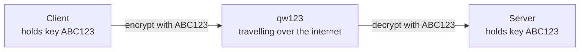
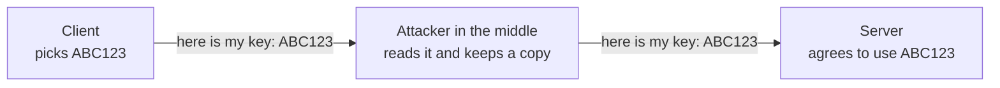
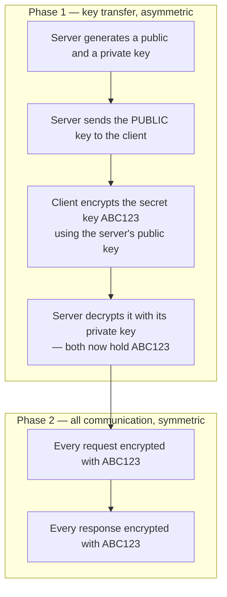

The previous note left a requirement without a mechanism: a client and a server need to exchange messages that nobody in between can read or alter. The field that solves this is **cryptography**, and it offers two families of technique. Neither is sufficient on its own, and understanding why is what makes the real design make sense.

## Symmetric keys

The first approach is the intuitive one. Client and server each hold **the same secret key**, and that one key both scrambles and unscrambles messages.

Say they have agreed on the key `ABC123`. Encryption takes a message and a key and produces an encrypted message:

```
encrypt(message, key) → encrypted message

encrypt("hello", "ABC123") → "qw123"
```

Decryption takes the encrypted message and the same key, and gives back the original:

```
decrypt(encrypted message, key) → message

decrypt("qw123", "ABC123") → "hello"
```



An attacker in the middle sees `qw123`. They cannot turn it back into `hello`, because turning it back requires the key, and the key exists only at the two ends.

This is **symmetric key cryptography** — symmetric because the same key does both jobs.

### What it costs

Very little, and that is its defining virtue. **Symmetric encryption is fast.** One key, one operation, no elaborate mathematics per message. When a page load involves dozens of requests and responses, speed is not a nicety — an encryption scheme that noticeably slowed every API call would be paid for on every single interaction.

### Where it fails

The key is a single point of failure at both ends.

If an attacker compromises the client, or compromises the server, and steals `ABC123`, then every message either party sends is readable and there is nothing left. They have two chances to get it and only need one. Encrypting at all becomes pointless the moment they succeed, because the same key that protects the traffic also reveals it.

## Asymmetric keys

The second approach splits the key in two. Rather than one key doing both jobs, there are **two related keys**, and each does only half.

The server generates both:

| Key | Shared? | What it does |
|---|---|---|
| **Public key** | Yes — freely, with anyone | Encrypts |
| **Private key** | Never — it stays on the server | Decrypts |

The public key is meant to be distributed. Publish it to the world; hand it to anyone who asks; if an attacker obtains it, that is fine and changes nothing. The private key never leaves the machine that generated it.


Written the same way as before:

```
encrypt(message, server's public key)  → encrypted message
decrypt(encrypted message, server's private key) → message
```

> [!important] The public key cannot undo its own work. This is the entire point.
> Encrypting with the public key is a **one-way** operation. Having the public key does not let you decrypt what was encrypted with it — for that you need the private key, and only the server has that. So an attacker holding the public key, which they are welcome to, can encrypt messages to the server and can do absolutely nothing with anyone else's.

This is **asymmetric key cryptography**, and it removes the failure mode symmetric encryption has. There is no shared secret sitting at both ends waiting to be stolen. The only secret is the private key, it exists in exactly one place, and the client never has a copy — so compromising the client gains an attacker nothing.

### What it costs

Speed. Asymmetric encryption is substantially **slower** than symmetric, and the difference is large enough to matter when it is applied to every message in a conversation.

There is a second awkwardness too. As described, this only secures traffic in one direction. The client can encrypt to the server, because the server published a public key. For the server to encrypt back the same way, the **client** would need its own key pair, and would have to publish its public key to the server first. That is a whole second exchange, and every client would have to do it. The complication is real and nobody wants to pay for it.

| | Symmetric | Asymmetric |
|---|---|---|
| Keys | One, shared by both | Two: public shared, private held |
| Same key encrypts and decrypts | Yes | No — public encrypts, private decrypts |
| Speed | Fast | Slow |
| Works both directions with one setup | Yes | No — each direction needs its own pair |
| Fails if | Either end leaks the shared key | The private key leaks |

## The problem neither solves alone

The two techniques have opposite shapes: symmetric is fast but needs a shared secret, asymmetric needs no shared secret but is slow.

So the obvious thing to want is symmetric encryption for the actual conversation. And the moment you try to set it up, you hit the question that this whole subject turns on:

**How does the client get the shared key to the server?**

They are not in the same room. There is no prior arrangement, no physical connection, nothing agreed in advance. The client picks `ABC123` and the server has no way of knowing it — there is no mechanism by which a server simply intuits what a browser decided a moment ago. The key has to be sent across the internet.

So send it:



The client sends the key in the clear. The server receives it and agrees. And the attacker sitting in the middle has read it on the way past and stored it.

Now all three parties hold `ABC123`. The client encrypts, the server decrypts, and the attacker decrypts everything too, with no effort and no indication to either party that anything is wrong. The entire scheme is defeated by its first message.

## The combination

The answer is to use each technique for the thing it is good at.

**Asymmetric encryption is used once, to transfer the key. Symmetric encryption is used for everything after that.**



Trace what the attacker sees now. The public key goes past — fine, it is public. Then an encrypted blob goes past, which is the secret key wrapped in the server's public key. They cannot open it: decrypting requires the private key, the private key is on the server, and the client does not have a copy either. So the secret key arrives at the server and nowhere else, and every message from that point is symmetric, fast, and unreadable to anyone without `ABC123`.

Both problems solved. The slow technique runs once, on one small piece of data. The fast technique runs on everything else.

> [!info] A JWT is not this.
> Tokens and secret keys get conflated because both are opaque strings that grant access to something. They belong to different stages: a secret key here is for encrypting and decrypting traffic, while a JWT is issued **after** authentication and is signed rather than encrypted. Different mechanism, different purpose, different point in the flow.

## The problem that remains

The scheme above has a hole in it, and it is in the very first step.

The server sends its public key to the client. That message travels over the same hostile network as everything else, and an attacker in the middle can do more than read — they can **replace**. Which means the client has no way of knowing whether the public key it received is really the server's.

That is the next problem, and it is what certificates exist to solve.

*Source: class 8 — 2 September 2026.*
