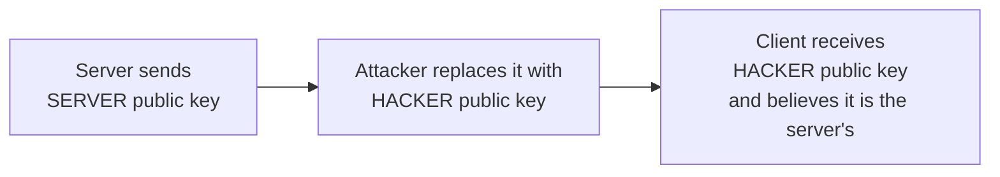
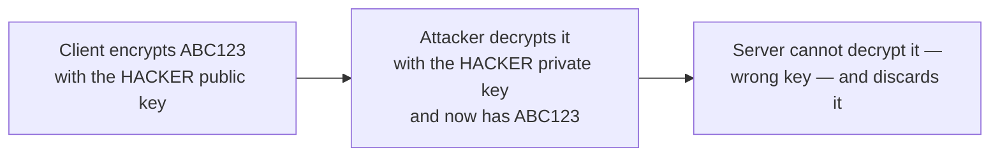
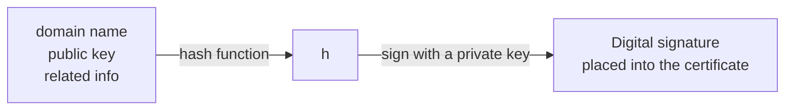
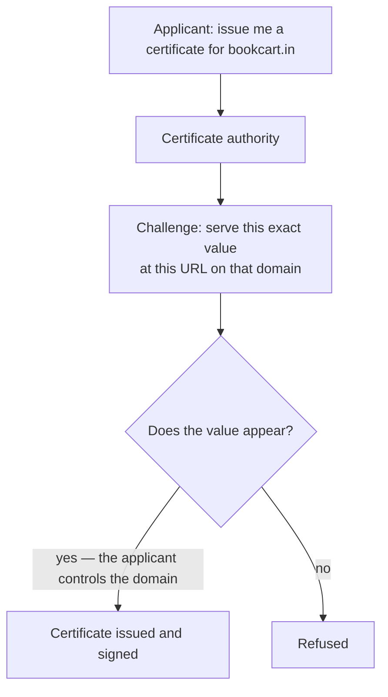
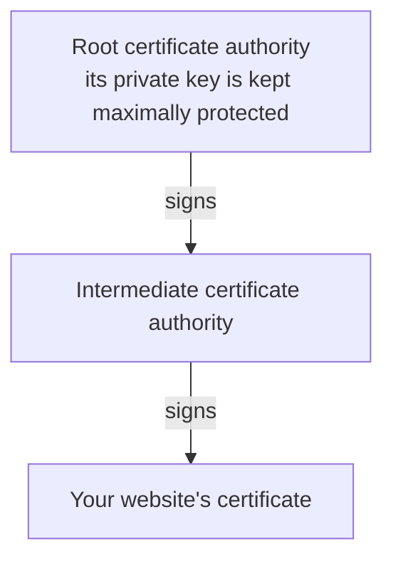
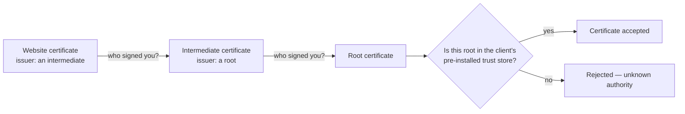

The scheme from the previous note works only if the client receives the server's real public key. This note is about the fact that, as described, it has no way to tell — and about the machinery that exists solely to fix that.

## The substitution attack

The server sends its public key. The client uses it to encrypt the secret key. That message crosses a network with an attacker on it, and the attacker's options are not limited to reading.

Suppose the attacker has generated their own key pair — a hacker public key and a hacker private key, exactly as anyone can. When the server's public key travels past, they intercept it and **swap it for their own**:



The client has no reason for suspicion. It received a public key, it was expecting a public key, and one public key looks like another.

So the client does what it was going to do: it encrypts the secret `ABC123` using the key it was given, and sends it. The attacker intercepts that too, decrypts it with their own private key — which works, because it was encrypted with their public key — and reads `ABC123`.



The server, receiving a message encrypted with a key that is not its own, cannot decrypt it and probably discards it. That is a separate malfunction and beside the point. **The attacker has the secret key.** Every symmetric message that follows is readable, and the encryption has been defeated at its foundation.

So the question is precise: **how does a server give a client its public key in a way the client can actually trust?**

## Why the obvious answers do not work

Several plausible fixes fail, and it is worth seeing why, because each one nearly works.

**Rotate the keys periodically.** Rotation limits how long a stolen key stays useful, which is genuinely valuable, but it does not help here. Rotation happens on some interval; the attacker got the key on the very first exchange and can read everything until the next rotation.

**Have the server acknowledge the exchange.** An acknowledgement proves nothing when the attacker sits between the parties. They can issue a perfectly convincing fake acknowledgement, having already impersonated the server in every other respect.

**Encrypt the public key.** With what? Any key used to protect it faces the identical problem one level down. This is the trap the whole subject circles: you cannot bootstrap trust with more encryption.

The answer has to come from somewhere outside the conversation.

## Proof of identity

The situation is familiar from ordinary life. Somebody rings your doorbell and says they are your brother. The voice sounds about right. Do you open the door?

Probably not on that alone. You ask for something that proves it, because anyone can make a claim, and the person making it has every incentive to make it convincingly.

The client is in exactly that position. A server says here is my public key, trust me, I am `bookcart.in`. The client is entitled to demand proof — and given that an attacker may have swapped the key in transit, it is obliged to.

The proof is a **digital certificate**.

## What is in a certificate

The server does not send a bare public key. It sends a document that contains it, along with several other fields:

| Field | Contents |
|---|---|
| **Domain name** | `bookcart.in` — who this certificate is for |
| **Public key** | The server's public key |
| **Digital signature** | A value that proves the rest has not been altered |
| **Issuing authority** | Who issued and vouched for this certificate |
| **Issued on** | The date it was created |
| **Expires on** | The date it stops being valid |

You have seen one without opening it. The padlock beside a web address is exactly this: click it and a browser reports that the connection is secure and the certificate is valid, and it will show you the certificate itself — the domain it was issued to, the organisation, the issue and expiry dates, a hash string, and the public key. Any site served over HTTPS has one, and you can inspect it.

When the certificate arrives, the client immediately checks the straightforward things: does the domain name match the site being visited, and is the current date between the issue and expiry dates?

Those are necessary but nowhere near sufficient. An attacker can copy a certificate wholesale, or fabricate one with any domain name they like. Two further checks are what actually close the attack, and both need explaining.

## Check one — the digital signature

The signature exists so that changing anything in the certificate can be detected.

Here is how it is produced. Take the certificate's contents — domain name, public key, and the related information — and run them through a **hashing function**, producing a single value:

```
hash(domain name, public key, related info) → h
```

A hash is one-way: you cannot reconstruct the inputs from `h`. Then that hash is **signed** using a private key, and the result goes into the certificate as the digital signature:



> [!important] Signing is not encryption, and confusing the two makes the rest incomprehensible.
> Encrypting something hides it. Signing something does not hide it at all — the certificate's contents are perfectly readable to anyone. What signing produces is a value that is bound to those exact contents. Change any of them and the signature no longer matches, and anyone checking will get back not verified. It is a tamper-detector, not a lock.

When the client receives the certificate, it performs the corresponding check:

```
verify(signature, public key) → true or false
```

Internally this recomputes the hash from the certificate's contents and tests whether it agrees with what the signature encodes. Agreement means nothing was altered; disagreement means something was.

### What that catches

Return to the attack. The attacker intercepts the certificate and swaps in their own public key, leaving everything else alone.

The client runs `verify`. The signature was computed over the original public key; the certificate now carries a different one. The values do not agree, verification returns false, and the client concludes the certificate has been tampered with and refuses to establish the connection.

### What it does not catch

Now suppose the attacker is more thorough. Rather than editing one field, they build an entire certificate of their own: their public key, the domain name `bookcart.in`, plausible dates, and a signature they computed themselves using their own private key.

Every field is internally consistent, because they made all of them. The client runs `verify` and it **passes** — the signature genuinely does match these contents.

The signature check alone is therefore not enough. It proves the certificate has not been altered since it was signed. It says nothing about **who signed it**, and a self-made certificate is unaltered too.

## Check two — the certificate authority

Which is why certificates are not self-issued. They are issued by a **certificate authority**, or **CA**: an organisation whose business is verifying that you control a domain and then issuing a signed certificate saying so.

Well-known ones include **Let's Encrypt**, **DigiCert** and **GlobalSign**, and the large cloud providers run their own — a certificate for a site hosted on AWS is commonly issued by Amazon's authority.

### How a CA verifies you

The verification is a possession test, and it has to be, because a claim is worthless on its own. If you could get a certificate simply by asking, an attacker would request one for someone else's domain and the whole structure would collapse.

So the CA sets a challenge that only the domain's actual owner can complete. Typically: publish a specific value at a specific URL on the server that domain resolves to. Only somebody who controls the domain and its server can make that value appear there.



Request a certificate for a domain you do not own and you simply cannot complete the challenge — you have no way to make anything appear on somebody else's server. The request fails.

### How the client checks the authority

Every browser and operating system ships with a built-in list of **root certificate authorities** it already trusts. That list arrives with the software; it is not fetched at the time of the check.

So when a certificate arrives naming its issuer, the client asks whether that issuer traces back to one of the authorities it already knows about.

> [!important] The client verifies locally. It does not contact the certificate authority to ask.
> This is worth being explicit about, because the natural assumption is that the browser phones the CA and asks whether a certificate is genuine. It does not. It already holds the root authorities' details, and it checks the certificate against what it has. No network call, nobody to impersonate in the middle of it.

### Certificate chaining

One complication makes this more robust rather than less. A root authority does not usually sign website certificates directly. Instead:



The root signs **intermediate** authorities, and intermediates sign the certificates that actually go on websites. The chain can run deeper than two levels.

The reason is protection of the root's private key. That key underwrites trust for an enormous number of certificates, and if it were used routinely — for every website certificate issued — it would be exposed constantly. Keeping it offline and using it only to sign a small number of intermediates limits its exposure enormously.

For the client this means walking the chain. Your certificate names an intermediate as its issuer. Who signed that intermediate? Another authority. Who signed that one? Keep going up until you reach a root, then check whether that root is in the list the browser or operating system already holds.



### What this catches

Back to the thorough attacker, who forged an entire certificate with a valid self-made signature.

The client walks the chain and asks who issued it. The answer is the attacker themselves — because no real authority would issue them a certificate for a domain they cannot prove they own. Their name is not in the trust store, the chain leads nowhere recognised, and the certificate is rejected.

They cannot get a real one either. A CA would put them through the ownership challenge for `bookcart.in`, and they would fail it, so no genuine authority ever signs anything of theirs.

> [!important] The two checks are complementary, and neither alone is sufficient.
> The signature check catches an attacker who modifies a genuine certificate. The authority check catches an attacker who fabricates a whole one. An attacker would have to defeat both — produce a certificate that verifies **and** trace to a root the client already trusts — and the second is not something they can obtain by any amount of cleverness in the middle of a connection. It requires an authority to have vouched for them, which requires proving ownership of a domain that is not theirs.

## What has been established

At the end of all this, a client that has received and validated a certificate knows something it could not know before: the public key it is holding genuinely belongs to the server it meant to reach.

Which is precisely the missing precondition. The key exchange from the previous note can now proceed safely, because the key it starts from can be trusted. What remains is the exact order in which all of this happens on a real connection.

*Source: class 8 — 2 September 2026.*
