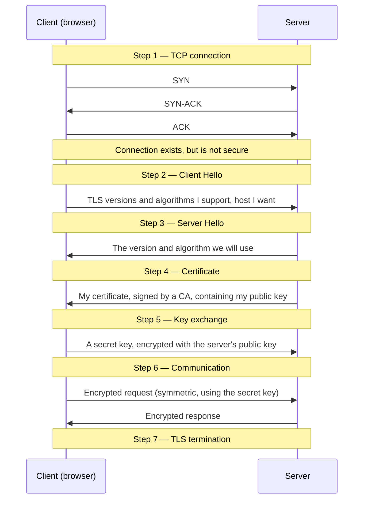
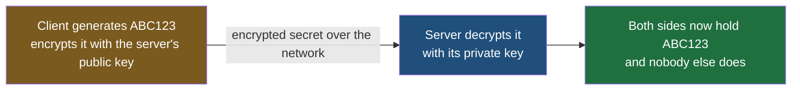
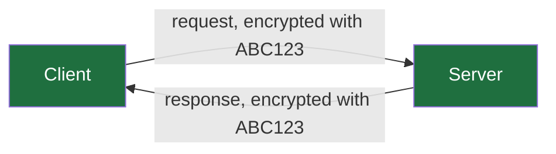

Three notes have built up the pieces separately: two kinds of encryption and why both are needed, and certificates as the way a client comes to trust a public key. This note puts them in order, as they occur when a browser opens a secure connection.

## The sequence

Seven steps, from typing an address to exchanging real data.



Each step is worth taking on its own.

## Step 1 — the TCP connection

Before anything security-related happens, the two machines establish an ordinary TCP connection.

The browser visits `bookcart.in`. Behind that, the machinery from the earlier notes runs: DNS resolves the name to an address, and the browser aims at that address. TCP is a connection-oriented protocol, so it performs its three-way handshake — the client sends a packet, the server acknowledges it, the client acknowledges that.

> [!warning] At the end of step 1 there is a connection, and it is not secure.
> This is the point people skip past. Both sides can now send each other messages, and any of those messages can be read by anyone in the path. Nothing has been encrypted, no keys exist, and no identity has been established. All that has been agreed is that the two machines can talk. Everything that follows happens over this open, readable connection — which is why the design has to survive being watched.

## Step 2 — Client Hello

The client sends the first TLS message, called **Client Hello**. It is the browser describing itself.

What it contains:

| Field | Example | Why |
|---|---|---|
| Supported TLS versions | TLS 1.2, TLS 1.3 | Versions differ; both ends must use one they share |
| Supported encryption algorithms | a list of several | Browsers differ in what they implement |
| Expected host name | `bookcart.in` | Which site is being asked for |

The algorithm list matters because there is no single universal choice. Different browsers support somewhat different sets, so the client offers what it has and lets the server pick.

## Step 3 — Server Hello

The server replies with **Server Hello**, which is a selection rather than a description. Given the client's list, the server chooses:

- the **TLS version** the connection will use, the highest one both ends support
- the **encryption algorithm** it will use, picked from the ones the client offered

In practice these lists overlap heavily. Browsers do not offer exotic algorithms nobody else implements, so the negotiation almost always finds a match immediately.

At the end of steps 2 and 3, both parties have agreed **how** they are going to talk. They still have no way to do it privately.

## Step 4 — the server sends its certificate

The server sends its **certificate**, digitally signed by a certificate authority.

This is where the previous note's machinery runs. The certificate carries the domain name, the issuing authority, the validity dates, the digital signature — and, crucially, **the server's public key**. The public key is not sent separately; it is a field inside the document whose whole purpose is to make that key trustworthy.

The client verifies it: domain matches, dates are current, signature verifies, and the issuing authority chains to a root it already trusts. If any check fails, the connection stops here.

If they all pass, the client is holding a public key it has grounds to believe belongs to the real server.

## Step 5 — the key exchange

This step is the one to read most carefully, because the version of it described here is the classic one and it is no longer how a modern connection works. Take it as written first; the section after it says exactly what replaced it and why.

The client now generates a **random secret key** — the browser does this itself, and it is the symmetric key both sides will use from here on. Call it `ABC123`.

It cannot be sent as it stands. So the client encrypts it with the server's public key, which it obtained in step 4 and validated:

```
encrypt(ABC123, server's public key) → encrypted secret
```

and sends that.

The server decrypts it with its private key, which nobody else holds:

```
decrypt(encrypted secret, server's private key) → ABC123
```



Both ends hold the same secret. Nobody in the middle does — the only thing that crossed the network was the encrypted form, and undoing it requires a private key held on one machine.

## Step 6 — communication

With a shared secret in place, the parties switch to symmetric encryption for everything.



Every request the client sends is encrypted with `ABC123`; the server decrypts it with `ABC123`. Every response is encrypted the same way and decrypted at the client. This is the fast technique, doing the work it is good at, on every message for the rest of the session.

An attacker watching this sees encrypted traffic in both directions and holds nothing that opens it. Two facts stand behind that: the secret was transferred encrypted with the server's public key, and the client knew that key was really the server's because a certificate authority vouched for it.

## Step 7 — TLS termination

Once the exchange is complete, the process is described as **TLS termination** — the handshake is finished and the secure channel exists.

The word is worth noticing, because it names a place as much as a moment. Termination is where encrypted traffic stops being encrypted and becomes ordinary traffic that an application can read, and something has to do that decrypting. That component turns out to be one you already know, and it is the subject of a later note.

## Where the design is still fragile

The handshake as described works, and it is a genuine improvement on everything that preceded it. It also has a weakness, and it is in step 5.

The secret key is protected by the server's private key and nothing else. Suppose that private key is compromised at some point — leaked, stolen, or extracted from a machine somebody got access to. An attacker who has been recording encrypted traffic can now go back over all of it, decrypt each session's key exchange, recover every `ABC123`, and read everything.

The whole conversation's secrecy rests on one long-lived key remaining secret forever. That is a great deal of weight on one thing.

> [!note] Keys are per session, not per request.
> A new secret key is not generated for every request. It is generated when a **session** is created, and it serves that session's traffic. When the session ends, the next one starts over: a fresh secret, and fresh key material behind it. This limits the damage if a key is ever compromised, since it only covers the session it belonged to — but it does not address the problem above, where the long-lived private key is what fails.

## What a current connection actually does

The weakness above was not tolerated. It was designed out, and the design that removed it is the one running on the connections you make today.

> [!important] Step 5 as described is the key transport method, and TLS 1.3 removed it outright.
> Sending the secret encrypted under the server's public key is how TLS worked up to and including **TLS 1.2**. **TLS 1.3 deleted it**, along with every other key exchange that lacks the property described below. A connection negotiated as TLS 1.3 never performs step 5 in the form above — there is no client-chosen secret travelling under the server's public key, because the specification does not permit one. The seven steps are still worth holding, because every other step survives unchanged and the failure they lead to is what motivates the replacement. But do not carry away the belief that this is what your browser did this morning.

The property being protected has a name: **forward secrecy**. A connection has forward secrecy if compromising the server's long-term private key later does not expose traffic recorded earlier. Key transport fails that test completely, which is the whole content of the previous section. Every key exchange TLS 1.3 allows passes it.

What replaces step 5 is a mechanism where **neither side sends the secret at all** — both compute it independently from messages that are safe to send in the clear. That is the subject of the next note, and it is the last piece of this subject.

### What the real sequence looks like

![[Devops/04-Networking/Images/tls13-handshake-timeline.png]]

Two things in that picture are worth reading off deliberately, because both differ from the seven steps above.

**The key exchange starts in the very first message.** The client's opening message carries a key share alongside the version and algorithm list, and the server's reply carries its own key share back. There is no separate later step in which a secret is transported, which is why no such step appears.

**The whole of TLS costs one round trip.** The timings in the diagram are an illustration rather than a measurement, but the shape is real: the TCP handshake completes, then a single exchange of messages in each direction completes TLS, and application data follows immediately. The earlier design needed an extra round trip to carry the secret, so removing key transport made connections both safer and faster.

> [!tip] The certificate step did not go anywhere.
> Notice that the server's reply in the diagram still contains **Certificate**. Everything the previous note established about proving identity is unchanged and still mandatory. What changed is only how the two sides arrive at a shared secret — not how the client satisfies itself about who it is sharing that secret with.
