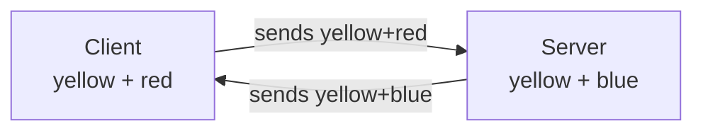
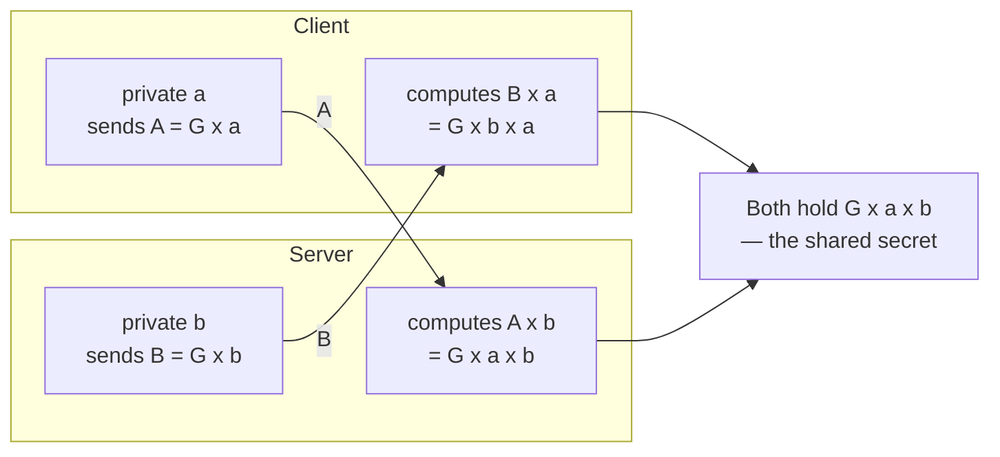
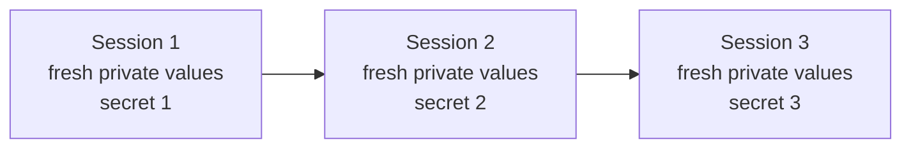

The handshake in the previous note ends on a weakness: the secret key is sent across the network, wrapped in the server's public key, so anyone who ever obtains the server's private key can unwrap every secret that was ever sent. This note is about the technique that removes that dependency entirely, by not sending the secret at all.

## The idea

Restate the problem exactly. Two parties who have never met need to end up holding the same secret value, over a network where everything they send is observed.

Every approach so far has treated that as a transport question — how do I get my secret to you safely. The alternative is to stop transporting it. **Both sides derive the same secret independently**, from an exchange in which the secret itself is never sent.

That sounds impossible until you see it done with colours.

## The colour version

Take a colour that everybody knows, including any attacker. Call it the public colour: **yellow**.

Each side then picks a colour it tells nobody:

| | Public colour | Private colour |
|---|---|---|
| Client | yellow | **red** |
| Server | yellow | **blue** |

Each side mixes its private colour into the public one, and sends the mixture across:

Now each side adds its own private colour to what it received:

- The **server** received yellow+red, and adds its blue → **yellow + red + blue**
- The **client** received yellow+blue, and adds its red → **yellow + red + blue**

Both have arrived at the same mixture. Neither sent it.

### What the attacker has

An attacker watching the whole exchange has seen three things: **yellow**, **yellow+red**, and **yellow+blue**. Every message, complete and unencrypted.

And they are stuck, because paint does not come apart. Given yellow+red you cannot extract the red; given yellow+blue you cannot extract the blue. Without isolating either private colour, they cannot construct yellow+red+blue.

The best they can do is combine the two mixtures they saw — which gives them yellow twice over plus red plus blue, a different result from the one both legitimate parties reached. Close, and useless.

> [!important] Notice what did not happen: no asymmetric encryption, and no secret in transit.
> Nothing was encrypted at any point in that exchange. The messages were sent in the clear and the attacker read all of them. The secret is safe not because it was hidden but because it was **never sent** — it only ever existed as something each side computed for itself.

## The same thing with numbers

The colours are an analogy for real arithmetic, and the structure maps across exactly.

Start with a public value **G**, known to everyone including the attacker — the equivalent of yellow.

Each side picks a private value:

| | Public | Private | Computes and sends |
|---|---|---|---|
| Client | G | **a** | **A** = G × a |
| Server | G | **b** | **B** = G × b |

They exchange **A** and **B**. Then each combines what it received with its own private value:

- The **client** received B, and computes B × a = G × b × a
- The **server** received A, and computes A × b = G × a × b

`G × b × a` and `G × a × b` are the same value. Both sides hold it, and it never crossed the network.

The attacker saw **G**, **A** and **B**. They know A is G combined with some private value, and B likewise. To build G × a × b they need `a` or `b` individually, and neither was ever sent.

> [!important] The whole thing rests on the operation being one-way.
> Written as ordinary multiplication, the attacker simply divides A by G and recovers `a`, and the scheme collapses. Real implementations do not use multiplication. They use an operation where going forward is easy and going backward is computationally infeasible — you can combine G with `a`, but you cannot start from the result and work out what `a` was. Everything depends on that asymmetry, and `a` and `b` are very large numbers rather than the small symbols used here for legibility.

## What is actually used

The real operation comes from **elliptic curve** geometry, and the algorithm is **ECDHE** — Elliptic Curve Diffie–Hellman Ephemeral. It is the modern choice and it is what TLS 1.3 uses.

Two parts of that name carry meaning worth separating:

- **Elliptic curve** is the mathematics that supplies the one-way operation. Combining a point with a private value is straightforward; recovering the private value from the result is not.
- **Ephemeral** means the key material is discarded after use rather than kept. New values every time.

The point of ephemeral is the failure the previous note ended on. If the client and server generate fresh private values for each session, then no long-lived key exists whose compromise would open past traffic. An attacker who obtains the server's private key today gains nothing retrospectively, because yesterday's session secret was never derived from it and was never transmitted in any form.

> [!info] The certificate is still needed. This does not replace it.
> Diffie–Hellman solves key agreement, and it solves it against an attacker who only watches. It does not tell the client **who** it is agreeing a key with — an attacker who intercepts and substitutes could still run the whole exchange while impersonating the server. Identity remains the certificate's job. The two mechanisms sit side by side in the handshake: the certificate establishes who the server is, and Diffie–Hellman establishes a shared secret with it.

## When new keys are generated

Not on every request — that would be far too expensive.

New key material is generated when a **session** is created. That session's traffic uses the secret derived at its start. When the session ends and a new one begins, the client generates a fresh private value, the server does the same, and the exchange runs again to produce a different shared secret.

So the keys rotate naturally, without any explicit rotation mechanism. If a session's secret is somehow compromised, the exposure is bounded by that session — the next one is derived from values that did not exist when the old secret was in use.

That is the property worth taking away. Earlier designs put the secrecy of every conversation on one key staying safe indefinitely. This one puts each conversation's secrecy on values that exist briefly and are then thrown away.

*Source: class 8 — 2 September 2026.*
