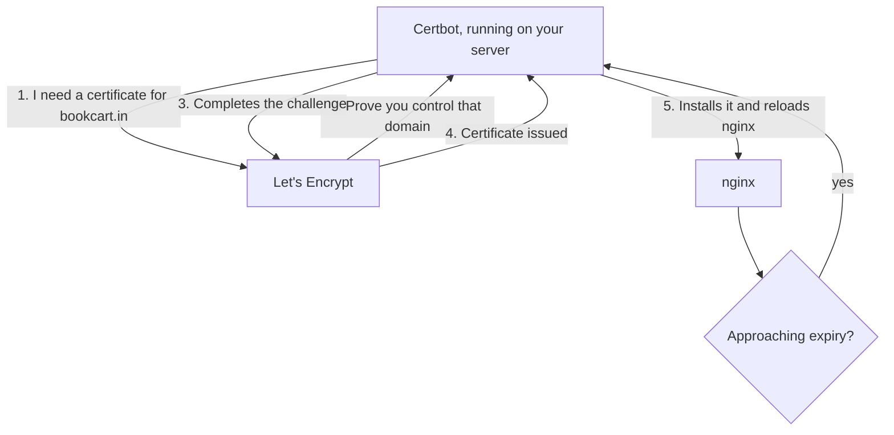
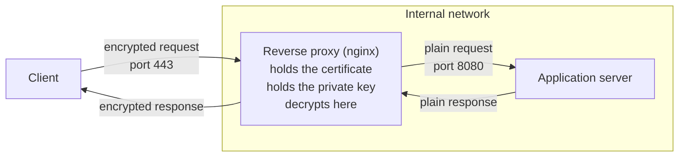

Everything about certificates so far has been mechanism — what one contains, how it is verified, where it sits in the handshake. This note is about owning one: how it gets onto your server in the first place, what stops it going stale, and which component in your architecture is actually holding it.

## The problem with expiry dates

A certificate has an expiry date, and that date is not far away.

When it passes, the certificate stops being valid. Browsers reject it, and visitors get a security warning instead of your site. Not a degraded experience — a wall, with most people turning back at it.

So somebody has to replace the certificate before it expires, every time, forever. Do that by hand and you have a recurring manual task whose failure mode is your site becoming unreachable, scheduled by a date you have to remember.

> [!important] Certificate lifetimes are short, and getting shorter.
> Certificates from Let's Encrypt are valid for **90 days**, and renewal is recommended at **60 days** — the gap exists so a failed renewal has time to be retried before anything breaks. There is also a six-day option for those who want it, renewed every three. Short lifetimes are deliberate: a compromised certificate stops being useful quickly. The practical consequence is that manual renewal is not a workable strategy. Four or more renewals a year, each one load-bearing, is exactly the kind of task that gets forgotten once.

Automating this is DevOps work, and it is one of the clearer cases where the job is not to do something but to make sure it does itself.

## The manual version

It helps to know what is being automated.

Set up a certificate by hand and you deal with files. A certificate arrives as a `.crt` file, and the private key that goes with it as a `.pem` file. You place them on the server, point your nginx configuration at them, and reload.

That works. It is entirely legitimate, and some deployments still do it. Everything below exists to remove it.

## The automated version

Three pieces, and it is worth being precise about which does what, because they get conflated.

| Piece | What it is |
|---|---|
| **Let's Encrypt** | A certificate authority. It issues the certificates, and it is free. |
| **ACME** | The protocol for requesting and renewing certificates automatically. |
| **Certbot** | The client that runs on your server and speaks ACME to Let's Encrypt. |

**ACME** stands for **Automatic Certificate Management Environment**. It is not a product — it is the standardised conversation between an applicant and a certificate authority, covering verification, issuance and renewal, and it exists so that this whole exchange can happen without a human in it.

**Certbot** is the ACME client you will actually meet. It is the recommended one for Let's Encrypt, and it is what gets installed and configured alongside nginx.

### What happens when it runs

The exchange is the same ownership test from the certificates note, with the human removed. Certbot asks for a certificate. Let's Encrypt replies that it must first prove control of the domain. Certbot completes the challenge — it is running on the very server the domain resolves to, so it is in a position to. Let's Encrypt verifies, issues the certificate, and Certbot installs it.

Then it does the same again before expiry, on its own, indefinitely. Nothing needs to be remembered and nothing needs to be scheduled by a person.

> [!info] The private key never leaves your server.
> When a certificate is issued, the key pair belongs to you. The certificate authority signs your public key and vouches for it; it does not hold your private key and cannot. Think of it the way you would an environment variable holding a credential — it lives on the machine that needs it, ownership sits with you alone, and nothing about the issuing process gives anyone else a copy.

Certbot's configuration goes alongside nginx's, which is a hint about where certificates actually live.

## Where TLS actually terminates

Here is the part that ties this folder together, and it recasts a component you met early on.

The **reverse proxy** is where the certificate sits and where encryption is undone.

Trace what that means. An encrypted request arrives from the internet. The reverse proxy holds the private key, so it is the thing that can decrypt it. It decrypts, then forwards the plain request inward to the application — which never deals with encryption at all, and does not need a certificate, a key, or any awareness that TLS exists.

This is **TLS termination**, and now the word makes sense as a location: the reverse proxy is where the encrypted connection ends.

> [!important] The reverse proxy's job is considerably larger than rewriting ports.
> It was introduced as an addressing fix — receive on 443, forward to 8080. That is true and it is the smaller half. The reverse proxy is also responsible for **certificate management**, for **holding the private key**, and for **TLS termination**. It is the security boundary of the whole deployment, which is why the certificate automation is configured there and not on the application servers.

One clean consequence: the application behind it stays simple. It listens on a plain port, speaks plain HTTP, and knows nothing about certificates or expiry. Add a second application, or ten, and none of them acquires any of this. The encryption is handled once, at the edge, by the component that was already sitting there.

## The shape of the whole thing

Put every note in this folder end to end and one request's journey reads like this.

A name is typed. DNS resolves it through browser cache, resolver and hierarchy to an address — the address of a load balancer or a reverse proxy, never of an application server. TCP establishes a connection. TLS negotiates a version and an algorithm, the server proves its identity with a certificate signed by an authority the client already trusts, and both sides derive a shared secret neither transmitted. The reverse proxy decrypts what arrives, rewrites the port, and hands it inward. A gateway may route it by path to the right service, and a load balancer picks which replica of that service answers. The application, at the end of all of it, receives a plain HTTP request on port 8080 and has no idea any of the rest happened.

Every layer in that chain exists because a simpler arrangement broke on a harder case. That is the only reason any of them are there.

*Source: class 8 — 2 September 2026.*
