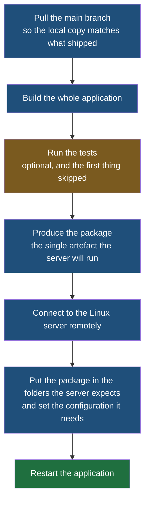
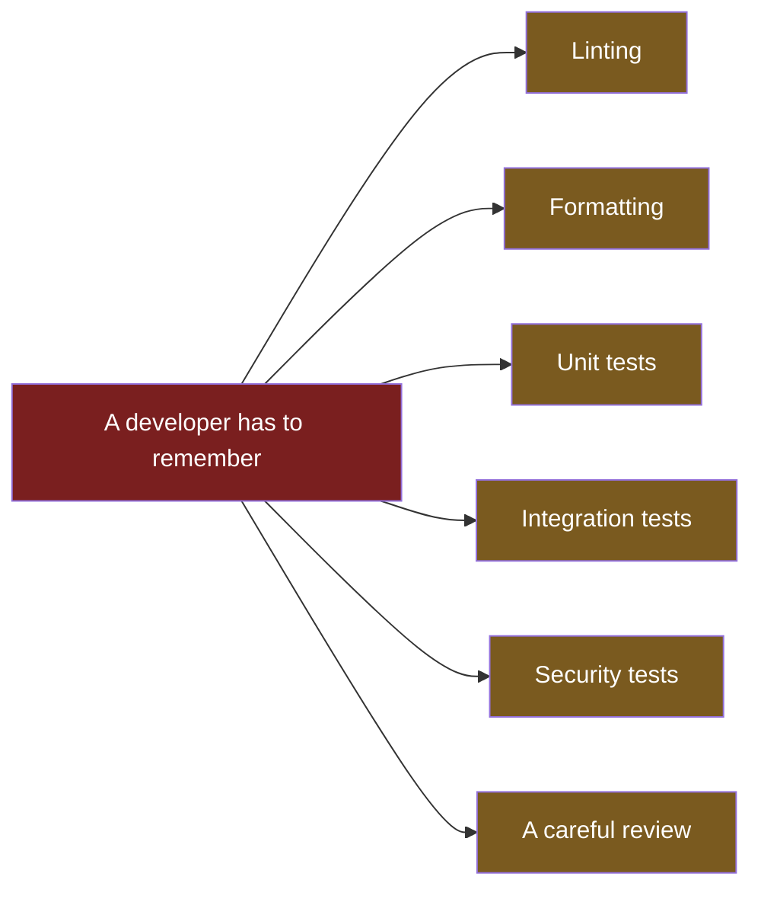
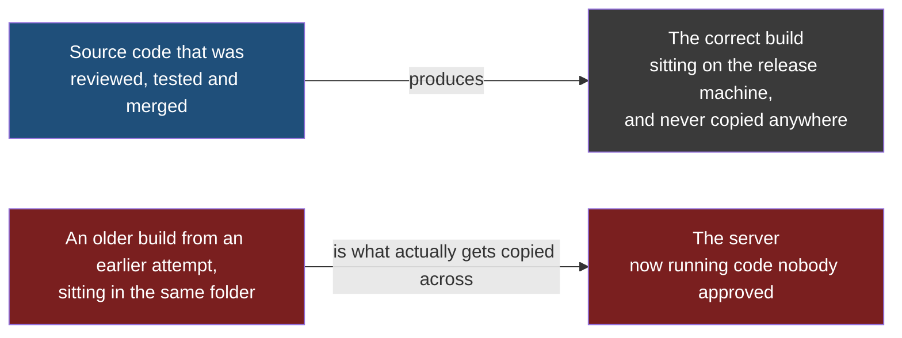

Writing an application is not the same as having one that people can use. The code sits on your laptop; the users are somewhere else entirely, pointing a browser at a machine you do not own and have never touched. Between those two facts is a sequence of steps that a developer has to carry out, and for most of the history of software that developer was following a checklist by hand.

This note is about what that developer actually did, and about every way the arrangement fails. Everything that comes later in this folder exists to replace it, so it is worth seeing properly rather than being told in one line that it was slow.

The running example throughout is an online bookshop, `bookcart.in`, built as a Spring Boot application in Java and running on a Linux server that the team rents. Nothing in this note depends on it being a bookshop, or on Spring Boot — it is a concrete thing to point at so that the steps are steps rather than abstractions.

One word is needed before anything else. **Production is the real one** — the machine, or set of machines, that actual customers reach when they type `bookcart.in` into a browser. Teams run other copies of the same system for other purposes, and those copies can be broken without anybody outside the team noticing. Production is the copy where that is not true, and every rule in this folder exists because of the difference.

## What has to happen between writing code and a user seeing it

Suppose you have added a reviews section to the bookshop. The code works on your machine. For a customer to see it, four things must be true, in order:

| | What has to happen | Why it is not automatic |
|---|---|---|
| 1 | Your work has to join everybody else's work | You wrote it on your own copy of the code; the version that runs in production is a different copy |
| 2 | A developer has to be confident it is safe to ship | Your code now sits next to code written by developers you never spoke to |
| 3 | The source code has to be turned into whatever the server actually runs | A server does not run a folder of source files |
| 4 | That result has to be placed on the server and started | The machine is somewhere else and has no idea you exist |

Each of those is a job. In the arrangement described here, each of them is a job a developer does by hand.

## The flow as it used to be

A developer works on a **branch** — their own line of development, a private copy of the code where their changes can accumulate without disturbing any other developer. The branch carrying the reviews work is a **feature branch**, named for the fact that it holds one feature.

When the feature is finished, it has to be merged into the **main branch**, the single line of code that everyone agrees is the real one and that production is built from.

```mermaid
flowchart LR
    DEV["Developer writes<br/>the reviews feature"] --> FB["Feature branch<br/>their own copy"]
    FB --> PUSH["Push, and ask for<br/>the work to be merged"]
    PUSH --> CHK["Checks<br/>carried out by developers"]
    CHK --> MAIN["Main branch<br/>the version that ships"]
    MAIN --> REL["Release<br/>carried out by a developer"]
    REL --> SRV["The server<br/>customers reach this"]
    style DEV fill:#2d333b,color:#fff
    style FB fill:#1f4f7a,color:#fff
    style PUSH fill:#1f4f7a,color:#fff
    style CHK fill:#7a5a1f,color:#fff
    style MAIN fill:#1f4f7a,color:#fff
    style REL fill:#7a5a1f,color:#fff
    style SRV fill:#1f6f3f,color:#fff
```

The two amber boxes are the ones this note is about. Everything else in that diagram is a developer doing their own job on their own machine. Those two are where a developer has to remember something.

Between the feature branch and the main branch there is often an intermediate stop. A team may keep a **staging environment** — a second, complete copy of the whole system, running on its own machines, that exists so that changes can be exercised somewhere realistic before customers see them. A team may also keep an **integration branch**, a shared branch where several developers' finished work is combined and tested together before any of it reaches main. Neither changes the shape of the problem; they add places where the same manual checks happen.

## The checks that are meant to happen first

Before a merge is allowed, a list of things is supposed to be true. Each one has a name, and each one is a separate activity.

1. **Linting** is an automatic check of the code's style and safety rather than its behaviour. A linter reads the source without running it and reports things that are legal but unwanted — a variable that is declared and never used, a comparison that is always true, a function that is far longer than the team allows. It answers the question of whether the code is written the way this team writes code.

That last part is not decoration. Teams adopt written conventions and then enforce them, and the conventions can be very specific: one team's policy was that every variable name had to follow a fixed pattern, and code that did not follow it was not accepted no matter what it did. A linter is how a rule like that stops being a matter of whichever developer is reviewing today.

2. **Formatting** is the narrower cousin — indentation, spacing, line breaks, where the braces go. It changes nothing about what the code does and **everything about whether a change is readable**, because a file that has been reformatted shows up as hundreds of altered lines that hide the four that matter.

3. **Unit testing** checks one piece of code on its own. You wrote a function that calculates the average rating of a book; a unit test calls that function with known input and checks the answer.

4. **Integration testing** checks that the piece works once it is part of the whole. This is a genuinely different question, and the reason it is different is the entire point of the exercise: your reviews code passed its own tests in isolation, but the moment it is merged, it shares the application with the catalogue, the profile page and everything else. The application has to be exercised as one thing, because the failure you are looking for is the one that only appears when the parts are joined.

5. **Security testing** looks for the class of problem that is not a bug in the ordinary sense — **a dependency with a known vulnerability**, a secret committed by accident, an input that is passed somewhere it should not be.

6. **Code review** is another developer reading the change and saying yes. It is the only one of these that cannot be automated, and it is the one that degrades quietest, because a review that was not done carefully looks exactly like one that was.

> [!note] Tests are written by the developer, alongside the feature.
> Writing the login feature means writing the test cases that cover the login feature. The tests are not a separate artefact produced later by somebody else — they arrive with the code they describe, which is why a team that skips them at the moment of writing never gets them at all.

## Doing the release by hand

Say all the checks passed and the work is merged. A developer now has to put it on the server. In this arrangement, that is a developer at a keyboard, working through these steps in order:

**Build** here means turning the source code into the form the server actually runs, and **package** means collecting that result into the one file that gets shipped. The two words are used loosely and differently by different languages, and the distinction between them — along with the difference between deploying and releasing — is the subject of its own note later in this folder. For now they are steps in a list.

Two details about the last three boxes are worth holding on to, because they are what makes this a chore rather than a click. **The server is a remote machine, so reaching it means connecting to it over the network and working on it as if you were sitting at it.** And the application needs more than its own code to run — it needs configuration, the settings that differ between your laptop and the real machine, which a developer has to put in place correctly by hand.

And then a developer has to check that it worked, which is also done by hand. The server has an address, so the first check is to point a browser at that address and see whether the bookshop loads. The second is to exercise the parts a browser cannot easily reach — a request that creates something, or one that needs particular data attached — and the usual tool for that is Postman, an application for composing HTTP requests by hand and reading what comes back. You call the endpoint you just changed, look at the response, and decide from it whether the deployment did what you wanted.

> [!question] Why is running the tests marked as optional?
> Because in practice it is. Nothing in a manual process forces a step to happen; the sequence exists in a developer's head or in a document, and a step that takes four minutes when you are in a hurry is a step that gets skipped. That is not a character flaw, it is what optional means, and it is exactly the property that automation removes.

## Where it breaks

Look back at that list of checks and notice what every single one of them has in common: it happens because a developer remembered to make it happen.

So the failures are ordinary and none of them require any developer to be careless:

- The naming policy is not followed, because the developer writing the code had not read the policy.
- Formatting is forgotten, and a small change arrives as an unreadable diff.
- Linting is not run at all, because running it is a separate command that nothing insists on.
- Quality assurance tests the feature locally, it passes, and **integration testing is skipped** — so the one failure mode that only appears when the code joins the application is the one no developer looked for.
- Security testing is skipped, for the same reason as everything else on this list.
- The review happens, but quickly, and the reviewer approves a change they did not really read.

Each of these is individually forgivable and individually small. The trouble is what they have in common: there is no point in the process where the answer to did any developer actually check is anything other than a developer's memory.

## The failure that actually hurts

The checks are the frequent problem. The release step contains a rarer and much worse one.

The developer deploying has to build the application and then move the result to the server. Nothing about that sequence verifies that the thing arriving is the thing intended. A build made from a stale copy of the code, a package left over from an earlier attempt, a file copied from the wrong folder — any of these produces a plausible-looking artefact that gets deployed successfully and runs.

> [!warning] The wrong build deploys cleanly. That is what makes it dangerous.
> Nothing errors. The upload succeeds, the application starts, the server answers requests. Code is now running in front of customers that nobody reviewed, nobody tested and nobody chose — and the only signal that anything is wrong is behaviour that does not match what the team believes is deployed. Debugging in that state is brutal, because every developer looking at the problem is reading the source code of a version that is not the one running.

## Multiply it by the size of the team

Everything above is the story of one developer shipping one feature. Now count.

A team of twenty developers, each merging work regularly, is twenty developers each of whom can forget the linter, skip the integration tests, approve a review without reading it, or deploy a stale build. These are not rare events being made rarer; they are ordinary events being made more numerous. The probability that some change this week skipped some check approaches certainty, and because nothing recorded which check was skipped, nobody knows which one.

> [!important] The problem is not that any single step is hard. It is that every step is optional.
> Each individual task here — running a linter, running tests, building, copying a file to a server — is easy and takes minutes. What fails is the guarantee. There is no point at which the process can state that this code was linted, these tests ran and passed, and this exact artefact is what is running in production. Every one of those is a belief rather than a fact, and beliefs are what the rest of this folder is about replacing.
