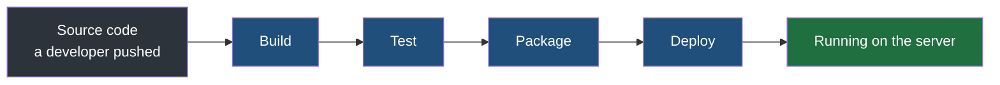
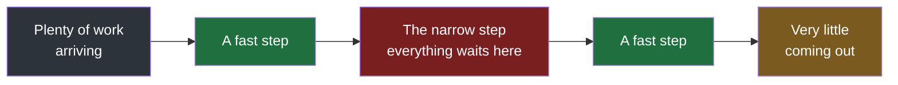

Every failure in the previous note came from the same place: a step that a developer had to remember. The checks were optional because nothing enforced them, and the release was risky because nothing verified that the artefact being copied was the artefact that had been approved. The fix is not to try harder. The fix is to take the entire sequence away from developers and give it to a machine.

That is what CI/CD is, and this note is about the shape of it — what the letters stand for, what changes about the flow, and what the thing running the flow is called.

## What the letters mean

**CI** is **continuous integration**.

**CD** is **continuous delivery**, or **continuous deployment**.

That is not a typo, and it is where most of the confusion about this subject starts: **CD has two expansions, and they are two different things.** Developers say the phrase CI/CD constantly without settling which of the two they mean, and the difference between them comes down to whether a person has to agree before a change goes live. Both halves of the abbreviation get taken apart properly later in this folder — continuous integration first, then delivery against deployment.

> [!note] The two halves answer two different questions.
> The CI half is about code joining other code — how often, and with what checked automatically at the moment it happens. The CD half is about what happens to code that has already been integrated — how it gets from a passing build to a machine that customers are pointing at. They are routinely spoken about as one word, which hides the fact that a team can be good at one and hopeless at the other.

## The inversion

Here is the entire change, stated in one sentence: **the developer pushes, and everything else starts by itself.**

```mermaid
flowchart TD
    subgraph BEFORE["Before"]
        D1["Developer pushes"] --> H1["A developer remembers to lint"]
        H1 --> H2["A developer remembers to test"]
        H2 --> H3["A developer builds and packages"]
        H3 --> H4["A developer copies it to the server"]
    end
    subgraph AFTER["After"]
        D2["Developer pushes"] --> A1["Automation engine starts,<br/>because a push happened"]
        A1 --> A2["Builds the project"]
        A2 --> A3["Runs the tests"]
        A3 --> A4["Produces the package"]
        A4 --> A5["Deploys it"]
    end
    style D1 fill:#2d333b,color:#fff
    style H1 fill:#7a1f1f,color:#fff
    style H2 fill:#7a1f1f,color:#fff
    style H3 fill:#7a1f1f,color:#fff
    style H4 fill:#7a1f1f,color:#fff
    style D2 fill:#2d333b,color:#fff
    style A1 fill:#1f4f7a,color:#fff
    style A2 fill:#1f4f7a,color:#fff
    style A3 fill:#1f4f7a,color:#fff
    style A4 fill:#1f4f7a,color:#fff
    style A5 fill:#1f6f3f,color:#fff
```

The developer's job ends at the push. No developer logs into a server, no developer runs a build on their laptop, and nobody has to remember anything. An **automation engine** — a program whose whole purpose is to watch for that push and then carry out a defined sequence of work — picks it up and does the rest.

**Push here is the broader event, not only the literal command.** In most teams the thing that starts the sequence is opening a pull request, which is the formal request to have a branch's work merged into another branch. Whether the trigger is a direct push to a branch or a pull request being opened, the principle is identical: a developer does the one action they were going to do anyway, and the machinery reacts to it.

The automation engine runs the same steps a developer used to, and what each of those four words precisely means is the subject of the next note. What matters here is what each one replaces:

| Step | Who used to do it |
|---|---|
| Build | The developer, on their own laptop |
| Test | A developer remembering, or not |
| Package | A developer assembling a file by hand, sometimes the wrong one |
| Deploy | A developer connecting to the server and copying it across |

> [!important] Automation does not make the steps better. It makes them unskippable.
> Every one of those four steps existed before. A linter ran or it did not; tests passed or nobody ran them. What changes is that the sequence is now written down in a form a machine executes, so the answer to did the tests run is no longer a developer's memory — it either ran or the sequence stopped. The guarantee is the product, not the speed.

## What a pipeline is

The sequence itself has a name.

> [!important] A pipeline is a predefined sequence of steps that takes source code to the deployment stage.
> Predefined is the load-bearing word. The steps are decided in advance and written down, so every change that comes through goes through the same steps in the same order — not the steps whichever developer was on duty happened to think of.

When those steps are the build-test-package-deploy sequence above, it is a **CI/CD pipeline**.

The word pipeline is chosen deliberately, and the metaphor is worth taking seriously because the next idea depends on it: things flow through a pipe in one direction, at a rate, and the pipe can be obstructed.

## Bottlenecks

Picture an ordinary bottle. The body is wide and holds a lot; the neck at the top is narrow. **Whatever the bottle contains, the rate at which anything leaves is decided by the neck, not by the body.** You can make the bottle twice as large and pour no faster.

A **bottleneck** is that narrow step: the one point in a sequence that limits the whole sequence, regardless of how fast everything else is. When a pipeline has one, the pipeline is said to be **choked** — work piles up in front of the slow step and everything behind it waits, and the fact that every other stage is fast buys you nothing at all.

> [!tip] The bottleneck is why optimising the wrong step feels like doing nothing.
> If the test stage takes twenty minutes and everything else takes one, then making the build twice as fast changes the total by half a minute. The only work that changes the outcome is work on the narrow step — which means the first job is always finding out which step that is, rather than improving whichever step is easiest to improve.

**Keeping the pipeline from choking is the DevOps engineer's responsibility.** That is worth saying plainly, because it is easy to read this subject as being about setting a pipeline up once. Setting it up is the small part. The pipeline is a thing that every developer on the team waits behind several times a day, and keeping it fast and unblocked is ongoing work that belongs to somebody specific.
