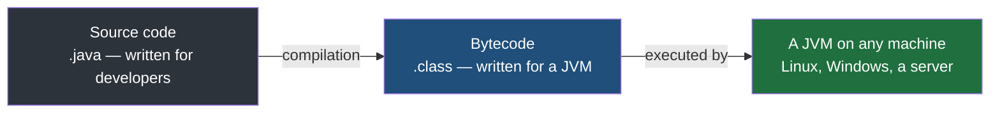

The pipeline in the previous note had four stages — build, test, package, deploy — and they were used as step names without ever being pinned down. Two of them get confused constantly, including by developers who have been shipping software for years, so this note pins all of them down. The confusion is not helped by the fact that different languages use the same words for slightly different things.

## Build

**To build is to turn source code into the form that actually runs.**

Source code is for developers. It is text, organised for a developer to read and edit. The thing a machine executes is not that, and **getting from one to the other is the build.**

The bookshop in this folder is a Spring Boot application, written in Java, and Java is the clearest place to learn this because **every stage of the build leaves a file behind that you can point at.** Nothing about it is abstract: compile, and a new file appears; package, and another one appears.

```
before                     after compiling            after packaging
──────                     ───────────────            ───────────────
Hello.java                 Hello.java                 Hello.java
                           Hello.class   ← new        Hello.class
                                                      app.jar      ← new
```

That listing is a single one-line class, small enough to see whole. The bookshop is the same thing with more files in it — every one of its source files compiled, and the lot packaged into one jar.

### What compilation produces

Java is a **platform-independent** language, and the mechanism behind that claim is what compilation does. Compiling a Java source file does not produce something your particular machine can run. It produces **bytecode** — an instruction set that no physical processor executes, stored in a file ending in `.class`.

That file will run on any machine at all, with one condition: the machine must have a **JVM**, a Java Virtual Machine, which is the program that reads bytecode and **executes it in terms the real processor understands.** Write once, and the same bytecode runs on Linux, on Windows, on a laptop and on a server, because each of them has its own JVM and the bytecode does not care which.

Compiling a single-line Java class produces a `.class` file of **402 bytes**, carrying a stamp recording which Java release compiled it. That is the whole output of compilation — the source has become something else, and **the something else is not yet a thing you can hand to a server.**



### Verification rides along with the build

A build tool does more than translate. Alongside compilation it runs **verification** — checks defined by the developer who set the project up, carried out by **plugins**, which are add-on components the build tool loads to do work it does not do itself.

What gets verified is the team's choice. A plugin can insist that a forbidden library is not being used anywhere, that the coding conventions are followed, that a dependency with a known vulnerability is not present. These are the same checks the previous notes described as things a developer had to remember, except here they are attached to the build itself. **A build that fails verification is a failed build**, and that is the point of putting them there — the check is no longer a separate action a developer chooses to take.

### Packaging

After compilation there is a further stage: **packaging**, which collects the compiled output into one file that can be moved around and run as a unit.

In Java that file is a **jar**. Packaging that 402-byte class produces a **729-byte** jar, and that jar can be executed directly — **you hand the one file to a machine with a JVM and the application starts.** This is what makes packaging worth a stage of its own: a folder of loose `.class` files is awkward to copy, easy to get half-right, and has nothing recording which class to start from. A jar is one file, and it is complete.

**Once the jar exists, the application is built.**


### Other languages use the words differently

Java is unusually explicit about all this, but the concept is not a Java concept. **In every language, built means the same thing: the code is ready to be deployed.** What differs from one ecosystem to the next is which steps that involves and which of them the word build gets attached to — some languages have no separate compile step at all, and translate the source only at the moment the program starts, leaving nothing on disk to point at.

> [!tip] The naming differs, the stages do not.
> Do not spend effort on whose vocabulary is correct. Every language has a step that turns the source into the runnable form, and a step that collects the result into something shippable. Which of those two the word build refers to is a local convention — and knowing that saves an argument, because two developers can be describing the identical process and disagreeing about nothing but a label.

## Deploy

**To deploy is to put the built artefact onto the server and start it.**

That is the boundary. Build ends with a file. **Deploy ends with that file running on a machine that is not yours, reachable over the network, answering requests.** Everything the manual release did — connecting to the server, putting the package where it belongs, setting the configuration, restarting — is deployment.

After a deployment, the code is on the server and ready for ordinary users to see.

## Release

**To release is for the change to reach your users.**

Ready for users and reaching users are not the same event, and the gap between them is where the third word lives. Code can be deployed to production and still not be released — sitting there, running, but switched off for everybody, or enabled for a small fraction of traffic while it is watched.

| Word | Ends with | The question it answers |
|---|---|---|
| Build | A file, on the build machine | Is the code in a runnable form, and did it pass its checks? |
| Deploy | That file running on the server | Is it on the machine customers point at? |
| Release | Users experiencing the change | Can people actually see it? |

> [!important] Deployment is a technical event. Release is a product decision.
> This is why the distinction survives being pedantic. Deploying is something a pipeline does, many times a day, on its own. Releasing is somebody deciding that this feature is now on for these people — a choice about the product, made by people who may not have been involved in the deployment at all. Collapsing the two words into one makes that decision invisible, and a decision nobody can see is a decision nobody is making deliberately.

> [!question] Do not get stuck on the vocabulary itself.
> The three words are worth knowing because teams use them to mean specific things and you need to follow the conversation. They are not worth arguing about. What matters is that there are three distinct events — the code becomes runnable, the runnable thing reaches a server, and the change reaches a person — and that they can happen at three different times.
