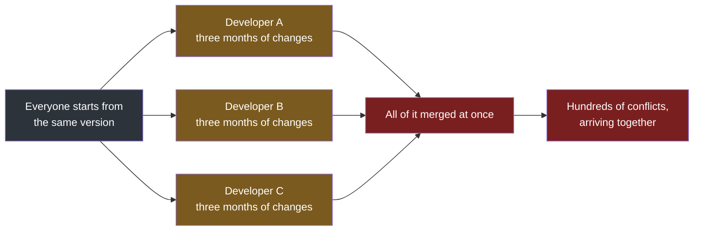
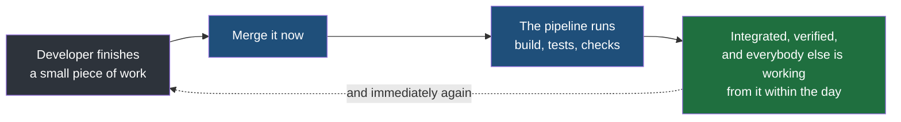

Build, deploy and release describe what happens to code once it is finished. This note goes back to the other half of the abbreviation, and to the step that comes before all of them: getting your work and everybody else's work into the same place. That is what the I in CI stands for, and the word in front of it — continuous — is doing more work than it looks.

## Integration is the act of joining your work to everyone else's

The previous notes described a developer working on a feature branch, their own copy of the code, and eventually merging it into the main branch, the single version everybody agrees is real. **To merge is to combine two branches into one**, taking the changes made on each and producing a single version containing both.

Some teams put a branch in between. A common arrangement keeps a long-lived **develop** branch that finished features are merged into first, with main reserved for what is actually in production. It is one more stop, and it changes nothing about what follows.

Merging is the moment of integration. Until it happens, your reviews feature and somebody else's payment feature are two pieces of work that have never met.

## The naive approach, and why it collapses

The obvious way to work is to stay on your own branch until your feature is done. You are not disturbed, nothing half-finished reaches anybody else, and you merge once at the end. On a small piece of work that is completely fine.

Now scale it. Twenty developers, each on their own branch, each working for a month without merging. Three months in, the work has to come together.

A **merge conflict** happens when two branches changed the same part of the same file in different ways. The tool combining them cannot decide which version is correct, because that is a question about intent rather than about text, so it stops and asks a person. Somebody now has to read both versions, work out what each developer was trying to do, and write the version that does both.

One conflict is a few minutes of thought. The failure is what happens when they arrive together.

> [!failure] The cost of integration grows with the time two branches stay apart.
> Two branches that separated an hour ago have barely any overlapping changes, so they merge cleanly. Two that separated three months ago have both moved a long way, often through the same files, and each conflict now has to be resolved by somebody reconstructing what a colleague intended twelve weeks ago from code alone. Worse, the conflicts interact: resolving one changes the file that the next one is about. **Waiting does not postpone the work — it multiplies it.**

And the conflicts are only the visible part. Code that merges without a single conflict can still be broken by the merge, because two changes can be textually independent and behaviourally incompatible — one developer renames what a value means while another writes new code relying on the old meaning. Nothing in the merge notices. The tests notice, if anybody runs them.

## Continuous means merging often enough that this never builds up

Continuous integration is the opposite policy: **create an environment where code is merged constantly rather than saved up.**

Each merge is small because little has happened since the last one. Conflicts are rare, and the ones that do occur are about code written yesterday by somebody who is still in the room.

> [!important] Continuous does not name a fixed interval, and nobody can tell you the number.
> There is no standard duration, and anyone who quotes one is describing their own team. **The period is whatever the company decides** — but the decision has a shape. **One month is too long. Two months is far too long.** A day, two days, three days is the kind of interval that works. The test is not the number itself; it is whether developers are working individually for long stretches and then integrating everything in one go. If they are, the interval is wrong whatever it is.

Some organisations do release on a monthly cycle, and that is a separate question from this one. How often the product ships to customers is a business decision. How often developers merge into the shared branch is an engineering one, and keeping the second frequent does not require the first to be.

## What makes it continuous rather than merely frequent

Merging often, on its own, is a habit. What turns it into a mechanism is the pipeline from earlier in this folder: every merge triggers the automation engine, which builds the code and runs the tests against the combined result.

That is the part that converts hope into evidence. Merging frequently means conflicts stay small; merging frequently **into a pipeline** means you also find out, within minutes, whether the combined code still works.

**This depends on the tests existing.** When you write the login feature, you write the test cases that cover the login feature, and they get merged with it. A pipeline with no tests still builds and still deploys — it simply cannot tell you whether the integration was sound, which was the whole reason for running it on every merge.

| | Guarantees | Does not guarantee |
|---|---|---|
| Merging often | Conflicts stay small, and are resolved by people who still remember the code | That the combined code works |
| Merging often into a pipeline | The combined code builds, and every test that exists passes | That the tests cover anything meaningful |
| Merging often into a pipeline, with tests written alongside features | That a break is found within minutes of the merge that caused it | That the change is a good idea, which is what review is for |

> [!tip] The pipeline has to stay healthy for any of this to hold.
> Continuous integration only works while the pipeline is running and trusted. A pipeline that is broken, or so slow that people work around it, stops being a check and becomes an obstacle — and a team that has learned to ignore a failing build has lost the guarantee without anybody deciding to give it up. Keeping it fast, keeping every run passing, and keeping it unchoked is what makes the rest of this real.
