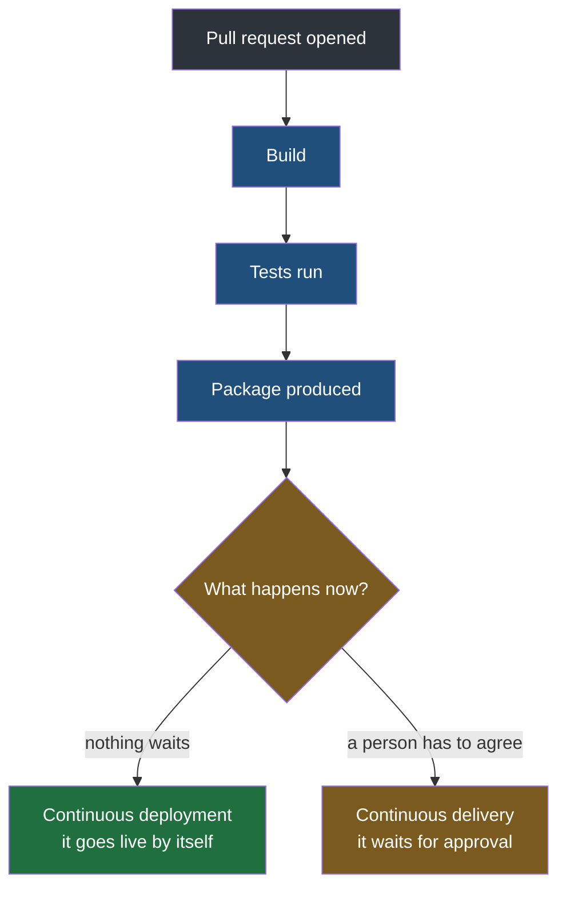
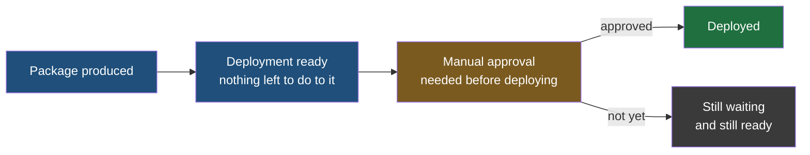

The previous note took apart the CI half of the abbreviation — code joining other code, constantly, with the pipeline checking the result. This note takes apart the CD half, which is where the two expansions finally get separated. Continuous delivery and continuous deployment are not synonyms, and the difference between them is a single step.

## Everything up to the package is identical

Both arrangements start the same way, and it is the sequence already established: a developer opens a pull request, the automation engine is triggered, the code is built, the tests that were written alongside it are run, and a package is produced. If the tests fail, the pipeline stops there and nobody goes any further.

So the shared part is the whole of the pipeline except its last step. What separates the two is **what is allowed to happen once that package exists.**

## Continuous deployment — nothing waits for anybody

**Under continuous deployment there is no human in the path at all.** You open the pull request, the automation engine runs, the code is built, tested and packaged, and then it is deployed. The change is live. At no point between the push and the deployment does the pipeline pause for a person to look at it, agree to it, or press anything.

That is the literal meaning of the word deployment in this phrase: the pipeline's final act is putting the change on the server that customers reach.

## Continuous delivery — one stage is added, and it is a person

**Under continuous delivery everything runs automatically up to the point of deploying, and then the pipeline stops and asks.** The approval is a human decision, normally from whoever is accountable for what goes out — a manager, a release owner, a team lead. Once that approval is given, the same pipeline carries on and deploys.

One stage has been inserted, and inserting it creates a state that did not exist before:

> [!important] The code becomes deployment-ready, which is a real state and not a figure of speech.
> Built, tested, packaged, and waiting. Nothing remains to be done to it and nothing has been done with it. It is finished work sitting in a queue, and the only thing between it and customers is somebody saying yes. That state is the entire product of continuous delivery — the pipeline's job is to make the change ready to go at any moment, and to stop exactly there.

> [!note] Deployment ready is a statement about deploying, not about releasing.
> An earlier note separated three events: the code becomes runnable, the runnable thing reaches a server, and the change reaches a person. The gate described here sits before the second of those. So a change waiting for approval has not been deployed at all — it is not on the server — which is a different situation from one that is deployed and running but not yet switched on for anybody. Both are forms of finished work that users cannot see, and they are stopped at different points.

### What that looks like across a week

The shape is easier to see on a calendar than in the abstract. Suppose the team's convention is that releases happen on Friday.

You finish your work on Wednesday. You open the pull request, and the pipeline runs everything it runs — build, tests, package — and then stops, because the deploy step needs approval. Your change is deployment-ready on Wednesday afternoon, and so is everybody else's who finished before the cut-off.

On Friday the manager goes through what is waiting, approves it, and the pipeline finishes the job. Everything that was ready deploys.

**Two days passed in which nothing technical was pending.** That waiting is the deliberate part. The team is not waiting for engineering; it is waiting for a decision it chose to keep in human hands.

## Choosing between them

| | Continuous delivery | Continuous deployment |
|---|---|---|
| Who decides when it ships | A person, each time | Nobody — the pipeline does |
| What the pipeline guarantees | The change is ready to ship at any moment | The change is shipped as soon as it passes |
| What the pipeline does not guarantee | That anything actually ships today | That anybody looked at it before customers did |
| The cost | Shipping is as slow as the approver | A bad change reaches users at machine speed |
| Where it suits | Regulated work, coordinated releases, anything where shipping has consequences beyond the code | Fast-moving products with tests and monitoring good enough to be trusted unsupervised |

> [!tip] The approval gate is a test of your tests, not of your code.
> A team keeps a human gate because something needs catching that the pipeline cannot catch. That is a legitimate position — but it is worth naming what it is each time, because the honest answers differ. If the gate exists because the tests are not trusted, the work is to fix the tests. If it exists because shipping has to be coordinated with something outside engineering, no amount of testing will ever remove it, and it should stay.
