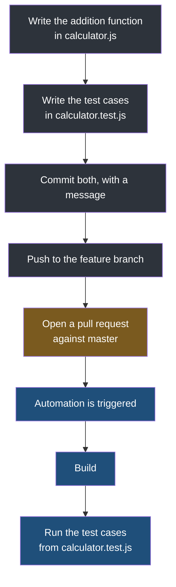
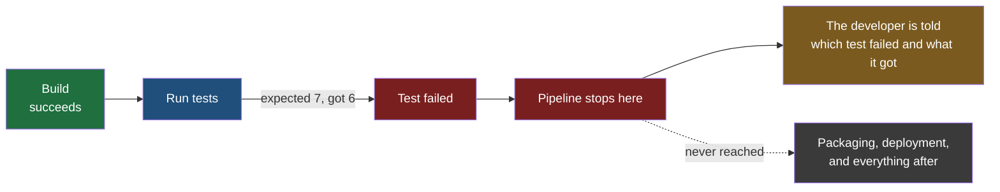

Everything so far has been the shape of the thing. This note follows one change through it, from a developer deciding to write a function to the pipeline either letting it through or stopping it, so that every stage named in the earlier notes has something concrete attached to it.

## The application

The example is a calculator, and it is deliberately smaller than the bookshop used earlier, because the point is to watch the pipeline rather than the application.

It is a live application that people use, written in JavaScript. It does what a calculator does — addition, subtraction, multiplication, division — and a good deal more besides, since it also handles integration and differentiation. Its code lives in a repository, and one of the files in that repository is `calculator.js`.

## The change

You are asked to add a function that adds two numbers.

So you write it, into `calculator.js`. That is the whole feature, and on its own it is a few lines of work.

**Then you write the second file, and this is the part that is your job rather than somebody else's.** Alongside the feature you create `calculator.test.js`, holding the test cases that check it. The tests are not a separate deliverable handed to a different team later; they arrive with the code they describe, in the same change, written by the person who wrote the code.

What goes in them is mechanical — call the function with known inputs, state the answer you expect:

| Inputs | Expected result |
|---|---|
| 4 and 3 | 7 |
| 5 and 5 | 10 |
| 0 and 1 | 1 |

Three cases, each one an assertion about behaviour that a machine can check without asking anybody's opinion. Your change now touches two files: the feature, and the evidence that the feature works.

## Getting it into the pipeline

You commit both files with a message describing what you did, and push to your own branch — a feature branch, named for the work, say the one holding the addition feature.

Then you open a **pull request** against the master branch, which is the formal request to have your branch's work merged into the shared one.

**That pull request is the trigger.** The moment it exists, the automation engine starts.

> [!note] There are two reasonable places to put the trigger, and the choice is yours.
> The pipeline can run when the pull request is opened, so that the checks report back before anybody merges anything — the result is information used to decide whether to merge. Or it can run after the merge has happened, against the combined code. Teams do both, often both at once, and what changes is only whether a failure is caught before or after it reaches the shared branch.

## The trap in the middle

This is the single most common misunderstanding of the whole subject, and it is worth stopping on.

> [!warning] Merging to master does not mean your code is deployed.
> When the pull request is approved and merged, your change is in the master branch. That is all that has happened. Nothing picked the code up, nothing put it on a server, and no customer can see any of it. The master branch is a version of the source; the server is a machine running a package. A merge changes the first and touches nothing about the second. Treating merged as shipped is how people end up convinced a fix is live when it is sitting in a branch.

Deployment is a later, separate step — the one that the previous note showed either happening automatically or waiting for an approval.

## When a test fails

Now the useful case. Suppose the addition function has a bug and returns 6 for the inputs 4 and 3.

The pipeline builds the code successfully, because the code compiles and runs perfectly well — it is simply wrong. Then it runs the test cases, and the first one expects 7 and receives 6.

**The pipeline stops, and nothing after that point runs.** No package is produced, nothing is deployed, and the failure is reported back to the developer with the detail that matters — which test failed, what it expected, what it actually got. The developer fixes the function and pushes again, and the pipeline starts over.

> [!important] This is the guarantee that the manual process could never make.
> In the arrangement described at the start of this folder, a wrong answer of 6 reaches production if whoever was releasing did not happen to run the tests. Here it cannot, and not because anybody is more careful — because the deploy step is downstream of the test step, and a stage that fails ends the run. **The test is not a recommendation that somebody might follow. It is a gate the code physically cannot get past.**
