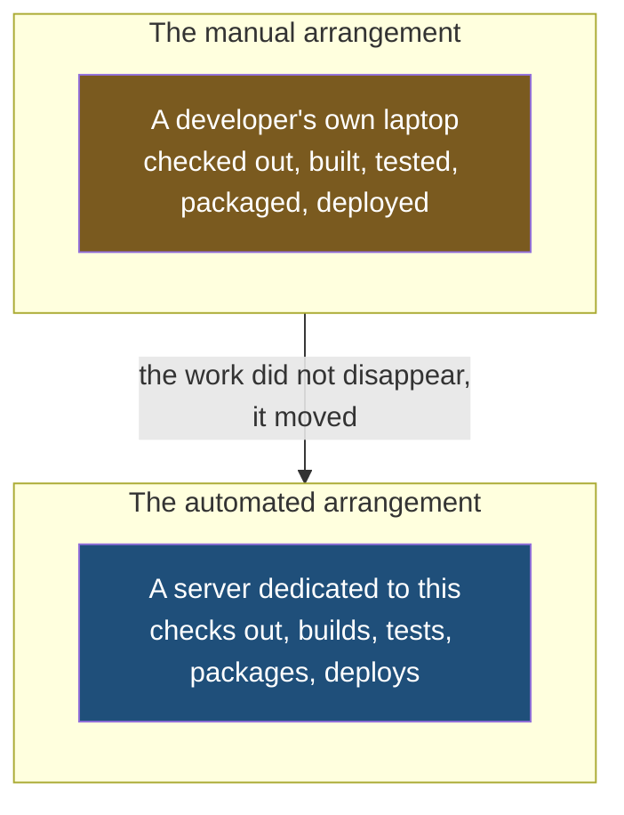

The pipeline in the previous note built some code, ran some tests and produced a package. All of that was described as though it simply happened. It does not simply happen — every one of those steps is work that some computer has to do, and so far nothing in this folder has said which computer.

## The question nobody asks until it matters

Go back through the stages and ask where each one physically runs.

To build the code, something must first get hold of the code — check out the branch, pull the changes down onto a disk somewhere. Then something must compile it, or whatever building means for that language. Then something must execute the test suite. Then assemble a package. Then connect to the target server and deploy.

**Every one of those needs a machine with a processor, memory, a filesystem and a network connection.** They are not abstract operations; they are the same operations a developer used to perform on a laptop, and removing the developer does not remove the need for the computer.

So the pipeline needs a machine of its own. In practice that means a separate server, bought or rented for the purpose, and a cloud provider is the ordinary place to put it — on AWS, say.

> [!note] The package at the end is not always a jar.
> What gets produced depends on what you are shipping. A Spring Boot application packages into a jar. Another project might produce a Docker image instead — a self-contained bundle of the application together with the environment it needs to run. The pipeline does not care which; the packaging stage produces whatever artefact that project's deployment expects.

## Something has to conduct all this

There is now a set of machines, a sequence of steps, several applications wanting to go through that sequence, and developers pushing changes at unpredictable times. Somebody has to decide what runs where and in what order.

That job has a name, and the name is borrowed.

**Orchestration** comes from orchestra. An orchestra is a large number of players, each capable and each doing something different, and what turns them into music rather than noise is one person at the front coordinating them — deciding who plays when, holding the whole thing to one tempo. Nobody in the orchestra needs to know what everybody else is doing; the conductor knows.

An **orchestration tool** does that for your pipeline. It holds the definition of the sequence, decides which machine performs which piece of work, starts things in the right order, and knows the state of everything in flight.

## The two tools you will meet

| | Jenkins | GitHub Actions |
|---|---|---|
| What it is | A dedicated automation server you run yourself | Automation built into the place the code already lives |
| Where it runs | On your own machines, which you install, configure and maintain | On machines the provider operates, created for a job and thrown away after |
| Who sets it up | You, from an empty server upwards | Largely already there once your code is hosted |
| Who tends to use it | Larger companies, and anywhere the pipeline has to live inside the organisation's own network | Teams wanting a pipeline without running a server for it |

**Both are orchestration tools and both do the same job** — define the pipeline, automate the sequence, coordinate the machines. Both keep that definition as a file in the repository. They differ in what you take on, and each side of that has a real cost.

**What running Jenkins yourself costs you.** It is a server, so it is yours to keep alive: patched, secured, backed up, and upgraded. Most of what Jenkins does beyond the basics comes from plugins — separately maintained add-ons — and that is simultaneously its greatest strength and its most common complaint. There is a plugin for almost anything, and the quality varies, they can conflict, and an upgrade can break a pipeline that worked yesterday. None of that is hypothetical; it is the ordinary experience of maintaining one.

**What a hosted tool costs you.** You give up control of the machines. They are created for a job and destroyed afterwards, which is clean but means anything you want present has to be installed on every run. The tool is tied to where your code is hosted, so moving your code means rebuilding your automation. And the machines live outside your network, so work that needs to reach something private — a database with no public address, an internal deployment target — needs a machine of your own added back in anyway.

> [!tip] The deciding question is usually who is going to look after it.
> A team with people whose job includes running infrastructure can take on a Jenkins server and get control in return. A team without that capacity will spend the time they saved on writing pipelines maintaining the thing that runs them. It is a staffing question at least as much as a technical one, which is why the answer differs so much between a large company and a small one.

> [!important] Jenkins is the one to learn first, and the reason is not that it is better.
> It is what you are most likely to walk into, particularly at a large company, and it is the one that makes the machinery visible. Because you run it yourself, you have to understand the parts — what coordinates, what executes, where the code is checked out to. A hosted tool hides those decisions behind defaults, which is pleasant to use and a poor way to learn what is actually happening. Once the parts are clear in one tool, the other is a change of vocabulary.
