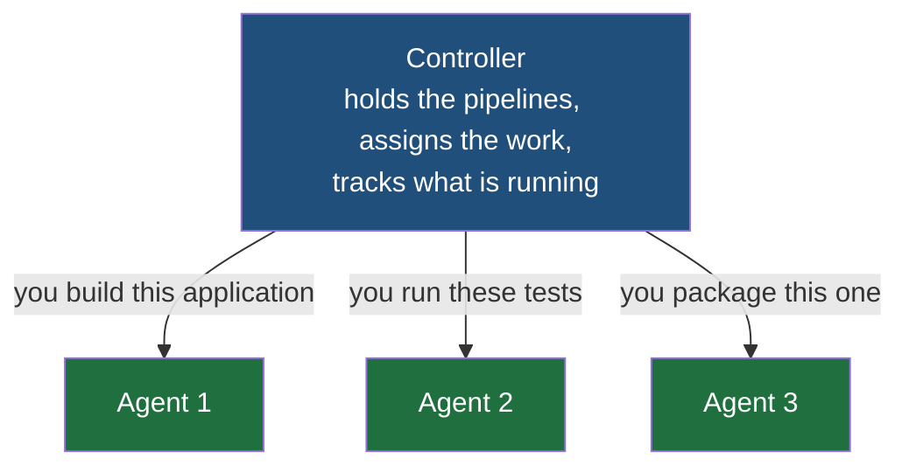
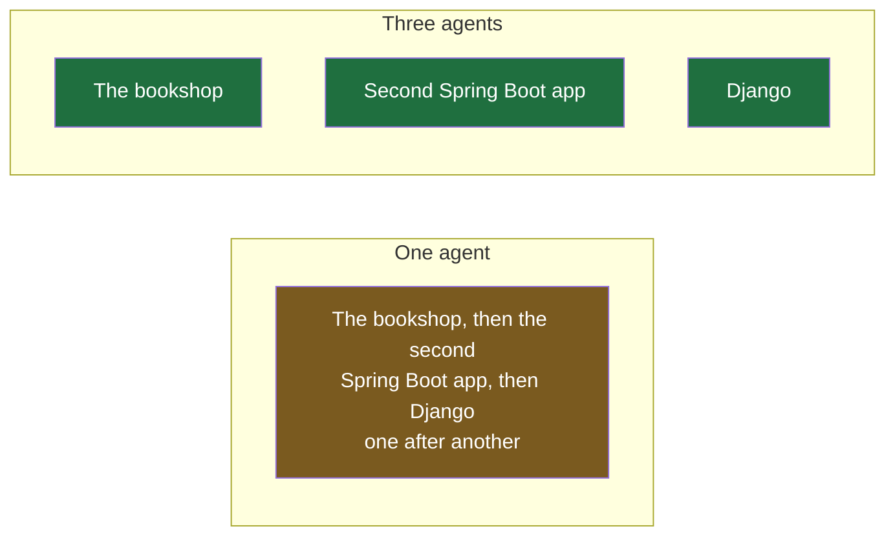

Jenkins is the orchestration tool the previous note settled on, and orchestration was described there as one thing coordinating many. Jenkins is built exactly that way, and its two halves have names worth getting right, because almost everything else about it follows from the split.

## Two layers

> [!important] Jenkins has a controller layer and an agent layer. The controller coordinates work. The agent executes it.
> That is the whole architecture in two sentences. The controller decides what needs doing and who should do it; it does not do the work itself. The agent does the work and decides nothing.

**The controller** holds the definition of every pipeline, watches for the events that should start one, assigns each piece of work to an agent, and keeps track of what is running and what finished. It also carries everything around the edges — the jobs, the structure of each pipeline, the management of those jobs, and the interface a developer looks at.

**The agents** are the workers. An agent is given a task — build this application, run these tests, produce this package — and it performs it. It is told what to do by the controller and has no view about what it is handed.

> [!note] Older material calls these two the master and the slaves.
> The current names are controller and agent, and those are the ones to use. You will still meet the older pair in documentation, in tutorials and in the way developers talk about existing setups, and they mean exactly the same two things — master for the coordinating layer, slave for a worker. Recognise them and write the current ones.

## Both of them are just servers

This is the point where developers get confused, so it is worth being blunt about it.

**Neither the controller nor an agent is anything on its own.** They are programs. A program needs a computer to run on, which means the controller runs on a machine and each agent runs on a machine, and those machines are ordinary servers with processors and memory and addresses.

> [!note] A node means a computer. Nothing more.
> The word turns up constantly in this material and in system design generally, where a collection of separate machines is described as a set of nodes. In this context it means exactly one thing: a computer, or a server. The controller runs on a node. Each agent runs on a node. When a developer says a Jenkins node they mean one of the machines involved.

Being a server also means an agent is reachable the ordinary way. Give it a subdomain such as `api.bookcart.in`, and anything looking for that name gets the machine's address back and connects to it — the same mechanism that puts any name on the internet in front of any machine. That mechanism is the domain name system, and it is covered in its own right in [[../04-Networking/04-DNS-Resolution|DNS resolution]] and [[../04-Networking/05-DNS-Records|DNS records]]. The point here is only that there is nothing exotic about these machines: an agent is a server, addressed like any other.

## Why you would run more than one agent

One agent would work. Several is normal, and there are three distinct reasons, each independent of the others.

### Different applications need different platforms

A Spring Boot application is happy on Linux — Linux is a perfectly good platform for it, and that is the end of the matter.

Now suppose you also maintain a .NET application. **.NET runs better on Windows**, and the reason is its lineage: .NET is Microsoft's, the language is C#, and the whole stack belongs to the Windows world. You can fight that, or you can keep a Windows machine for it.

One agent cannot be both a Linux machine and a Windows machine. So you keep one of each, and the controller sends each build to the agent that can actually run it.

### Parallelism

Say you have three applications — the bookshop, a second Spring Boot application, and a Django one — running on ports `8080`, `9090` and `8292`. They are completely independent of each other; nothing about building one involves the others.

**Parallel here means what it sounds like: the work happening at the same instant, on separate machines, with nothing shared and nothing waiting.** There is a weaker arrangement that also makes several things progress together on one machine, and the difference between the two matters enough to get its own treatment in the next note.

With one agent, the three builds queue up and run one after another. With three agents, they run at the same time.

**The relationship is direct: more agents means more of your work builds in parallel, fewer agents means less of it does, and a single agent serialises everything.** It is the same trade as running one thread against several — the work is divisible, and how much of that division you actually get depends on how many workers exist to take it.

This is also why a system split into many small services pushes in the same direction. A codebase made of a dozen independently deployable services has a dozen things that could be building at once, and only as many of them proceed in parallel as you have agents to run them.

### Isolation

The third reason applies even when the platform is identical and parallelism is not the concern. You may want one application's builds kept away from another's — separate machines, separate filesystems, nothing shared — so that one build cannot interfere with another, consume everything, or leave state behind that the next one trips over.

## What an agent's machine actually is

An agent needs a machine, and that machine can be had in more than one form.

| Form | What it means |
|---|---|
| Physical machine | A real server, dedicated to the agent, running nothing else |
| Virtual machine | A simulated computer running on top of a real one, the way you might run several on your own hardware — each with its own operating system |
| Container-based environment | Lighter-weight isolated environments on a shared host — a substantial subject of its own, and not one this folder goes into |

Virtual machines are the ordinary answer, because they let one piece of real hardware host several agents that believe they are separate computers.

## Two questions this raises immediately

> [!question] Do you need a separate agent per platform — one for a Windows application, one for macOS — or can one agent be configured for everything?
> You configure them. **An agent is not inherently tied to a platform**, because an agent is just a server, and that server can be running Windows, Linux, macOS or anything else. What matters is the match between the task and the machine: it is the DevOps engineer's job to ensure that when a task is assigned to an agent, that agent can actually run it. A Windows build assigned to a machine that cannot build Windows applications fails, and that is a configuration mistake rather than a limitation of Jenkins.

> [!question] If those three applications run on three different ports, they could all sit on one server — so why separate agents for parallelism?
> They could, and that arrangement works: three applications on different ports on one machine can be built and deployed there perfectly well. Several agents can also be deployed onto one server. The separation described above assumes virtual machines — three agents meaning three machines, even if the hardware underneath is shared. And the reason to go that way is mostly the third one: **doing everything on a single machine gets expensive in configuration and complexity**, and isolation is what you are buying when you stop.
