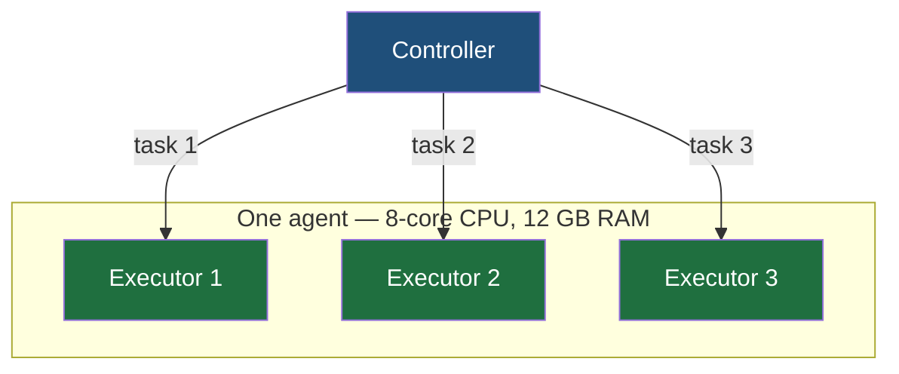
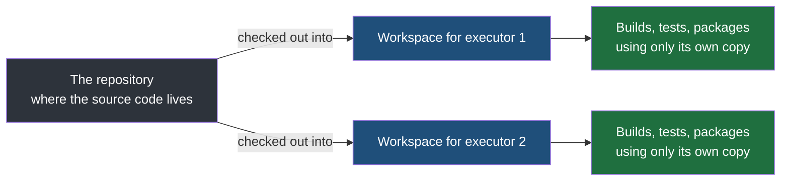

An agent was described in the previous note as a worker that performs whatever task the controller gives it, running on a server of its own. Two details about that server were left out, and both of them are things you have to understand before configuring one: how many tasks it can take at once, and where it puts the code while it works.

## One agent can do several things at once

Consider what an agent's server actually is. Say it has an **8-core CPU and 12 GB of RAM**. That is a capable machine — more than enough for one build at a time, and leaving most of the hardware idle if that is all it ever does.

So an agent is not limited to one job. Inside a single agent there can be several **executors**, each able to take a task independently.

> [!important] One agent, many executors. The agent is the machine; an executor is one slot on it that can be given work.
> The controller does not hand work to a machine, it hands work to an executor. An agent with three executors can be given three tasks at once and will carry all three, which is why the number of executors is a configuration decision made from the server's specification rather than a number somebody picks at random.

The mental model is the one you already have from writing programs. You have one computer and several things to do on it, so you use several threads, or several processes. An agent with several executors is the same arrangement, one level up.

A concrete case: a Linux agent configured with two executors. Executor 1 builds one application, executor 2 builds another, and both proceed without either waiting for the other to finish.

> [!warning] The tasks sharing an agent must be genuinely independent of one another.
> Two executors running work that is unrelated is fine. Two executors running work where one task is waiting on something the other task holds is how you get a deadlock — each one stuck, neither able to finish, the agent occupied indefinitely and nothing to show for it. **Tasks handed to the same agent should have no dependency between them**, which is a constraint on how you divide the work rather than something the tool can check for you.

## Concurrent is not the same as parallel

The word for what those executors are doing is **concurrent**, and it is worth keeping distinct from parallel, because they are different claims about what the hardware is doing.

**Parallelism** means the tasks genuinely run at the same instant, on separate hardware, never interfering with one another. Three agents on three machines building three applications is parallelism.

**Concurrency** means several tasks are in progress and the machine switches between them. One task runs, then yields so another can run, then that one yields back — **context switching**, performed over and over, fast enough that from the outside all of them appear to be progressing together.

| | Parallel | Concurrent |
|---|---|---|
| What is happening | Several tasks executing at the same instant | Several tasks in progress, the machine alternating between them |
| What it needs | Separate processors or separate machines | One processor is enough |
| In Jenkins terms | Separate agents, on separate machines | Several executors inside one agent |

> [!tip] The distinction belongs to operating systems, and that is where to go for the detail.
> Concurrency, context switching and how threads are scheduled are an operating-systems subject, treated properly there and only sketched here. What you need at this level is the one sentence: **an agent can hold several executors and therefore take several tasks at once, and it can do that because the server it runs on has the capacity for it.** The machinery underneath is somebody else's chapter.

## Where the code goes — the workspace

An executor has been given a task: build this application, run its tests. To do any of that it needs the code, which means the code has to be somewhere on that machine, in a directory, as files.

**That directory is the workspace.** It is where the source is checked out to, and it is where the build happens.

Crucially, **each executor gets its own workspace.** Two executors on the same agent, both building, both needing the code, each working in a separate directory of its own.

The reason for one each is what would happen otherwise. Both builds write files — compiled output, downloaded dependencies, test results — and two builds writing into the same directory would overwrite each other's work and produce results that depend on which one happened to run first. Separate workspaces are what make two simultaneous builds on one machine independent rather than entangled.

## What the controller still does not know

There is now a controller assigning work, agents with executors to perform it, and a workspace on each one with the code checked out into it. One thing is still missing, and it is the obvious one.

The controller has no idea what to actually do with that code. It does not know that the tests for `calculator.js` live in `calculator.test.js`, or that this project is built one way and that one another. **None of that can be guessed — it has to be written down somewhere and handed to the controller**, which is what the rest of this folder is about.
