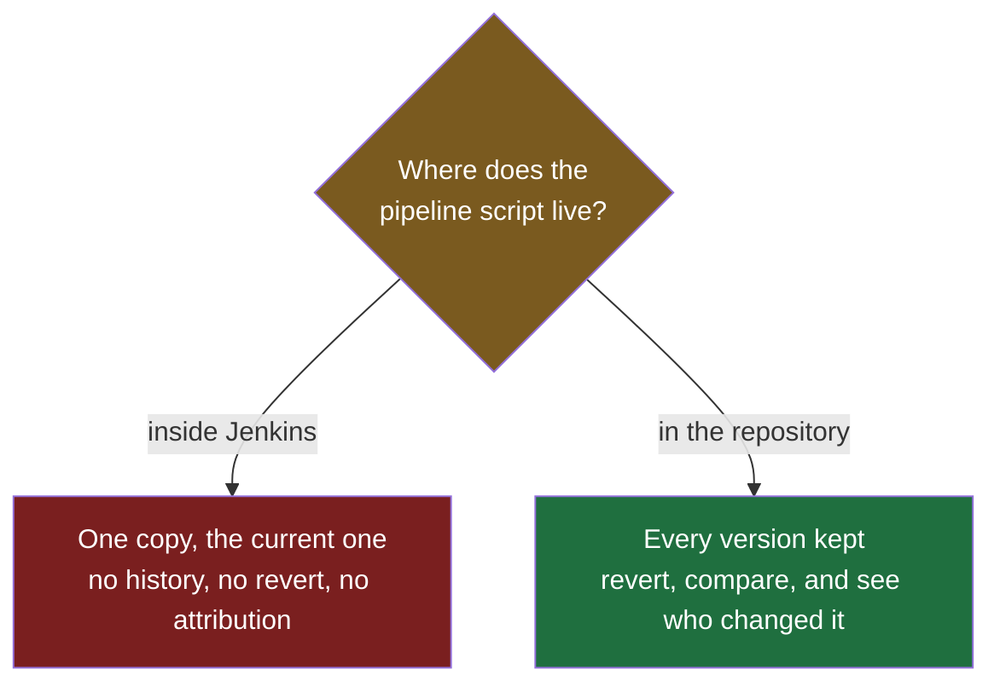

The previous note ended on the missing piece: the controller has the code and the machines, and no idea what to do with either. What it needs is a script — a description of the pipeline listing every step to perform and in what order. This note is about that script, and specifically about the question of where it is kept, which turns out to be a more interesting decision than it first appears.

## Where would you put it?

The script belongs to a particular project and describes how that project is built, tested and deployed. So there are two obvious homes for it.

**The first instinct is usually to put it in Jenkins.** Jenkins is the tool that runs the pipeline, it has a web interface, and you can paste a script into it and save it. That works, and it is wrong.

> [!failure] A script stored inside Jenkins has no history.
> Jenkins is a server with a configuration, not a version control system. Paste the script in and you have exactly one copy: the current one. A developer changes it tomorrow and there is no record of what it said before, no way to see what changed, nobody to attribute the change to, and nothing to revert to when the change turns out to have broken every build. You have taken the file that controls how your software ships and put it in the one place in your infrastructure with no memory.

**The second option is the repository**, alongside the application's own source code. Everything that argument needs is already true of the repository: it keeps every version, it records who changed what and when, it lets you revert, and it lets you see the history of a file over years.

The question answers itself once it is put that way. **The source code lives in the repository because the repository gives you history. The pipeline script needs history for exactly the same reasons. So it goes in the repository.**



## What that looks like in the repository

A Maven project's repository has a recognisable shape before any of this — a `src` directory holding the application's code, with its sources under `src/main/java` and its tests under `src/test/java`, a `pom.xml` at the top describing the project and its dependencies, and a handful of other files alongside it.

You add one more file at the root, named **`Jenkinsfile`**. The capitalisation is fixed and it takes no extension: a capital `J`, a capital `F`, nothing after it.

```
calculator/
├── src/
├── pom.xml
└── Jenkinsfile      ← the pipeline script
```

That file holds the script. It is committed like any other file, reviewed like any other file, and changed through the same process as the application code it describes.

> [!important] This model has a name: pipeline as code.
> The pipeline stops being a setting configured in a tool and becomes a file in your project. Everything that is true of code becomes true of your deployment process — it is versioned, so every change to how the software ships is recorded; it can be reverted, so a mistake in the pipeline is undone the way a mistake in the application is; a change to it can be attributed, so when a build starts behaving differently you can find out who changed what and read their reasoning in a commit message; and it can be reviewed before it takes effect.

## More than one of them is allowed

Nothing says a project gets exactly one pipeline definition. You can keep several scripts for several purposes, each describing a different sequence.

A common split is by how much you want run: one script that builds and runs the full test suite, and another that builds and runs only the integration tests, for situations where the full suite is too slow to be worth waiting for. Which one a given trigger uses is part of the configuration.

## The language it is written in

The script is written in **Groovy**. It is a real programming language that runs on the JVM, and Jenkins pipeline definitions are built on it.

> [!tip] You are not expected to learn Groovy, and almost no developer who writes these files knows it properly.
> It is not a language developers generally study, and there is no need to become fluent in it to write a pipeline. What you need is the handful of constructs a pipeline definition actually uses, which is a small and very repetitive set. **The next note shows the form these files take, and the reason it can be learned that cheaply is that Jenkins offers a way of writing them in which you state what should happen rather than how to make it happen** — which removes most of the language from the problem.
