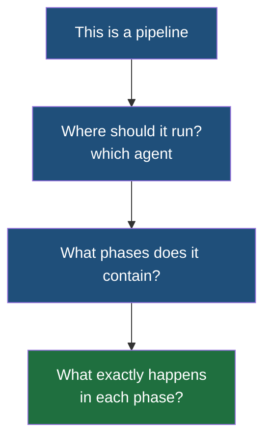

The previous note established where the pipeline script lives — a file named `Jenkinsfile` at the root of the repository, written in Groovy — and ended on the claim that you do not need to learn Groovy properly to write one. This note is why that claim holds, and what these files actually look like.

## Two ways to write the same file

Jenkins accepts two different syntaxes for a pipeline, and they are genuinely different in kind rather than in style.

**The scripted approach is the programming approach.** You write out the procedure: the steps, and how to perform them. That means the things programming always means — variables to declare, loops to write, conditions to branch on, structure to maintain. It is fully expressive, and for anything beyond a simple pipeline it grows complicated quickly, which is a real cost when the person maintaining the file next year does not know Groovy either.

**The declarative approach only asks what should happen.** You state the phases and what each one contains, and the how is already handled for you. You do not write the loop that iterates the stages or the code that reports a failure; you say there is a testing phase and here is what runs in it.

| | Scripted | Declarative |
|---|---|---|
| What you write | What to do and how to do it | What to do |
| What you need to know | Groovy, properly | A small fixed set of block names |
| How it scales | Grows complicated as the pipeline grows | Stays the same shape |
| When you need it | Logic a declarative file cannot express | Essentially everything else |

> [!tip] Start declarative and stay there unless something forces you out.
> The declarative form is what the rest of this note uses, and it is what you will see in most repositories. Reaching for the scripted form because a pipeline feels complicated is usually a sign the pipeline is doing too much rather than a sign the syntax is insufficient.

## The four things a declarative pipeline states

Strip it down and a declarative pipeline answers four questions, in order.



A typical set of phases is build, testing, packaging and deployment — the same sequence the earlier notes described, now written down in a form a machine reads.

The smallest complete example of that structure looks like this:

```groovy
// Jenkinsfile — at the root of the repository
pipeline {
    agent any
    stages {
        stage('Example') {
            steps {
                echo 'Hello World'
            }
        }
    }
}
```

Four block names carry the whole thing. `pipeline` says this is a pipeline. `agent` says where it runs. `stages` holds the phases, each one a `stage` with a name. `steps` holds what actually happens inside a phase.

> [!important] `agent any` means run this on whichever agent is free.
> `any` is a keyword, and it is the most common thing to write there. It says you do not care which machine the work lands on — take any available agent and use it. That is the right answer whenever the work has no particular requirement, and the wrong one when it does: a build that needs Windows, or needs a tool only one machine has, must name the agent it needs rather than accepting whatever is idle.

## A real one, for a Node.js application

Now the same structure with actual work in it. Three stages: install the dependencies, run the tests, build the application.

```groovy
// Jenkinsfile — at the root of the repository
pipeline {
    agent any
    stages {
        stage('Install') {
            steps {
                sh 'npm ci'
            }
        }
        stage('Test') {
            steps {
                sh 'npm test'
            }
        }
        stage('Build') {
            steps {
                sh 'npm run build'
            }
        }
    }
}
```

**`sh` is the step that runs a shell command**, and it is how a stage does anything at all. This matters more than it looks: Jenkins has no idea how to install a Node.js project's dependencies, or how to run its tests. It is an orchestrator, not a build tool. What it knows is how to run commands on a machine in a defined order, and it is your job to tell it which commands those are.

A stage can hold one step or several. Each one runs in turn, and a step that fails ends the run — which is the mechanism behind the earlier note's failing test case stopping the pipeline dead.

## The same pipeline for a Spring Boot application

Nothing about the structure changes. What changes is the commands, because a Java project is built with Maven rather than npm.

```groovy
// Jenkinsfile — at the root of the repository
pipeline {
    agent any
    stages {
        stage('Test') {
            steps {
                sh 'mvn test'
            }
        }
        stage('Package') {
            steps {
                sh 'mvn package'
            }
        }
    }
}
```

**And here a shortcut becomes available that Node.js does not offer.** Maven runs a fixed, ordered sequence of phases, and asking for a later phase runs every earlier one on the way. The order includes `compile`, then `test`, then `package` — so `mvn package` compiles the code, runs the tests, and only then produces the jar. The tests are not skipped; they are part of getting to a package.

Which means the two stages above can be collapsed into one:

```groovy
// Jenkinsfile — at the root of the repository
pipeline {
    agent any
    stages {
        stage('Build and test') {
            steps {
                sh 'mvn package'
            }
        }
    }
}
```

> [!note] Fewer stages is not automatically better.
> Collapsing them is legitimate, and it is less to maintain. What you give up is visibility: with separate stages, a failure reports which stage failed, so a broken test and a broken packaging step are distinguishable at a glance. With one stage you are told the stage failed and have to read the output to find out what part of it did. Keep them separate while you are still learning what breaks.

> [!warning] Whatever the commands need must already be installed on the agent.
> `npm ci` only works on a machine that has npm. `mvn package` only works on a machine that has Maven, and a JDK for it to compile with. The agent is a server, and a server has exactly the software somebody installed on it — Jenkins does not supply these tools and will not fetch them for you. A pipeline that is correct in every other respect fails immediately on an agent where the build tool is missing, and the error can be unhelpfully far from the cause. **Provisioning the agents with what the builds need is part of the job.**

> [!question] Could the pipeline be defined in JSON instead?
> It can be expressed that way, and nothing stops a tool generating it. But Groovy is the form Jenkins is built around, it is what the documentation and every example use, and it is what you will find in other people's repositories — so it is the one worth writing by hand.
