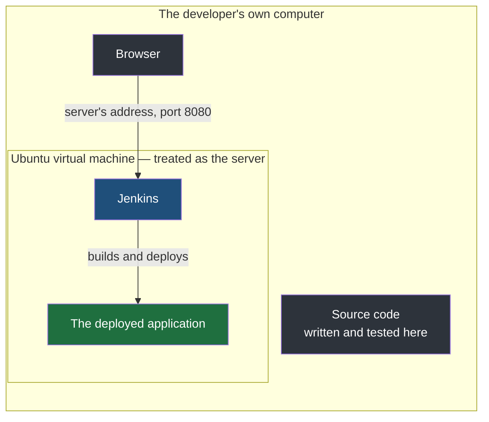
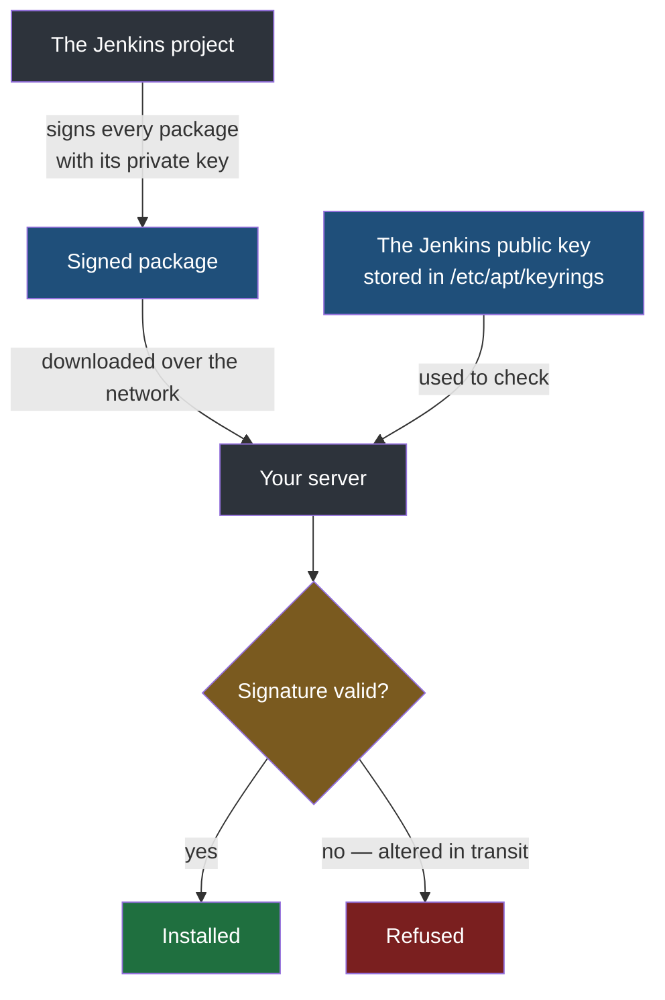

Everything so far has described Jenkins from the outside — a controller that coordinates, agents that execute, a `Jenkinsfile` that says what to do. None of it exists until Jenkins is installed on an actual machine, and installing it is where the abstractions meet an operating system that has opinions about software, permissions and ports. This note takes a bare Linux server to a Jenkins dashboard you can log into.

## The machine it goes on

In real use, the server Jenkins runs on is somewhere else — a machine in a data centre or a cloud provider, reached over the network. For learning, that distance adds nothing but cost, so the setup here is smaller and behaves the same way.

The developer's own computer — a MacBook — runs an **Ubuntu virtual machine**, created with **Multipass**, a tool for starting and managing lightweight Ubuntu virtual machines. That virtual machine is treated as the server. It has its own operating system, its own address on the network and its own filesystem, and from the point of view of everything that follows it is simply a Linux server that happens to be physically inside the laptop.



**Nothing about the commands depends on this arrangement.** A virtual machine on a Windows computer, a Linux machine of your own, or a real server rented from a cloud provider all take exactly the same steps, because the steps are about the server's operating system and the server is Ubuntu in every case.

### One machine playing both roles

The earlier notes described a controller that assigns work and agents that perform it, usually on separate machines. That arrangement exists for scale: many deployments, many developers pushing, many applications building at once, which is when it becomes worth spreading the work across several machines.

A single server building one demonstration application needs none of that. **Here the controller does the agent's work as well** — the same Jenkins installation both decides what should run and runs it. Nothing about the pipeline changes; there is simply one node doing both jobs.

## Java comes first, whatever you are deploying

**Jenkins is itself a Java application.** It needs a Java runtime on the server before it will start, and that is true regardless of what language the software it builds is written in. A team deploying only Python services still installs Java on its Jenkins server, because the requirement belongs to Jenkins, not to the code passing through it.

Current Jenkins releases require **Java 21 or later**:

```bash
# on the server
sudo apt update
sudo apt install fontconfig openjdk-21-jre
java -version
```

> [!note] A runtime is not a compiler.
> The package installed here is a JRE, a Java runtime — enough to run Jenkins, and nothing more. It does not contain `javac`, the Java compiler. That distinction turns out to matter later, when a pipeline needs to compile Java code rather than merely run it: the Java that Jenkins runs on and the Java that a build compiles with are separate things, set up separately.

## Why the download has to be verified

Jenkins is not installed from Ubuntu's own package collection but from the Jenkins project's repository. That raises a question that did not exist a moment ago.

Suppose you download a file claiming to be the Jenkins package. **How do you know it came from the Jenkins project** — rather than from somebody sitting between you and the download, who substituted a file of their own? This is a man-in-the-middle attack, and a CI server is an unusually valuable target for one: it holds the credentials to your code and your servers, and it runs whatever it is told to run.

The protection is a digital signature. The Jenkins project signs its packages with a **private key** that only it holds, and publishes the matching **public key**. Your server stores that public key, and the package manager uses it to check the signature on every package before installing anything. A package altered in transit fails that check, and the install stops.



This is exactly the signing mechanism covered in [[../04-Networking/10-Certificates-And-Trust|certificates and trust]], resting on the key pairs from [[../04-Networking/09-Symmetric-And-Asymmetric-Keys|symmetric and asymmetric keys]]: something signed with a private key can be verified by anyone holding the public key, and cannot be forged by anyone who does not hold the private one.

The public key is stored in `/etc/apt/keyrings`, the conventional directory for keys the package manager trusts. Printing it shows a single long block of encoded text between a begin marker and an end marker — that block is the whole key.

## Installing Jenkins

The key is downloaded into the keyring, the Jenkins repository is registered with the package manager and told which key signs it, and then Jenkins installs like any other package:

```bash
# on the server — current as of 2026; the key file name changes when Jenkins rotates its key
sudo mkdir -p /etc/apt/keyrings
sudo wget -O /etc/apt/keyrings/jenkins-keyring.asc \
  https://pkg.jenkins.io/debian-stable/jenkins.io-2026.key
echo "deb [signed-by=/etc/apt/keyrings/jenkins-keyring.asc]" \
  https://pkg.jenkins.io/debian-stable binary/ | sudo tee \
  /etc/apt/sources.list.d/jenkins.list > /dev/null
sudo apt update
sudo apt install jenkins
```

The first line creates the keyring directory if it does not already exist — recent Ubuntu releases ship with it, older ones do not, and `-p` makes the command harmless either way. The `signed-by` part is what ties the key to the repository: it tells the package manager that packages from this repository must carry a signature that the stored key can verify.

> [!warning] Take these commands from the Jenkins documentation, never from an old copy.
> The Jenkins project rotates its signing key, and the key file's name changes with it. A command copied from a tutorial written a year or two ago points at a retired key, and the install then fails on signature verification — which is the check doing its job, but reads as a broken install. Before running these, check the current commands on the official Jenkins installation page.

> [!question] The install fails with unable to fetch some archives. What now?
> Run `sudo apt update` and try again. That message usually means the package manager's list of available packages is stale — it is looking for a file version that the repository has since replaced — and refreshing the list resolves it in most cases. If it persists, the exact error text is what to search for, since the causes beyond that are specific to the machine.

## Starting it and finding it

Installing puts Jenkins on disk. It then runs as a background service, managed by `systemd`, the part of Ubuntu that starts and supervises services:

```bash
# on the server
sudo systemctl enable jenkins
sudo systemctl start jenkins
sudo systemctl status jenkins
```

`enable` makes it start again whenever the server reboots, `start` starts it now, and `status` should report it as **active**, meaning it is running.

**Jenkins listens on port `8080` by default.** The port can be changed, but there is rarely any reason to.

To reach it, point a browser at the server's address and that port. The important detail is **which address**. The browser is running on the laptop; Jenkins is running inside the virtual machine. So `localhost` in the laptop's browser means the laptop, not the server, and finds nothing. You need the **virtual machine's own address** — something like `http://192.168.64.2:8080` — which is the address the server has on the network between the laptop and the machine running inside it.

> [!important] Change your application's port, never the tool's.
> Jenkins uses `8080`. So does a Spring Boot application, by default. The moment you deploy one onto the other's server, two programs want the same port, and only one can have it. **The one to change is always your application**, because it is the thing you wrote and fully control — a Spring Boot application's port is one line, `server.port=8081`, in its `application.properties`. The ports of installed tools — Jenkins, a database, Docker and the like — are left at their defaults, because every guide, every other tool that connects to them and every colleague who logs in expects to find them there.

## Unlocking it

The first time the dashboard opens, Jenkins refuses to go further until you **prove you own the server it is running on**.

The proof is a file. During installation Jenkins generated a long random password and wrote it into a file on the server that only an administrator can read:

```bash
# on the server
sudo cat /var/lib/jenkins/secrets/initialAdminPassword
```

Only somebody who can log into the server and use `sudo` can read that file, so pasting its contents into the browser demonstrates that the person at the browser controls the machine. Jenkins then asks you to create your own administrator account with a password of your choosing.

This happens once. On a server where Jenkins has been set up before, its configuration is already on disk, and opening the address goes straight to an ordinary login page asking for that administrator's username and password.

> [!warning] That account controls everything the pipeline can reach.
> A Jenkins administrator can run arbitrary commands on the Jenkins server and use every credential Jenkins holds — which, once pipelines deploy code, means access to the servers they deploy to. A trivial password on a Jenkins instance reachable from anywhere is an open door into all of it. Choose one you would be comfortable defending.

## Installing the plugins

The setup wizard then offers two choices: **install suggested plugins**, or **select plugins to install** yourself.

**Take the suggested plugins.** It takes a while — five or ten minutes is normal — and it is worth the wait. Much of what Jenkins can do comes from plugins, and a plugin you skipped now does not announce itself as missing; it surfaces weeks later as a pipeline failing to deploy for a reason that takes an afternoon to trace back to a plugin that was never installed. Installing the recommended set up front removes that entire category of problem.

The wizard also mentions **distributed builds** — setting up separate agents — and connecting cloud providers to create agents on demand. Neither is needed with a single server playing both roles.

## What has actually happened

Put together, the whole sequence was: install Java, verify and install Jenkins, start it, find it on port `8080` at the server's address, unlock it with the password from the server's own disk, and install the plugins.


**That is the entire result: Jenkins is running on a server.** It has not built anything or deployed anything, and it knows nothing about any application yet.

> [!tip] Do not memorise the installation steps.
> They are fixed, documented and change from version to version — the key rotation above is proof of that. Anyone setting Jenkins up works from the official instructions rather than from memory, and effort spent learning the commands by heart is effort not spent on the part that actually carries over: what Jenkins is for, what each piece of the pipeline does, and how the pieces fit together.
