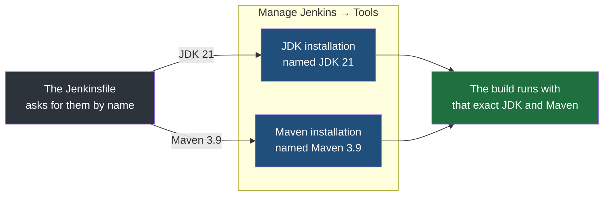
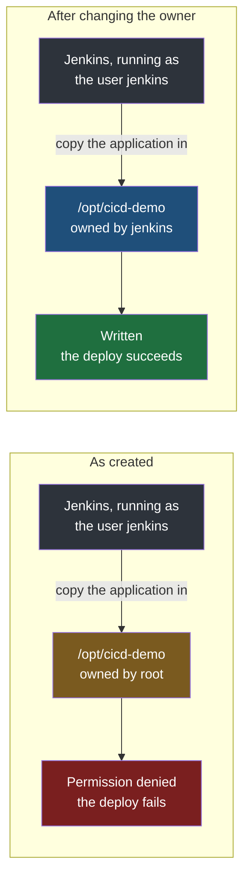

The previous note ended with Jenkins running on a server and knowing nothing about any application. Before it can build and deploy one, four things have to be put in place: Jenkins needs the tools the build uses, the server needs somewhere for the deployed application to live, Jenkins needs permission to put it there, and something other than Jenkins has to be responsible for keeping the application running. The last two are the ones that catch people.

## What the server can run at once

The first thing worth looking at on the dashboard is the list of nodes, under **Manage Jenkins**. With a single server there is one entry, the built-in node — the controller, doing agent work as well, as the previous note described.

It shows **two executors**. An executor, from earlier in this folder, is one slot on a node that can be given a job, so two executors means this server will run **two jobs at the same time**, and a third one waits in a queue until a slot frees. That number is configurable, and on a server with more capacity it can be raised.

## The tools and plugins

The suggested plugins from setup cover most of what a pipeline needs. Nobody keeps their names in their head — there are a great many of them, and what matters is knowing that the starter set is what makes Jenkins able to run a pipeline at all, not being able to list it.

Two are worth recognising, because they are the ones you look at every day:

| Plugin | What it gives you |
|---|---|
| **Pipeline: Declarative** | Support for the declarative pipeline syntax that `Jenkinsfile`s are written in |
| **Pipeline: Stage View** | The row of boxes on a pipeline's page showing each stage, whether it passed, and how long it took |

If one of these is missing, it is installed from **Manage Jenkins → Plugins**, by searching for it and ticking it.

### Telling Jenkins which JDK and which Maven to use

The application built in this folder is Java, built with Maven. Jenkins itself does not know what Maven or a JDK is until it is told, and the place it is told is **Manage Jenkins → Tools**.

There you add a **JDK installation** and a **Maven installation**, and give each one a name. The name is the important part. A pipeline does not say which version of Java to use by describing it; it refers to one of these configured installations by the name it was given, and Jenkins supplies that tool to the build.



> [!important] The Java Jenkins runs on is not the Java a build compiles with.
> The previous note installed a Java 21 runtime so that Jenkins itself could start. That runtime has no compiler and plays no part in building your code. The JDK a pipeline compiles with is whichever one it is given here and asks for by name — so a Jenkins server running happily on Java 21 can still fail every build of a Java 21 application, if the JDK the build receives is an older one.

## Somewhere for the application to live

Deploying means copying the built application onto the server into a known place and running it from there. So that place has to exist first.

On Linux, `/opt` is the conventional directory for add-on application software — programs that are not part of the operating system and not installed through the package manager. The application goes under it, in a directory of its own, with a subdirectory where each deployed version is kept:

```bash
# on the server
sudo mkdir -p /opt/cicd-demo/calculator/releases
```

`-p` creates every missing directory along the path in one go, and does nothing if they already exist.

> [!question] Why so many directories? Why not put the code straight into one folder?
> It is convention rather than necessity, and you could follow it or not. The reason to follow it is that it keeps things manageable once there is more than one of anything: one directory per application, and inside it one place holding each released version by name, so that what is running, what ran before and what is about to replace it are all separate and all findable. And the directory is not decoration — it is precisely where the deploy stage of the pipeline will put the application.

## The permission problem

Here is the step that is easy to miss, because everything up to now was done as yourself.

**Jenkins does not run as you.** When the package was installed, it created a Linux user named `jenkins`, and the Jenkins service runs as that user. Everything Jenkins does — checking out code, building it, running tests, and deploying — it does **as `jenkins`**.

The directory just created belongs to `root`, because it was made with `sudo`. The `jenkins` user has no right to write into it. So when the pipeline reaches its deploy stage and tries to copy the application into `/opt/cicd-demo/calculator/releases`, it is refused, and the pipeline fails — not because anything is wrong with the code or the pipeline, but because the account doing the work was never allowed in.



The fix is to make `jenkins` the owner of that directory tree, using the same ownership change used for any other user:

```bash
# on the server
sudo chown -R jenkins:jenkins /opt/cicd-demo
```

`chown` changes ownership — here to the user `jenkins` and the group `jenkins` — and `-R` applies it to the directory and everything inside it, rather than only to the top-level directory itself.

### Proving it worked before relying on it

Rather than find out during a deploy, check it directly by acting as the `jenkins` user and trying to write a file:

```bash
# on the server
sudo -u jenkins touch /opt/cicd-demo/calculator/releases/permission-check
ls -l /opt/cicd-demo/calculator/releases
```

`sudo -u jenkins` runs the command as the user `jenkins` instead of as root. If the file appears, `jenkins` can write there, and so the pipeline will be able to as well. If it is refused, the ownership change did not take, and you have found that out in two seconds instead of at the end of a pipeline run.

## Letting systemd run the application

One more thing has to be settled before the first deploy: **what actually starts the application**, and what restarts it when a new version arrives.

The obvious answer is for the pipeline to start it — run `java -jar` on the new jar as the last step of deploying. That does not work, and the reason is a deliberate Jenkins behaviour: **when a build finishes, Jenkins terminates the processes that build started.** It does this so that a finished build cannot leave stray programs running. An application started from inside a build is exactly such a program, so it would be killed seconds after the deploy reported success.

The application therefore has to be started by something that is not a build. On Ubuntu that is `systemd`, the part of the system that starts and supervises services — the same mechanism that runs Jenkins itself, covered in [[../02-Linux/07-Processes-Services-And-Systemd|processes, services and systemd]]. The application is described to it once, in a small file:

```ini
# /etc/systemd/system/calculator.service
[Unit]
Description=Calculator service

[Service]
User=jenkins
ExecStart=/usr/bin/java -jar /opt/cicd-demo/calculator/current.jar
Restart=on-failure

[Install]
WantedBy=multi-user.target
```

`ExecStart` is the command that starts it. It always runs `/opt/cicd-demo/calculator/current.jar` — not a particular release, but a link that each deploy points at the newest release, so the service file never has to change. `Restart=on-failure` has `systemd` start it again if it crashes. `WantedBy=multi-user.target` makes it start whenever the server boots. `User=jenkins` runs it as the same user that owns the directory; a larger setup would give the application a user of its own.

The Java it runs on is the Java 21 runtime installed for Jenkins — a runtime is all an already-built jar needs.

`systemd` is told about the new file, and the service is set to start at boot:

```bash
# on the server
sudo systemctl daemon-reload
sudo systemctl enable calculator
```

### Allowing Jenkins to restart it, and nothing else

Each deploy ends by asking `systemd` to restart the service, which needs `sudo`, which normally needs a password — and a pipeline has nobody to type one. So `jenkins` is allowed to run **exactly that one command** without a password, through a rule file edited with `visudo`, which checks the file's syntax before saving it:

```bash
# on the server
sudo visudo -f /etc/sudoers.d/jenkins-calculator
```

```
# /etc/sudoers.d/jenkins-calculator
jenkins ALL=(root) NOPASSWD: /usr/bin/systemctl restart calculator
```

That line grants `jenkins` the right to restart this one service as root, without a password, and grants nothing more. It cannot stop other services, install software or read other users' files.

> [!warning] Grant the single command, never general sudo.
> It is tempting to give `jenkins` passwordless `sudo` for everything and move on. That turns every pipeline, and every change anyone merges into a `Jenkinsfile`, into full control of the server — a `Jenkinsfile` is code, and any step in it would run as root. Naming the one command the pipeline genuinely needs keeps a compromised or careless pipeline limited to restarting one application.

> [!tip] Test permissions as the user who will need them, never as yourself.
> Everything works when you try it yourself, because you are usually an administrator with `sudo`. That proves nothing about an account with ordinary rights. The whole value of `sudo -u` here is that it reproduces the exact conditions the pipeline will run under — and it is the same habit that saves time with any service that runs under an account of its own.
