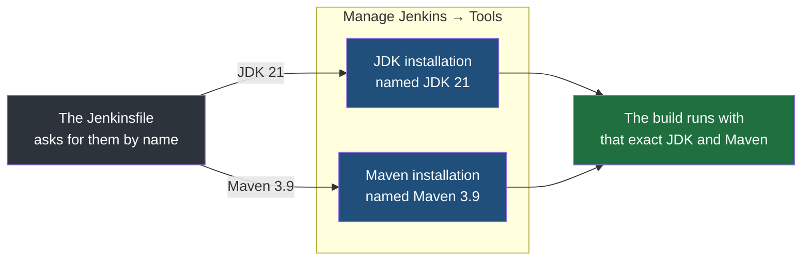
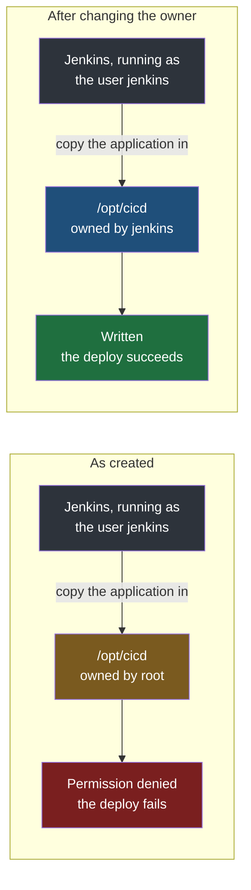
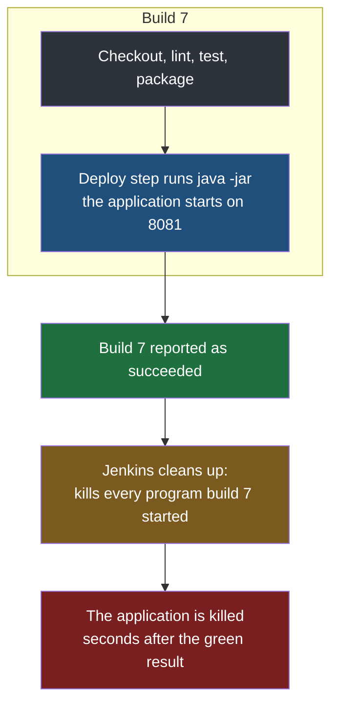
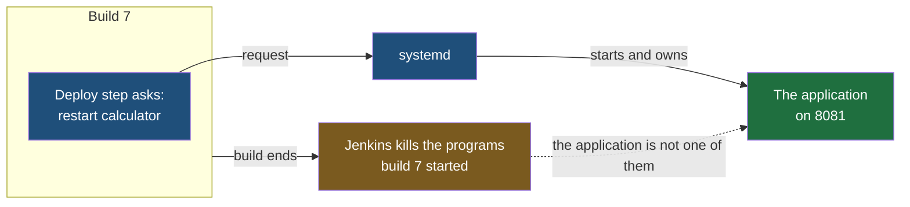
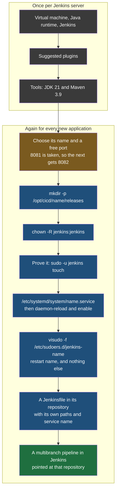

The previous note ended with Jenkins running on a server and knowing nothing about any application. Before it can build and deploy one, four things have to be put in place: Jenkins needs the tools the build uses, the server needs somewhere for the deployed application to live, Jenkins needs permission to put it there, and something other than Jenkins has to be responsible for keeping the application running. The last two are the ones that catch developers out.

## What the server can run at once

Everything in this note is configured from **Manage Jenkins**, the gear icon at the top right of every page. It opens onto Jenkins's whole administration area, and three of its entries under **System Configuration** are the ones used here: **Nodes**, **Plugins** and **Tools**.

![[Devops/05-CI-CD/Images/manage-jenkins.png]]

The first thing worth looking at is the list of nodes. With a single server there is one entry, the built-in node — the controller, doing agent work as well, as the previous note described.

![[Devops/05-CI-CD/Images/nodes.png]]

Each column is a health check Jenkins runs on the node every few minutes. **Architecture** reads `aarch64` because the laptop underneath is an Apple Silicon Mac, and a virtual machine has the same processor family as the machine it runs on. **Free Disk Space** is the room left for workspaces and build output. The two coloured cells are not faults on a practice machine:

- **Free Swap Space, 0 B, in red.** Swap is disk space the operating system borrows as overflow when memory runs out. A Multipass virtual machine is created with none at all, and Jenkins flags that. Builds still run normally as long as memory itself suffices, which is why the machine was given 4 GB rather than the default 1.
- **Free Temp Space, 1.90 GiB, in amber.** On current Ubuntu, `/tmp` is held in memory rather than on disk and is sized at half the machine's RAM — 2 GB here — so it reads small and Jenkins warns about it. A build as small as the one in this folder uses a tiny fraction of that, so the warning costs nothing.

The node's own settings open from the gear at the end of its row, and they show **two executors**. An executor, from earlier in this folder, is one slot on a node that can be given a job, so two executors means this server will run **two jobs at the same time**, and a third one waits in a queue until a slot frees. That number is configurable, and on a server with more capacity it can be raised.

![[Devops/05-CI-CD/Images/node-configure.png]]

**Number of executors** is the setting itself, and changing it and saving is all it takes to raise or lower it. The **Build Executor Status** box on the left reads `0/2` — none of the two slots busy right now — and it is the quickest place to glance at while a build is running to see a slot taken.

## The tools and plugins

The suggested plugins from setup cover most of what a pipeline needs. Nobody keeps their names in their head — there are a great many of them, and what matters is knowing that the starter set is what makes Jenkins able to run a pipeline at all, not being able to list it.

Two are worth recognising, because they are the ones you look at every day:

| Plugin | What it gives you |
|---|---|
| **Pipeline: Declarative** | Support for the declarative pipeline syntax that `Jenkinsfile`s are written in |
| **Pipeline Graph View** | The picture of a run on a pipeline's page, showing each stage, whether it passed, and how long it took |

If one of these is missing, it is installed from **Manage Jenkins → Plugins**, by searching for it and ticking it.
### Telling Jenkins which JDK and which Maven to use

The application built in this folder is Java, built with Maven. Jenkins itself does not know what Maven or a JDK is until it is told, and the place it is told is **Manage Jenkins → Tools**.

![[Devops/05-CI-CD/Images/tools.png]]

There you add a **JDK installation** and a **Maven installation**, and give each one a name. The name is the important part. A pipeline does not say which version of Java to use by describing it; it refers to one of these configured installations by the name it was given, and Jenkins supplies that tool to the build.



> [!important] The Java Jenkins runs on is not the Java a build compiles with.
> The previous note installed a Java 21 runtime so that Jenkins itself could start. That runtime has no compiler and plays no part in building your code. The JDK a pipeline compiles with is whichever one it is given here and asks for by name — so a Jenkins server running happily on Java 21 can still fail every build of a Java 21 application, if the JDK the build receives is an older one.

Everything else on the Tools page — the Maven settings providers at the top and the Git installation Jenkins created for itself — stays as it is. Only the two installations are added.

**The JDK has to exist on the server before Jenkins can be pointed at it.** The runtime from the previous note is not enough: it has no compiler, and a JDK entry pointing at it fails the first time a build tries to compile. The full JDK of the same version adds `javac`:

```bash
# on the server
sudo apt install openjdk-21-jdk
javac -version    # javac 21.0.12
```

It installs into `/usr/lib/jvm/java-21-openjdk-arm64` — the `arm64` because this server runs on an Apple Silicon Mac; on an Intel or AMD machine the directory ends in `amd64`. Then, on the Tools page:

1. Under **JDK installations**, press **Add JDK**.
2. **Name:** `JDK 21`.
3. **Untick Install automatically.** The JDK is already on disk; Jenkins only needs to be told where.
4. **JAVA_HOME:** `/usr/lib/jvm/java-21-openjdk-arm64`.

![[Devops/05-CI-CD/Images/tools-jdk.png]]

Maven is the opposite case. It is not on the server, and it does not need to be — Jenkins can fetch it:

1. Scroll further down the same page, past Git, to **Maven installations**, and press **Add Maven**.
2. **Name:** `Maven 3.9`.
3. **Leave Install automatically ticked**, with **Install from Apache** chosen.
4. **Version:** the newest 3.9 release in the list — 3.9.16 here.

![[Devops/05-CI-CD/Images/tools-maven.png]]

**Saving this does not download Maven.** It only records an instruction for later: when a build asks for `Maven 3.9`, fetch 3.9.16 from the Apache project. Until then, there is no Maven on the server at all. The download happens inside the first build that needs it:

| | What Jenkins does before running `mvn` |
|---|---|
| **The first build** | Looks for Maven 3.9.16 on the server, finds nothing, downloads it from Apache and unpacks it |
| **Every build after** | Looks for Maven 3.9.16, finds the copy from last time, and uses it straight away |

So the first build takes noticeably longer than the rest, and its console output shows Maven being downloaded. That is the one-time fetch, not a fault. The JDK never behaves this way, because it was installed by hand and **Install automatically** was left unticked for it.

**Save** at the bottom of the page keeps both. The names typed here are **not labels** for a human to read — they are exactly what the `Jenkinsfile` will ask for, and a single character's difference between the two means the pipeline fails, reporting that no tool by that name exists.

## Somewhere for the application to live

Deploying means copying the built application onto the server into a known place and running it from there. So that place has to exist first.

On Linux, `/opt` is the conventional directory for add-on application software — **programs that are not part of the operating system and not installed through the package manager.** The application goes under it, in a directory of its own, with a subdirectory where each deployed version is kept:

```bash
# on the server
sudo mkdir -p /opt/cicd/calculator/releases
```

`-p` creates every missing directory along the path in one go, and does nothing if they already exist.

> [!question] Why so many directories? Why not put the code straight into one folder?
> It is convention rather than necessity, and you could follow it or not. The reason to follow it is that it keeps things manageable once there is more than one of anything: one directory per application, and inside it one place holding each released version by name, so that what is running, what ran before and what is about to replace it are all separate and all findable. And the directory is not decoration — it is precisely where the deploy stage of the pipeline will put the application.

## The permission problem

Here is the step that is easy to miss, because everything up to now was done as yourself.

**Jenkins does not run as you.** When the package was installed, it created a Linux user named `jenkins`, and the Jenkins service runs as that user. Everything Jenkins does — checking out code, building it, running tests, and deploying — it does **as `jenkins`**.

The directory just created belongs to `root`, because it was made with `sudo`. The `jenkins` **user has no right to write into it**. So when the pipeline reaches its deploy stage and tries to copy the application into `/opt/cicd/calculator/releases`, it is refused, and the pipeline fails — not because anything is wrong with the code or the pipeline, but because the account doing the work was never allowed in.



The fix is to make `jenkins` the owner of that directory tree, using the same ownership change used for any other user:

```bash
# on the server
sudo chown -R jenkins:jenkins /opt/cicd
```

`chown` changes ownership — here to the user `jenkins` and the group `jenkins` — and `-R` applies it to the directory and everything inside it, rather than only to the top-level directory itself.

### Proving it worked before relying on it

Rather than find out during a deploy, check it directly by acting as the `jenkins` user and trying to write a file:

```bash
# on the server
sudo -u jenkins touch /opt/cicd/calculator/releases/permission-check
ls -l /opt/cicd/calculator/releases
```

`sudo -u jenkins` runs the command as the user `jenkins` instead of as root. If the file appears, `jenkins` can write there, and so the pipeline will be able to as well. If it is refused, the ownership change did not take, and you have found that out in two seconds instead of at the end of a pipeline run.

A passing check looks like this:

```
-rw-r--r-- 1 jenkins jenkins 0 Sep 19 19:47 permission-check
```

`touch` itself prints nothing when it succeeds, so the proof is the `ls` line: the file exists, and its owner and group — the two `jenkins` columns — show it was created by the `jenkins` user rather than by you. A failure would instead stop at the `touch`, with `Permission denied`.

The file has done its job, and nothing else needs it:

```bash
# on the server
sudo -u jenkins rm /opt/cicd/calculator/releases/permission-check
```

## Letting systemd run the application

One more thing has to be settled before the first deploy: **what actually starts the application**, and what restarts it when a new version arrives.

The obvious answer is to let the pipeline start it: make the last step of the deploy stage `java -jar` on the new jar. **That does not work**, and the reason is something Jenkins does on purpose.

A build is a temporary piece of work with an end. **When it ends, Jenkins cleans up after it by killing every program that build started.** Picture what happens without that cleanup: every build that started a test server, a database or a background script would leave it running for good, and after fifty builds the server is full of forgotten programs holding memory and ports. So Jenkins treats anything a build started as belonging to that build, and removes it when the build is over.

The catch is that Jenkins cannot tell a leftover test server from the application you meant to keep. To Jenkins, an application started by the deploy step is just another program the build started:



The pipeline shows green, and nothing is listening on port `8081`. That is a worse failure than a red build, because nothing reports it.

The way out is for the build never to start the application itself. It has to be started by something that is not a build, so that the cleanup has nothing of the build's own to kill. The build only asks for the restart; the program that does it, and that owns the running application afterwards, is outside the build:



On Ubuntu that program is `systemd`, the part of the system that starts and supervises services — the same mechanism that runs Jenkins itself. The application is described to it once, in a small file. Services you define yourself live in `/etc/systemd/system/`, and that directory belongs to root, so the file is created with `sudo`:

```bash
# on the server
sudo nano /etc/systemd/system/calculator.service
```

`nano` is a simple editor that opens in the terminal. The file starts empty; this is its entire content:

```ini
# /etc/systemd/system/calculator.service
[Unit]
Description=Calculator service

[Service]
User=jenkins
ExecStart=/usr/bin/java -jar /opt/cicd/calculator/current.jar
Restart=on-failure

[Install]
WantedBy=multi-user.target
```

`ExecStart` is the command that starts it. It always runs `/opt/cicd/calculator/current.jar` — not a particular release, but a link that each deploy points at the newest release, so the service file never has to change. `Restart=on-failure` has `systemd` start it again if it crashes. `WantedBy=multi-user.target` makes it start whenever the server boots. `User=jenkins` runs it as the same user that owns the directory; a larger setup would give the application a user of its own.

The Java it runs on is the Java 21 runtime installed for Jenkins — a runtime is all an already-built jar needs.

In `nano`, **Ctrl+O** then **Enter** saves the file, and **Ctrl+X** leaves the editor.

Writing the file is not enough on its own. `systemd` reads its service files when it starts and does not notice a new one appearing afterwards, so it has to be told to read them again. Then the service is set to start at boot:

```bash
# on the server
sudo systemctl daemon-reload
sudo systemctl enable calculator
```

`daemon-reload` prints nothing when it succeeds. `enable` prints one line, and that line shows what enabling actually is:

```
Created symlink '/etc/systemd/system/multi-user.target.wants/calculator.service' → '/etc/systemd/system/calculator.service'.
```

`multi-user.target` is the point in booting at which the server is up and ready for ordinary services, and its `.wants` directory is the list of services started when it is reached. Enabling a service is nothing more than placing a link to its file in that list — which is exactly what the `WantedBy=multi-user.target` line in the file asked for. `disable` removes the link again.

```bash
# on the server
systemctl is-enabled calculator   # enabled
```

> [!important] Do not start it yet.
> `current.jar` does not exist. Nothing has been built or deployed so far, so `sudo systemctl start calculator` now would only fail, with Java unable to find the jar. The service is defined and enabled, and that is all it should be at this stage. The pipeline's first deploy creates `current.jar` and restarts the service itself — which is the next thing to set up.

### Allowing Jenkins to restart it, and nothing else

Each deploy ends by asking `systemd` to restart the service, which needs `sudo`, which normally needs a password — and a pipeline has nobody to type one. So `jenkins` is allowed to run **exactly that one command** without a password, through a rule file edited with `visudo`, which checks the file's syntax before saving it:

```bash
# on the server
sudo visudo -f /etc/sudoers.d/jenkins-calculator
```

```
# /etc/sudoers.d/jenkins-calculator
jenkins ALL=(root) NOPASSWD: /usr/bin/systemctl restart calculator
```

> That line grants `jenkins` the right to **restart this one service as root,** without a password, and grants nothing more. It cannot stop other services, install software or read other users' files.

> [!warning] Grant the single command, never general sudo.
> It is tempting to give `jenkins` passwordless `sudo` for everything and move on. That turns every pipeline, and every change anyone merges into a `Jenkinsfile`, into full control of the server — a `Jenkinsfile` is code, and any step in it would run as root. Naming the one command the pipeline genuinely needs keeps a compromised or careless pipeline limited to restarting one application.

> [!tip] Test permissions as the user who will need them, never as yourself.
> Everything works when you try it yourself, because you are usually an administrator with `sudo`. That proves nothing about an account with ordinary rights. The whole value of `sudo -u` here is that it reproduces the exact conditions the pipeline will run under — and it is the same habit that saves time with any service that runs under an account of its own.

## Doing it again for the next application

Only part of this note is a one-time cost. The Java runtime, Jenkins itself, its plugins and the JDK and Maven entries under **Tools** belong to the Jenkins server and are shared by everything it builds. Everything from **Somewhere for the application to live** onwards belongs to **one application**, and a second application — a second repository, a second service — needs all of it again under its own name.



**The name has to be the same in every step.** The directory, the service file, the sudoers rule and the `Jenkinsfile` all refer to the application by name, and nothing checks that they agree. A service called `billing` with a sudoers rule for `billing-service` fails only at the deploy stage, as a password prompt the pipeline cannot answer.

The port is the one thing that must be **different** each time. Two applications on one server cannot both listen on `8081`, and the second to start fails because the address is already in use. The port is set in each application's own `application.properties`, as `server.port`, and a list of which application holds which port is worth keeping from the second application onwards.

### How many pipeline files a set of microservices needs

A system split into microservices raises the obvious version of this question: does every service need its own `Jenkinsfile`? The answer follows from how the code is stored rather than from how many services there are, and both arrangements were covered when repository layout was discussed.

| Layout | Pipeline files |
|---|---|
| **Polyrepo** — each service in its own repository | One `Jenkinsfile` per repository, so one per service |
| **Monorepo** — several services in one repository | One file can serve them all, because there is one repository to watch and one place a `Jenkinsfile` can sit |

**Separate repositories force separate pipelines**, and that is usually a feature rather than a cost. Each service is deployed to its own place, on its own port, under its own service name, and quite possibly on its own schedule. It may also have rules the others do not: one service might have integration tests worth running on every change, another might skip them, a third might need an extra packaging step. Those differences have to live somewhere, and a pipeline file belonging to exactly one service is the natural home for them.

A monorepo makes one file possible, not compulsory. The price of the single file is that a change to any service runs the pipeline for all of them unless the file is written to detect which parts of the repository actually changed — which is a real technique, and a real piece of extra complexity to maintain.
