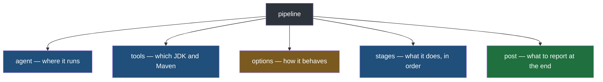
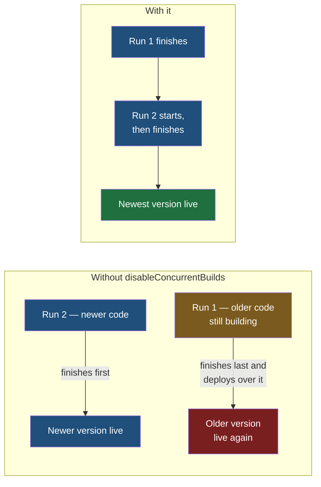

The application now builds and passes its tests on the developer's machine. The earlier notes on declarative pipelines showed the shape of a `Jenkinsfile` with a few stages in it; this note is a complete one, for this application, as it would actually be written — every block in it, and what each one is there to prevent.

## The whole file first

```groovy
// Jenkinsfile — at the root of the repository
pipeline {
    agent any

    tools {
        jdk 'JDK 21'
        maven 'Maven 3.9'
    }

    options {
        skipDefaultCheckout()
        timestamps()
        disableConcurrentBuilds()
    }

    stages {
        stage('Checkout') {
            steps {
                checkout scm
            }
        }
        stage('Lint') {
            steps {
                sh 'mvn pmd:check'
            }
        }
        stage('Unit tests') {
            steps {
                sh 'mvn test'
            }
            post {
                always {
                    junit 'target/surefire-reports/*.xml'
                }
            }
        }
        stage('Package') {
            steps {
                sh 'mvn package'
                archiveArtifacts artifacts: 'target/*.jar'
            }
        }
        stage('Deploy') {
            when {
                branch 'main'
            }
            steps {
                sh 'cp target/*.jar /opt/cicd-demo/calculator/releases/calculator-${BUILD_NUMBER}.jar'
                sh 'ln -sfn /opt/cicd-demo/calculator/releases/calculator-${BUILD_NUMBER}.jar /opt/cicd-demo/calculator/current.jar'
                sh 'sudo systemctl restart calculator'
            }
        }
        stage('Smoke test') {
            when {
                branch 'main'
            }
            steps {
                sh 'curl -f --retry 10 --retry-delay 3 --retry-connrefused http://localhost:8081/health'
            }
        }
    }

    post {
        success {
            echo 'Pipeline succeeded'
        }
        failure {
            echo 'Pipeline failed — deployment was blocked'
        }
    }
}
```

It looks long, but it is five kinds of block, each with one job:



## agent

`agent any` is familiar from earlier: run this on any agent that is available. With more precision now that executors are part of the picture — **whichever agent is free, and whichever executor on that agent is free**, takes the job.

## tools

This is where the names given under **Manage Jenkins → Tools** are used. `jdk 'JDK 21'` and `maven 'Maven 3.9'` ask for the installations configured under exactly those names, and Jenkins makes them available to every `sh` command in the pipeline. If the names here do not match the names configured there, the pipeline fails before it does anything.

## options

**Options are not compulsory.** A pipeline runs perfectly well without this block. These three are here because each one removes a specific annoyance or a specific danger.

**`skipDefaultCheckout()`** needs the idea of a checkout first. The code lives in a repository, on some branch. Jenkins cannot build what it does not have, so before anything else it must fetch the code into its workspace — the directory on the agent where this job's files live. That fetch is the **checkout**, and it is the same idea as checking out a branch in Git: Jenkins takes the exact revision that triggered the run and puts those files on disk.

Jenkins does this **automatically**, before the first stage, unless told not to. `skipDefaultCheckout()` tells it not to, and the pipeline then does the checkout itself, as its first stage. The effect is that the checkout becomes visible — a named stage, with its own timing and its own success or failure — instead of something that happened invisibly before the pipeline started.

**`timestamps()`** puts the time at the start of every line of the pipeline's log. When something takes eleven minutes and you are trying to find out which part, a log with times on it answers the question at a glance; a log without them leaves you guessing.

**`disableConcurrentBuilds()`** stops two runs of the same pipeline happening at once. Without it, a second push can start a second run while the first is still going — and then the order of events is up to chance. The second run can finish and deploy while the first is still building, after which the first fails, or worse, succeeds and deploys an older version over the newer one. With this option, the second run waits in the queue until the first has finished.



## stages

These are the work, in the order the earlier notes laid out.

**Checkout** — `checkout scm`. Here `scm` is a special variable Jenkins provides that means the repository and the exact revision that triggered this run. It works equally whether the code is on GitHub, GitLab or anywhere else Jenkins was pointed at, which is why the stage never names a repository.

**Lint** — `mvn pmd:check` analyses the source and **fails the build if it finds any violation** of its rules, such as a variable declared and never used or a private method written and never called. Code that is half-finished stops here.

**Unit tests** — `mvn test` runs the test suite. The `post` block attached to this stage matters more than it looks. By default, when the tests run, their results are shown in the log and then thrown away: Jenkins knows the stage passed, but not that seven tests ran, which ones, or how long each took. `junit 'target/surefire-reports/*.xml'` hands Jenkins the report files Maven writes after every test run, and Jenkins keeps them — so test results are recorded per build and can be compared across builds. It sits under `always` so the results are recorded **even when tests fail**, which is exactly when you most want to read them.

> [!note] There is no separate step to install dependencies.
> Some build tools need an explicit install step first, and a pipeline for them has a stage for it. Maven does not: it reads the dependency list in `pom.xml` and downloads whatever is missing as part of any command, so the first `mvn` command in the pipeline takes care of it.

**Package** — `mvn package` produces the jar. As an earlier note established, asking Maven for a phase runs every phase before it, so this stage recompiles and runs the tests again on the way; for a small project that repetition is cheap, and the separate stages keep a lint failure, a test failure and a packaging failure distinguishable at a glance. Then `archiveArtifacts` keeps a copy of the jar in Jenkins.

Keeping that copy is what makes older builds useful. Every run has a **build number**, counting up from 1, available in the pipeline as `BUILD_NUMBER`. With artifacts archived, the jar from build 7 is still there after build 12 has replaced it — so an older version can be redeployed, and a build that failed or ran unusually slowly can be investigated after the fact. Without it, only the newest jar exists anywhere.

**Deploy** — three commands, each depending on the server preparation in the previous notes:

| Command | What it does |
|---|---|
| `cp` | Copies the jar into the releases directory, named with its build number, so every release is kept separately |
| `ln -sfn` | Points `current.jar` at that new release. `-s` makes it a symbolic link — a small file that stands for another file — and `-f` replaces the old link rather than refusing because one exists |
| `sudo systemctl restart calculator` | Asks `systemd` to stop the running version and start again from `current.jar`, which is now the new release |

The link is what makes the restart simple: the service always runs `current.jar`, and deploying is just changing what that name points at. It also makes going back simple. Every previous release is still in the directory, so returning to build 7 means pointing `current.jar` at `calculator-7.jar` and restarting — no rebuild needed.

And the restart is done by `systemd` rather than by the pipeline itself for the reason the previous notes gave: Jenkins terminates whatever a build started once the build ends, so an application launched directly by the pipeline would not survive it.

A real deploy stage usually also prints what it is doing as it goes — which build number it is deploying, which directory it is writing to, that it is starting the new version — using `echo`. None of those lines change what happens; they exist so that the console output of a run tells a readable story when somebody has to work out afterwards what a deploy actually did. They can be removed, and are usually worth keeping.

This stage has a condition in front of it, and the condition is the most important line in the file:

```groovy
when {
    branch 'main'
}
```

**The stage only runs when the branch being built is `main`.** Every other branch — every feature branch any developer pushes — goes through checkout, lint, tests and packaging exactly as `main` does. Then deploy is skipped.

> [!warning] The branch named here must be the one your repository actually deploys from.
> Repositories name their primary branch either `main` or `master`, and nothing forces the `Jenkinsfile` to agree. If the condition names a branch that does not exist in the repository, the deploy and smoke-test stages are skipped on every run — and because a skipped stage is not a failure, the pipeline still reports success. Check which name your repository uses before trusting this line. The next note shows exactly this happening.

> [!important] Every branch is checked. Only one branch is deployed.
> There is only one version of the application that customers use, so only one branch may ever reach the server. But every branch deserves to know, within minutes, whether it lints, passes its tests and packages. The `when` condition is what gets both: a feature branch gets the full verdict on its code without ever touching production, and the branch that is deployed has already passed everything the others do.

**Smoke test** — after deploying, `curl` asks the freshly deployed application's health endpoint whether it is alive. `-f` makes it fail outright if the server answers with an error, which in turn fails the stage.

The other three options exist because of timing. A Spring Boot application takes a few seconds to start, and the smoke test runs the instant the restart command returns — so the first attempt usually finds nothing listening yet. `--retry 10` tries up to ten more times, `--retry-delay 3` waits three seconds between tries, and `--retry-connrefused` counts a refused connection as worth retrying rather than as a final answer. Together they give the application about half a minute to come up. If it has not answered by then, it genuinely failed to start, and the stage fails.

It carries the same `when` condition, since there is nothing to smoke-test on a branch that was never deployed.

The three checks in this pipeline each prove something different, and the smoke test is the one that proves the thing the others cannot:

| Check | What it proves |
|---|---|
| Lint | The code is well formed — nothing declared and abandoned, no rule broken |
| Unit tests | The business logic is right — 2 and 3 really do make 5 |
| Smoke test | **The deployed application is actually running and answering** |

Lint and tests can pass on a jar that then fails to start on the server — wrong port, missing configuration, a permission problem. Only a check against the deployed thing catches that, and only after deployment is there anything to check.

## post

After all the stages, `post` reports the outcome. On `success` it prints that the pipeline succeeded. On `failure` it says the pipeline failed and **deployment was blocked** — which tells whoever reads it, developer or DevOps engineer, both that something went wrong and that nothing bad reached the server as a result.

## The same file for any stack

**This structure does not change with the language.** A Spring Boot application, a Django or Flask application, a .NET application — each gets the same shape: an agent, the tools that stack needs, whatever options are wanted, then checkout, lint, test, build or package, deploy, smoke test, and a report. What changes is the tool names and the commands inside the `sh` steps. Learn the shape once and every other `Jenkinsfile` is a variation on it.

> [!question] Can the file be called something other than Jenkinsfile?
> Keep it as `Jenkinsfile`, at the root of the repository. That is the name Jenkins looks for by default, it is what every other developer who opens the repository expects, and nothing is gained by departing from it.

> [!question] Could the pipeline be written in Python instead of Groovy?
> No. A `Jenkinsfile` is Groovy, and Jenkins reads it as Groovy. The declarative form is what keeps that from mattering, since it asks for very little of the language.

> [!question] Can old builds be seen from the dashboard?
> Yes — each build is listed by its build number, and because the artifacts were archived, the jar from each one is still attached to it.
