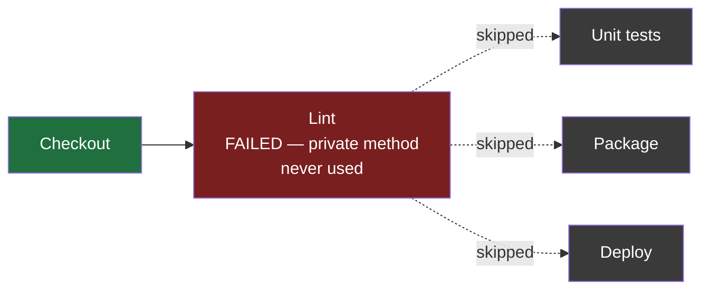
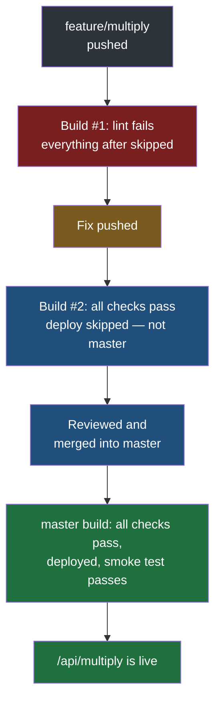

Everything is now in place separately — Jenkins on a server with its tools configured, a directory it may deploy into, an application that passes its tests, and a `Jenkinsfile` describing the pipeline. None of it is connected yet. This note connects the repository to Jenkins and follows what happens as code is pushed: a first deploy, a feature branch that fails, a fix, a merge, and a live application that changed without anybody logging into the server.

## Getting the code into a repository

Jenkins builds what is in a repository, so the application has to be in one. The sequence is the ordinary one for publishing a local project, covered in detail in [[../03-Git/03-Working-With-A-Remote-Repository|working with a remote repository]]:

1. Initialise Git in the project directory and commit everything — the source, the tests, `pom.xml` and the `Jenkinsfile`.
2. Create an **empty** repository on GitHub, with nothing in it.
3. Connect the local repository to that remote one.
4. Push.

```bash
# in the project directory, on the developer's machine
git init
git add .
git commit -m "Add calculator service"
git remote add origin https://github.com/bookcart/calculator-service.git
git push -u origin master
```

> [!question] How can there be a master branch to push, when the GitHub repository was just created empty?
> Because the branch was created locally, not on GitHub. `git init` made a local repository, and the first commit created its first branch there. The GitHub repository really was empty — it was only connected afterwards, with `git remote add`, and the push is what copied the local branch up to it. The order is local first, then connect, then push, and the empty remote simply receives what the local side already had.

Note the name of that branch. **Unless Git has been configured otherwise, `git init` names the first branch `master`.** Many teams and many tools now expect `main`. Whichever your repository uses, it has to agree with the branch name in the `Jenkinsfile`, which here says `master`.

## Pointing Jenkins at the repository

The pipeline type used here is a **Multibranch Pipeline**. Rather than a pipeline tied to one branch, it watches a whole repository, **discovers every branch that contains a `Jenkinsfile`**, and runs a separate pipeline for each one. A new branch pushed tomorrow gets its own pipeline automatically, without anybody configuring it.

Creating one:

1. On the dashboard, **New Item**.
2. Give it a name — the repository's name is the natural choice — and choose **Multibranch Pipeline**, then **OK**.

![[Devops/05-CI-CD/Images/new-item.png]]

3. Under **Branch Sources**, add the Git source and enter the repository's address, with **Discover branches** enabled so it finds them all.

![[Devops/05-CI-CD/Images/branch-sources.png]]

4. Under **Scan Multibranch Pipeline Triggers**, tick **Periodically if not otherwise run** and choose an interval.

![[Devops/05-CI-CD/Images/scan-triggers.png]]

5. Save.

### How Jenkins notices a push

That last setting deserves understanding, because it decides how quickly anything happens.

There are two ways one system can learn that something changed in another, and the distinction turns up well beyond this subject:

| | Pull | Push |
|---|---|---|
| How it works | Jenkins asks the repository at a fixed interval whether anything is new | The repository tells Jenkins the moment something is pushed |
| Delay | Up to one interval | Near-immediate |
| What it needs | Nothing beyond the scan setting | A **webhook** — the repository calling an address on the Jenkins server |
| Set up here | Yes | No |

This setup pulls. Every interval, Jenkins scans the repository, and any branch with new commits gets a new build.

> [!question] How does the push direction actually work — is there a message queue behind it?
> No. A webhook needs nothing so elaborate: it is an ordinary HTTP request. The repository is configured with an address, and when the event happens it sends a request to that address carrying a description of what changed. The receiving system is listening on that address and acts on what arrives. There is no broker in between, nothing subscribes to a topic, and no queueing system such as Kafka is involved — which is the usual guess, because the pattern of one system telling another that something happened does look like messaging from a distance.

**The interval is a trade.** In production it is set to something like an hour or two, or even a day: scanning more often makes Jenkins keep asking about repositories that have not changed. For a demonstration it is set to **one minute**, which is the smallest the setting allows — deliberately, aggressively short, so that the effect of a push is visible almost immediately. Nobody runs it that low for real.

And a build can always be started by hand: every pipeline has a **Build Now** button, which runs it immediately regardless of the schedule. In production, builds are normally left to start themselves.

## The first run

After saving, Jenkins scans the repository and finds one branch, `master`, containing a `Jenkinsfile`. It starts that branch's **build #1**. The pipeline's own page lists every branch it has found, one row each, with the result of its latest build:

![[Devops/05-CI-CD/Images/branches.png]]

The green tick in **S** is the last build's status. The sun in **W**, for weather, summarises the recent builds — sunny when they have all passed, clouding over as more of them fail. The play button at the end of the row is **Build Now** for that branch.

Clicking into the build and opening **Console Output** shows everything it did, line by line and in order — fetching the code, then each stage of the `Jenkinsfile` with its commands and their output. This log is where you go first whenever anything fails.

This first run goes through every stage in order: checkout, lint, tests, package, **deploy** and **smoke test**. Deploy and smoke test run because the branch being built is `master`, which is exactly what the `when` condition in the `Jenkinsfile` names. It is also the slowest run this pipeline will have, because everything is being fetched for the first time: Jenkins downloads Maven itself, and Maven then downloads every library the application and its plugins depend on from Maven Central, the public repository of Java libraries. The console output fills with hundreds of `Downloading from central` and `Progress` lines. Maven keeps what it downloads in a local cache on the server, so the next run finds them there and skips all of it.

## Proof that it deployed

The proof is not in Jenkins — it is on the server. A browser pointed at the server's address and the application's port, `http://192.168.64.2:8081/health`, gets an answer: the service is up. And `http://192.168.64.2:8081/api/add?a=10&b=20` returns **30**.

The smoke test at the end of the build's console output shows the other half of the story — and why its retry options exist:

```
00:00:46.229  curl: (7) Failed to connect to localhost port 8081 after 0 ms: Could not connect to server
00:00:46.229  Warning: Problem : connection refused. Will retry in 3 seconds. 10 retries left.
00:00:49.602  {"version":"0.0.1-SNAPSHOT","service":"calculator","status":"UP"}
...
00:00:49.752  Pipeline succeeded
Finished: SUCCESS
```

The first attempt came a fraction of a second after `systemctl restart`, while the application was still starting, and nothing was listening yet on `8081` — connection refused. Without `--retry-connrefused` that single refusal would have failed the build. Three seconds later the retry got the health response, with the version number and the service name, and the pipeline finished.

On the server, the deploy stage's work is visible directly:

```bash
# on the server
ls -l /opt/cicd/calculator /opt/cicd/calculator/releases
```

```
/opt/cicd/calculator:
lrwxrwxrwx 1 jenkins jenkins   46 Sep 19 20:35 current.jar -> /opt/cicd/calculator/releases/calculator-1.jar
drwxr-xr-x 2 jenkins jenkins 4096 Sep 19 20:35 releases

/opt/cicd/calculator/releases:
-rw-r--r-- 1 jenkins jenkins 19906367 Sep 19 20:35 calculator-1.jar
```

The release is named after the build number — `calculator-1.jar` from build #1 — and `current.jar` is a link pointing at it, which is what the `calculator` service runs. Build #2 will add `calculator-2.jar` beside it and move the link.

**Nobody copied a file to the server, nobody restarted anything by hand.** A push to a branch was the whole of the developer's involvement, and the application on the server is now running that code — the deploy stage copied the new jar, pointed `current.jar` at it and had `systemd` restart the service.

> [!note] This is continuous deployment, not continuous delivery.
> Recall the distinction from earlier in this folder: under continuous delivery the pipeline takes a change as far as ready-to-deploy and then waits for a person to approve it; under continuous deployment nothing waits. This pipeline has no approval step anywhere — a commit on `master` that passes every stage is deployed, immediately and automatically. Turning it into continuous delivery would mean adding a stage before deploy that pauses for a person to confirm.

## A feature branch that fails

Now the normal day-to-day case: a new feature, developed on its own branch.

A developer creates a branch named `feature/multiply`, adds an `/api/multiply` endpoint, adds a private method doing the multiplication, and writes a test for it. They commit with a message describing the change and push the new branch:

```bash
# on the developer's machine
git checkout -b feature/multiply
# … write the endpoint, the method and the test …
git add .
git commit -m "Add multiplication"
git push -u origin feature/multiply
```

Within a minute Jenkins has discovered a branch it did not know about, created a pipeline for it, and started **`feature/multiply` build #1**.

It fails.

The pipeline graph shows it plainly: **Lint** is red, and every stage after it — tests, package, deploy, smoke test — is marked as skipped because of an earlier failure. The console output says why, in one line, because the Lint step runs with `-Dpmd.printFailingErrors=true`:

```
[WARNING] PMD Failure: com.lab.jenkins.CalculatorController:49 Rule:UnusedPrivateMethod Priority:3 Avoid unused private methods such as 'multiplyNumbers(int, int)'..
[ERROR] Failed to execute goal org.apache.maven.plugins:maven-pmd-plugin:3.28.0:check (default-cli) on project jenkins: PMD 7.17.0 has found 1 violation.
```

Without that flag the first line is missing, and the console only reports that there was one violation and names a report file on the server — a red build that does not say what is wrong. The endpoint was written, and the private multiply method was written, but the endpoint never actually calls the method. It computes nothing with it. The linter's rule against a private method that is written and never used caught it.



> [!important] This is the pipeline working, not the pipeline failing.
> A method that was written and never wired in is exactly the half-finished work that slips through a manual process. Nobody reviewing quickly would necessarily see it; the code compiles, and nothing crashes. Here it was stopped within a minute of being pushed, on a branch nobody else depends on, with the reason written in the log — and it never got near the server.

The fix: make the endpoint call the method. Commit it as a quick fix and push again. The next scan sees a new commit on `feature/multiply`, and **build #2** of that branch starts by itself. This time lint passes, the tests pass, the package is produced — and deploy and smoke test are skipped, because this is not `master`. The branch has been fully checked and has touched nothing.

## Merging, and the deploy that follows

Once the feature is ready, it is merged into `master` — normally through a pull request, where a colleague reviews it first. The merge is a new commit on `master`, so at the next scan `master` gets a new build.

On `master`, every stage runs, deploy included. When it has finished, `http://192.168.64.2:8081/api/multiply?a=10&b=2` returns **20**. The new feature is live.



While all this runs, the server's **two executors** are the limit. With several branches building at once, a new build waits in the queue until one of the two slots is free — and then the agent picks it up.

> [!question] Can the number of executors be raised?
> Yes. It is a setting on the node, and on a server with more processor and memory to spare it can be increased so more builds run at once. The limit exists to stop so many builds running together that each one is slowed down by the others.

## A failure worth recognising

There is one more failure worth knowing on sight, because it is common and its message does not say what is actually wrong.

A pipeline for a Java 21 application fails in the compile step, every stage after it is skipped, and the log says:

```
error: release version 21 not supported
```

**The code is fine. The JDK is wrong.** The project asks the compiler to produce Java 21 code, and the compiler doing the build comes from a JDK older than 21, which does not know how. The same message appears for any version a JDK is too old to target.

The confusing part is that the Jenkins server itself is running on Java 21. But as the earlier note on preparing the server stressed, the Java Jenkins runs on and the Java a build compiles with are separate things. The build uses the JDK it is given — through the `tools` block, from an installation configured under **Manage Jenkins → Tools** — and if no such installation exists, or the `tools` block names an older one, the build gets whatever older JDK is to hand.

The fix is on the Jenkins side, not in the code: configure a JDK 21 installation under **Tools**, and make sure the `Jenkinsfile`'s `tools` block asks for it by name.

## What changed for the developer

Put the whole note together and look at what the developer did in it. They pushed code to branches, fixed what the pipeline told them was broken, and merged when the work was reviewed. They never connected to the server, never built a package by hand, never copied a file anywhere and never restarted the application.

> [!tip] The whole point, in one line.
> Every check that the first note in this folder showed being skipped because somebody forgot — the linter, the tests, deploying the right build, confirming it runs — now happens on every push, in the same order, without anybody remembering to do it. And the branch that reaches customers is the only one that could have got there after passing all of it.
