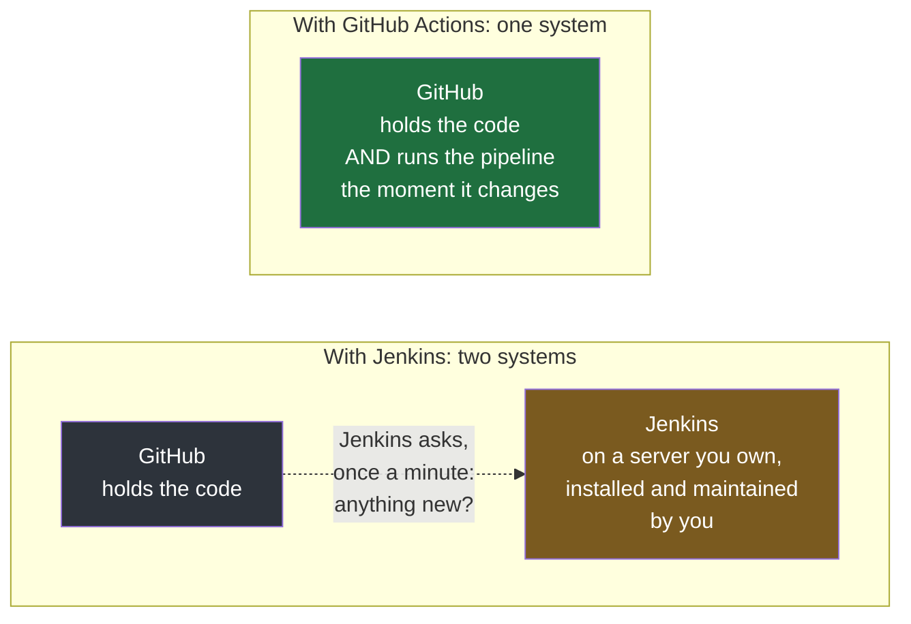
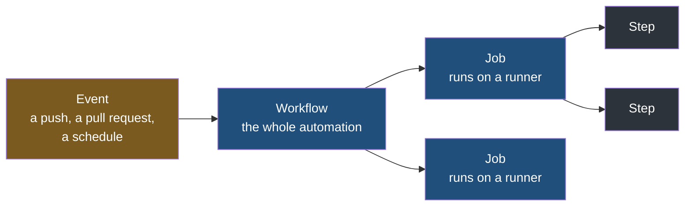

The pipeline in the previous notes works, and it is worth counting what it took to get there. A virtual machine. Java installed on it. The Jenkins package, its plugins, a JDK and a Maven installation configured by hand through its settings pages. A directory for the application, a systemd unit to own the process, a sudoers rule so the build could restart it. Only after all of that did a single line of the application get built. And Jenkins still had to be told where the repository was, and then ask it once a minute whether anything had changed.

Now notice where the code was the whole time. It was on GitHub. Jenkins was a separate piece of software, on a separate machine, looking in from outside and repeatedly asking a question the repository already knew the answer to.

**GitHub Actions is what happens when the continuous integration engine is moved inside the thing that already holds the code.** Same idea as Jenkins — something watches for a change and runs a sequence of steps in response — but built into the repository host rather than bolted onto it.



The engine being inside the product has one immediate consequence: **nothing has to be asked.** Jenkins polls because it is a stranger — it has no way of knowing about a push except by enquiring, over and over, almost always to be told nothing has changed. GitHub Actions never polls, because the system that would do the asking and the system that would be asked are the same system. A workflow starts at the moment of the push rather than up to an interval later.

## What it can be set off by

A useful way to see the range is to group what it reacts to. Four groups cover most real use.

| When this happens | You can make it | Why anybody wants that |
|---|---|---|
| A pull request is opened against `master` | Run the test suite | The tests run before the merge rather than after, so broken code is caught while it is still somebody's proposal |
| A pull request is merged | Build, package and deploy | The branch customers see is updated by merging, and by nothing else |
| An issue is opened, or a review comment is left unaddressed | Label it automatically, or remind the person it is assigned to | Housekeeping nobody does reliably by hand |
| A fixed time of day arrives | Run any script at all | Work that has to happen on a clock rather than in response to a change |

The first two are things the Jenkins pipeline in this folder already did. **The third is where the difference shows.** An issue and a review comment are GitHub's own concepts, and Jenkins — sitting outside, watching for commits — has no notion of them at all. It can be made to hear about them, with the right plugin and a webhook pointed at it, but that is integration work you do. An engine living inside the repository host can act on everything the host knows about, with nothing to connect up, because there is no gap to bridge.

## The same ideas, different words

Nearly everything from the Jenkins notes carries over. What changes is vocabulary, and the fastest way into GitHub Actions is to read that vocabulary as a translation rather than as new material.

| In Jenkins | In GitHub Actions | What it means |
|---|---|---|
| Trigger | **Event** | The thing that happens and sets the automation off |
| Pipeline | **Workflow** | The whole automation, start to finish |
| Stage | **Job** | One named phase of it |
| Agent | **Runner** | The machine a job actually runs on |
| Step | **Step** | One command or action inside a phase |



The one genuinely new word is **runner**, and it is the one that repays attention later, because where a job runs turns out to be the thing that breaks first.

## Where the files live

A `Jenkinsfile` sits at the root of the repository and there is one of them. GitHub Actions uses a fixed directory instead, and you may put as many files in it as you like:

```
your-repository/
├── .github/
│   └── workflows/
│       ├── pre-tests.yml
│       └── deploy.yml
├── src/
└── pom.xml
```

**This location is not a convention you can vary.** GitHub scans `.github/workflows/` and nowhere else; a workflow file anywhere else in the repository is an ordinary file that nothing reads. The directory name is `workflows`, plural.

Each file in there is one workflow — the equivalent of one Jenkins pipeline. Splitting them up is the normal case rather than an advanced one: a repository typically has one workflow for testing a proposal, another for deploying a merge, and perhaps a third on a nightly schedule. They are separate files because they answer to different events and do different work.

## What it does and does not remove

GitHub Actions takes away the **server** that **runs** the pipeline. It does not take away the server the application **runs on**.

|                                          | Jenkins, as built in this folder                      | GitHub Actions                                |
| ---------------------------------------- | ----------------------------------------------------- | --------------------------------------------- |
| Machine that executes the pipeline       | A virtual machine you created, installed and maintain | Provided by GitHub, created fresh for the run |
| Software to install and keep updated     | Jenkins, its plugins, its JDK and Maven installations | None                                          |
| Machine the application is deployed onto | Yours                                                 | **Still yours**                               |

That last row is the one to hold on to. Building, testing and packaging can all happen on machines GitHub owns and throws away afterwards. But an application has to run somewhere permanent, and that somewhere is still a server you are responsible for — whether that is a cloud instance or the same virtual machine from the earlier notes. Moving to GitHub Actions removes one of those two servers, not both.
