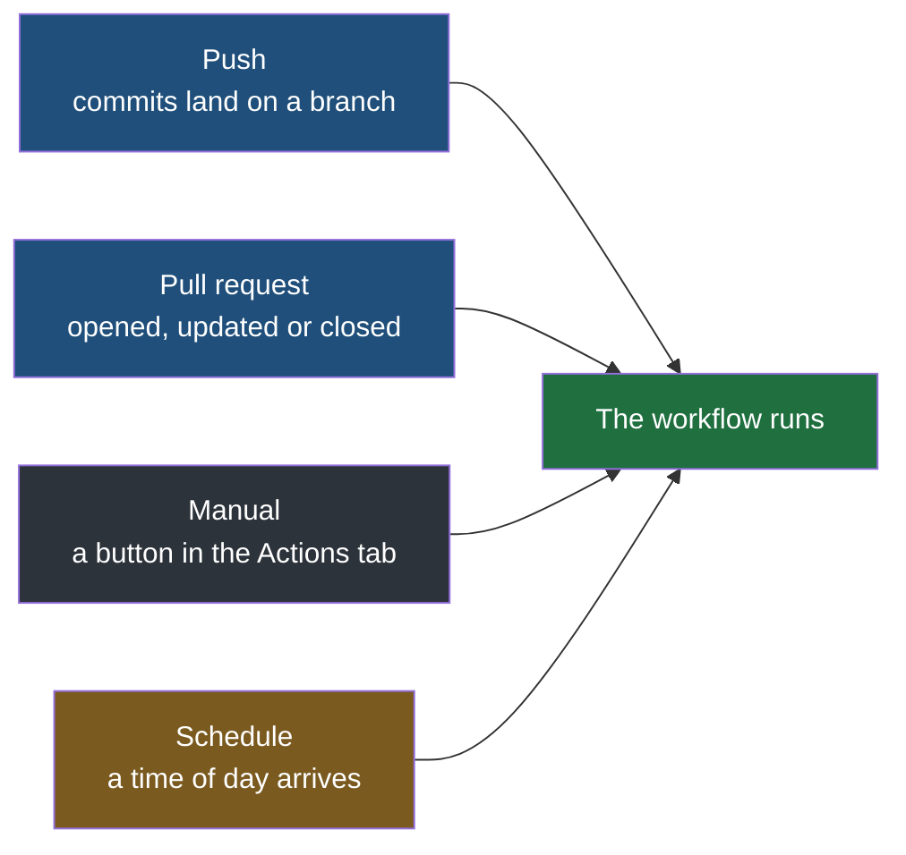

An event is the thing that sets a workflow off, and it is the first line of real content in any workflow file. Everything else in the file describes what to do; the event decides when any of it happens at all.

It is written under a top-level key called `on`:

```yaml
# .github/workflows/pre-tests.yml
name: PR Tests

on:
  pull_request:
    branches:
      - master
```

Read that as a sentence: run this workflow when a pull request is opened against `master`. The `name` above it is free text and shows up in the repository's Actions tab, which matters more than it sounds — when three workflows are listed side by side after a push, the name is how you tell which one failed.

## The four that cover most work

| Event        | Written as          | Fires when                                   | Typically used for                                                    |
| ------------ | ------------------- | -------------------------------------------- | --------------------------------------------------------------------- |
| Push         | `push`              | Commits are pushed to a branch               | Building and testing whatever just landed                             |
| Pull request | `pull_request`      | A pull request is opened, updated, or closed | Testing a proposal before it is allowed in, and deploying after it is |
| Manual       | `workflow_dispatch` | Somebody presses a button in the Actions tab | Anything you want run on demand — a one-off deploy, a cleanup         |
| Schedule     | `schedule`          | A time you specify arrives                   | Work that happens on a clock rather than in response to a change      |

Those four are the common ones rather than the whole list. GitHub publishes an event for most things that can happen to a repository — a release being published, an issue being opened, a review being submitted, a branch being created — and the full set is in its documentation. The shape is always the same: a key under `on`, optionally narrowed by filters beneath it.



## Narrowing which branch

An event on its own is broad. `push` with nothing under it means every push to every branch, which is rarely what anybody wants — a workflow that deploys should not deploy because somebody pushed to a scratch branch.

The `branches` filter narrows it:

```yaml
on:
  push:
    branches:
      - master
```

That fires on pushes to `master` and ignores every other branch. The same filter works under `pull_request`, where it means something slightly different and worth being careful about: **it filters on the branch being merged into, not the branch the work is on.** A pull request from `feature` into `master`, with the filter above, fires — because `master` is the target.

## Narrowing which activity

A pull request is not one event. It is opened, then commits get added to it, then eventually it is either merged or abandoned. Each of those is an activity on the same pull request, and `types` picks which ones you care about:

```yaml
on:
  pull_request:
    branches:
      - master
    types:
      - closed
```

Without `types`, a `pull_request` workflow runs when the pull request is opened, when it is reopened, and every time new commits are pushed to it — which is exactly right for a workflow that runs tests, since the tests should re-run each time the proposal changes. With `types: [closed]` it instead runs once, at the end, when the pull request is closed. That is the shape a deployment workflow wants, and the next notes build one.

> [!warning] Closed does not mean merged.
> Look at the block above and notice what is missing: nothing in it says anything about merging. `closed` means the pull request is finished with, and a pull request gets finished with in two quite different ways — somebody merges it, or somebody reads it, decides against it, and closes it without merging. Both of those are `closed`, so the workflow above fires in both cases, including for a change that was looked at and rejected. A deployment workflow written on `closed` alone will therefore deploy work that nobody accepted, which is worse than not deploying at all. Telling the two apart cannot be done here, because the event filters know only which kind of activity happened and not what came of it — it is done further in, once the workflow is already running, and the note that builds the deploy workflow does exactly that.

## Running on a clock

The fourth event is a schedule, and it is worth slowing down on, because the underlying idea predates GitHub Actions by decades and turns up everywhere.

**A cron job is a task set to run automatically at fixed times, forever, without anybody starting it.** The name comes from the long-standing Unix scheduler. The work it does is usually invisible and usually unglamorous:

| Job                                                                        | Why it runs on a clock                                                                                                                          |
| -------------------------------------------------------------------------- | ----------------------------------------------------------------------------------------------------------------------------------------------- |
| Pull yesterday's rows out of a spreadsheet and load them into the database | The upstream file is produced once a day, so there is nothing to react to                                                                       |
| Rebuild the database's indexes                                             | Expensive, and cheapest to do when nobody is using the system                                                                                   |
| Clear the cache                                                            | Stale entries accumulate, and clearing at a quiet hour costs the fewest users a slow request                                                    |
| Warm the cache                                                             | The opposite: load the data you already know people will ask for, before they ask, so the first request of the morning is fast rather than slow |

That last pair reads like a contradiction and is not. **Clearing a cache throws out what is stale; warming it puts back what is predictable.** A bookshop that knows the front page and the bestseller list are requested by nearly every visitor can load exactly those into the cache at four in the morning, so the first real visitor gets a fast page instead of paying to populate it.

Scheduling is not unique to GitHub Actions — Spring Boot can schedule a method inside the running application, and most frameworks have their own equivalent. The difference is where the work happens. A scheduled method runs inside your application, on your server, and stops when the application stops. A scheduled workflow runs on GitHub's machines whether your application is up or not, which makes it the better place for work about the system rather than work inside it.

## Cron syntax

A schedule is written as a cron expression: five fields, separated by spaces, saying minute, hour, day of the month, month, and day of the week.

```yaml
on:
  schedule:
    - cron: '0 2 * * *'
```

```
 ┌───────────── minute        (0 - 59)
 │ ┌─────────── hour          (0 - 23)
 │ │ ┌───────── day of month  (1 - 31)
 │ │ │ ┌─────── month         (1 - 12, or JAN - DEC)
 │ │ │ │ ┌───── day of week   (0 - 6,  or SUN - SAT)
 │ │ │ │ │
 0 2 * * *
```

A `*` means every value of that field. So `0 2 * * *` reads: at minute 0 of hour 2, every day of the month, every month, every day of the week — two in the morning, daily. Changing the last field to `1-5` gives `0 2 * * 1-5`, the same time but weekdays only.

> [!important] Scheduled workflows run in UTC.
> Not in your timezone, and not in the timezone of whoever wrote the file. If the intention is two in the morning where the servers are and the office is, `0 2 * * *` delivers that only if you happen to be on UTC. Write the expression in UTC and convert deliberately — a maintenance job meant for a quiet local hour can otherwise land squarely in the working day.

## Several events, one workflow

A workflow can answer to more than one event, and the short form is a list:

```yaml
on: [push, workflow_dispatch]
```

That runs on every push and also whenever somebody presses the button. The combination is a common and genuinely useful one: the automation happens by itself, and there is still a way to force a run when something has gone strange and you want to see it happen now.
