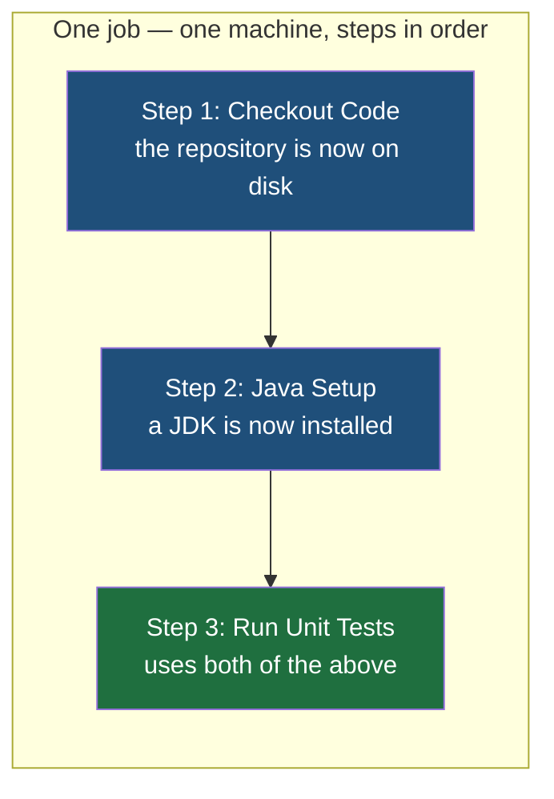

The event decides when a workflow runs. Everything under `jobs` decides what it does. This note is the inside of a workflow file: how the work is divided, and the two ways a step can be written.

## Jobs and the steps inside them

A workflow contains one or more jobs. Each job has a name you choose, a machine to run on, and a list of steps:

```yaml
# .github/workflows/pre-tests.yml
jobs:

  tests:
    runs-on: ubuntu-latest

    steps:

      - name: Checkout Code
        uses: actions/checkout@v7

      - name: Java Setup
        uses: actions/setup-java@v6
        with:
          distribution: temurin
          java-version: '21'

      - name: Run Unit Tests
        run: |
          chmod +x mvnw
          ./mvnw test
```

`tests` is the job's name, picked by whoever wrote the file. `runs-on` names the kind of machine, covered in the next note. Each entry under `steps` begins with a `-`, which is how YAML writes a list, and each has a `name` that shows up as a heading in the log — worth writing properly, because when a workflow fails, the step name is the first thing you read.

**Steps inside one job share a machine, and run in order, top to bottom.** That single fact is what makes the sequence above work. The second step installs Java and can assume the first step already put the source code there. The third step runs Maven and can assume both. Nothing is passed between them explicitly; they simply happen one after another in the same place, so whatever one step leaves behind is there for the next.



Jobs are the opposite. **Two jobs get two machines and no shared state**, and by default they run at the same time rather than in order. This is the reverse of Jenkins, where the stages of a pipeline run one after another on one agent by default and running them together is something you ask for. Splitting work across jobs is therefore a real decision: it buys parallelism, and it costs you everything the other job had on disk.

> [!note] Why the first step exists at all.
> The machine a job runs on starts empty. It has an operating system and very little else — it does not have your repository on it, because it was created moments ago and has never heard of your project. Checking out the code is a real step that really has to be there, and a workflow that forgets it fails immediately with files not found. The earlier Jenkins pipeline had the same step for the same reason.

## Two ways to write a step

Every step is one of two kinds: `run`, or `uses`.

**`run` executes a shell command**, exactly as if you had typed it into a terminal on that machine:

```yaml
      - name: Say hello
        run: echo "Hello DevOps Engineer"
```

The `|` seen earlier lets one step hold several lines, each executed in turn:

```yaml
      - name: Run Unit Tests
        run: |
          chmod +x mvnw
          ./mvnw test
```

This is the same mechanism as the `sh` steps in a Jenkinsfile, and the commands are whatever your stack needs: `./mvnw test` and `./mvnw clean package` for a Maven project, `npm test` and `npm run build` for a Node.js one.

## Where `run` alone stops being reasonable

Now take a job that has to compile Java, and try to do the setup with `run` steps only. Installing a JDK on a fresh Linux machine is not one command. It is downloading the right build for the right architecture, unpacking it somewhere sensible, setting `JAVA_HOME` so tools can find it, putting its `bin` directory on `PATH`, and possibly installing a package or two the download assumes is present. Then the same again for Maven.

Every project that compiles Java needs those same commands. Writing them out in every workflow in every repository, and fixing them in all of those places when a version changes, is exactly the duplication a pipeline was supposed to remove.

**So the commands were written once and published, and a step can refer to them instead.** That is what `uses` does:

```yaml
      - name: Java Setup
        uses: actions/setup-java@v6
        with:
          distribution: temurin
          java-version: '21'
```

Five lines replace the whole sequence. `actions/setup-java` is a published, reusable unit of work — an **action** — that somebody else wrote and maintains, and `@v6` says which version of it to use.

| | `run` | `uses` |
|---|---|---|
| What it is | A shell command on the runner | A prewritten, reusable unit of work |
| Written by | You | Usually somebody else, published in a repository |
| Configured with | The command text itself | `with`, a block of named inputs |
| Reach for it when | The command is specific to your project | The task is one that thousands of projects also need |

The two used above are the ones nearly every workflow starts with:

| Action | What it does |
|---|---|
| `actions/checkout@v7` | Puts the repository's files onto the runner, so the rest of the job has something to work with |
| `actions/setup-java@v6` | Installs a JDK and configures the environment so `java` and `javac` are on `PATH` |

`temurin` in that `distribution` field is a build of the JDK — Eclipse Temurin, the usual choice for a build machine. Java has several such builds, all implementing the same language, and the field exists because the action needs to know which one to fetch rather than because the choice normally matters.

## `with` is how you pass arguments

An action does a general job and needs to be told the specifics. `with` is where those specifics go, and the mental model that makes it click is an ordinary function call:

```
actions/setup-java@v6   is like   setupJava(distribution, javaVersion)

with:                             the arguments you pass in
  distribution: temurin           setupJava("temurin", "21")
  java-version: '21'
```

You are calling something somebody else wrote, and `with` is the argument list. Which inputs an action accepts, and which are required, is documented by whoever published it — for `setup-java` it is the distribution and the version, and for `checkout` there are no required inputs at all, which is why it appears without a `with` block.

> [!important] A name that trips everybody up once.
> **GitHub Actions** is the product — the whole automation system this folder is describing. **An action** is one reusable step inside it, like `actions/checkout`. The product is the platform; an action is a single piece of Lego. They are written almost identically and mean entirely different things, and the plural is doing all the work.

## Pinning the version

`@v7` and `@v6` are not decoration. An action is code in somebody else's repository, and that repository keeps changing. Naming a major version says: give me version 7 of this, including any fixes published for it, but do not hand me version 8 when it arrives and quietly change how my build behaves.

Leaving the version off, or pointing at a branch, means your workflow can start behaving differently on a day you changed nothing — which is the precise opposite of what a pipeline exists to provide. Pin it, and upgrade when you choose to.
