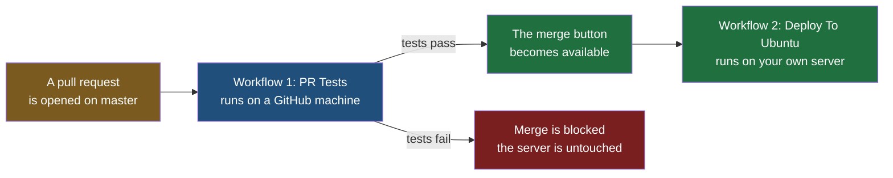

Events, jobs, steps and both kinds of runner are now all in hand. Put together, they make the arrangement almost every repository ends up with: one workflow that tests a proposal before it is allowed in, running on a machine GitHub provides, and a second that deploys once it has been let in, running on a server you own. This note builds the first of those, which needs nothing of yours at all; the next one builds the second, which is where the work and the failures are.

The application is the same calculator as before: the Spring Boot service with a `/health` endpoint and an `/api/add` endpoint, listening on port 8081, which the Jenkins pipeline in the previous notes builds and deploys. Using the same application on purpose is what makes the two tools comparable — everything that differs below is the tool and nothing else.



> [!tip] Run it locally before handing it to anything.
> The same rule the Jenkins notes made: a pipeline is a slow way to discover a mistake a thirty-second local run would have shown. `./mvnw test` reports `Tests run: 7, Failures: 0, Errors: 0, Skipped: 0` and `BUILD SUCCESS` before any of this goes near GitHub.

## Workflow 1: testing a proposal

```yaml
# .github/workflows/pre-tests.yml
name: PR Tests

on:
  pull_request:
    branches:
      - master

jobs:

  tests:
    runs-on: ubuntu-latest

    steps:

      - name: Checkout Code
        uses: actions/checkout@v7

      - name: Java Setup
        uses: actions/setup-java@v6
        with:
          distribution: temurin
          java-version: '21'

      - name: Run Unit Tests
        run: |
          chmod +x mvnw
          ./mvnw test
```

Every piece of that has appeared in the previous notes. It fires when a pull request targets `master`; it runs on a machine GitHub creates and throws away; it checks out the code, installs Java 21, and runs the tests. `chmod +x mvnw` is there because the Maven wrapper script arrives from the repository without the executable bit reliably set, and a script that cannot be executed fails with permission denied rather than with anything informative.

**This is the workflow worth having even if you never write another one.** Tests that run only when somebody remembers to run them are tests that eventually stop running. Attached to a pull request, they run on every proposal, every time, and the result is visible to everybody looking at the change rather than sitting in one person's terminal. A repository with this workflow and no tests written at all still gains something: the run reports that it found none, which is a fact about the project that was previously easy to avoid noticing.

That visibility is most of the value. A failing test on a pull request is not a private message to its author; it is attached to the change, in front of whoever is going to review it, and it stays in the record afterwards. Writing tests stops being a thing a conscientious developer does and becomes a thing the team can see whether anyone did.

> [!question] Is there anything better than writing every unit test by hand?
> A language model will write them, and it is a reasonable use of one: hand it the class and ask for fifteen or twenty tests covering the edge cases, and most of what comes back is usable. Expect roughly one in ten to be wrong — an assertion against behaviour the code does not actually have, written as confidently as the rest. Which is why this belongs with the workflow above rather than instead of it: generated tests are a first draft that still has to be read, and the pipeline is what tells you when one of them was nonsense.

## That much already works

Stop here for a moment, because what exists at this point is already a working, useful pipeline, and it cost one file.

The proposal goes up as a pull request in the ordinary way: a branch, a change, a push, and a pull request against `master`. The check appears on the pull request straight away, and while it runs the page looks like this:

![[Devops/05-CI-CD/Images/pr-check-running.png]]

Three things on that screen are the whole mechanism. The check is named `PR Tests / tests (pull_request)` — the workflow's `name`, then the job's name, then the event that triggered it, which is the practical reason both names are worth choosing carefully. The status is amber and says the check has started. And **the merge button is greyed out**: not hidden, not disabled forever, just not yet, because the answer to whether this change is safe is still being worked out.

A few seconds later it resolves:

```
All checks have passed
1 successful check

PR Tests / tests (pull_request)    Successful in 18s

No conflicts with base branch
Merging can be performed automatically
```

The merge button turns green and becomes the obvious thing to press.

### What the run actually did

Opening the run itself shows the steps, with a time against each:

![[Devops/05-CI-CD/Images/workflow-run-steps.png]]

**There are six steps there and you only wrote three.** The three you wrote are in the middle — Checkout Code, Java Setup, Run Unit Tests — and the other three were added for you.

| Step | Where it came from |
|---|---|
| Set up job | GitHub, always first: it provisions the machine and reports what it is |
| Checkout Code · Java Setup · Run Unit Tests | Your file |
| Post Java Setup · Post Checkout Code | The two actions you used, cleaning up after themselves |

**An action can register work to run at the end of the job**, and that is what the two `Post` steps are. Expanding `Post Checkout Code` shows it undoing exactly what checkout set up: removing the credentials it wrote into the repository's git configuration so they cannot linger on disk. You never asked for that and never had to know about it, which is a fair summary of what `uses` buys — somebody else thought about the cleanup.

The timings are worth a glance too. The whole job took 18 seconds, of which 14 were the tests and the rest was setup and teardown. That is the real cost of putting a gate in front of every pull request.

**Nothing was installed anywhere to get this.** No virtual machine, no server, no account anywhere else, nothing to keep running or keep updated. A file was added to the repository and every pull request from that moment on gets compiled and tested by a machine that did not exist when the pull request was opened and will not exist a minute after it finishes. Compared with the Jenkins half of this folder, which needed a virtual machine, an installation, plugins and two tool configurations before it could compile a single line, this is a remarkably small amount of work for the same guarantee.

If all you ever want from continuous integration is that broken code cannot be merged, you can stop reading here and you will have got the valuable part.

